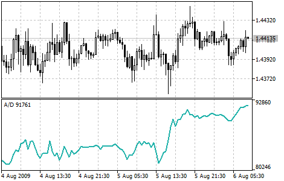

[🏠 Document Start](../../../README.md) / [Price Charts, Technical and Fundamental Analysis](../../README.md) / [Technical Indicators](../../Technical-Indicators.md) / [Volume Indicators](../Volume-Indicators.md) / AccumulationDistribution

[Previous](../Volume-Indicators.md) | [Next](Money-Flow-Index.md)

# Accumulation/Distribution

Accumulation/Distribution Technical Indicator is determined by the changes in price and volume. The volume acts as a weighting coefficient at the change of price — the higher the coefficient (the volume) is the greater the contribution of the price change (for this period of time) will be in the value of the indicator.

In fact, this indicator is a variant of the more commonly used indicator [On Balance Volume](On-Balance-Volume.md). They are both used to confirm price changes by means of measuring the respective volume of sales.

When the Accumulation/Distribution indicator grows, it means accumulation (buying) of a particular security, as the overwhelming share of the sales volume is related to an upward trend of prices. When the indicator drops, it means distribution (selling) of the security, as most of sales take place during the downward price movement.

Divergences between the Accumulation/Distribution indicator and the price of the security indicate the upcoming change of prices. As a rule, in case of such divergences, the price tendency moves in the direction in which the indicator moves. Thus, if the indicator is growing, and the price of the security is dropping, a turnaround of price should be expected.

## Calculation

A certain share of the daily volume is added to or subtracted from the current accumulated value of the indicator. The nearer the closing price to the maximum price of the day is, the higher the added share will be. The nearer the closing price to the minimum price of the day is the greater the subtracted share will be. If the closing price is exactly in between the maximum and minimum of the day, the indicator value remains unchanged.

A/D(i) =((CLOSE(i) - LOW(i)) - (HIGH(i) - CLOSE(i)) * VOLUME(i) / (HIGH(i) - LOW(i)) + A/D(i-1)

Where:

A/D(i) — value of the Accumulation/Distribution indicator for the current bar;  
CLOSE(i) — close price of the bar;  
LOW(i) — the lowest price of the bar;  
HIGH(i) — the highest price of the bar;  
VOLUME(i) — volume;  
A/D(i-1) — value of the Accumulation/Distribution indicator for the previous bar.
