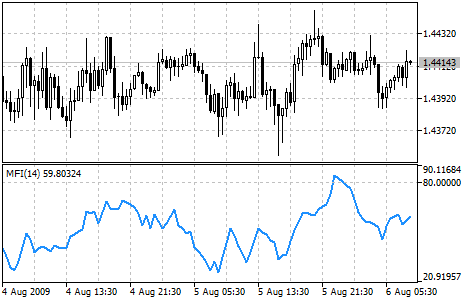

[🏠 Document Start](../../../README.md) / [Price Charts, Technical and Fundamental Analysis](../../README.md) / [Technical Indicators](../../Technical-Indicators.md) / [Volume Indicators](../Volume-Indicators.md) / Money Flow Index

[Previous](AccumulationDistribution.md) | [Next](On-Balance-Volume.md)

# Money Flow Index

Money Flow Index (MFI) is the technical indicator, which indicates the rate at which money is invested into a security and then withdrawn from it. Construction and interpretation of the indicator is similar to [Relative Strength Index](../Oscillators/Relative-Strength-Index.md) with the only difference that volume is important to MFI.

When analyzing the money flow index one needs to take into consideration the following points:

  * divergences between the indicator and price movement. If prices grow while MFI falls (or vice versa), there is a great probability of a price turn;
  * Money Flow Index value, which is over 80 or under 20, signals correspondingly of a potential peak or bottom of the market.

## Calculation

The calculation of Money Flow Index includes several stages. At first one defines the typical price (TP) of the period in question:

TP = (HIGH + LOW + CLOSE) / 3 

Then one calculates the amount of the Money Flow (MF):

MF = TP * VOLUME 

If today’s typical price is larger than yesterday’s TP, then the money flow is considered positive. If today’s typical price is lower than that of yesterday, the money flow is considered negative.

POSITIVE MONEY FLOW is a sum of positive money flows for a selected period of time. NEGATIVE MONEY FLOW is the sum of negative money flows for a selected period of time.

Then one calculates the money ratio (MR) by dividing the positive money flow by the negative money flow:

MR = POSITIVE MONEY FLOW / NEGATIVE MONEY FLOW 

And finally, one calculates the money flow index using the money ratio:

MFI = 100 - (100 / (1 + MR)

Where:

HIGH — the highest price of the current bar;  
LOW — the lowest price of the current bar;  
CLOSE — close price of the current bar;  
VOLUME — volume of the current bar.
