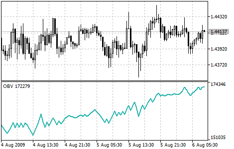

[🏠 Document Start](../../../README.md) / [Price Charts, Technical and Fundamental Analysis](../../README.md) / [Technical Indicators](../../Technical-Indicators.md) / [Volume Indicators](../Volume-Indicators.md) / On Balance Volume

[Previous](Money-Flow-Index.md) | [Next](Volumes.md)

# On Balance Volume

On Balance Volume Technical Indicator (OBV) is a momentum technical indicator that relates volume to price change. The indicator, which Joseph Granville came up with, is pretty simple. If the close price of the current bar is higher than that of the previous bar, the volume of the current bar is added to the previous OBV. If the current bar close price is lower than of the previous one, the current volume is subtracted from the previous OBV.

The basic assumption, regarding On Balance Volume analysis, is that OBV changes precede price changes. The theory is that smart money can be seen flowing into the security by a rising OBV. When the public then moves into the security, both the security and the On Balance Volume will surge ahead.

If the security’s price movement precedes OBV movement, a "non-confirmation" has occurred. Non-confirmations can occur at bull market tops (when the security rises without, or before, the OBV) or at bear market bottoms (when the security falls without, or before, the On Balance Volume Technical Indicator).

The OBV is in a rising trend when each new peak is higher than the previous peak and each new trough is higher than the previous trough. Likewise, the On Balance Volume is in a falling trend when each successive peak is lower than the previous peak and each successive trough is lower than the previous trough. When the OBV is moving sideways and is not making successive highs and lows, it is in a doubtful trend.

Once a trend is established, it remains in force until it is broken. There are two ways in which the On Balance Volume trend can be broken. The first occurs when the trend changes from a rising trend to a falling trend, or from a falling trend to a rising trend.

The second way the OBV trend can be broken is if the trend changes to a doubtful trend and remains doubtful for more than three days. Thus, if the security changes from a rising trend to a doubtful trend and remains doubtful for only two days before changing back to a rising trend, the On Balance Volume is considered to have always been in a rising trend.

When the OBV changes to a rising or falling trend, a "breakout" has occurred. Since OBV breakouts normally precede price breakouts, investors should buy long on On Balance Volume upside breakouts. Likewise, investors should sell short when the OBV makes a downside breakout. Positions should be held until the trend changes.

## Calculation

If the current close price is higher than the previous one, then:

OBV (i) = OBV (i - 1) + VOLUME (i).

If the current close price is lower than the previous one, then:

OBV (i) = OBV (i - 1) - VOLUME (i)

If the current close price is equal to the previous one, then:

OBV (i) = OBV (i - 1)

Where:

OBV (i) — value of the On Balance Volume indicator in the current period;  
OBV (i - 1) — value of the On Balance Volume indicator in the previous period;  
VOLUME (i) — volume of the current bar.
