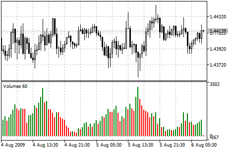

[🏠 Document Start](../../../README.md) / [Price Charts, Technical and Fundamental Analysis](../../README.md) / [Technical Indicators](../../Technical-Indicators.md) / [Volume Indicators](../Volume-Indicators.md) / Volumes

[Previous](On-Balance-Volume.md) | [Next](../Bill-Williams'-Indicators.md)

# Volumes

For the Forex market, Volumes is the indicator of the number of price changes within each period of a selected timeframe. For stock symbols this is an indicator of actually traded volumes (contracts, money, units, etc.)

Bars of the indicator have two colors. The green color means that the volume of the current bar is larger than that of the previous one. The red color means that the volume of the current bar is smaller than the volume of the previous bar. The indicator colors, as well as its application to tick or real volumes are set in the indicator [parameters (#appearance)](../../Technical-Indicators.md#appearance).
