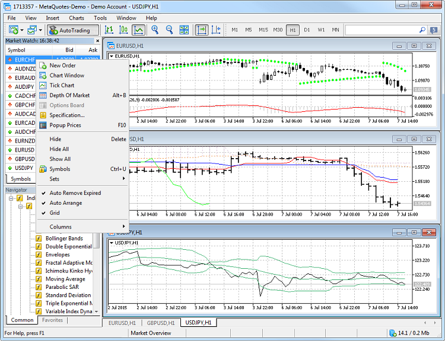
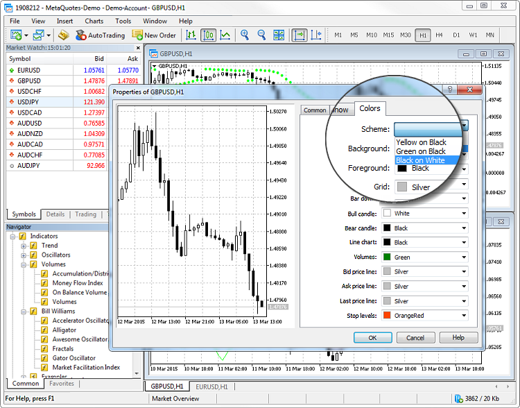
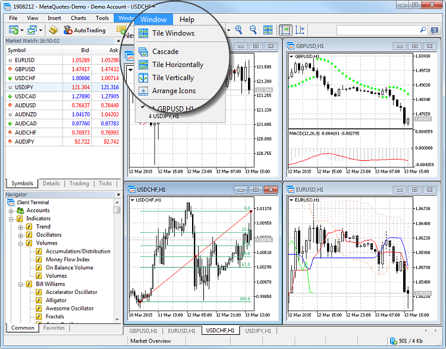
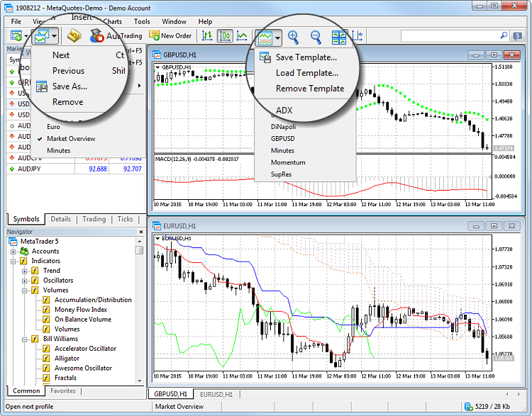
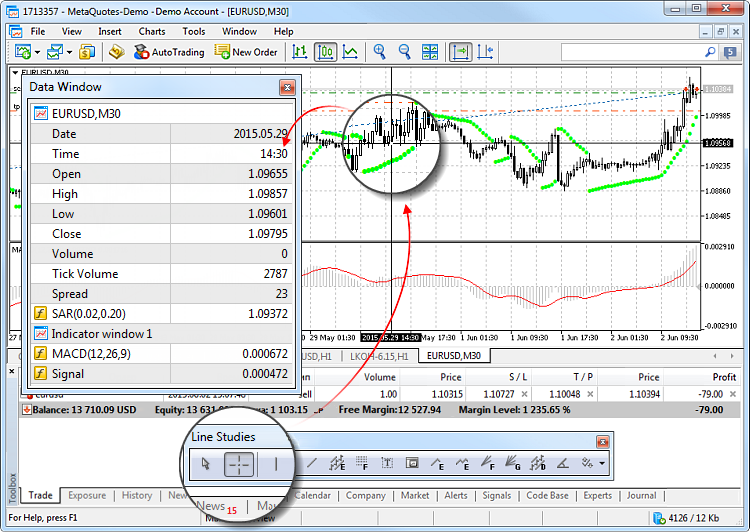
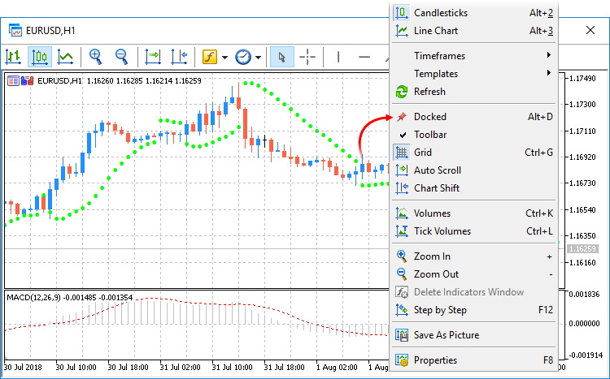

[🏠 Document Start](../README.md) / [Price Charts, Technical and Fundamental Analysis](README.md) / View and Configure Charts

[Previous](README.md) | [Next](Publish-Online.md)

# View and Configure Charts (#view-and-configure-charts)

Charts in the trading platform visualize changes of financial symbol quotes over time. Charts are used for technical analysis and operation of Expert Advisors. They allow traders to visually monitor the prices of currencies and shares in real time and instantly respond to any changes in the market situation.

In the trading platform, you can open up to 100 charts at a time, customize their appearance and displayed information, apply and remove various [objects](Analytical-Objects.md) and [indicators](Technical-Indicators.md), and much more.

## Chart: How to Open, View, Set Timeframe and Scale (#operations)

### Chart opening (#chart-opening)

You can quickly open a chart by selecting a financial symbol in the Market Watch window and clicking on the "Chart Window" item of the context menu. You can also open a chart by dragging a symbol from the Market Watch window to any area of the trading platform.

Another way is to execute the "New Chart" command from the File menu or click the appropriate button on the toolbar.

### Chart types: broken line, bars and candlesticks (#chart-types-broken-line-bars-and-candlesticks)

Price charts can be presented as a sequence of bars, Japanese candlesticks, and as a broken line. You can switch between presentation types using commands on the toolbar.

The figure shows the three price types.

The chart type can be changed using the Charts menu, the context menu of the chart or from the [chart properties](Additional-Features/Chart-Settings.md).

### Changing the chart timeframe (#changing-the-chart-timeframe)

A timeframe is a time interval of quotes on the chart of a financial instrument. This is the time of one bar or candlestick. There are 21 chart timeframes from one minute to one month available in the trading platform.

The timeframe is selected depending on the trends studied. As a rule, the timeframes from M1 to M15 are used for short-term scalping. Mid-term timeframes are from M30 to H4, they are usually used for intraday trading. Higher timeframes allow you to analyze longer-term trends.

You can switch between the timeframes using a special toolbar "Timeframes".

A timeframe can also be changed using the "Charts" menu and the context menu of a chart.

### Chart zoom (#chart-zoom)

To zoom the chart in or out, use buttons on the toolbar.

Chart scale can be changed by rolling the mouse wheel while holding down Ctrl.

  * A chart can be opened by dragging an instrument from the Market Watch window. If the instrument is dragged to the window of an open chart, the new symbol is opened in the same window while the previous one is deleted from it. In this case all settings of the previous chart are applied to the new one. If you hold down Ctrl while dragging a financial instrument, the new chart is opened in a separate window using the DEFAULT.TPL [template (#template)](View-and-Configure-Charts.md#template), which is created during platform installation process. This template cannot be deleted, but it can be changed.

  * To quickly find a desired chart among multiple open charts, select the appropriate symbol in the Market Watch, an order or position in the Trade or History section, or an alert. The chart frame of the appropriate symbol will blink three times.

  
---  
  

## How to Change the Color of the Chart (#color)

The chart appearance is highly customizable: you can hide or show any element, as well as change its color. For convenience, three color schemes of charts are available in the platform. In the [chart properties](Additional-Features/Chart-Settings.md), you can select a color scheme or set up colors of individual elements of the chart:

To open chart properties, click " Properties" in the context menu or the [Charts](../Getting-Started/User-Interface.md) menu.

## How to Arrange Charts (#arrange)

If multiple charts are open in your trading platform, you can easily organize them. Use the [Window](../Getting-Started/User-Interface.md) menu and select one of the available chart arrangement types:

## What are the Templates and Profiles (#template)

Templates and profiles allow saving settings of charts and easily apply them when necessary. For example, to analyze a currency pair you have added horizontal lines to mark up the levels. Save a separate chart template in order to preserve the levels. In this case, you can always restore the levels on a new chart by applying the template.

Templates are used for saving parameters of an individual chart: chart type and color, color scheme, scale, running Expert Advisors, applied indicators and analytical objects, as well as other settings. 

In profiles you can save the settings and arrangement of all open charts, that is of the entire workspace for technical analysis.

You can conveniently work with profiles and templates using the toolbar:

They can also be accessed using the [Charts](../Getting-Started/User-Interface.md) menu, the context menu of the chart and the [status bar](../Getting-Started/User-Interface.md) of the platform.

> See [Templates and Profiles](Additional-Features/Templates-and-Profiles.md) for further details.

## How to View Precise Values on the Chart (#datawindow)

You can view the precise price, time or [indicator](Technical-Indicators.md) values using the Crosshair and the Data Window.

Turn on the crosshair on the "Line Studies" toolbar, and the exact values of a chart point will be shown on the price and time scales. More details about the current cursor position on the chart are available in the Data Window: date and time, bar parameters, volumes, spread (minimum value on a selected bar), as well as indicator values.

> Any indicator can be configured ([Visualization (#visualization)](Technical-Indicators.md#visualization) tab in the indicator properties window) so that its values are displayed in this window.

## Working with Charts on Multiple Monitors (#docked)

The trading platform allows detaching financial symbol charts from the main terminal working area. This feature is convenient when using multiple monitors. Thus, you may set the main platform window on one monitor to control your account state, and move your charts to the second screen to observe the market situation. To detach a chart from the terminal, disable the "Docked" option in its context menu. After that move the chart to the desired monitor.

A separate toolbar on detached charts allows applying [analytical objects](Analytical-Objects.md) and [indicators](Technical-Indicators.md) without having to switch between monitors. Use the toolbar context menu to manage the set of available commands or to hide it.

## Chart Construction Features (#notes)

The history data, based on which charts are constructed, are stored on the hard disk. When you open a chart, the data are loaded from the disk, and the last missing data are downloaded from the trading server. If there are no history data for the symbol on the hard disk, the latest 512 bars of history are downloaded.

To download earlier data, move the chart to the desired area. Once a chart is opened, the platform starts receiving information about the current quotes. Thus, further price changes are shown in the real-time mode. This information is automatically saved in the history file and used later when you reopen this chart.

  * In the [platform settings (#max-bars)](../Getting-Started/Platform-Settings.md#max-bars), you can set up the "Max. bars on chart" parameter. This parameter allows you to control the amount of history data displayed on the chart.
  * Bid prices are used for constructing charts. If the [depth of market](../Trading-Operations/Depth-of-Market.md) is available for a symbol, its chart is based on the Last prices (the price of the last executed trade).

  
---
