[🏠 Document Start](../README.md) / [Trading Operations](README.md) / Depth of Market

[Previous](Basic-Principles.md) | [Next](Market-Watch.md)

# Depth of Market (#depth-of-market)

The Depth of Market (DOM) displays bids and asks for a particular instrument at the currently best prices (closest to the market).

The Dept of Market is different on the exchange and over-the-counter markets:

  * If an instrument is traded in the exchange mode, in which related trading operations are sent to an external trading system (an exchange), the DOM features real prices and order volumes from market participants.
  * If an instrument is traded in the over-the-counter (OTC) market, the Depth of Market can be formed based on the quotes of the broker, who may provide different prices depending on the buy or sell volume. If the broker does not provide volumes, the DOM window functions as a scalping tool, which allows placing of market and pending orders with a single click. In this case, the Depth of Market displays price levels calculated based on the Bid and Ask prices using the price change step.

For more information about prices in the Depth of Market, please see the [Price Data](For-Advanced-Users/Price-Data.md) section.

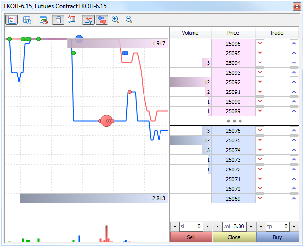

To open the depth of market of a financial instrument, click " Depth of Market" in the context menu of the [Market Watch](Market-Watch.md).

  * The number of bids and offers displayed in the DOM is determined by the symbol parameters set by the broker.

  * The availability of the Depth of Market feature for exchange instruments is not guaranteed and depends on your broker.

  
---  
  
Operations of two types are performed from the depth of market:

  * Market Operations — buying/selling a financial instrument at the current market price;
  * Trade Requests — placing various trade requests ([pending orders (#pending-order)](Basic-Principles.md#pending-order)) to buy/sell a financial instrument at a specified price (which is currently unavailable on the market).

## Market Operations (#market)

A market operation is buying/selling a financial instrument at the best price currently offered in the market.

Execute a market operation from the depth of market. Click on the appropriate trade command in the depth of market of the appropriate [symbol](Market-Watch.md) specifying the required amount. If ["One Click Trading" (#one-click)](../Getting-Started/Platform-Settings.md#one-click) is enabled, this request is immediately sent to the server without specifying any extra conditions (trading dialog is not displayed).

Suppose we have executed a 20-lot buy operation, while the following offers are currently available in the market:

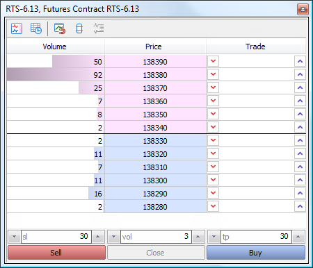

Since we have requested 20 lots with the Fill or Kill condition at the market price, the required volume will be made up of the nearest market bids. If the order contained a certain price, then it would be executed only at this specified price and only in the specified volume.

You can view the history of order execution in the ["History" (#trade-history)](Executing-Trades.md#trade-history) tab of the "Toolbox" window:

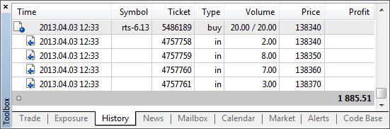

You see here that the final volume of 20 lots was received from a few offers closest to the market. The corresponding offers disappear from the depth of market.

## Trade Requests (#request)

Placing a trade requests means creating a [pending order (#pending-order)](Basic-Principles.md#pending-order) to buy/sell a financial instrument at a specified price, which is currently not available on the market. Depending on how requests are processed on the server, they can be displayed directly in depth of market (mostly limit requests) or wait for execution on the broker's side (mostly stop or stop limit requests) and then be converted into a market order.

Here is an example of placing a limit request to buy 3 lots of the futures contract RTS-6.13. Specify the required volume in the "vol" field and click on  (in the Bid price area for the Buy Limit order) or  (in the Ask price area for the Sell Limit order) in the "Trade" column in the line of the price, at which you wish to place an order. If ["One Click Trading" (#one-click)](../Getting-Started/Platform-Settings.md#one-click) is enabled, this request is immediately sent to the server without specifying any extra conditions (trading dialog is not displayed).

> Examine "Quick trading" section to learn how to quickly manage orders in the depth of market.

When placed successfully, the request appears in the depth of market:

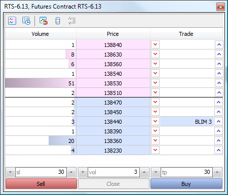

The newly placed order is displayed in the "Trade" column — BLIM 3 (Buy Limit order of 3 lots). As soon as there is a market participant ready to sell the financial instrument at the specified price, the order will be filled and will turn into a position.

### Stop and Stop Limit Orders (#stop-and-stop-limit-orders)

Usually, [Stop and Stop Limit Orders (#pending-order)](Basic-Principles.md#pending-order) (Buy Stop, Sell Stop, Buy Stop Limit and Sell Stop Limit) are not sent to an external trading system (exchange) directly as opposed to limit orders. Until reaching the [stop price (#pending-place)](Executing-Trades.md#pending-place), these orders are processed within the MetaTrader 5 platform.

  * Upon reaching the stop price specified in a Buy Stop or Sell Stop order, an appropriate market operation is executed.
  * Upon reaching the stop price specified in a Buy Stop Limit or Sell Stop Limit order, an appropriate limit request is executed, which will be visible to other market participants.

## Quick Trading from the Depth of Market (#quick-trading)

The depth of market allows users to quickly manage stop levels (Stop Loss and Take Profit) and pending orders of open positions. This option is only available with the ["One Click Trading" (#one-click)](../Getting-Started/Platform-Settings.md#one-click) option enabled in the trading platform settings. Trade requests are sent from the depth of market instantly without showing a trading dialog.

### Moving Stop Levels (#moving-stop-levels)

Stop levels of open positions are displayed in the "Trade" column as TP (Take Profit) and SL (Stop Loss). These levels can be moved by mouse:

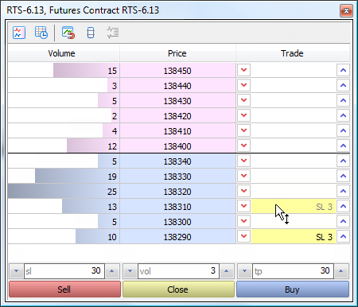

Move a level to the line with the required price, and it will be modified instantly.

### Deleting Stop Levels (#deleting-stop-levels)

Stop levels can be deleted from Depth of Market:

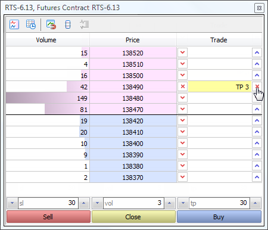

Hover the mouse cursor over the button  (or ) to the right or to the left from the level and click Shift. The button will change its view to . Click the button to delete the level.

### Placing Orders (#pending-place)

[Pending orders (#pending-order)](Basic-Principles.md#pending-order) are placed using buttons  or  next to the desired price:

  * To place a Buy Limit order, click  in the Bid price area.
  * To place a Buy Stop order, click  in the Ask price area.
  * To place a Sell Limit order, click  in the Ask price area.
  * To place a Sell Stop order, click  in the Bid price area.

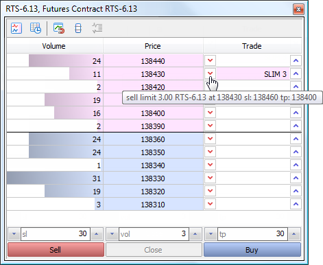

After that, an order is placed at the specified price. It has the volume set in the "vol" field, as well as Stop Loss and Take Profit levels specified in "sl" and "tp" fields, respectively.

### Modification of Orders (#modification-of-orders)

The depth of market allows users to easily change prices of previously set orders.

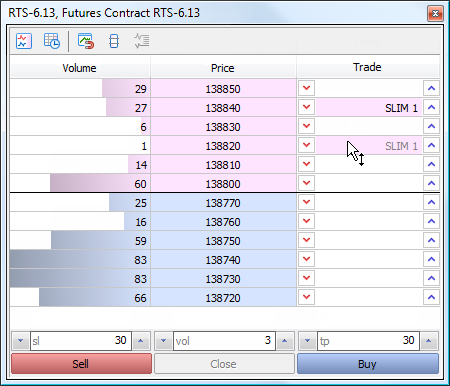

Move the pending order to the necessary price line. The order price changes instantly. If the Stop Loss and Take Profit levels are set for the order, they are moved by the same distance as the price.

If we drag a limit order through the ask/bid border, it will change to a stop order (Buy Limit will be replaced by Buy Stop, while Sell Limit - by Sell Stop).

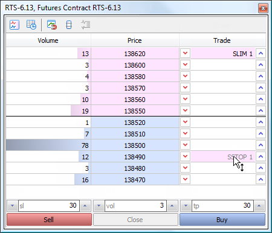

> If several same price orders are placed, they cannot be moved in the depth of market.

### Deleting Orders (#deleting-orders)

To delete an order from the depth of market, hover the mouse cursor over  (or ) to the right and click Shift. The button will change its view to . Click the button to delete the order.

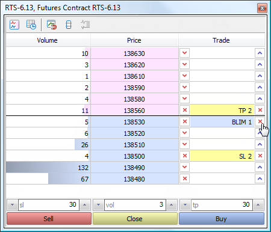

> If several same price orders are placed, the oldest one is removed first.

## Time & Sales and Tick Chart (#timesales)

Time and sales and a tick chart of exchange instruments with real transaction prices is displayed in the Depth of Market.

### Time & Sales (#time-sales)

The Time & Sales feature provides the price and time of every trade executed on the exchange. Information on every trade includes the time when the trade was executed, its direction (buying or selling), as well as the price and volume of the trade. For easy visual analysis, different colors are used to indicate different trade directions: blue is used for Buy trades, pink for Sell trades, green means undefined direction. Trade volumes are additionally displayed in a histogram.

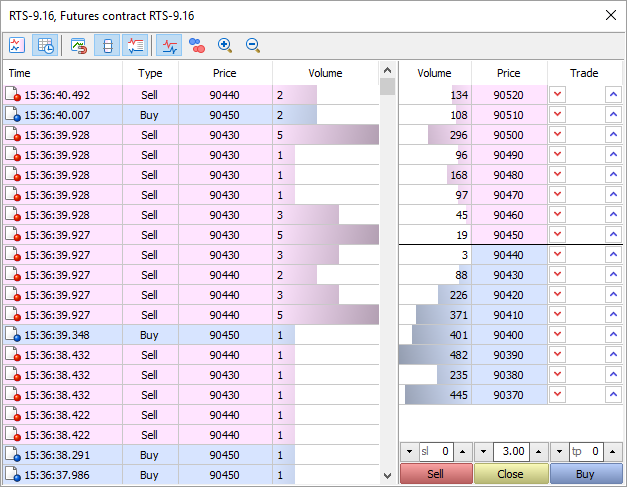

How Time & Sales can help you understand the market

The Time & Sales feature provides tools for a more detailed market analysis. The trade direction suggests who has initiated the trade: the buyer or the seller. The volume of trades allows traders to understand the behavior of market participants: whether the trades are performed by large or small market players, as well as estimate the activity of the players. The trade execution speed and the volume of trades on various price levels help traders to estimate the importance of the levels.

How to use Time & Sales data

In addition to the visual analysis of the table, you can save the details of trades to a CSV file. Further, they can be analyzed using any other software, such as MS Excel. The file contains comma-separated data:

Time,Bid,Ask,Last,Volume,Type  
2016.07.06 16:05:04.305,89360,89370,89370,4,Buy  
2016.07.06 16:05:04.422,89360,89370,89370,2,Buy  
2016.07.06 16:05:04.422,89360,89370,89370,10,Buy  
2016.07.06 16:05:04.669,89360,89370,89370,1,Buy  
2016.07.06 16:05:05.968,89360,89370,89360,7,Sell  
---  
  
If you want to save data to a file, open the context menu and select "Export Ticks to CSV".

Filter by Volume

Deals with the volume less than the specified value can be hidden from the Time & Sales table. This filter allows to show only large deals in the Time & Sales window.

Double click on the first line in the Time & Sales window, specify the minimum volume in lots, and then click on any other area of ​​the Market Depth. Trades will be filtered, and the current filter value will appear in the volume column header.

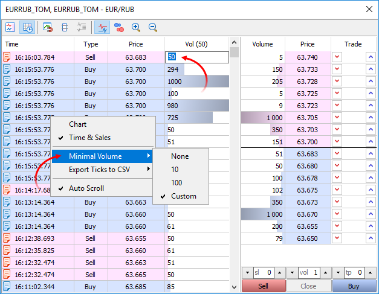

You can also specify the minimum volume using the Time & Sales context menu.

### Tick Chart (#tick-chart)

All transactions conducted on the Exchange are plotted on this chart:

  * Red circles show Sell transactions.
  * Blue circles show Buy transactions
  * Green circles appear when the direction of the transaction is undefined. It is used when the exchange does not transmit the direction of a transaction. In this case, the direction is determined based on the price of the transaction as compared to prices bid and ask. A Buy transaction is that executed at the ask price or above, a Sell transaction is executed at the bid price or lower. The direction is undefined if the price of the transaction is between the bid and the ask.

The larger the circle, the greater the volume of the transaction. Transaction volumes are also shown as a histogram below the tick chart.

Using the "Synchronize" command in the context menu, you can control the display of deals charts (circles and histogram):

  * In the synchronous mode, the deals chart is tied to the tick chart and they both have the same time scale.
  * In the independent mode, the deals chart is not tied to the tick chart, and the deals are drawn one by one.

At the top and bottom of the histogram, the total volumes of the current Buy and Sell offers are shown.

> The vertical scale of the tick chart is the Market Depth (i.e. its levels). Price change ranges which are not available in market depth are displayed as straight lines on the tick chart. To view the most accurate tick chart, enable the extended mode and the display of spread values for the Market Depth.

## Toolbar (#toolbar)

To customize the appearance of the depth of market, use the toolbar at the top of the window:

  *  — show/hide the tick chart.
  *  — show/hide Time & Sales.
  *  — binding the Market Depth to an active chart. Every time you switch to a chart of a financial instrument, the same instrument will be automatically enabled in the Market Depth window. So, you will not need to open the Market Depth window for each new symbol.
  *  — switch to the advanced mode; every step of the price will be displayed in the depth of market, regardless of whether there are any offers at this price.
  *  — show the spread in the depth of market.
  *  — show/hide the Bid and Ask price charts.
  *  — show/hide transactions that appear in the form of circles on the tick chart.
  *  — zoom in the chart.
  *  — zoom out the chart.

Most of these commands are also available in the context menu of the Market Depth and Time & Sales windows. The context menu of the scalping Depth of Market (for non-exchange instruments) also allows switching between the volume in lots and units.
