[🏠 Document Start](../README.md) / [Trading Operations](README.md) / Executing Trades

[Previous](Options-Board.md) | [Next](One-Click-Trading.md)

# Executing Trades (#executing-trades)

The trading activity in the platform implies forming and sending [market (#position-open)](Executing-Trades.md#position-open) and [pending orders (#pending)](Executing-Trades.md#pending) to be executed by a broker, as well as managing current [positions (#position-manage)](Executing-Trades.md#position-manage) by modifying or closing them. In the platform, you can view your account [trading history (#trade-history)](Executing-Trades.md#trade-history), configure [alerts (#alert)](Executing-Trades.md#alert) of market events and much more.

## Opening Positions (#position-open)

Opening a [position (#position)](Basic-Principles.md#position) or entering the market is the primary purchase or sale of a certain amount of a financial instrument. In the trading platform, this can be done by placing a [market order (#market-order)](Basic-Principles.md#market-order), as a result of which a [deal (#deal)](Basic-Principles.md#deal) is executed. A position can also be opened as a result of a triggered [pending order (#pending-order)](Basic-Principles.md#pending-order).

### Placing an Order and General Parameters (#position-common)

There are several ways to call a dialog window for order creation:

  * Select a symbol in the Market Watch and click " New order" in its context menu.
  * Press the F9 hot key. In the order window, a symbol will be inserted in accordance with the [platform settings (#use-symbol)](../Getting-Started/Platform-Settings.md#use-symbol).
  * Click " New order" in the [Tools](../Getting-Started/User-Interface.md) menu or " New order" on the [Standard](../Getting-Started/User-Interface.md) toolbar.

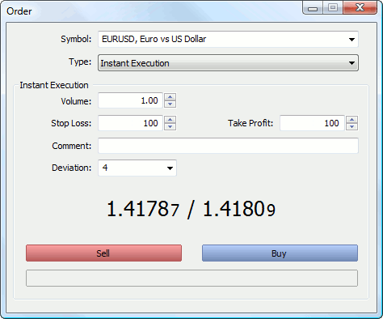

General order parameters:

  * Symbol — the financial instrument for which the deal is performed.
  * Type — if one of the execution modes is selected in this field, a market operation is executed for the selected instrument. Otherwise, a [pending order (#pending-order)](Basic-Principles.md#pending-order) of the selected type is placed.
  * Volume — order volume in lots. The greater the deal volume, the greater its potential profit or loss, depending on where the symbol price goes. The deal volume also affects the [margin](For-Advanced-Users/Margin-Calculation-Retail-Forex-Futures.md) reserved for the position on the trading account. 
  * Stop Loss — the [Stop Loss (#stop-loss)](Basic-Principles.md#stop-loss) level as a price or distance in points from the price specified in order, depending on the [platform settings (#use-stops)](../Getting-Started/Platform-Settings.md#use-stops). The level is set to limit the position loss. If you leave the null value in this field, this type of order will not be set.
  * Take Profit — the [Take Profit (#take-profit)](Basic-Principles.md#take-profit) level as a price or distance in points from the price specified in order, depending on the [platform settings (#use-stops)](../Getting-Started/Platform-Settings.md#use-stops). The level is set to lock in profits of the position. If you leave the null value in this field, this type of order will not be set.
  * Comment — an optional text comment to an order. The maximum comment length is limited to 31 characters. The comment appears in the list of open positions and also in the history of orders and deals. A comment to an order can be changed by a broker or server. For example, if a position is closed by Stop Loss or Take Profit, the corresponding information is displayed in the comment.

  * There is a convenient way to modify prices, volumes or Stop Loss and Take Profit levels by a certain amount:

  *     * Holding "Shift", — by 5 points;
    * Holding "Ctrl", — by 10 points;
    * Holding "Ctrl"+"Shift", — by 50 points.

  * A tick chart can be shown or hidden in any order placing window. To do this, double-click on the window.

  * The trade window displays the current best Bid and Ask price.

  * Upon order execution, an appropriate massage about an [open position (#position-list)](Executing-Trades.md#position-list) is added to the Trade tab of the Toolbox window, as well as the [order (#trade-history)](Executing-Trades.md#trade-history) and the [deal (#trade-history)](Executing-Trades.md#trade-history) (or deals) executed for the order are added to the History tab.

  * If Stop Loss or Take Profit are specified incorrectly in the order, upon pressing the button, the "Invalid stops" alert appears and the order is not accepted.

  
---  
  
Click Buy to send a buy order or Sell to send a sell order.

Once an order is sent, its execution results appear in the window — a successful trade operation or a reason why it has not been executed. If [One Click Trading (#one-click)](../Getting-Started/Platform-Settings.md#one-click) is enabled in the platform settings, upon successful order execution the trading window closes without notifying of execution results.

Let's look at trading features in different [execution modes (#execution-type)](Basic-Principles.md#execution-type) now. It depends on the instrument type and the broker.

### Trading in the Instant Execution Mode (#instant)

In this mode, the order is executed at the price offered to the broker. When sending an order to be executed, the platform automatically adds the current prices to the order. If the broker accepts the prices, the order is executed.

If during order processing the price changes by an amount greater than that specified in the ["Deviation" (#deviation)](Executing-Trades.md#deviation) field, the dealer (server) can refuse to accept the order and offer new execution prices. A corresponding message appears in the creation window in this case:

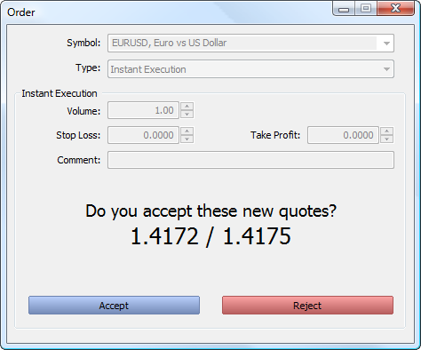

If you agree with the new prices, click "Accept", and the order is then executed at the new prices. If the new price is not good, click "Reject".

New prices are valid for a few seconds only. If you do not make a decision during this time, message "Price changed" appears in the window. Click "OK" to get back to the original order placing window.

Deviation is the difference between the order execution price and the specified price to which a trader agrees. The larger the value, the less likely it is that you receive a new execution price ([requote (#requote)](Executing-Trades.md#requote)) in response to the order execution request. If the deviation is equal to or less than this value, the order is executed at the new price without any notification. Otherwise, a broker returns new prices, at which the order can be executed.

### Trading in the Request Execution Mode (#request)

In this mode, the market order is executed at the price previously received from the broker. Prices for a certain market order are requested from the broker before the order is sent. Upon receiving the prices, order execution at the given price can be either confirmed or rejected.

> Order parameters can only be modified before requesting the prices. Once the request is sent, a trader can only place an order with the pre-set parameters.

To receive prices, click on "Request". After that "Buy" and "Sell" buttons appear in the window. Quotes offered after the request are valid for a few seconds. If you cannot decide during this time, buttons "Buy" and "Sell" again get hidden.

### Trading in the Market Execution Mode (#market)

In this order execution mode, a broker makes a decision about the order execution price without any additional discussion with the trader. Sending an order in such a mode means advance consent to its execution at this price.

In the 'Fill Policy' additional order [filling rules (#fill-policy)](Basic-Principles.md#fill-policy) can be specified: "Fill or Kill", "Immediate or Cancel" or "Book or Cancel". If this field is inactive, then the option is disabled on the server.

When the "Sell by Market" or "Buy by Market" button is pressed, an order to execute a sell or buy deal at the broker's price is sent to a broker.

### Trading in the Exchange Execution Mode (#exchange)

In the 'Fill Policy' additional order [filling rules (#execution-type)](Basic-Principles.md#execution-type) can be specified: "Fill or Kill", "Immediate or Cancel" or "Book or Cancel". If this field is inactive, then the option is disabled on the server.

A click on "Sell" or "Buy" creates an order to a broker to execute a Sell or Buy deal respectively.

> For more information about trading in the exchange execution mode read ["Depth of Market" (#market)](Depth-of-Market.md#market).

## Managing Positions (#position-manage)

An important aspect of trading in financial markets is the competent position management. The trading platform provides all the necessary tools for that.

### Where Can I View Current Open Positions? (#position-list)

The list of currently open positions is displayed in the Trading tab of the Toolbox window.

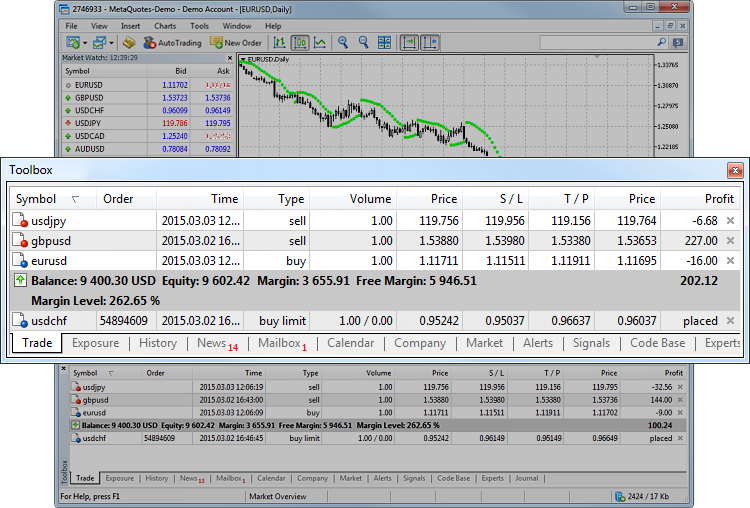

A list of open positions:

  * Ticket — position ticket. Unique number assigned to each newly opened position. It usually matches the ticket of an order used to open the position except when the ticket is changed as a result of service operations on the server, for example, when charging swaps with position re-opening.
  * Symbol — a financial instrument of the open position.
  * ID — the position ID in an external trading system (for example, on the exchange). The display of this parameter can be disabled depending on your broker's settings.
  * Time — position opening time. Specified according to the time zone of the broker's trading server. The record is represented as YYYY.MM.DD HH:MM (year.month.day hour:minute).
  * Type — position type: "Buy" — long, "Sell" — short.
  * Volume — trade operation volume (in lots or units). The minimum volume and its change step are limited by a brokerage company, the maximum amount — by the deposit size.
  * Price — the price of a deal, as a result of which the position was opened. If the opened position is a result of execution of several deals, then this field displays their weighted average price: (price of deal 1 * volume of deal 1 + ... + price of deal N * volume of deal N) / (volume of deal 1 + ... + volume of deal N). The accuracy of rounding of the weighted average price is equal to the number of decimal places in the symbol price plus three additional characters.
  * S/L — [Stop Loss level (#stop-loss)](Basic-Principles.md#stop-loss) for the current position. If this order has not been placed, a zero value is displayed in this field.
  * T/P — [Take Profit level (#take-profit)](Basic-Principles.md#take-profit) for the current position. If this order has not been placed, a zero value is displayed in this field.
  * Price — the current price of the financial symbol. Bid price is displayed for short positions, while Ask price is used for long ones. The price of the last performed deal (Last) is displayed for the positions of exchange symbols (both directions).
  * Value — the market value of the position. The value is calculated as the product of the opening price and the contract size.
  * Swap — amount of swaps charged.
  * Profit — the financial result of the trade taking into account the current price is written in this field. A positive result indicates the profitability of the deal, negative indicates loss.
  * Change — the change in the asset price as a percentage since the operation execution time. Positive and negative values are colored in blue and red, respectively.
  * Magic — the value specified by a [trading robot](../Algorithmic-Trading-Trading-Robots/Expert-Advisors-and-Custom-Indicators.md) when opening orders and positions (Expert Advisor ID)

A list of placed pending orders:

  * Symbol — a financial instrument of the pending order.
  * Order — ticket number (a unique identifier) of the pending order.
  * ID — the order ID in an external trading system (for example, on the exchange). The display of this parameter can be disabled depending on your broker's settings.
  * Time — pending order placing time. Specified according to the time zone of the broker's trading server. The record is represented as YYYY.MM.DD HH:MM (year.month.day hour:minute).
  * Type — [pending order type (#order-type)](Basic-Principles.md#order-type): "Sell Stop", "Sell Limit", "Buy Stop", "Buy Limit", "Buy Stop Limit" or "Sell Stop Limit".
  * Volume — volume requested in the pending order, and volume covered by the deal (in lots or units).
  * Price — price reaching which the pending order will trigger.
  * S/L — the level of the [Stop Loss (#stop-loss)](Basic-Principles.md#stop-loss) order. If this order has not been placed, a zero value is displayed in this field.
  * T/P — the level of the [Take Profit (#take-profit)](Basic-Principles.md#take-profit) order. If this order has not been placed, a zero value is displayed in this field.
  * Price — the current price of the financial symbol. Bid price is displayed for short orders, while Ask price is used for long ones. The price of the last performed deal (Last) is displayed for the orders involving exchange symbols (both directions).
  * Comment — comments on the pending order are added in this column. A comment can only be written when placing an order. The comment cannot be changed during order modification. In addition, a comment on a trade operation can be added by a broker.
  * State — in the last column, the current [state (#order-state)](Basic-Principles.md#order-state) of a pending order is displayed: "Started", "Placed", etc.

Trading account state:

  * Balance — money on the account, results of currently open positions not included (deposit).
  * Credit — amount of credit money that the broker has given to a trader.
  * Assets — the current value of purchased financial instruments (of long positions) defined in a trader's deposit currency. The value is determined dynamically based on the price of the latest deal of the financial instrument, taking into account the liquidity margin rate. In fact, the amount of assets is equivalent to the amount of money that the trader would receive in case of immediate closure of long positions. This rate is used on the exchange markets. For more details please read the [appropriate section (#assets)](For-Advanced-Users/Margin-Calculation-Exchange-Model.md#assets).
  * Liabilities are obligations on current short positions calculated as the value of these positions at the current market price. In fact, the amount of liabilities is equivalent to the amount of money that the trader would pay in case of immediate closure of short positions. This rate is used on the exchange markets. For more details please read the [appropriate section (#liabilities)](For-Advanced-Users/Margin-Calculation-Exchange-Model.md#liabilities).
  * Commission — commission by orders and positions accumulated during a day/month. Depending on commission charging terms (determined by a broker), a preliminary calculation of commission is performed during a day or a month. The corresponding amount of funds is blocked on the account and is shown in this field. The final commission calculation is performed at the end of a day/month and the appropriate sum is withdrawn from the account in a balance operation (displayed as a separate deal in the ["History" (#trade-history)](Executing-Trades.md#trade-history) tab), and the blocked amount is unblocked. If a commission is charged immediately during execution of a deal, its value is added to the "Commission" field of a deal in the History tab.
  * Blocked — under certain trading conditions (determined by a broker), a profit taken during a day cannot be used to perform trade operations (is not included in the free margin). This blocked profit is displayed in the "Blocked" field. At the end of the trading day, this profit is unblocked and deposited to the account balance.
  * Equity — equity is calculated as Balance + Credit - Commission +/- Floating profit/loss - Blocked.
  * Margin — money required to cover open positions and pending orders.
  * Free Margin — the free amount of money that can be used to open positions. It is calculated as Equity - Margin. Depending on the trading conditions (defined by a broker), the equity value may or may not consider: floating profit, floating loss or floating profit and floating loss together.
  * Margin Level — percentage of the account equity to the margin volume (Equity / Margin * 100).
  * Total of deals — total financial result of all open positions.

The account state line is highlighted with the red color, if the account is in the Margin Call or Stop Out state.

The following position parameters are displayed here: financial instrument, type, volume, current profit/loss and more. Additionally, the current state of the trading account and the total financial result of all open positions is shown here.

The summary information about the state of assets of all open positions is available on the "Exposure" tab.

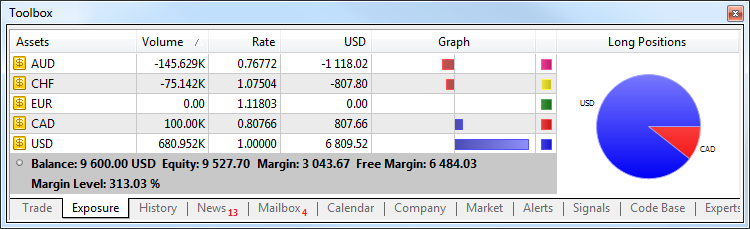

The name of the currency or financial instrument.

The volume (in units) of a trader's position for the currency or financial instrument including leverage.

Instrument or currency exchange rates in the deposit currency.

The amount of deposit currency (excluding leverage) actually spent to buy/sell the currency or trading instrument.

The graphical display of the position in the deposit currency (long positions are displayed with blue bars and short positions are displayed with red ones).

To switch between the information on short and long positions click on the diagram title.

The displayed account assets for the deposit currency take into account the free margin.

The platform adapts the display of assets depending on the risk management system applied to a trading account: [Retail Forex, Futures](For-Advanced-Users/Margin-Calculation-Retail-Forex-Futures.md) or [Exchange model](For-Advanced-Users/Margin-Calculation-Exchange-Model.md).

The Assets section is helpful for those trading Forex or futures at an exchange showing their current status on the market. Same currencies can be found in a variety of different symbols: as one of the currencies in a pair, as a base currency, etc. For example, you may have oppositely directed positions on GBPUSD, USDJPY and GBPJY. In this situation, it is very difficult to understand how much currency you have and how much you need. Having more than three positions further complicates the task. In this case, the total account status can be easily seen in the Assets tab.

Let's use the same three positions as an example:

  * Buy GBPJPY 1 lot at 134.027 — received GBP 100,000, given JPY 134,027,000
  * Sell USDJPY 1 lot at 102.320 — given USD 100,000, received 102,320,000
  * Sell GBPUSD 1 lot at 1.30923 — given GBP 100,000, received USD 103,920

We have bought and sold GBP 100,000 simultaneously. You have 0 GBP, and the Assets tab does not display this currency. As of USD, we gave a currency in one case and received it in another. The Assets tab calculates the final outcome and adds it to the current balance since the deposit currency is USD as well. JPY participated in two deals meaning that the tab displays its total value.

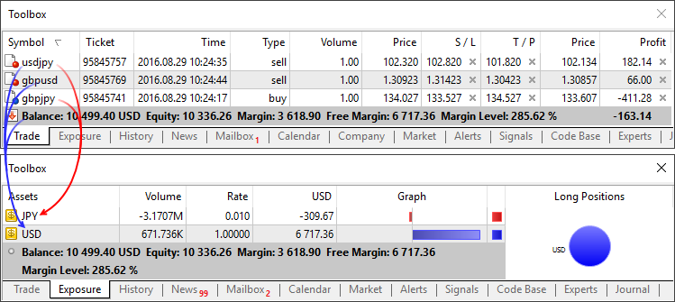

Those using the exchange model can use the section to understand how their money is used. Unlike the previous model, the funds are withdrawn/added right when deals are performed. For example, if you buy EURRUB, you receive EUR at once while the appropriate sum in RUB is withdrawn from the balance. During trading, the account balance may even become negative: when you use borrowed money while purchased assets are used as the collateral. In this case, the Assets tab allows you to easily understand the trading account status.

Additionally, you can see the liquidation value here — amount of funds on the account and the price (result) of closing all current positions at the market price.

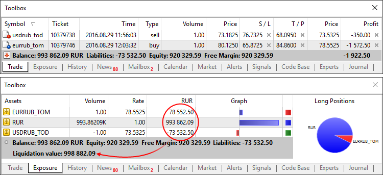

### How to Secure Positions by Stop Loss and Take Profit (#position-sltp)

[Take Profit (#take-profit)](Basic-Principles.md#take-profit) and [Stop Loss (#stop-loss)](Basic-Principles.md#stop-loss) are additional orders attached to a position or a pending order. In fact, they are instructions for a broker to close a position when the price reaches a certain level. Take Profit is set to lock in profits when the price moves in a favorable direction. Stop Loss is intended for limiting losses if the price moves in an unfavorable direction.

Of course, traders can monitor their positions on their own or using a [trading robot](../Algorithmic-Trading-Trading-Robots/README.md). However, this approach has several disadvantages:

  * A trader cannot be all the time in front of the monitor to control positions.
  * This is not true for the robot. However, it runs on a user's PC. Accordingly, the Expert Advisor cannot manage its positions in case of a computer failure or server connection loss (Internet problems).

Take Profit and Stop Loss help to solve these problems. These orders are associated with a trade position, they are stored and executed on the broker's server, and therefore do not depend on the performance of the trading platform.

Orders of this type can also be attached to pending orders: Limit, stop-and stop-limit. A position, which opens as a result of pending order triggering, inherits Take Profit or Stop Loss specified in the order. If the triggered pending order relates to a financial instrument, for which an open position exists, this position is modified: its volume is increased or decreased. The Stop Loss and Take Profit specified in the order are used in this case. If zero values are specified in the order, the appropriate levels of the position are removed.

There are several ways to modify stop levels:

  * Using the [position modification (#position-modify)](Executing-Trades.md#position-modify) dialog.
  * [Using a mouse on a chart (#position-modify-chart)](Executing-Trades.md#position-modify-chart) of the financial instrument the position is open for.
  * Using the [context menu on a chart (#position-context)](Executing-Trades.md#position-context) of the financial instrument the position is open for.

### Position Modification (#position-modify)

To modify the stop levels of a position, click " Modify or delete" in its context menu on the ["Trade" (#position-list)](Executing-Trades.md#position-list) tab.

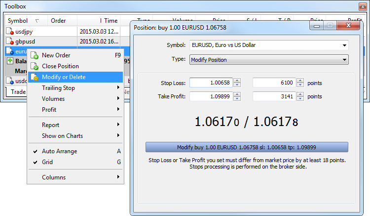

In the resulting window, the levels can be modified in two ways:

  * Set the new values in the fields ["Stop Loss" (#stop-loss)](Basic-Principles.md#stop-loss) and ["Take Profit" (#take-profit)](Basic-Principles.md#take-profit);
  * Set level values as a number of points from the position opening price.

Then Click "Modify...".

  * The "Modify..." button is inactive until the Stop Loss and Take Profit are set correctly. The terms of stop levels are determined by the broker and are specified in [symbol properties (#specification)](Market-Watch.md#specification) (contract specification).
  * A double click on the position modifying window shows/hides a tick chart.

  
---  
  
Position modification can also be accessed from the position context menu on a char:

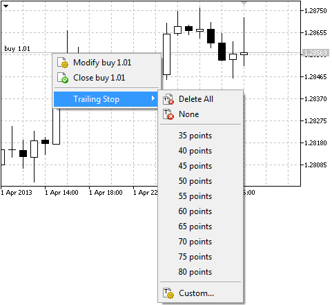

### Managing Stop Levels from a Chart (#position-modify-chart)

Modification of Stop Loss and Take Profit on a chart is only available if the "Show trade levels" option is enabled in the [platform settings (#trade-levels)](../Getting-Started/Platform-Settings.md#trade-levels).

To modify the level on a chart, left-click on it and drag the level up or down to the required value holding the mouse button (Drag'n'Drop):

Once a level is set, the [position modification (#position-modify)](Executing-Trades.md#position-modify) window appears allowing users to adjust the level more precisely.

> Modification of Stop Loss and Take profit on a chart is disabled if you enable the ["Disable dragging of trade levels" (#trade-levels)](../Getting-Started/Platform-Settings.md#trade-levels) option in the platform settings.

### Placing Stop Levels from a Context Menu (#position-context)

If an open position is available for the instrument of the chart, its stop levels can be set from the "Trade" submenu of the chart's context menu:

The price for the stop order is set according to the current location of a cursor on the chart price scale. Depending on the position open price and its direction, appropriate commands for placing [Stop Loss (#stop-loss)](Basic-Principles.md#stop-loss) or [Take Profit (#take-profit)](Basic-Principles.md#take-profit) appear in the menu.

The command opens the [order modification window (#position-modify)](Executing-Trades.md#position-modify), where the price can be adjusted manually.

> If [One Click Trading (#one-click)](../Getting-Started/Platform-Settings.md#one-click) is enabled in the platform settings, stop orders are placed at a specified price instantly without displaying the trading dialog.

### What Is a Trailing Stop and How to Set It (#trailing)

[Stop Loss (#stop-loss)](Basic-Principles.md#stop-loss) is used for minimizing losses if the security price moves the wrong direction. Once a position becomes profitable, its Stop Loss can be manually moved to a break-even level. Trailing Stop automates this process. This tool is especially useful during a strong unidirectional price movement or when it is impossible to monitor the market continuously for some reason.

Trailing Stop is always associated with an [open position (#position-open)](Executing-Trades.md#position-open) or a [pending order (#pending-order)](Basic-Principles.md#pending-order). It is executed in the trading platform rather than on the server like Stop Loss. To set a Trailing Stop, select "Trailing Stop" in the context menu of a position or an order in the ["Trading" (#position-list)](Executing-Trades.md#position-list) tab:

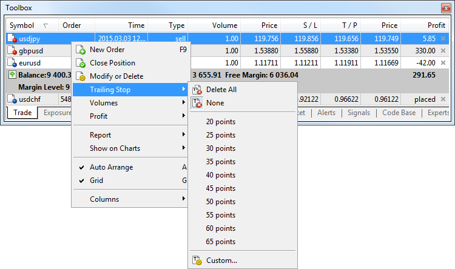

Select the desired value of a distance between the Stop Loss level and the current price. Use the " Set custom level" button to set Trailing Stop manually:

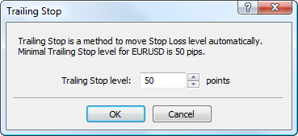

  * For each open position or pending order only one Trailing Stop can be set.
  * Trailing Stop operation is described in details in a [separate section (#trailing-stop)](Basic-Principles.md#trailing-stop).

  
---  
  

### How to Increase or Decrease the Volume of a Position (#position-partial)

Increase or decrease of position volume depends on the [position accounting system (#position)](Basic-Principles.md#position) adopted on the trading account.

Netting | Hedging  
---|---  
For one financial instrument only one position can exist at any given time. Differently directed positions (buy and sell) are not allowed. Thus, if you execute a [trade operation (#position-open)](Executing-Trades.md#position-open) to buy 1 lot of a financial symbol, and there is an open 1-lot sell position, the position is closed. If you have a 1-lot buy position and execute a trade operation to buy one more lot of the same instrument, you will have one position of 2 lots. The open price is recalculated in this case — the weighted average open price is calculated: (Price of the 1st deal*Volume of the 1st deal + Price of the 2nd deal*Volume of the 2nd deal)/(Volume of the 1st deal + Volume of the 2nd deal). The same is true for an opposite deal. If you have a 1-lot buy position and execute a trade operation to sell 0.5 lot of the same instrument, you will have one buy position of 0.5 lots. | Multiple open positions of the same symbol can simultaneously exist on the trading account, including oppositely directed ones (Buy and Sell). The volume of an existing position cannot be increased. To partially close a position, click "Close Position" in the context menu of the appropriate position. Next enter the value of the volume to close and click "Close...".  
  

### How to Analyze Your Entries on the Chart (#position-showonchart)

In trading it is important to evaluate the correctness of market entry and exit moments. This can be conveniently done through the graphical representation of executed deals on the symbol's price chart.

Choose an open position or a trade on the Trade or History tab, and click "Show on Chart" in the context menu: Next, click "Add [Symbol Name] Deals". Appropriate deals will be displayed on all currently open charts of the selected symbol. If there are no open charts for the selected symbol, a new chart will be opened. The "Show trading history" option can also be enabled in [chart properties (#trade-history)](../Price-Charts-Technical-and-Fundamental-Analysis/Additional-Features/Chart-Settings.md#trade-history).

Deals are marked on charts with icons  (a Buy deal) and  (a Sell deal). When you hover the mouse cursor over an icon, a tooltip appears containing information about the deal: ticket, deal type, volume, symbol, open price and current price coordinate of the cursor. The object name also includes the "autotrade" comment. It indicates that the object has been added to the chart automatically. Use it to work with such objects from [MQL5 programs](../Algorithmic-Trading-Trading-Robots/How-to-Create-an-Expert-Advisor-or-an-Indicator.md).

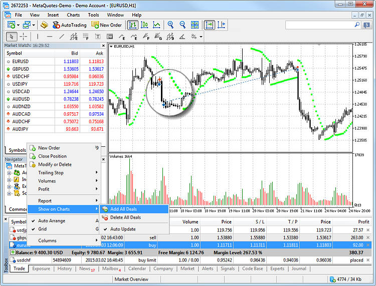

To enable the display of all history deals on charts, enable the "Show on Charts \ Auto Update" option in the context menu or "Show trade history" in [platform settings (#trade-history)](../Getting-Started/Platform-Settings.md#trade-history).

## Closing Positions (#position-close)

In order to profit from exchange rate differences, it is necessary to close the position. To close a position, a trade operation opposite to the first one is executed. For example, if the first trade operation was buying one lot of GOLD, one lot of the same security must be sold to close the position.

  * A position can be closed fully or partially, depending on the volume of a trade executed in the opposite direction.

  * To close a position in the [netting system (#netting)](Basic-Principles.md#netting), you should perform an opposite trading operation for the same symbol and the same volume. To close a position in the [hedging (#hedging)](Basic-Principles.md#hedging) system, explicitly select the "Close Position" command in the context menu of the position.

  
---  
  
To close an entire position, double-click on it or use the command " Close Position" in its context menu on the "Trade" tab.

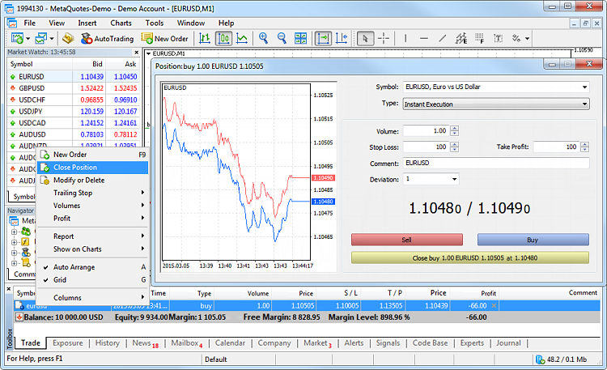

Upon clicking "Close..." the position is closed.

  * If you want to close a part of the position, enter the volume to close in the "Volume" field.
  * In the [Request Execution (#execution-type)](Basic-Principles.md#execution-type) mode, the price must be requested before you close a position.

  
---  
  

## Close by (#closeby)

This operation allows closing two opposite positions of the same symbol. If the positions have different volumes, only one position will be left open. Its volume will be equal to the difference between the volumes of two closed positions, and the direction will correspond to the larger position. 

In contrast to separate closure of two positions, the Close By operation saves the trader one spread:

  * When closing positions separately, the trader pays spread twice: when closing the Buy position at a lower price (Bid), and when closing Sell at the Ask price.
  * In the Close By operation, the open price of the first position is used to close the seconds one, and the first one is closed at the open price of the second position.

> This type of operation is only available in the [hedging (#hedging)](Basic-Principles.md#hedging) position accounting system.

Click twice on a position or select "Close Position" in its context menu on the Trade tab. In the Type field select "Close By":

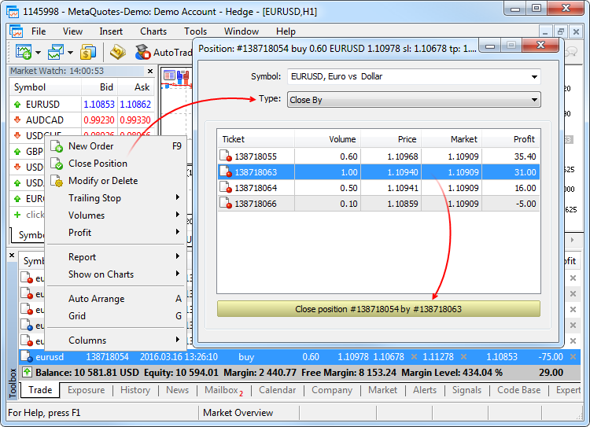

Select an opposite position and click "Close".

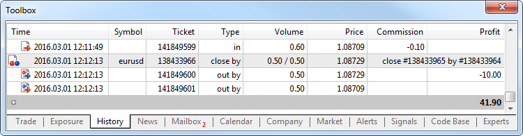

During the Close By operation an order of the "close by" type is placed. Tickets of positions to close are specified in its comment.

A pair of opposite positions is closed in two "out by" deals.

The total profit/loss resulting from the close by operation is only specified in one deal.

## Bulk position closing (#bulk-positions)

The trading platform allows closing all positions at once in a couple of clicks. For example, you may want to promptly take the profit in case om an important news release. To do this, use the "Group operations" item in the context menu of the Trade section:

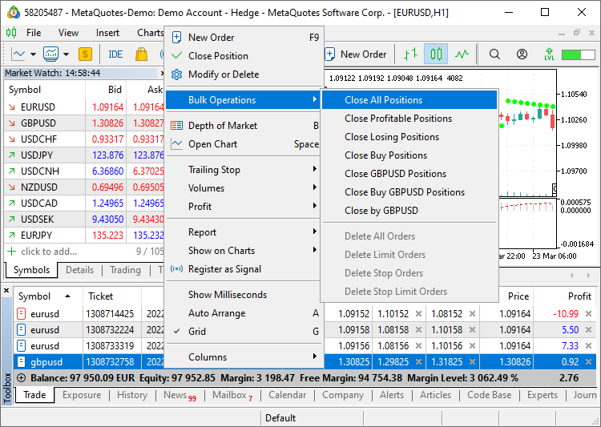

The list of available commands is formed automatically, depending on the selected operation and on your account type.

The following commands are always available in the menu:

  * Close all positions on hedging accounts, the system tries to [close positions by opposite ones (Close By) (#closeby)](Executing-Trades.md#closeby), and then it closes the remaining positions following a regular procedure.
  * Close all profitable or all losing positions.

If you select a position, additional commands appear in the menu:

  * Close all positions for the symbol.
  * Close all positions in the same direction (on hedging accounts).
  * Close opposite positions for the same symbol (on hedging accounts). If there is no opposite operation to close the position, it will remain open.
  * Reverse position (on netting accounts). For example, if you run this command for a EURUSD buy position with a volume of two lots, you will obtain a EURUSD sell position with the same volume of two lots. In this case, a deal of four lots will be executed on your account: two lots to close the current positions and two lots to open an opposite position.

> These commands are only available if One Click Trading is enabled in [platform settings (#one-click)](../Getting-Started/Platform-Settings.md#one-click). Some bulk operations are incompatible with [FIFO (#fifo)](Executing-Trades.md#fifo) account and are not displayed for them: closing of all profitable/losing positions, same-directed positions and opposite positions.

Closing procedure and restrictions:

  * For hedging accounts, the system first attempts to close positions using opposite orders. Any remaining positions are then closed using the standard procedure.
  * Positions are closed by opposite ones sequentially: first pair, second pair, and so on. If an error occurs during the closing of an opposite position, the entire process will be stopped. Any remaining positions will not be closed.
  * Positions are also closed sequentially for accounts operating under [FIFO (#fifo)](Executing-Trades.md#fifo) rule. Similarly, if an error occurs while closing a position, the entire process will be stopped.
  * After successfully closing opposite positions, the platform proceeds to close the remaining positions. This process is performed asynchronously: the platform sends requests to close each position to the broker's trading server as quickly as possible, without waiting for confirmation of the previous closures.
  * If the server returns an error in response to any request (requote, invalid parameters, or any other issue), the position will remain open, and the application will continue sending closure requests for the remaining positions.
  * If the application is closed during this process, the bulk closing process will be immediately terminated. Any positions that were not closed by the application will remain open.

## Closing positions using the FIFO rule (#fifo)

According to the regulatory requirements of certain authorities (for example, [NFA](https://www.nfa.futures.org/)), the broker can set a special position closing rule for the account to allow only FIFO closing (first in, first out). According to this rule, positions for each instrument can only be closed in the same order in which they were opened. The oldest one should be closed first, then the next one, etc. If you try to close positions in a different order, the platform will return an error. The rule can only be enabled for [hedging accounts (#position-type)](Basic-Principles.md#position-type).

There are three main methods to close a position:

  * Closing from the trading platform — the trader closes the position manually, using a trading robot, based on the [Signals](../Trading-Signals-and-Copy-Trading/README.md) service subscription, etc. When trying to close positions without meeting the FIFO rule, the trader will receive a corresponding error.
  * Closing upon [Stop Loss (#stop-loss)](Basic-Principles.md#stop-loss) or [Take Profit (#take-profit)](Basic-Principles.md#take-profit) activation — these orders are processed on the server side, so the position closure is not requested on the trader (platform) side but is initiated by the server. If Stop Loss or Take Profit triggers for a position, and this position does not comply with the FIFO rule (there is an older position for the same symbol), the position will not be closed. To prevent non-FIFO closing, the order in which stop levels are placed is changed on the platform side. If multiple positions exist for the same instrument, the placing of stop levels for any of them causes the same levels to be placed for all others. Accordingly, if a level triggers, all positions will be closed in a FIFO-compliant order.  
The same behavior is used when modifying and deleting stop levels.
  * Closing upon Stop Out triggering — such operations are also processed on the server side. In a normal mode, in which FIFO-based closing is disabled, Stop Out causes the position having the largest loss to be closed first. If this option is enabled, the open time will be additionally checked for losing positions. The server determines losing positions for each symbol, finds the oldest position for each symbol, and then closes the one which has the greatest loss among the found positions.

## Placing of Pending Orders (#pending)

A pending order is the trader's instruction to a brokerage company to buy or sell a security in future under pre-defined conditions. For example, if you want to sell EURUSD at 1.10800, but the price has not risen to that level yet, you do not have to wait. Place a pending order and the broker will perform it, even if the trading platform is closed at that point.

> Stop Loss and Take Profit can also be specified in a pending order. They will be set for the position that opens based on the order.

### Placing a Pending Order and General Parameters (#pending-place)

A pending order can be placed in different ways:

  * Select a symbol in the Market Watch and click " New order" in its context menu.
  * Press F9. In the order window, a symbol will be inserted in accordance with the [platform settings (#use-symbol)](../Getting-Started/Platform-Settings.md#use-symbol).
  * Click " New order" in the [Tools](../Getting-Started/User-Interface.md) menu or " New order" on the [Standard](../Getting-Started/User-Interface.md) toolbar.

After that, in the order placing window select "Pending order" in the "Type" field and the necessary symbol in the "Symbol" field:

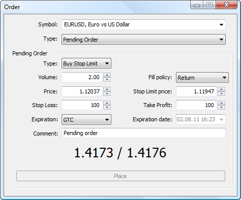

  * Type — pending order [type (#pending-order)](Basic-Principles.md#pending-order)
  * Volume — order volume in lots.
  * Price — the price at which the pending order should trigger. For stop and limit orders, it is the price at which they will be placed. For Stop Limit orders, this is the limit order activation and placing price at the level specified in "Order Price".
  * Stop Loss — the [Stop Loss (#stop-loss)](Basic-Principles.md#stop-loss) level. If you leave the null value in this field, this type of order will not be set.
  * Expiration — order expiration terms: 
    * Good Till Canceled (GTC) — the order is in the queue until it is manually removed;
    * Today — the order is only valid during the current trading day;
    * Specified — the order is active until the date indicated in the "Expiration Date" field;
    * Expiration date — the order is valid until 00:00 of the specified day. If this time appears to be out of a trade session, the expiration will be processed at the nearest trading time. 
  * Comment — a text comment to the order. The maximum comment length is 31 characters.

  * Fill policy — additional [filling rules (#fill-policy)](Basic-Principles.md#fill-policy) for limit and stop limit orders: "Fill or Kill", "Immediate or Cancel" or "Return". If this box is unavailable, then the option is disabled on the server.
  * Stop Limit — this field is only active for Stop Limit orders. When the Stop Limit order triggers, a limit order will be placed at the price specified in this field.
  * Take Profit — the [Take Profit (#take-profit)](Basic-Principles.md#take-profit) level. If you leave the null value in this field, this type of order will not be set.
  * Expiration date — in this field the order expiration date is specified, if the "Specified" or "Specified day" is selected for the order expiration condition.

  * The "Place" button is inactive if any of the parameters is incorrect.
  * Stop Loss and Take Profit orders only trigger for open positions, not for pending orders.
  * A comment to an order can be changed by a broker or server.
  * If the "Fill Policy" and "Expiration" fields are inactive, it means that the possibility to change them is disabled on the server.

  
---  
  

### Placing Limit Orders (#pending-limit)

Limit orders are placed in the expectation of price "rollback". The trader expects the price reaches a certain level, for example support or resistance, and then moves in the opposite direction.

These orders are executed at a price equal to the specified one or better than that. Accordingly, no slippage occurs during order execution. The downside of these orders is that their execution is not guaranteed, since the broker may reject an order if the price goes too far in the opposite direction.

Here is how we can place a Buy Limit order.

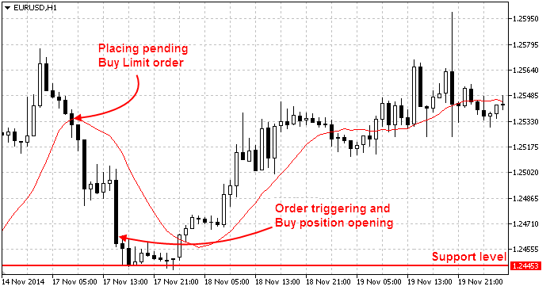

In this example, the price is at the level of 1.25350, and the trader places a limit order to buy at the price of 1.24620 expecting that the price will reach the support level of 1.24453 and will continue to move upwards.

It is the opposite for Sell Limit orders. They are placed in anticipation that the price will rise to a certain level and will go down.

### Placing Stop Orders (#pending-stop)

Stop orders imply expected breakthrough of certain levels. The trader expects the price to reach a certain level, break it through and move on in the same direction. The trader assumes that the market has reversed, having reached the support or resistance level.

When such an order triggers, a request to execute a corresponding market order is sent to a broker. The order is executed at the price equal to the specified one or worse than that. In other words, if the market price goes opposite, the order will be filled with a slippage. However, unlike limit orders, the execution of stop orders is guaranteed.

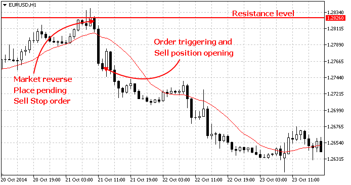

In this example, the price is at the level of 1.28190, and the trader places a stop order to sell at the price of 1.27600 assuming that the market has reversed at the level of 1.28260 and will move downwards.

It is the opposite for Buy Stop orders. They are placed assuming that the market has reversed, and the price will rise.

### Placing Stop Limit Orders (#pending-stoplimit)

This is a combination of a stop and a limit order. If the price reaches the stop price, a limit order is placed. This type of orders is used when a trader wants to set a stop order and limit the slippage.

In the example below, a stop-limit order is placed with the expectation that the price will reach the resistance level 1, will roll back from it, and then will rise to the resistance level 2.

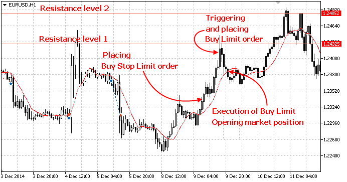

### How to Quickly Place an Order from the Chart (#pending-chart)

Pending orders can be placed from the chart using the [Trading (#trading)](../Price-Charts-Technical-and-Fundamental-Analysis/Additional-Features/Chart-Management.md#trading) submenu of the chart context menu:

Place the mouse cursor on the necessary price level on the chart and execute the appropriate context menu command.

Depending on the cursor position, available [order types (#order-type)](Basic-Principles.md#order-type) are displayed in the menu. If the menu is activated above the current price, a user can place Sell Limit and Buy Stop orders. If the menu is activated below the current price, Buy Limit and Sell Stop orders can be placed.

Available distance between the selected and current price for the symbol is additionally checked ("[Stops level (#specification)](Market-Watch.md#specification)").

Once the command execution, the [Order window (#pending-place)](Executing-Trades.md#pending-place) appears allowing the user to adjust its parameters more precisely.

> If the [One Click Trading (#one-click)](../Getting-Started/Platform-Settings.md#one-click) option is enabled in the platform settings, orders are placed at a specified price instantly without displaying the trading dialog.

## Managing Pending Orders (#pending-manage)

Sometimes you may need to modify a [pending order (#pending-order)](Basic-Principles.md#pending-order): set a new activation price, change stop levels or its expiration time.

### Order Modification (#pending-modify)

To modify a pending order, click " Modify or delete" in its context menu on the ["Trade" (#position-list)](Executing-Trades.md#position-list) tab.

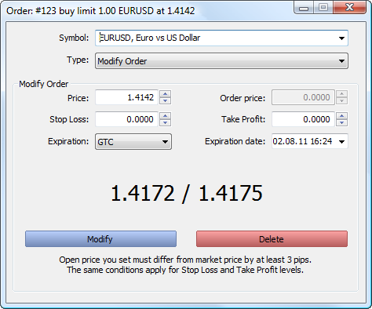

Almost all the fields of a pending order that you fill in during order [placing (#pending-place)](Executing-Trades.md#pending-place) can be modified, except for the volume, [fill policy (#fill-policy)](Basic-Principles.md#fill-policy) and its comment. After you enter new parameters click "Change".

> If parameters are set incorrectly, the "Modify" button becomes inactive.

### Order Modification on a Chart Using a Mouse (#pending-modify-chart)

Modification of pending orders on a chart is only available if the "Show trade levels" option is enabled in the [platform settings (#trade-levels)](../Getting-Started/Platform-Settings.md#trade-levels).

For pending orders, it is possible to modify [Stop Loss (#stop-loss)](Basic-Principles.md#stop-loss) and [Take Profit (#take-profit)](Basic-Principles.md#take-profit) levels separately, as well as modify the order price along with stop levels:

  * For the separate modification of stop levels on a chart, left-click the necessary level and drag it to the desired value (Drag'n'Drop).
  * Drag the price line to modify the entire order. In this case, both the price and the stop level are moved.
  * As for a Stop Limit order, its stop price and limit order price can be moved too. When moving the stop level indicated on the chart as "buy stop limit" or "sell stop limit", all the levels of the order will be moved including the limit order price, Stop Loss and Take Profit. The limit order price indicated on the chart as "buy limit" or "sell limit" is moved independent from other levels.

Once a level is set, the [order modification (#pending-modify)](Executing-Trades.md#pending-modify) appears allowing users to adjust the level more precisely. If ["One Click Trading" (#one-click)](../Getting-Started/Platform-Settings.md#one-click) option is enabled in the platform settings, orders are placed at a specified price instantly without displaying the trading dialog.

> Changing pending orders on the chart can be disabled by enabling ["Disable dragging of trade levels" (#trade-levels)](../Getting-Started/Platform-Settings.md#trade-levels) option in the platform settings.

### Order Modification on a Chart Using a Context Menu (#pending-context)

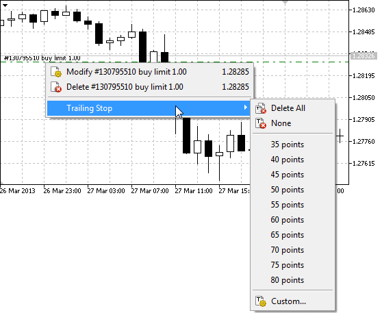

You can change or remove your pending orders, as well as set a trailing stop using pending order's context menu on the chart:

  *  Modify — open the window of [the selected order modification (#pending-modify)](Executing-Trades.md#pending-modify);
  *  Delete — open the order deletion window. If [One Click Trading (#one-click)](../Getting-Started/Platform-Settings.md#one-click) is enabled in the platform settings, removal is performed instantly without displaying the trading dialog;
  * Trailing Stop — open the menu of [Trailing Stop (#trailing-stop)](Basic-Principles.md#trailing-stop) selection.

### Deleting Pending Orders (#pending-delete)

A pending order can be deleted from its modification window by pressing the "Delete" button. Pending orders can also be deleted automatically at the time specified in the ["Expiration" (#pending-place)](Executing-Trades.md#pending-place) field. A deleted pending order is marked as "Canceled" on the [History (#trade-history)](Executing-Trades.md#trade-history) tab of the Toolbox window.

The pending order can also be [removed directly from the chart (#pending-delete)](One-Click-Trading.md#pending-delete) using the context menu.

### Bulk deletion of pending orders (#bulk-orders)

The trading platform allows canceling all pending orders at once, in a couple of clicks. For example, if there is an important market news release, you may want to remove orders to avoid their activation in case of a sharp price jump. To do this, use the "Group operations" item in the context menu of the Trade section:

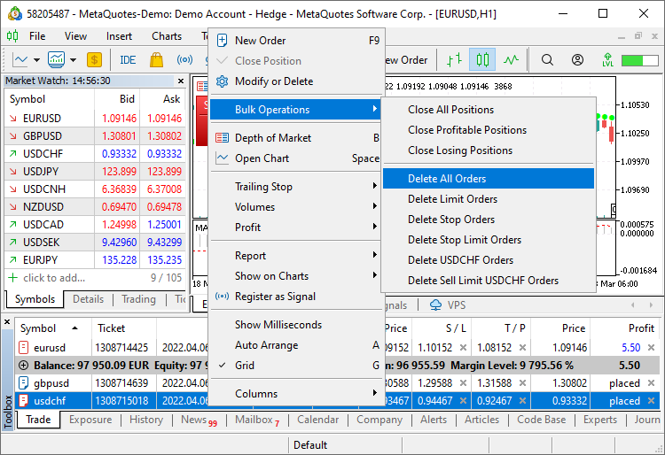

The list of available commands is formed automatically, depending on the selected operation and on your account type.

The following commands are always available in the menu:

  * Delete all pending orders.
  * Delete pending orders of certain types: Limit, Stop, Stop Limit

If you select a pending order, additional commands appear in the menu:

  * Delete all pending orders for the same symbol.
  * Delete all pending orders of the same type for the same symbol.

> These commands are only available if One Click Trading is enabled in [platform settings (#one-click)](../Getting-Started/Platform-Settings.md#one-click).

## Trading Account History (#trade-history)

The platform provides full access to the trading history of an account, as well as various tools for analyzing it. Open the "History" tab of the Toolbox window.

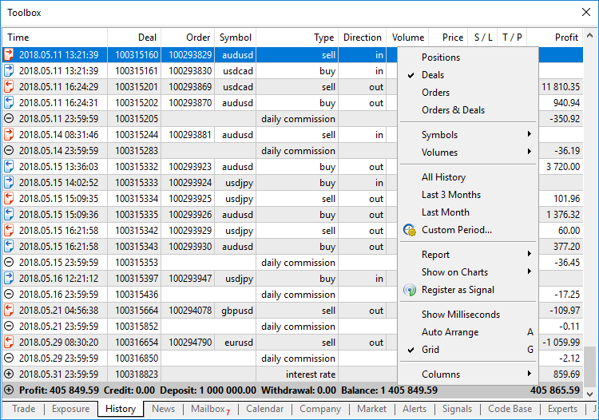

A list of trades on the trading account:

  * Time — deal execution time. Specified according to the time zone of the broker's trading server. The record is represented as YYYY.MM.DD HH:MM (year.month.day hour:minute).
  * Deal — ticket number (a unique identifier) of a deal;
  * ID — the deal ID in an external trading system (for example, on the exchange). The display of this parameter can be disabled depending on your broker's settings.
  * Order — ticket number (unique identifier) of the order, based on which the deal was executed. Several deals can correspond to one order, if the required volume specified in the order was not covered by one market offer;
  * Symbol — a financial instrument of the deal;
  * Type — trading operation type: "Buy" — a buy deal, "Sell" — a sell deal. In some situations a previously performed deal is canceled. In this case, the type of the previously performed deal is changed to Canceled buy or Canceled sell, and its profit/loss is reset to zero. Previously gained profit/loss is deposited/withdrawn from an account in a separate balance operation;
  * Direction — direction of the deal relative to the current position of a particular symbol: "in", "out" or "in/out";
  * Volume — volume of an executed deal (in lots or units);
  * Price — price at which the deal was executed;
  * Value — market value of the deal. The value is calculated as the product of the price and the contract size.
  * Cost — the cost of a deal execution relative to the current mid-point price of the symbol (mid-point spread cost). Actually, this is the amount which the trader loses on traded spread. The availability of the parameter depends on the server.  
  
The value is calculated using the following formulas.  
  
Forex:  
For Buy deals: Normalize((Market Bid price + Market Ask price)/2 * Contract size * Volume in lots) - Normalize(Deal price * Contract size * Volume in lots)  
For Sell deals: Normalize(Deal price * Contract size * Volume in lots) - Normalize((Market Bid price + Market Ask price)/2 * Contract size * Volume in lots)  
  
CFD, CFD Index, CFD Leverage and Exchange Stocks, Exchange MOEX Stocks:  
For Buy deals: Normalize((Market Bid price + Market Ask price)/2 - Deal price) * Contract size * Volume in lots  
For Sell deals: Normalize(Deal price - (Market Bid price + Market Ask price)/2) * Contract size * Volume in lots  
  
Futures, Exchange Futures, FORTS Futures, Exchange Options, Exchange Margin Options:  
For Buy deals: Normalize((Market Bid price + Market Ask price)/2 - Deal price) * Contract size * Volume in lots * Tick price/ Tick size  
For Sell deals: Normalize(Deal price - (Market Bid price + Market Ask price)/2) * Contract size * Volume in lots * Tick price / Tick size  
  
Deal size is determined in accordance with the trading instrument type, similarly to profit calculation. For Forex and CFD instruments, the value is equal to the contract size multiplied by the deal volume; for futures, it is the ratio of price to tick size multiplied by the deal volume, etc.  
  
The value derived from the formula is the deal cost in the instrument's profit currency. Conversion is applied if it differs from the deposit currency. 
  * S/L — the Stop Loss level. Stop Loss values for entry and reversal deals are set in accordance with the Stop Loss of orders, which initiated these deals. The Stop Loss values ??of appropriate positions as of the time of position closing are used for exit deals.
  * T/P — the Take Profit level. Take Profit values for entry and reversal deals are set in accordance with the Take Profit of orders, which initiated these deals. The Take Profit values of appropriate positions as of the time of position closing are used for exit deals.
  * Commission — commission charged for the deal execution. The commission value is only displayed in this field if commission is charged immediately after the execution of a deal. Commission may also be configured so that its value is accumulated within a day/month and is then withdrawn from the account by a single balance deal. In that case, its value is not displayed for each deal. The value accumulated during a day/month is displayed in the account state bar. The way commission is charged is regulated by a broker;
  * Fee — separate type of fees charged by the broker per deals.
  * Profit — the financial result of the position exiting. For entry trades the zero profit is shown. 
  * Change — a percentage change in the asset price at the time when profit/loss is locked in. Positive and negative values are colored in blue and red, respectively.
  * Magic — the value specified by a [trading robot](../Algorithmic-Trading-Trading-Robots/Expert-Advisors-and-Custom-Indicators.md) when opening orders and positions (Expert Advisor ID)

Deal execution result relative to the initial deposit:

  * Profit — profit or loss relative to the initial deposit.
  * Credit — amount credited by the brokerage company.
  * Deposit — deposit of the account (the sum of balance type operations with a positive value).
  * Withdrawal — amount withdrawn from the account (the sum of balance type operations with a negative value).

The current account balance is displayed at the end of the line.

Switching between history representation modes.

Filtering history by financial instruments and volume switching between lots and units.

If the account trading history is too large, or you need to access data for a certain time interval, select the desired period here.

A report can be saved as a file and shared with other traders or analyzed using external software. In addition to the list of operations and results on the account, the trade report includes various statistics.

You can also choose to display all trades on charts and analyze the efficiency of entries and exits. 

The trading history can be presented in various forms:

  * As a list of positions. The platform collects data on deals related to a position (position opening, additional volume, partial and full closure), and then combines the data into one record providing the following details:

  * Position opening and closing time determined by the first and last trade respectively
  * Position volume. If part of the position was closed, the record contains the closed volume and the source volume
  * The weighted average position opening price and its closing price
  * The total financial result of deals related to the position

  * Position Stop Loss and Take Profit determined by Stop Loss and Take profit values of the deals, which opened and closed the position
  * A list of orders containing all trade requests sent to a broker;
  * A list of deals — the actual purchase and sale transactions executed based on the orders;
  * A tree view of all trading operations showing how the trade requests were processed.

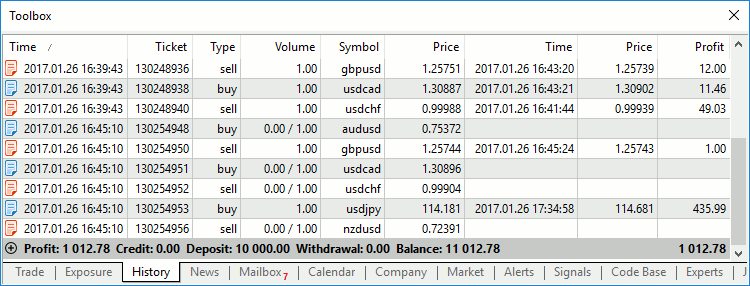

To display the trading history as positions, the platform uses information about deals executed during the requested period. A position is included into the report only if its opening date or closing date falls within the selected period. If a position was opened before the start of the selected time period and was closed after its end, this position will not be included in the report.

## Alerts — How to Configure Market Event Notifications (#alert)

The alerts are used to notify of market events. Having created alerts, you may leave the monitor, and the trading platform will automatically notify of the specified event.

Alerts are configured on the "Alerts" tab. An alert can be created via the context menu or by pressing Insert.

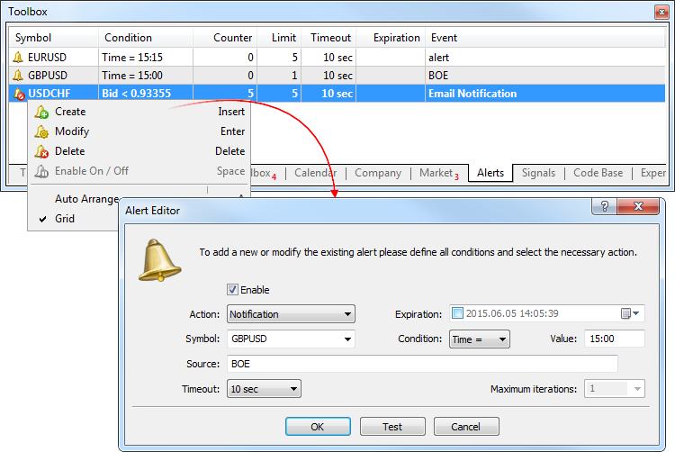

The data of this financial instrument are used to check the alert conditions. If the alert condition is "Time", the symbol does not matter.

The condition under which the alert triggers:

  * Bid < — an alert triggers if the Bid price goes below the specified value;
  * Bid > — an alert triggers if the Bid price goes above the specified value;
  * Ask < — an alert triggers if the Ask price goes below the specified value;
  * Ask > — an alert triggers if the Ask price goes above the specified value;
  * Last < — an alert triggers if the Last price goes below the specified value;
  * Last > — an alert triggers if the Last price goes above the specified value;
  * Volume < — an alert triggers if the last deal volume is below the specified value;
  * Volume > — an alert triggers if the last deal volume is above the specified value;
  * Time = — an alert triggers at the specified time. Specify the local computer time in the format "HH:MM", for example 15:00; 

An action executed when the event triggers:

  * Sound — playing a sound file;
  * File — running an executable file;
  * Email — sending an email at the address specified in the [platform settings (#mail)](../Getting-Started/Platform-Settings.md#mail).
  * Notification — sending a [push notification to a mobile device (#notifications)](../Getting-Started/Platform-Settings.md#notifications). To enable push notifications, specify the MetaQuotes ID in the platform settings. MetaQuotes ID is a unique identifier, which is assigned to each mobile terminal during installation on a device. Push notifications are an effective means to notify of events, they are instantly delivered to mobile devices and are never lost. The message text is specified in the "Source" tab. 

Alert lifetime. An alert can be automatically deleted at the specified time. The local computer time should be indicated here.

The value of the price, volume or time to trigger an alert.

Depending on the selected action type, specify here:

  * An audio file in *.wav, *.mp3 or *.wma format.
  * An executable file of *.exe, *.vbs or *.bat format.
  * An email template. If "Email" is selected for the action, a click on this field opens a window where you can create the template of the email to be sent to the address specified in the [platform settings (#mail)](../Getting-Started/Platform-Settings.md#mail). You can also write an email text message in the format "email subject\n email text".
  * Push notification text. The maximum message length is 255 characters.

Time between alert repetitions.

Maximum number of alert repetitions.

Enable or disable the selected alert. When disabled, an alert is not deleted, but becomes inactive.

The "Test" button allows to test the selected alert. To apply the changes, click "OK".

> To send event alerts as emails, configure the mailbox parameters in the [platform settings (#mail)](../Getting-Started/Platform-Settings.md#mail).

### Creating an Email (#mail)

If Email is selected for the alert action, a click on the button 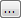 opens a window where you can create the email:

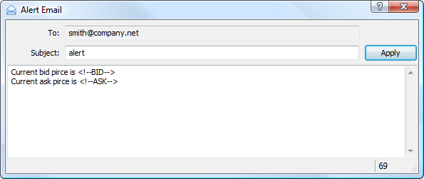

In the "To" field, add the name of the [mailbox (#mail)](../Getting-Started/Platform-Settings.md#mail) to which the email will be sent. Next enter the email subject. Below is the field for entering the message text. You can insert various macros into the text using "Macros" command of the context menu:

  * Symbol — the name of the financial symbol the alert is configured for;
  * Bid — bid price;
  * Bid High — the highest Bid price for the chart period (for exchange instruments);
  * Bid Low — the lowest Bid price for the chart period (for exchange instruments);
  * Ask — ask price;
  * Ask High — the highest Ask price for the chart period (for exchange instruments);
  * Ask Low — the lowest Ask price for the chart period (for exchange instruments);
  * Last — the last price, at which a deal was executed (for exchange instruments);
  * Last High — the highest last price at which a deal was executed for the chart period (for exchange instruments);
  * Last Low — the lowest last price at which a deal was executed for the chart period (for exchange instruments);
  * Volume — the volume of deals executed during the period of the chart;
  * Volume High — the highest volume of an executed deal for a trading session (for exchange instruments);
  * Volume Low — the lowest volume of an executed deal for a trading session (for exchange instruments);
  * Volume Bid — the volume of a Buy deal closest to market (for exchange instruments);
  * Volume Ask — the volume of a Sell deal closest to market (for exchange instruments);
  * Time — the time of the last quote;
  * Bank — the instrument liquidity provider;
  * Login — current [account](../Getting-Started/Open-an-Account.md) number;
  * Balance — current account balance;
  * Equity — current account equity;
  * Profit — current profit value;
  * Margin — current margin value;
  * Free margin — current free margin value;
  * Positions — a list of all open positions in the account;
  * Orders — currently active orders ([pending orders (#position-list)](Executing-Trades.md#position-list), unfilled orders to execute a market deal).

Once you have created the email click "Apply".

### Creating and Managing Alerts on Chart (#creating-and-managing-alerts-on-chart)

An alert can be quickly created right on a chart. Click " Alert" in the chart context menu:

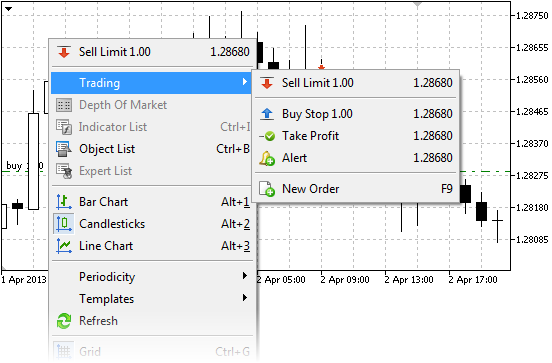

An alert is created for the symbol of the chart. If the menu is opened above the current price the alert is created with condition "Bid > selected price", below the current price — "Bid < selected price". Alerts created from the chart are automatically set to [expire (#alert)](Executing-Trades.md#alert). The expiration time depends on the chart timeframe: 

  * For minute timeframes the expiration is set in hours. The number of hours corresponds to the number of minutes in the timeframe. For example, the expiration is set to 1 hour on M1 timeframe, to 5 hours on M5 timeframe, to 30 hours on M30 timeframe, etc.
  * For hourly timeframes the expiration is set in days. The number of days corresponds to the number of hours in the timeframe. For example, the expiration is set to 1 day on H1 timeframe, to 2 days on H2 timeframe, to 6 days on H6 timeframe, etc.
  * For the day timeframe the expiration is set to 24 days.
  * For the week timeframe the expiration is set to 2 weeks.
  * On a monthly timeframe the expiration is set to 2 months.

Alerts are displayed as red arrows on the right side of the chart of the corresponding instrument:

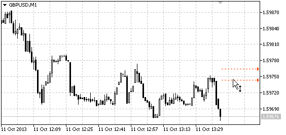

The price level of an alert can be modified directly on the chart. Just drag the alert arrow using a mouse.

> The alert modification feature on the chart is unavailable if the option ["Disable dragging of trade levels" (#trade-levels)](../Getting-Started/Platform-Settings.md#trade-levels) is enabled in the platform settings.
