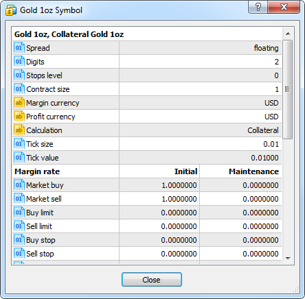
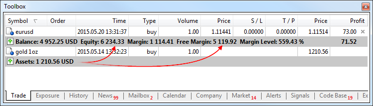

[🏠 Document Start](../../README.md) / [Trading Operations](../README.md) / [For Advanced Users](../For-Advanced-Users.md) / Collateral Symbols

[Previous](Margin-Calculation-Exchange-Model.md) | [Next](Custom-Financial-Instruments.md)

# Collateral Symbols

The trading platform supports a special type of non-tradable assets, which can be used as client's assets to provide the required margin for open positions of other instruments. For example, a certain amount of gold in physical form can be available on a trader's account, which can be used as a margin (collateral) for open positions.

In the [contract specification (#specification)](../Market-Watch.md#specification), these instruments have calculation type "Collateral".

Such assets are displayed as open positions. Their value is calculated by the formula: Contract size * Lots * Market Price * Liquidity Rate. Liquidity Rate here means the share of the asset that a broker allows to use for the margin.

The Assets are added to the client's Equity and increase Free Margin, thus increasing the volumes of allowable trade operations on the account.

In the example above, a trader has 1 ounce of gold having the current market value of 1,210.56 USD. This value is added to the equity and the free margin.

Brokers may allow closing such positions. In this case a trader is able to convert the asset into the deposit currency at the current market rate and use that money for trading.
