[🏠 Document Start](../../README.md) / [Trading Operations](../README.md) / [For Advanced Users](../For-Advanced-Users.md) / Custom Financial Instruments

[Previous](Collateral-Symbols.md) | [Next](Spreads.md)

# Custom Financial Instruments (#custom-financial-instruments)

The trading platform allows creating custom financial symbols. You can view [charts](../../Price-Charts-Technical-and-Fundamental-Analysis/View-and-Configure-Charts.md) of such symbols and perform [technical analysis](../../Price-Charts-Technical-and-Fundamental-Analysis/Technical-Indicators.md), as well as use them for testing trading robots and indicators in the [Strategy Tester](../../Algorithmic-Trading-Trading-Robots/Strategy-Testing.md).

If your broker does not provide the instrument, on which you want to test your strategy, or the provided history depth and the quality of price history is not enough, you can create a custom symbol and upload required data to it.

## How to Create and Configure a Custom Symbol (#how-to-create-and-configure-a-custom-symbol)

Open the symbol management window using the context menu of the ["Market Watch"](../Market-Watch.md) window and click on "Create Custom Symbol":

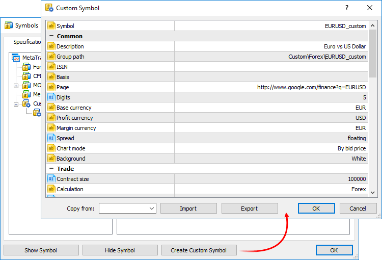

For a custom symbol, you can configure some parameters from the [specification of trading instruments (#specification)](../Market-Watch.md#specification), as well as some additional parameters:

  * Basis — the name of the underlying asset for the custom symbol. For example, gold is the underlying asset for futures contracts.
  * Page — the web page containing symbol information. It will be displayed as a link when viewing symbol properties in the Market Watch window.
  * Chart mode — the price used for creating the symbol chart, Bid or Last.
  * Background — the background color for the symbol in the Market Watch window.
  * Calculate hedged margin using larger leg — this mode is only used on [hedging (#hedging)](../Basic-Principles.md#hedging) accounts, where opposite positions of the same symbol can exist simultaneously. Symbol margin can be calculated using the margin of a short side (all sell positions and pending orders) and of a long side (all buy positions and sending orders). The largest one of the calculated values is used as the final margin value.
  * Time limits use — by setting "Yes", you can specify the first and the last day of the symbol trading period (circulation period).

In addition to the above parameters, you can configure trading and quoting sessions for the symbol. Sessions are configured separately for each day. Double-click on a day to edit it.

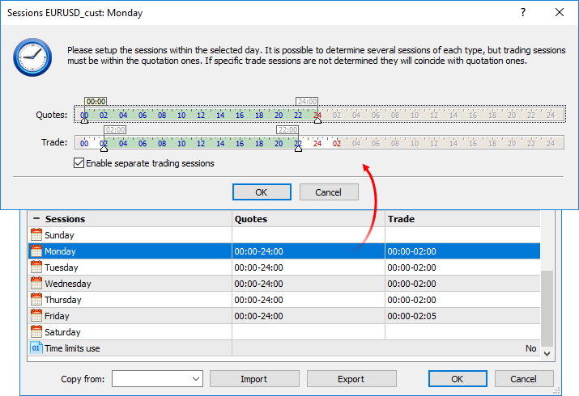

Set the desired sessions using sliders. Expert Advisors will not be able to trade in the Strategy Tester in non-session hours.

Trading sessions are not specified by default, and coincide with quoting sessions. If you need to configure the time of quoting and trading sessions separately, enable the option "Enable separate trading sessions". Each trading session must be within a quoting session.

  * You can quickly configure your custom symbol by copying parameters of any similar instrument and modifying them. Select an existing symbol in the "Copy from" field.
  * The name of the custom symbol must not match the names of symbols provided by the brokers. If you connect to the server, on which a symbol with the same name exists, the custom symbol will be deleted.
  * The symbol name may only contain Latin letters without punctuation, spaces or special characters (may only contain ".", "_", "&" and "#"). It is not recommended to use characters <, >, :, ", /, |, ?, *.

  * The minute and tick history of the custom financial instrument is automatically deleted when the following parameters in the symbol [specifications (#specification)](../Market-Watch.md#specification) are changed: the formula (for [synthetic symbols (#synthetic)](Custom-Financial-Instruments.md#synthetic)), the tick size and value, the charting mode, the point value and accuracy. When the above parameters are changed from MQL5 programs, price data is also deleted. Be careful and properly configure all the symbol parameters before [importing history (#import-history)](Custom-Financial-Instruments.md#import-history).

  
---  
  

## Import and Export of Custom Symbols (#export)

You can easily share custom symbols or transfer symbols between your platforms. Parameters of a specific custom symbol can be exported or imported from its settings editing window shown above.

It is also possible to export and import entire groups of symbols:

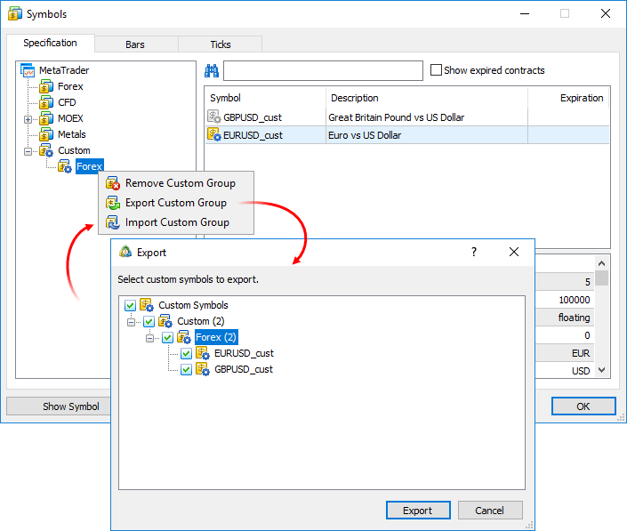

Settings are exported to JSON text files:

{   
"ConfigSymbols" : [   
{   
"Symbol" : "EURUSD_cust",   
"Path" : "Custom\\\Forex\\\EURUSD_cust",   
"ISIN" : "",   
"Description" : "Euro vs US Dollar",   
....  
---  
  

## Managing Custom Symbols (#manage)

All symbols are displayed in a separate Custom group. If you need to modify or delete a symbol, use the context menu of the list:

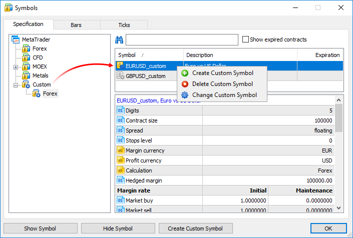

## Importing the Price History (#import-history)

You can import price data to your custom symbol from any text file, as well as from MetaTrader history files (HST). Choose a symbol and go to the "Bars" or "Ticks" tab.

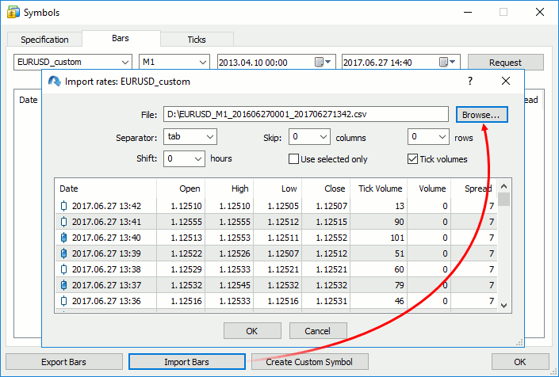

In the import dialog, specify the path to the file and set the required parameters:

  * Separator — separator of items in a text file.
  * Skip columns and rows — amount of columns (from left to right) and rows (from top to bottom) to be skipped during an import.
  * Shift — time shift by hours. The option is used when importing data saved in a different time zone.
  * Use selected only — import only rows highlighted in the row view area. You can highlight rows with your mouse while holding Ctrl or Shift.

A file with 1-minute bars should have the following format: Date Time Open High Low Close TickVolume Volume Spread. For example:

<DATE> <TIME> <OPEN> <HIGH> <LOW> <CLOSE> <TICKVOL><VOL> <SPREAD>   
2016.06.27 00:01:00 1.10024 1.10136 1.10024 1.10070 18 54000000 44   
2016.06.27 00:02:00 1.10070 1.10165 1.10070 1.10165 32 55575000 46   
2016.06.27 00:03:00 1.10166 1.10166 1.10136 1.10163 13 13000000 46   
2016.06.27 00:04:00 1.10163 1.10204 1.10155 1.10160 23 51000000 41  
---  
  
A file with ticks should have the following format: Date Time Bid Ask Last Volume. For example:

<DATE> <TIME> <BID> <ASK> <LAST> <VOLUME>   
2017.07.03 00:03:47.212 1.14175 1.14210 0.00000 0   
2017.07.03 00:03:47.212 1.14168 1.14206 0.00000 0   
2017.07.03 00:03:47.717 1.14175 1.14206 0.00000 0   
2017.07.03 00:03:54.241 1.14175 1.14205 0.00000 0   
2017.07.03 00:03:57.982 1.14165 1.14201 0.00000 0   
2017.07.03 00:04:07.795 1.14175 1.14201 0.00000 0   
2017.07.03 00:04:55.432 1.14164 1.14200 0.00000 0   
2017.07.03 00:14:33.743 1.14173 1.14203 0.00000 0   
2017.07.03 00:14:33.743 1.14173 1.14201 0.00000 0   
2017.07.03 00:16:44.901 1.14174 1.14195 0.00000 0  
---  
  
Do not pass [tick flags (#history)](../Market-Watch.md#history), as the terminal calculates them during import.

You can use data from any existing instrument for your custom symbol. [Export (#history)](../Market-Watch.md#history) data, modify it if necessary, and import the data back.

  * The price history is stored in the form of one-minute bars. All other timeframes are created based on these bars. You can also import data of higher timeframes, but charts on lower timeframes will have gaps in this case. For example, if you import one-hour data, one bar per hour will be shown on the M1 chart.

  * During import, the time interval is completely replaced by data from the specified file. For example, if the file contains data from 2016.01.01 00:00:00 to 2016.06.01 00:00:00, and the custom symbol history already has some data in this interval, these data will be completely replaced with new ones (even if the amount of imported data is less than data in the history).
  * When importing bars, the presence of duplicate entries in the imported file (bars with the same time) is considered to be an error. In the platform, only one bar can correspond to one minute. When importing ticks, several ticks can have fully identical parameters.
  * Values set to less than or equal to zero are not imported.
  * During import, the user must provide the correct order of ticks in the file, i.e. from earlier ticks to more recent ones.

  
---  
  
Price data of custom symbols are saved in a separate Custom directory (not in the directories where data of trade servers are stored):

C:\Users\\[windows account]\AppData\Roaming\MetaQuotes\Terminal\\[instance id]\bases\Custom  
---  
  

## Editing the Price History (#edit-history)

You can edit the history of bars and ticks of custom symbols manually. To do this, request the required data interval in the "Bars" or "Ticks" tab.

  * Double-tap to change the value.
  * Use the context menu to add or delete entries
  * If you need to delete multiple bars/ticks at once, select them with the mouse, holding down Shift or Ctrl+Shift.

> When editing bars, it is highly recommended to request data of the M1 timeframe. The price history is stored in the form of one-minute bars in the platform. All other timeframes are created based on these bars. Even if you initially request bars of another timeframe, all changes will be applied to the corresponding 1-minute bars. For example, if you request data of the M5 timeframe and edit a bar, five 1-minute bars will be replaced by one 1-minute bar (corresponding to the beginning of the M5 bar). It means that the edited interval will be completely replaced.

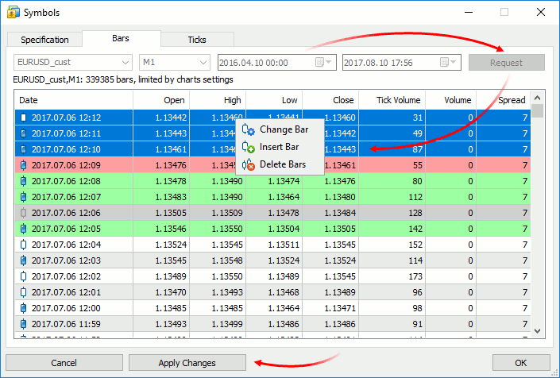

For convenience, modified entries are highlighted as follows:

  * Red background means that the entry is incorrect (for example, the high price is less than the low price)
  * Green background indicates a correct modified entry
  * Gray background means a deleted entry
  * Yellow background shows an added entry

  * When adding a new bar, the first unoccupied date/time from the current data selection is automatically inserted in the "Date" column.
  * The platform does not allow creating bars with the same date/time. Only one bar can correspond to one minute.

  
---  
  
To save the changes, click "Apply Changes" at the bottom of the window.

## Use of Custom Financial Instruments (#use-of-custom-financial-instruments)

Use of custom symbols is similar to the use of instruments provided by the broker. Custom symbols are displayed in the [Market Watch window](../Market-Watch.md); you can open charts of such symbols and apply indicators and analytical objects on them.

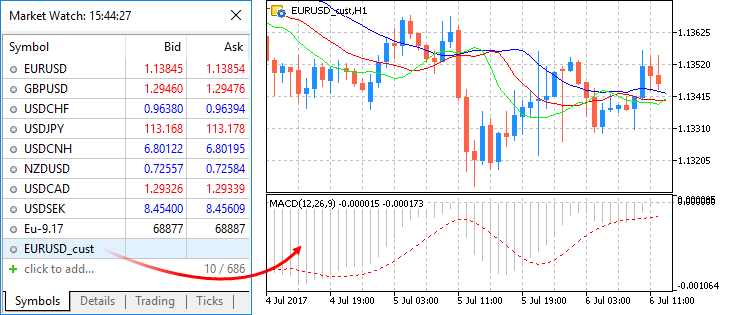

## Testing Using Custom Financial Instruments (#testing-using-custom-financial-instruments)

Real trades cannot be executed on custom symbols, but they can be used for testing trading robots and indicators in the [Strategy Tester](../../Algorithmic-Trading-Trading-Robots/Strategy-Testing.md). Select a custom symbol and launch testing:

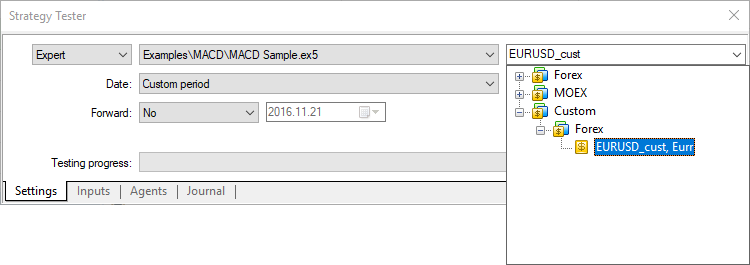

When calculating the margin and profit of trades executed during testing, the Strategy Tester can automatically use cross rates available on the account. For example, if the profit currency is EUR and the account currency is USD, the tester will convert it according to the corresponding EURUSD rates.

Most often, custom symbol names include various suffixes, such as EURUSD.1 or EURUSD.f. Therefore, the strategy tester uses a special mechanism to search for suitable cross rates for recalculation.

For example, we have created a custom symbol AUDCAD.custom with the margin calculation type [Forex](Margin-Calculation-Retail-Forex-Futures.md), and the currency of our account is USD. Based on the name of the Forex instrument, the tester searches for the required symbols in the following order:

  1. First, the tester searches for symbols such as AUDUSD.custom (for margin calculation) and USDCAD.custom (for profit calculation).
  2. If any of these symbols is not found, the tester searches for the first symbol, whose name corresponds to the required currency pairs, i.e. AUDUSD and USDCAD. If it finds for example AUDUSD.b and USDCAD.b, the rates of these symbols will be used for margin and profit calculation.

For financial instruments with other [margin calculation types](Margin-Calculation-Retail-Forex-Futures.md) (Futures, Stock Exchange), a currency pair is needed for converting the instrument currency into deposit currency. For example, we have created a custom symbol with the British pound (GBP) set for the profit and margin currency, and the Swiss franc (CHF) used as the deposit currency. In this case, symbols for testing are searched in the following order:

  1. The availability of a trading instrument corresponding to GBPCHF (GBP vs CHF) is checked.
  2. If this symbol is not available, the tester will search for the first trading instrument corresponding to the GBPCHF currency pair, such as GBPCHF.b or GBPCHF.def.

  * When testing applications using custom instruments, make sure that the account has all the necessary currency pairs. Otherwise, the calculation of financial results and margin requirements during testing will not be possible.

  * The use of [MQL5 Cloud Network (#cloud)](../../Algorithmic-Trading-Trading-Robots/Strategy-Optimization.md#cloud) for optimization using custom symbols is not allowed. This is due to the fact that custom symbols with the same names, but different price histories can exist on computers of different traders. In addition to the discrepancy of test results between network agents, this may cause mass reloading and synchronization of history data, which leads to excessive internet usage. Using [local network agents (#farm)](../../Algorithmic-Trading-Trading-Robots/Strategy-Optimization.md#farm) and [remote agents](../../Algorithmic-Trading-Trading-Robots/MetaTester-and-Remote-Agents.md) is allowed.

  
---  
  

## Synthetic Symbols with Real-Time Quotes (#synthetic)

The trading platform allows creating synthetic financial instruments, i.e. symbols based on one or more existing instruments. The user should set the formula for calculating quotes, after which the platform will generate ticks of the synthetic instrument in real time, and also will create its minute history.

### How It Works (#how-it-works)

  * You create a synthetic instrument and set formula for price calculation.
  * The platform calculates ticks at a frequency of 10 times per second, provided that the price of at least one of the instruments used in the formula has changed.
  * The platform also calculates the history of 1-minute bars based on 1-minute bars of instruments used in its formula. All new bars (current and subsequent ones) will be drawn in real time based on the generated ticks of the synthetic instrument.

For example, you can create an instrument showing the [dollar index (USDX)](https://ru.wikipedia.org/wiki/%D0%98%D0%BD%D0%B4%D0%B5%D0%BA%D1%81_%D0%B4%D0%BE%D0%BB%D0%BB%D0%B0%D1%80%D0%B0). It uses the below formula:

50.14348112*pow(ask(EURUSD),-0.576)*pow(USDJPY,0.136)*pow(ask(GBPUSD),-0.119)*pow(USDCAD,0.091)*pow(USDSEK,0.042)*pow(USDCHF,0.036)  
---  
  
The platform will calculate in real time the price of the new instrument based on the quotes of the other six symbols provided by your broker. The price changes will be visualized in the Market Watch window and on the chart:

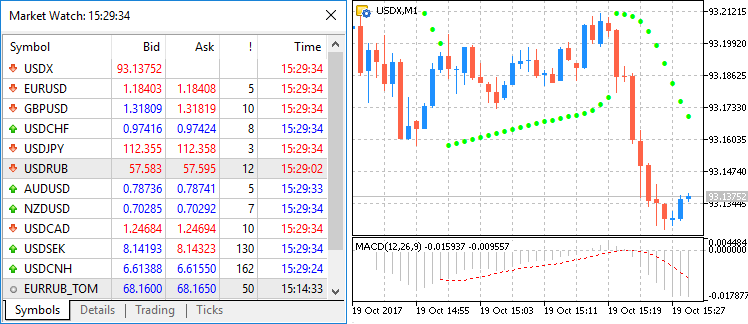

Create a new custom symbol, open [its specification](Custom-Financial-Instruments.md) and specify the formula:

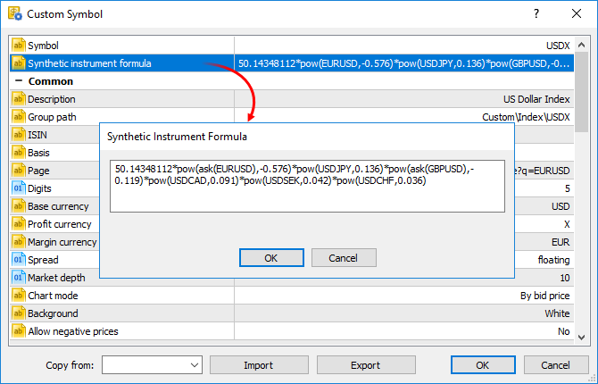

Calculation of [ticks (#synthetic-ticks)](Custom-Financial-Instruments.md#synthetic-ticks) and [1-minute bars (#synthetic-bars)](Custom-Financial-Instruments.md#synthetic-bars) of a synthetic instrument starts when this instrument is added to the Market Watch. Also, all symbols required for the synthetic price calculation are automatically added to the Market Watch. An entry about the calculation start will be added to the platform [log](../../Getting-Started/For-Advanced-Users/Platform-Logs.md): Synthetic Symbol USDX: processing started.

  * Calculation of a synthetic instrument is stopped after it is removed from the Market Watch.
  * Symbols that are currently used for calculating synthetic symbol prices cannot be hidden from the Market Watch.

  
---  
  

### Real-Time Calculation of Quotes (#synthetic-ticks)

Every 100 ms (i.e. ten times per second) the prices of the symbols used in calculation are checked. If at least one of them has changed, the price of the synthetic symbol is calculated and a new tick is generated. Calculation is performed in parallel in three threads for Bid, Ask and Last prices. For example, if the calculation formula is EURUSD*GBPUSD, the price of the synthetic symbol will be calculated as follows:

  * Bid = bid(EURUSD)*bid(GBPUSD)
  * Ask = ask(EURUSD)*ask(GBPUSD)
  * Last = last(EURUSD)*last(GBPUSD)

The availability of changes is checked separately for each price. For example, if only the Bid price of a source instrument has changed, only the appropriate price of a synthetic instrument will be calculated.

### Creating a History of 1-Minute Bars (#synthetic-bars)

In addition to collecting ticks in real time, the platform creates a minute history of the synthetic instrument. It enables traders to view synthetic symbol charts similar to normal ones, as well as to conduct technical analysis using objects and indicators.

When a trader adds a synthetic instrument to the Market Watch, the platform checks whether its calculated minute history exists. If it does not exist, the history for the last 60 days will be created, which includes about 50,000 bars. If a lower value is specified in the [Max. bars in chart (#max-bars)](../../Getting-Started/Platform-Settings.md#max-bars) parameter in platform settings, the appropriate limitation will apply. If some of bars within this period were created earlier, the platform will additionally generate new bars.

After creating bars for the last 60 days, the platform will continue to create a deeper history in the background mode. The price history of each symbol used in the synthetic formula can be of different depth. Therefore the calculation is performed for the shortest available period. For example, the formula uses three financial instruments:

  * EURUSD with the history down to 2009.01.01
  * USDJPY with the history down to 2012.06.01
  * EURJPY with the history down to 2014.06.01

In this case, the history of the synthetic symbol will be calculated for a period from 2014.06.01 to the present. 100 minutes will be additionally discarded from this date, to ensure the calculation integrity (if any minute bar is not available in history, a previous minute bar is used in the calculation).

The history of one-minute bars of a synthetic instrument is calculated based one one-minute bars (not ticks) of instruments used in its formula. For example, to calculate the Open price of a 1-minute bar of a synthetic symbol, the platform uses the Open prices of symbols used in its formula. High, Low and Close prices are calculated in a similar way.

If the required bar is not available for any of the instruments, the platform will use the Close price of the previous bar. For example, three instruments are used: EURUSD, USDJPY and GBPUSD. If in the calculation of a bar corresponding to 12:00 the required bar of USDJPY is not available, the following prices will be used for calculation:

  * Open: EURUSD Open 12:00, USDJPY Close 11:59, GBPUSD Open 12:00
  * High: EURUSD High 12:00, USDJPY Close 11:59, GBPUSD High 12:00
  * Low: EURUSD Low 12:00, USDJPY Close 11:59, GBPUSD Low 12:00
  * Close: EURUSD Close 12:00, USDJPY Close 11:59, GBPUSD Close 12:00

If the minute bar is not available for all instruments used in the formula, the appropriate minute bar of the synthetic instrument will not be calculated.

### Creating Minute Bars (#creating-minute-bars)

All new bars (current and subsequent ones) of the synthetic instrument are created based on the generated ticks. The price used for building the bars depends on the "Chart mode" parameter in the [specification](Custom-Financial-Instruments.md):

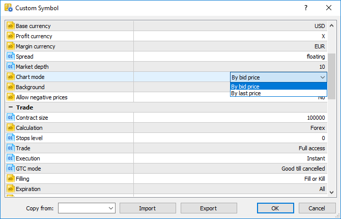

### What Operations Are Allowed in the Symbol Formula? (#what-operations-are-allowed-in-the-symbol-formula)

Price data and some properties of existing symbols provided by the broker can be used for calculating synthetic prices. Specify the following:

  * Symbol name — depending on the synthetic price to be calculated, the Bid, Ask or Last of the specified instrument will be used. For example, if EURUSD*GBPUSD is specified, Bid is calculated as bid(EURUSD)*bid(GBPUSD), and Ask = ask(EURUSD)*ask(GBPUSD).
  * bid(symbol name) — the bid price of the specified symbol will be forcedly used for calculating the Bid price of the synthetic instrument. This option is similar to the previous one (where the price type is not specified).
  * ask(symbol name) — the Ask price of the specified symbol will be used for calculating the Bid price of the synthetic instrument. Bid price of the specified instrument will be used for calculating Ask. The Last price of the specified symbol will be used for calculating Last. If ask(EURUSD)*GBPUSD is specified, the following calculation will be used:

  * Bid = ask(EURUSD)*bid(GBPUSD)
  * Ask = bid(EURUSD)*ask(GBPUSD)
  * Last = last(EURUSD)*last(GBPUSD)
  * last(symbol name) — the Last price of the specified symbol will be used in the calculation of all prices of the synthetic instrument (Bid, Ask and Last). If last(EURUSD)*GBPUSD is specified, the following calculation will be used:
  * Bid = last(EURUSD)*bid(GBPUSD)
  * Ask = last(EURUSD)*ask(GBPUSD)
  * Last = last(EURUSD)*last(GBPUSD)
  * volume(symbol name) — the tick volume of the specified instrument will be used in the formula. Make sure that volume information is provided by the broker for this symbol.
  * point(symbol name) — the minimum price change of the specified instrument will be used in calculations.
  * digits(symbol name) — the number of decimal places in the specified symbol price will be used in the formula.

> If a symbol has a complex name (contains hyphens, dots, etc.), it must be written in quotation marks. Example: "RTS-6.17".

The following arithmetic operations can be used in the formula: addition (+), subtraction (-), multiplication (*), division (/) and remainder of division (%). For example, EURUSD+GBPUSD means that the price is calculated as the sum of EURUSD and GBPUSD prices. Also you can use the unary minus to change the sign, for example: -10*EURUSD.

Mind the calculation priority of arithmetic operations:

  * The operations of multiplication, division and remainder are performed first, then addition and subtraction operations are performed.
  * The operations are performed from left to right. If the formula uses several operations that have the same priority (for example, multiplication and division), the operation on the left will be performed first.
  * You can use brackets ( and ) to change the priority of operations. Operations in brackets have the highest priority in the calculation. The left-to-right principle also applies for them: operations in brackets on the left are calculated first.

You can use constants in the formula:

  * Numerical (integer and float). Example: EURUSD*2+GBPUSD*0.7.
  * Symbol properties _Digits and _Point. They add to the formula appropriate properties of the custom symbol from the [specification](Custom-Financial-Instruments.md). _Digits means the number of decimal places in the instrument price; _Point means the smallest change in the symbol price.

You can also use in the formula all [mathematical functions](https://www.mql5.com/en/docs/math) supported in [MQL5 (#mql5)](../../Algorithmic-Trading-Trading-Robots/How-to-Create-an-Expert-Advisor-or-an-Indicator.md#mql5), except for MathSrand, MathRand and MathIsValidNuber:

Function | Description  
---|---  
fabs(number) | Returns an absolute value (modulo value) of the number passed to the function.  
acos(number) | Returns the arc cosine of the number in radians  
asin(number) | Returns the arcsine of the number in radians  
atan(number) | Returns the arc tangent of the number in radians  
ceil(number) | Returns the nearest upper integer  
cos(number) | Returns the cosine of the number  
exp(number) | Returns the exponent of the number  
floor(number) | Returns the nearest lower integer  
log(number) | Returns the natural logarithm  
log10(number) | Returns the logarithm of a number by base 10  
fmax(number1, number2) | Returns the highest of two numeric values  
fmin(number1, number2) | Returns the lowest of two numeric values  
fmod(dividend, divisor) | Returns the real remainder of the division of two numbers  
pow(base, power) | Raises the base to the specified power  
round(number) | Rounds the number to the nearest integer  
sin(number) | Returns the sine of the number  
sqrt(number) | Returns the square root  
tan(number) | Returns the tangent of the number  
expm1(number) | Returns the value of the expression exp(number)-1  
log1p(number) | Returns the value of the expression log(1+number)  
acosh(number) | Returns the value of the hyperbolic arc cosine  
asinh(number) | Returns the value of the hyperbolic arcsine  
atanh(number) | Returns the value of the hyperbolic arc tangent  
cosh(number) | Returns the value of the hyperbolic cosine  
sinh(number) | Returns the value of the hyperbolic sine  
tanh(number) | Returns the value of the hyperbolic tangent
