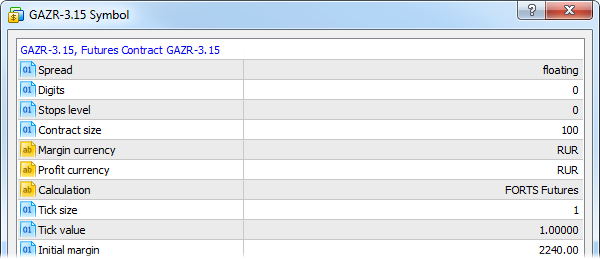
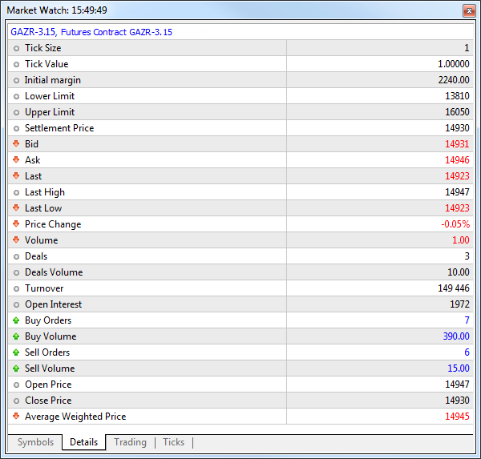
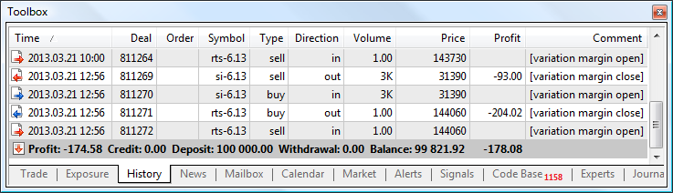

[🏠 Document Start](../../README.md) / [Trading Operations](../README.md) / [For Advanced Users](../For-Advanced-Users.md) / Futures

[Previous](Spreads.md) | [Next](Trading-Report.md)

# Futures

Futures is a derivative product. It is a financial contract between two parties obligating one party to deliver a commodity or a financial instrument at a predetermined future date, and the other party to pay a predetermined price for it at a future point. Commodity or a financial asset that is the subject of the contract is called an underlying asset.

The futures contracts do not always aim at buying or selling an asset. In most cases, market participants make a consistent purchase and sale (or vice versa) of futures to profit from the price difference. In this case, the contracts are detached from the transaction subject becoming independent financial instruments.

The name of the underlying asset and delivery date are indicated in the futures name in the [trading symbol properties (#specification)](../Market-Watch.md#specification):

Here you can see Gazprom equity futures contract with the delivery date set to March 2015.

Futures contracts' underlying asset delivery dates are standardized on the stock market. For example, contracts with delivery in the second, third and fourth quarters of the year may be offered during the first quarter, while contracts with delivery in the third and fourth quarters of the current year and the first quarter of the next year may be offered during the second quarter of the current year.

The exchange provides data on settlement prices of the contracts with different delivery dates, volumes of performed transactions and number of open positions on a daily basis. To review these data, select the required instrument in Market Watch and go to the [Details (#details)](../Market-Watch.md#details) tab.

## Contract Settlements

Unlike a spot market where assets are traded for immediate delivery and payment, on the futures market all final settlements are made only on the underlying asset delivery day. Until then, if the contract price goes up, a buyer may sell it and receive profit from the price difference (the same works for short positions).

In order to protect against a default on the contract, the exchange defines the amount of funds that should be present on the trader's account. These funds are called performance bond or margin. There are two types of margin:

  * Initial — the funds necessary to open a position (enter the market).
  * Maintenance — the funds that should be maintained on the account as long as the position is open.

> For more information about margin calculations, please read the [appropriate description (#futures)](Margin-Calculation-Retail-Forex-Futures.md#futures).

Following the results of each trading day, the exchange determines the calculation (clearing) price during the clearing session. This price is then used to close all open positions. According to the difference between the position open price and close (clearing) price, profit/loss obtained in the last trading day is deposited to/withdrawn from the trader's balance. That process is called variation margin charging. Variation margin charge transactions are displayed in the History tab. They have "variation margin close" comment.

After variation margin is charged, positions are re-opened. Now, their open price corresponds to the clearing price of the previous session. Position re-open transactions have "variation margin open" comment.
