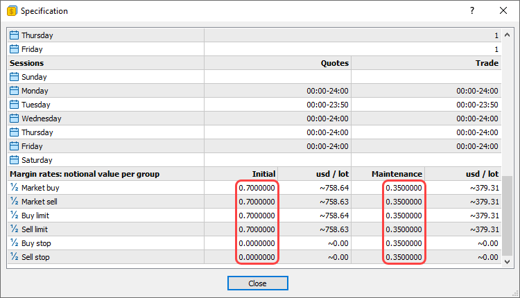

[🏠 Document Start](../../README.md) / [Trading Operations](../README.md) / [For Advanced Users](../For-Advanced-Users.md) / Margin Calculation: Exchange Model

[Previous](Margin-Calculation-Retail-Forex-Futures.md) | [Next](Collateral-Symbols.md)

# Exchange Risk Management Model (#exchange-risk-management-model)

The trading platform provides different risk management models, which define the type of pre-trade control. At the moment, the following models are used:

  * [For Retail Forex, Futures](Margin-Calculation-Retail-Forex-Futures.md) — used for the OTC market. Margin calculation is based on the type of instrument.
  * [For Stock Exchange, based on margin discount rates](Margin-Calculation-Exchange-Model.md) — used for the exchange market. Margin calculation is based on the discounts for instruments. Discounts are set by the broker, however they cannot be lower than the exchange set values.

## Basic Terminology (#basic-terminology)

### Exposure (#assets)

Assets — the current value of purchased financial instruments (of long positions) defined in a trader's deposit currency. The value is determined dynamically based on the price of the latest deal of the financial instrument, taking into account the liquidity margin rate. In fact, the amount of assets is equivalent to the amount of money that the trader would receive in case of immediate closure of long positions.

Assets = Size1 * Price1 * L1 + Size2 * Price2 * L2 + ... +SizeN * PriceN * LN  
---  
  
Where:

  * Size — the size of the Nth position calculated as the product of the volume in lots and the contract size.
  * Price — the current market price of the financial instrument.
  * L — the liquidity rate of the instrument.

> Only liquid instruments can be used as collateral.

### Liabilities (#liabilities)

Liabilities are obligations on current short positions calculated as the value of these positions at the current market price. In fact, the amount of liabilities is equivalent to the amount of money that the trader would pay in case of immediate closure of short positions.

Liabilities = Size1 * Price1 + Size2 * Price2 + ... +SizeN * PriceN  
---  
  
Where:

  * Size — the size of the Nth position calculated as the product of the volume in lots and the contract size.
  * Price — the current price of the instrument of the trader's open Nth position.

### Balance (own funds) (#balance-own-funds)

Balance — the trader's own funds on the account.

### Equity (portfolio value) (#equity-portfolio-value)

Equity is calculated by the following formula:

Equity = Own Funds + Assets - Liabilities - Commission  
---  
  

### Margin (#margin)

  * Initial margin is the minimum value of trader's own funds with which the trader is allowed to enter the market.
  * Adjusted initial margin is the minimum value of trader's own funds with which the trader is allowed to enter the market, including current market positions and limit orders.
  * Maintenance margin is the minimum amount of funds that must be available on the account for maintaining an open position. If the equity level falls below the maintenance margin, the broker starts closing trader's positions. The position closing procedure is determined by the broker's regulations.

## Calculation Features (#calculation-features)

On the spot market, as opposed to the futures and forward markets (characterized by margin movement), payment and receipt of assets (or liabilities in the event of repurchase) occur immediately at the moment of deal conclusion. Accordingly, the transaction value is immediately reflected on the trader's balance.

Since the payment for the instrument purchase or sale is always made in full, the margin is only used as an indication of the trading account state, which determines the possibility of opening new positions or necessity to close out existing positions.

## Margin Calculation (#margin-calculation)

The margin is the capitalized assessment of trader's positions:

Margin = Size1 * Price1 * MarginRate1 + Size2 * Price2 * MarginRate2 + ... + SizeN * PriceN * MarginRateN  
---  
  
Where:

  * Size — the size of the Nth position calculated as the product of the volume in lots and the contract size.
  * Price — the current price of the instrument of the trader's open Nth position.
  * MarginRate — the rate of margin or discount of the instrument, for which a position is opened. Individual margin rates can be used for the initial and maintenance margin, as well as for short and long positions.

### Example of Opening a Long Position (#example-of-opening-a-long-position)

For example, the trader's initial balance is 1,000,000 RUR. The initial and maintenance margin rates are equal to 0.1 and 0.05. For simplicity, we do not take into account the commission size.

Trade operations and price fluctuations | Trader's account state  
---|---  
Buying 1000 shares of LKOH 150 RUR each | 

  * Balance: 1,000,000 RUR - 1000 * 150 RUR = 850,000 RUR
  * Assets: 1000 * 150 = 150,000 RUR
  * Liabilities: 0 RUR
  * Equity: 850,000 RUR + 150,000 RUR = 1,000,000 RUR
  * Initial margin: 15,000 RUR
  * Maintenance margin: 7,500 RUR

  
Price drop to 50 RUR per share | 

  * Balance: 850,000 RUR
  * Assets: 1000 * 50 = 50,000 RUR

  * Liabilities: 0 RUR

  * Equity: 850,000 RUR + 50,000 RUR = 900,000 RUR
  * Initial margin: 5,000 RUR
  * Maintenance margin: 2,500 RUR

  
Buying 20,000 shares 50 RUR each | 

  * Balance: 850 000 RUR - 20 000 * 50 RUR = -150 000 RUR (uses borrowed money)
  * Assets: (1,000 + 20,000) * 50 RUR = 1,050,000 RUR

  * Liabilities: 0 RUR

  * Equity: 1,050,000 RUR - 150,000 RUR = 900,000 RUR
  * Initial margin: 105,000 RUR
  * Maintenance margin: 52,500 RUR

  
Price drop to 10 RUR per share | 

  * Balance: -150 000 RUR
  * Assets: 21,000 * 10 RUR = 210,000 RUR

  * Liabilities: 0 RUR

  * Equity: 210,000 RUR - 150,000 RUR = 60,000 RUR
  * Initial margin: 21,000 RUR
  * Maintenance margin: 10,500 RUR

  
Price drop to 7.8 RUR per share | 

  * Balance: -150 000 RUR
  * Assets: 21,000 * 7.8 RUR = 163,800 RUR

  * Liabilities: 0 RUR

  * Equity: 163,800 RUR - 150,000 RUR = 13,800 RUR
  * Initial margin: 16,380 RUR
  * Maintenance margin: 8,190 RUR

Note: equity below the initial margin. A trader cannot open new positions, only close existing ones.  
Price drop to 5 RUR per share | 

  * Balance: -150 000 RUR
  * Assets: 21,000 * 5 RUR = 110,000 RUR

  * Liabilities: 0 RUR

  * Equity: 110,000 RUR - 150,000 RUR = -40,000 RUR
  * Initial margin: 11 000 RUR
  * Maintenance margin: 5 500 RUR

Note: equity below the maintenance margin. Broker forcibly closes the trader's position.  
  

### Example of Opening a Short Position (#example-of-opening-a-short-position)

For example, the trader's initial balance is 1,000,000 RUR. The initial and maintenance margin rates are equal to 0.1 and 0.05. For simplicity, we do not take into account the commission size.

Trade operations and price fluctuations | Trader's account state  
---|---  
Selling 1000 shares of LKOH 150 RUR each | 

  * Balance: 1,000,000 RUR + 1,000 * 150 RUR = 1,150,000 RUR

  * Assets: 0 RUR

  * Liabilities: -1,000 * 150 RUR = -150,000 RUR

  * Equity: 1,150,000 RUR - 150,000 RUR = 1,000,000 RUR

  * Initial margin: 15,000 RUR
  * Maintenance margin: 7,500 RUR

  
Price grows to 300 RUR per share | 

  * Balance: 1,150,000 RUR
  * Assets: 0 RUR

  * Liabilities: -1000 * 300 RUR = -300,000 RUR

  * Equity: 1,150,000 RUR - 300,000 RUR = 850,000 RUR
  * Initial margin: 30,000 RUR
  * Maintenance margin: 15,000 RUR

  
Price grows to 1000 RUR per share | 

  * Balance: 1,150,000 RUR
  * Assets: 0 RUR

  * Liabilities: -1000 * 1000 RUR = -1,000,000 RUR

  * Equity: 1,150,000 RUR - 1,000,000 RUR = 150,000 RUR
  * Initial margin: 100,000 RUR
  * Maintenance margin: 50,000 RUR

  
Price grows to 1100 RUR per share | 

  * Balance: 1,150,000 RUR
  * Assets: 0 RUR

  * Liabilities: -1000 * 1100 RUR = -1,100,000 RUR

  * Equity: 1,150,000 RUR - 1,100,000 RUR = 50,000 RUR
  * Initial margin: 110,000 RUR
  * Maintenance margin: 55,000 RUR

Note: equity below the initial margin. A trader cannot open new positions, only close existing ones.  
Price grows to 1200 RUR per share | 

  * Balance: 1,150,000 RUR
  * Assets: 0 RUR

  * Liabilities: -1000 * 1200 RUR = -1,200,000 RUR

  * Equity: 1,150,000 RUR - 1,200,000 RUR = -50,000 RUR
  * Initial margin: 120,000 RUR
  * Maintenance margin: 60,000 RUR

Note: equity below the maintenance margin. Broker forcibly closes the trader's position.  
  

### Adjusted Initial Margin Calculation (#adjusted-initial-margin-calculation)

If a trader has limit orders, then the following formula is used for calculating the initial margin when opening a position.

The adjusted margin is always calculated on the larger side — the aggregate amount of Buy or Sell positions and orders.

Corrected Margin = Max(Margin Buy;Margin Sell)  
---  
  
Long side calculation:

Margin Buy = PositionSize * (PriceMarket - PriceMin) + (PositionSize + OrdersBuySize) * PriceMin * MarginRate + (OrdersBuyValue - OrdersBuySize * PriceMin)  
---  
  
Where:

  * PositionSize — position size calculated as the product of the volume in lots and the contract size.
  * PriceMarket — the current market price of the financial instrument (last deal price).
  * PriceMin — the minimum price among all current buy limit orders of the trader.
  * OrdersBuySize — the size of the trader's buy limit orders calculated as the product of the total volume of orders in lots and the contract size.
  * OrdersBuyValue — the value of the buy limit orders if they were executed at the prices specified in them. It is calculated as the sum of the products of order sizes and their limit price.
  * MarginRate — the amount of the symbol discount.

> If the trader's current position is short, and its size is greater than or equal to OrdersBuySize, then Margin Buy is not calculated and is assumed to be 0.

Short side calculation:

Margin Sell = -PositionSize * (PriceMax - PriceMarket) - (PositionSize - OrdersSellSize) * PriceMax * MarginRate + (OrdersSellSize * PriceMax - OrdersSellValue)  
---  
  
Where:

  * PositionSize — position size calculated as the product of the volume in lots and the contract size.
  * PriceMarket — the current market price of the financial instrument (last deal price).
  * PriceMax — the maximum price among all current sell limit orders of the trader.
  * OrdersSellSize — the size of the trader's sell limit orders calculated as the product of the total volume of orders in lots and the contract size.
  * OrdersSellValue — the value of the sell limit orders if they were executed at the prices specified in them. It is calculated as the sum of the products of order sizes and their limit price.
  * MarginRate — the amount of the symbol discount.

> If the trader's current position is long, and its size is greater than or equal to OrdersSellSize, then Margin Sell is not calculated and is assumed to be 0.

Let's consider the following example. The trader has:

  * Position Buy 1 lot LKOH, contract size is 1000 shares, the current price is 100 RUR, initial margin rate is 0.1
  * Order Buy Limit 0.5 lot LKOH (500 shares), order price is 80 RUR
  * Order Buy Limit 0.3 lot LKOH (300 shares), order price is 60 RUR
  * Order Buy Limit 0.1 lot LKOH (100 shares), order price is 40 RUR

Calculation:

PriceMin = 40   
Price Market = 100   
OrdersBuySize = 500 + 300 + 100 = 900   
OrdersBuyValue = 500 * 80 + 300 * 60 + 100 * 40 = 62 000   
Margin Buy = 1000 * (100 - 40) + (1000 + 900) * 40 * 0.1 + (62 000 - 900 * 40) = 87 900  
---  
  
The total amount of the adjusted initial margin is equal to 87,900.
