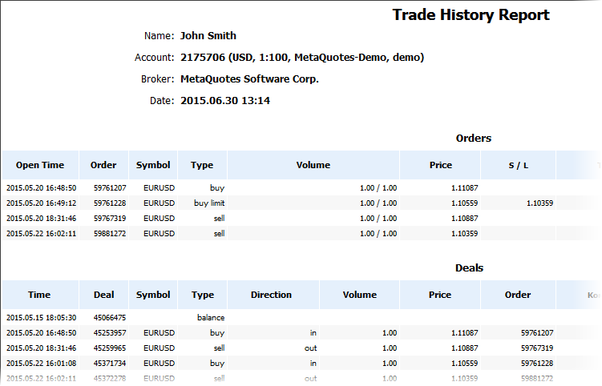
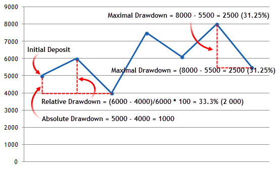

[🏠 Document Start](../../README.md) / [Trading Operations](../README.md) / [For Advanced Users](../For-Advanced-Users.md) / Trading Report

[Previous](Futures.md) | [Next](../../Price-Charts-Technical-and-Fundamental-Analysis/README.md)

# Trading Report (#trading-report)

The trading platform allows you to automatically save and publish account statement [reports (#ftp)](../../Getting-Started/Platform-Settings.md#ftp). To save the report, select "Report" in the context menu of the [History (#trade-history)](../Executing-Trades.md#trade-history) tab.

> HTML reports are generated from a template ReportHistory.htm, located in the [/Templates (#templates)](../../Getting-Started/For-Advanced-Users/Files-and-Folders.md#templates) folder of the platform. 

The report is divided into several blocks:

## Header (#header)

The header contains:

  * The name of a brokerage company
  * Account number
  * The name of the account owner
  * Deposit currency
  * Report generation date

## Orders (#orders)

This block contains all [orders (#trade-history)](../Executing-Trades.md#trade-history) from the account history in the form of a table. The table features all the information fields available for orders in the corresponding tab.

## Deals (#deals)

All the [trades (#trade-history)](../Executing-Trades.md#trade-history) ever executed on the account are displayed here. The table features all the information fields available for trades in the corresponding tab. An additional parameter is shown at the bottom of the block:

  * Recorder profit/loss (Closed P/L) — the total profit or loss of all trades.

## Positions (#positions)

This block shows all the [open positions (#position-list)](../Executing-Trades.md#position-list) on the account. The table features all the information fields available for positions in the "Trade" tab. An additional parameter is displayed at the bottom of the positions block:

  * Floating profit/loss (Floating P/L) — the current profit/loss of all open positions.

## Working Orders (#working-orders)

The block features all active orders ([pending orders (#pending)](../Executing-Trades.md#pending) and yet unfilled market orders). The table features all the information fields available for positions in the "Trade" tab.

## Summary (#summary)

Summary values of the account are shown here:

  * Deposit/Withdrawal — information about deposits to and withdrawals from the account;
  * Credit Facility — information about credit funds on the account;
  * Closed Trade P/L — total profit/loss of all closed trades;
  * Floating P/L — the current profit/loss of all open positions;
  * Balance — balance of the account not including results of currently open positions;
  * Equity — the account equity including results of currently open positions;
  * Margin — the amount of funds required to maintain open positions;
  * Free Margin — account's free margin amount.

## Details (#details)

The upper part of this block displays the account balance graph constructed based on deals (the number of deals is displayed along the X axis).

  * Gross Profit — the sum of all profitable trades in terms of money;
  * Gross Loss — the sum of all losing trades in terms of money;
  * Total Net profit — the financial result of all trades;
  * Profit Factor — the ratio of gross profit and gross loss in percents. 1 means that these parameters are equal;
  * Expected Payoff — this is a statistically calculated value showing the average return of one deal. Also, it is considered to display the expected return of the next trade;
  * Balance Drawdown Absolute — difference between the initial deposit and the minimal level below initial deposit throughout the whole history of the account. AbsoluteDrawDown = InitialDeposit - MinimalBalance See the [drawdown calculation example (#drawdown)](Trading-Report.md#drawdown).
  * Balance Drawdown Maximal — difference in deposit currency between the highest local balance value and the next lowest account balance value. The maximal drawdown value in percentage is given in brackets. MaximumDrawDown = Max[Local High - Next Local Low] See the [drawdown calculation example (#drawdown)](Trading-Report.md#drawdown).
  * Balance Drawdown Relative — difference in percentage terms between the highest local balance value and the next lowest account balance value. The maximal drawdown value in monetary terms is given in brackets. RelativeDrawdown = Max[(Local High - Next Local Low)/Local High * 100)] See the [drawdown calculation example (#drawdown)](Trading-Report.md#drawdown).
  * Total trades — the total amount of executed trades (the trades that resulted in a profit or loss);
  * Short Trades (won %) — number of trades that resulted in profit obtained from selling a financial instrument, and percentage of profitable short trades;
  * Long Trades (won %) — number of trades that resulted in profit obtained from purchasing a financial instrument, and percentage of profitable long trades;
  * Profit Trades (% of total) — the amount of profitable trades and their percentage in the total trades;
  * Loss trades (% of total) — the amount of losing trades and their percentage in the total trades;
  * Largest profit trade — the largest profit of all profitable trades;
  * Largest loss trade — the largest loss of all loss-making trades;
  * Average profit trade — the average profit value per a trade (the total of profits divided by the number of winning trades);
  * Average loss trade — the average loss value per a trade (the total of losses divided by the number of losing trades);
  * Maximum consecutive wins ($) — the longest series of winning trades and their total profit;
  * Maximum consecutive losses ($) — the longest series of losing trades and their total loss;
  * Maximal consecutive profit (count) — the maximum profit of a series of profitable trades and the amount of profitable trades in this series;
  * Maximal consecutive loss (count) — the maximum loss of a series of losing trades and the amount of losing trades in this series;
  * Average consecutive wins — the average number of winning trades in profitable series;
  * Average consecutive losses — the average number of losing trades in losing series.

## Drawdown Calculation Example (#drawdown)

The below chart shows the Balance change curve. The Initial Deposit is 5000.

  * The largest Balance drop below the Initial Deposit was at point three — 4000. Absolute Drawdown = 5000 - 4000 = 1000.
  * The largest Balance drop in percentage terms was between points two and three. Relative Drawdown = (6000 - 4000)/6000 * 100 = 33.3%. This difference was equal to 2000 in monetary terms.
  * The largest drop in monetary terms was between the last point and the previous one. Maximum Drawdown = 8000 - 5500 = 2500. This difference was equal to 31.25% in percentage terms.

