[🏠 Document Start](../README.md) / [Trading Operations](README.md) / Market Watch

[Previous](Depth-of-Market.md) | [Next](Options-Board.md)

# Market Watch (#market-watch)

The Market Watch window provides an overview of price data of financial instruments: quotes, price statistics and tick chart. It also provides details of contract specifications and One Click Trading options.

## How to View Quotes of Financial Instruments (#symbols)

The Market Watch features real-time quotes of financial instruments and other price data: spread, volume, etc.

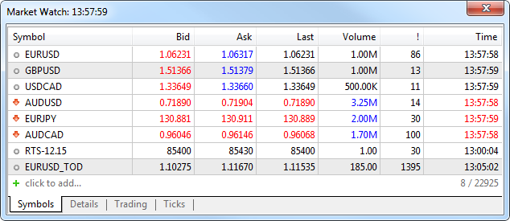

Financial instrument name

Bid price

Ask price

The last price at which the deal was executed

The volume of the last executed deal

Spread — the difference between the Bid and Ask prices

The last quote arrival time. Specified according to the time zone of the broker's trading server.

The displayed data can be configured in the context menu. For example, you can show the "Source" field — the provider of the financial instrument liquidity. To save the current state of Market Watch data to a CSV file, select 'Export'. All columns and their values displayed at the time of export will be saved to the file. This data can then be analyzed using third-party applications.

Double-clicking on one of the instruments opens [a new position opening (#position-open)](Executing-Trades.md#position-open) window. A symbol chart can be opened by dragging it to the chart viewing area using a mouse (Drag'n'Drop); in this case windows of currently open charts will be closed. If you hold down "Ctrl" while dragging, the chart is opened in a separate [tab](../Getting-Started/User-Interface.md), and other charts remain open.

  * If there are [open positions (#position-open)](Executing-Trades.md#position-open) or [pending orders (#pending)](Executing-Trades.md#pending) for the financial instrument, or when its chart is open, the instrument cannot be hidden from the Market Watch.
  * If a symbol is hidden in Market Watch, its data cannot be used in [MQL5 programs](../Algorithmic-Trading-Trading-Robots/How-to-Create-an-Expert-Advisor-or-an-Indicator.md) and the [Strategy Tester](../Algorithmic-Trading-Trading-Robots/Strategy-Testing.md).

  * In the High and Low columns of symbols whose charts are built at Bid prices, the Bid High and Bid Low prices are displayed. If a symbol chart is constructed using Last prices, Last High and Last Low prices are shown for this symbol. If Market Watch contains at least one symbol whose chart is drawn based on Last prices, the Last column is automatically enabled in addition to High/Low.

  
---  
  
Prices in the "Market Watch" window have different colors:

  * Blue — the current price is higher than the previous one;
  * Red — the current price is lower than the previous one;
  * Gray — the price has not changed for the last 15 seconds.

If the [depth of market](Depth-of-Market.md) and the Last trade price is available for a symbol, the color is determined by the Last price. Otherwise, the color is determined by the Bid price.

The individual background coloring for symbols can also be configured on the server. This enables their visual distinguishing by types, exchange and other properties. If you do not want to use the specified coloring, enable the "Use system colors" option in the context menu.

### How to Quickly Add Symbols (#how-to-quickly-add-symbols)

To quickly add a symbol in the Market Watch, click + below the list and enter the name of the symbol. While you type in the name, the list of suitable symbols is shown.

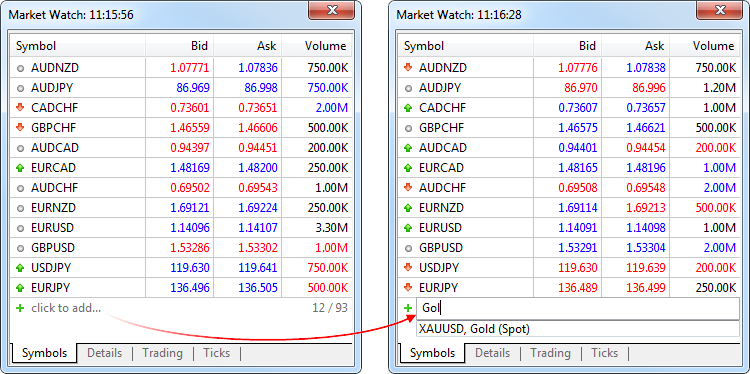

Information about the current number of symbols in the Market Watch and the total number of available symbols is available at the bottom of the list.

If you work with different brokers or markets, you can save separate Market Watch settings for each of them. Create a list of symbols, select the desired columns and click "Symbol Sets — Save as". The saved set becomes available for quick switching through the same menu.

### How to Sort Symbols (#sort)

To sort the list of symbols, click on any column header. For example, the list can be sorted by symbol name, close price, daily change or other variables. The context menu features the most popular sorting options. For example, sorting by the highest growth and fall based on a daily symbol price change can be useful when trading exchange instruments.

## Analysis by Sector and Industry (#industry-analysis)

Special trading instrument properties indicate the sector and industry which the instrument belongs to. These properties enable the complex analysis of financial symbols directly in the Market Watch. Select a category from the menu, and all available instruments will be added to a list:

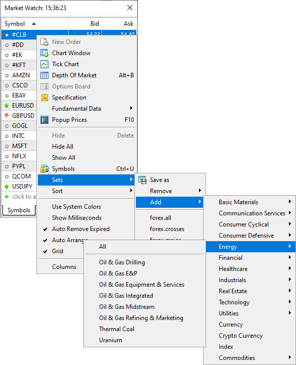

You can save your own symbol sets and easily switch between them in a couple of clicks. Click "Sets \ Save" and specify a name for the set. The file will save the list of symbols and a set of selected columns, which means that you will not need to set up the Market Watch window every time.

> If sector and industry data is not available, please contact your broker.

## How to View Fundamental Data (#fundamental)

You can easily view fundamental trading symbol data available on popular aggregator websites: Yahoo Finance, Google Finance, Finviz and many others. The relevant data can be accessed via the Fundamental Data menu:

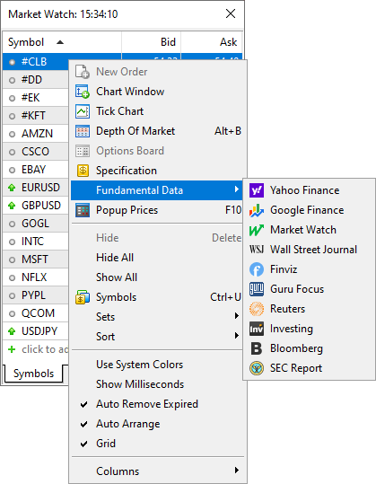

## How to View Trade Statistics of Financial Instruments (#details)

To view statistics, select a financial instrument in the ["Symbols"](Market-Watch.md) tab and click "Details".

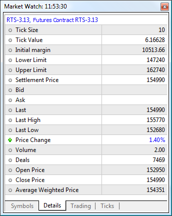

The statistical information includes:

  * Bid — bid price;
  * B. High — Bid High, the highest bid price for the current day;
  * B. Low — Bid Low, the lowest bid price for the current day;
  * Ask — ask price;
  * A. High — Ask High, the highest ask price for the current day;
  * A. Low — Ask Low, the lowest ask price for the current day;
  * Last — the last price at which a deal was executed;
  * L. High — Last High, the highest price at which a deal was executed for during the current day;
  * L. Low — Last Low, the lowest price at which a deal was executed for during the current day;
  * Volume — the volume of the last executed deal;
  * V. High — Volume High, the highest deal volume for the current day;
  * V. Low — Volume Low, the lowest deal volume for the current day;
  * Deals — the total number of deals executed during the current session;
  * Deals Volume — the total volume of deals executed during the current session;
  * Turnover — money turnover for a symbol for the current session;
  * Open Interest — the total volume of effective contracts (futures, options) which have not been settled yet;
  * Buy Orders — the total number of buy requests;
  * Buy volume — the total volume of buy orders;
  * Sell Orders — the total number of sell requests;
  * Sell Volume — the total volume of sell orders;
  * Open Price — the open price of the last (recent) session;
  * Close Price — the close price of the last (recent) session;
  * Average Weighted Price — the weighted average price for a session;
  * Settlement Price — the settlement (clearing) price of the previous session;
  * Daily Change — indicates the difference between the last price of the instrument and the close price of the last session in percentage terms. The calculation formula depends on the symbol charting mode:  
  
By Last prices: ((Last - Last price at session close)/Last price at session close)*100  
By Bid prices: ((Bid - Bid price at session close)/Bid price at session close)*100.  
  
For futures symbols, the clearing price is used instead of the the session close price, if the clearing price is provided by the broker (non-zero):  
  
By Last prices: ((Last - Clearing price)/Clearing price)*100  
By Bid prices: ((Bid - Clearing price)/Clearing price)*100.  

  * Delta — option delta. [The Greeks (#greeks)](Options-Board.md#greeks), which include Delta, Theta, Gamma, Vega, Po and Omega, are quantities representing the sensitivity of the option price to changes in various parameters: strike prices, volatility, etc.
  * Theta — option theta.
  * Gamma — option gamma.
  * Vega — option vega.
  * Rho — option rho.
  * Omega — option omega.
  * Sensitivity — option sensitivity. It shows by how many points the price of the option's underlying asset should change so that the price of the option changes by one point.

> The number of statistical values depends on the brokerage company.

## One Click Trading (#trading)

The One Click Trading option is available on the "Trading" tab. Upon clicking on the "Sell" or "Buy" button, a request to perform the corresponding [trade operation](Executing-Trades.md) in the specified volume is instantly sent to the server. This trading mode is available under the following conditions:

  * ["One Click Trading" (#one-click)](../Getting-Started/Platform-Settings.md#one-click) option is enabled in the platform settings;
  * [The execution type (#execution-type)](Basic-Principles.md#execution-type) of the selected instrument is Instant, Market or Exchange.

In other cases, a click on a button opens the [order creation (#position-open)](Executing-Trades.md#position-open) window.

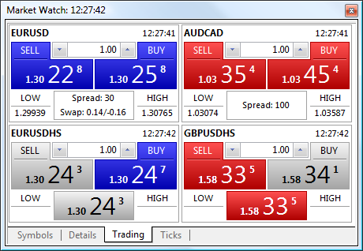

Financial instrument name

The last quote arrival time

A command to perform a Sell deal

A command to perform a Buy deal

Volume control: use arrows on the right and the left of the field, or use a keyboard

Current Bid price

Current Ask price

The lowest Bid price for the current day (Bid Low)

The highest Ask price for the current day (Ask High)

Current spread and swap for short and long positions. If the price of the last executed deal is available for a symbol, it is displayed instead of spread and swap.

This window contains panels for performing trade operations with different symbols. The set of symbols for quick trading is taken from the list on the ["Symbols"](Market-Watch.md) tab and can be adjusted using the " Symbols" command in the context menu.

  * Be careful, once the "Sell" or "Buy" button is pressed, the corresponding request to buy or the sell the specified amount of a selected symbol is immediately sent to the server without any additional confirmation.
  * The execution of the commands mentioned above does not always result in a corresponding deal. The reason can be a requote, refusal of a brokerage company, etc. In this case, an appropriate message is added to the platform log.
  * In the [Instant Execution (#execution-type)](Basic-Principles.md#execution-type) mode, the allowable price [deviation (#deviation)](Executing-Trades.md#deviation) in orders is set in accordance with the ["Use deviation" (#trade)](../Getting-Started/Platform-Settings.md#trade) option.

  * [The Fill Policy (#fill-policy)](Basic-Principles.md#fill-policy) is selected based on the trading instrument [execution mode (#execution-type)](Basic-Principles.md#execution-type): for exchange execution it is always "Return", for market execution it is either "Fill or Kill" or "Immediate or Cancel" (depending on what policy is allowed for the symbol), for instant and request execution it is always "Fill or Kill".

  * When a requote is received, an appropriate message is added to the platform [journal](../Getting-Started/For-Advanced-Users/Platform-Logs.md) and a [requote sound (#events)](../Getting-Started/Platform-Settings.md#events) is played.

  
---  
  
Depending on the quotes, the trade operation execution and price field may have different colors:

  * Blue — the current price is higher than the previous one;
  * Red — the current price is lower than the previous one;
  * Gray — the price has not changed for the last 15 seconds.

If the [depth of market](Depth-of-Market.md) and the Last trade price is available for a symbol, the color is determined by the Last price. Otherwise, the color is determined by the Bid price.

## How to Manage Symbols (#manage)

Open the window for managing symbols with the command " Symbols" of the context menu of the "Market Watch" window. It allows you to hide and show symbols in this window, as well as view their properties:

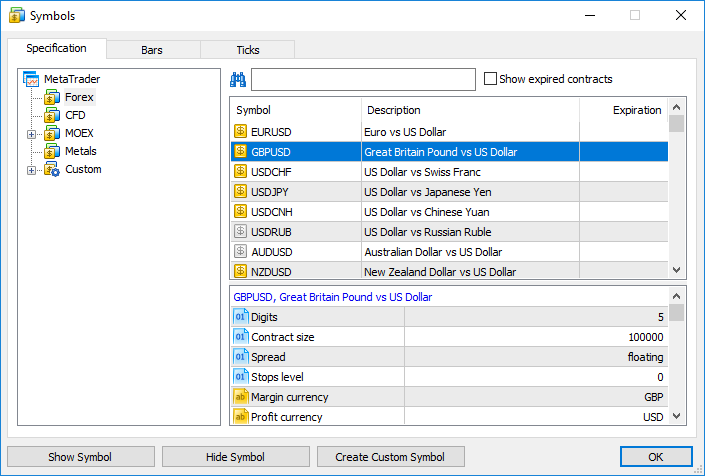

All symbols available in the platform are displayed here. A double click on a symbol name is used for hiding or showing it in the Market Watch window. The same actions can be performed by buttons "Hide" and "Show".

Here you can also [create a custom financial instrument](For-Advanced-Users/Custom-Financial-Instruments.md).

  * If there are [open positions (#position-open)](Executing-Trades.md#position-open) or [pending orders (#pending)](Executing-Trades.md#pending) for the financial instrument, or when its chart is open, the instrument cannot be hidden from the Market Watch.
  * If a symbol is hidden in the Market Watch, its data cannot be used in [MQL5 programs](../Algorithmic-Trading-Trading-Robots/How-to-Create-an-Expert-Advisor-or-an-Indicator.md) and the [Strategy Tester](../Algorithmic-Trading-Trading-Robots/Strategy-Testing.md).
  * No more than 5000 financial instrument can be added to "Market Watch".

  
---  
  
At the bottom of the window, properties of the selected symbol are shown.

To quickly find a symbol, use the filter at the top of the window. Type the first letters of the symbol name or description in it. A list of symbols corresponding to the search string appears below.

### Relevance of Trading Instruments (#expired)

All expired symbols are hidden to preserve a more compact display. This is particularly convenient when working on the futures market. A non-relevant symbol is the expired one, which is defined by the "Last trade" parameter. This date is specified in the "Expiration" column of the list of symbols. To view all symbols, click "Show expired contracts".

For convenience, the list of symbols is automatically sorted:

  * symbols without the expiration date are listed first
  * next go symbols with an expiration date starting with the nearest date
  * then follow expired symbols starting with the last expired one
  * other symbols sorted alphabetically

Option "Auto remove expired" in the context menu allows to automatically replace expired symbols with active ones in the [Market Watch](Market-Watch.md) window. After the platform restart, expired symbols are hidden, and active ones are added instead. For example, the expired futures contract LKOH 3.15 will be replaced with the next contact of the same underlying asset LKOH 6.15.

Symbols in the appropriate open charts are also replaced, provided there are no running [Expert Advisors](../Algorithmic-Trading-Trading-Robots/Expert-Advisors-and-Custom-Indicators.md) on them.

> Expired symbols are hidden and replaced only after the platform restart.

### Downloading price history (#history)

The trading platform allows downloading the quote and tick history from the broker's server. For example, you can download it in advance without waiting for the platform to do that during a test or optimization. The downloaded history can also be saved as a CSV file to perform analysis in third-party applications.

To download data, open the symbol management dialog in the "Market Watch" context menu and switch to the Bars or Ticks tab.

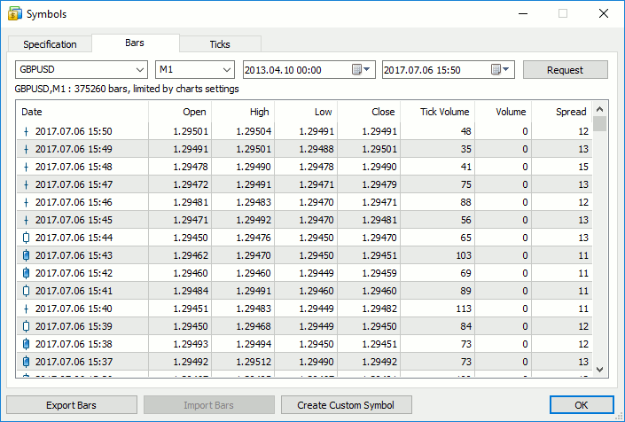

Select a symbol and a timeframe, and click Request. The platform requests all available data from the server or displays them immediately if they have already been downloaded. Click Export to save price data as a CSV file.

You can also export current chart data by clicking " Save" in the File menu.

In addition to price information (Вid, Ask, Last, volume), tick data contains flags. The flags enable the analysis of which data has changed with the current tick:

  * 2 — the tick changed the Bid price
  * 4 — the tick changed the Ask price
  * 8 — the tick changed the last deal price
  * 16 — the tick changed the volume
  * 32 — the tick appeared as a result of a buy trade
  * 64 — the tick appeared as a result of a sell trade

If a tick has multiple flags, you will see the total value. For example, 6 means that the tick changed the bid and the ask price; 24 means that it changed the last price and volume.

  * The entire history of quotes in the trading platform is stored in the form of minute bars. All other timeframes are based on them. Thus, switching timeframes in the dialog does not affect the download. The history is downloaded once. When requesting other timeframes, the platform simply calculates and saves them in the local cache.
  * The maximum number of downloaded bars is limited by the ["Max bars in chart" (#max-bars)](../Getting-Started/Platform-Settings.md#max-bars) parameter.
  * The tick data are large, occupy a lot of disk space and may take a long time.

  
---  
  

### Price history import (#import)

The import function is only available for [custom financial instruments (#import-history)](For-Advanced-Users/Custom-Financial-Instruments.md#import-history).

## Viewing Symbol Specification (#specification)

The symbol specification window features the symbol trading conditions (contract specification). To start viewing properties of the selected symbol, click " Specification" in the context menu of the Market Watch window.

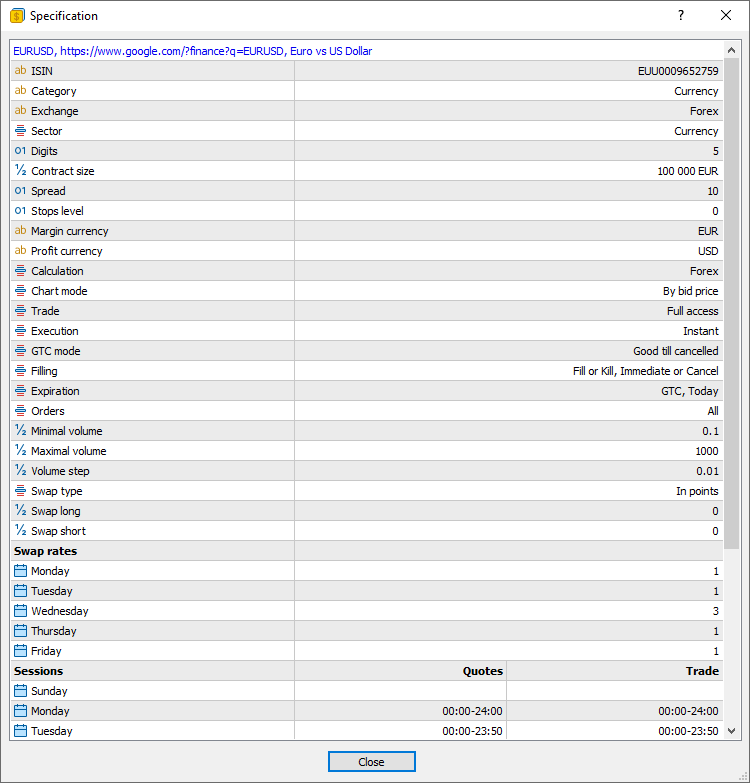

The following set of parameters set by a broker is displayed here:

  * Symbol name and description — the name of a symbol and its short description. This parameter can be a link to a website containing symbol information. A popup tip with the link address appears when you hover the mouse over it.
  * ISIN — International Securities Identifying Number.
  * Spread — spread in points. If the spread is floating, then the appropriate record is specified in this point (floating). 
  * Digits — number of decimal places in the price of the symbol.
  * Stops level — channel of prices (in points) from the current price, inside which one can't place [Stop Loss (#stop-loss)](Basic-Principles.md#stop-loss), [Take Profit (#take-profit)](Basic-Principles.md#take-profit) and [pending orders (#pending-order)](Basic-Principles.md#pending-order). When placing an order inside the channel, the server will return message "Invalid Stops" and will not accept the order.
  * Contract size — number of units of the commodity, currency or financial asset in one lot.
  * Margin currency — currency, in which the margin requirements are calculated.
  * Profit currency — currency, in which the profit of the symbol trading is calculated.
  * Calculation — method used for [margin](For-Advanced-Users/Margin-Calculation-Retail-Forex-Futures.md) calculation: Forex, Forex No Leverage, Futures, Exchange Futures, Exchange Stocks, FORTS Futures, Collateral.
  * Chart mode — symbol chart ([bar (#charts)](For-Advanced-Users/Price-Data.md#charts)) construction mode: by last deal prices (Last) or by Bid prices. The first option is usually used for exchange instruments.
  * Tick size — minimum price change step.
  * Tick value — cost of a single price change point.
  * Trade — symbol trading mode (full access, long only, short only, close only). Also, trading can be completely prohibited.
  * Execution — [execution mode (#execution-type)](Basic-Principles.md#execution-type): Instant, Request, Market, Exchange.
  * Type of orders — types of orders placed:
    * Good till today including SL/TP — orders that are valid only during one trading day. With the end of the day, all of the Stop Loss and Take Profit levels, as well as pending orders are deleted.
    * Good till canceled — pending orders are preserved for the next trading day.
    * Good till today excluding SL/TP — only pending orders are deleted at the end of a trading day, while Stop Loss and Take Profit levels are preserved.
  * Filling — available [fill policies (#fill-policy)](Basic-Principles.md#fill-policy): Fill or Kill, Immediate or Cancel, Book or Cancel, Return.
  * Expiration — available [types of expiration (#pending-place)](Executing-Trades.md#pending-place) of pending orders:
    * Good till Canceled — order lifetime is unlimited.
    * Intraday — orders are canceled at the end of the current trading.
    * Specified time — the order is canceled at a user-specified time.
    * Date — the order is canceled at the end of the day specified by the user.
  * Orders— allowed [order types (#order-type)](Basic-Principles.md#order-type): market, limit, stop, stop-limit, Stop Loss and Take Profit.
  * Minimal volume — minimal volume of a deal for the symbol.
  * Maximal volume — maximal volume of a deal for the symbol.
  * Volume step — volume change step.
  * Volume limit — maximum allowable total volume of an open position and pending orders at the same symbol and in the same direction (buy or sell). For example, the limit is 5 lots. If you have a buy position of 5 lots, you can place a Sell Limit order of 5 lots. But you cannot place a pending Buy Limit order (since the total volume in one direction will exceed the limit) or place a Sell Limit order above 5 lots.
  * Swap type — type of swap calculation:
    * In points — the specified number of points of the security price.
    * In the base currency — the specified amount in the symbol base currency.
    * In the margin currency — the specified amount in the symbol margin currency.
    * In the deposit currency — the specified amount in the deposit currency.
    * As a percentage of current price — the specified percentage of the symbol price at the time of swap calculation.
    * As a percentage of the open price — the specified percentage of the position open price.
    * In points, re-open at Close price — the position is closed at the end of the trading. The next day the position is re-opened at the close price +/- the specified number of points.
    * In points, re-open at the Bid price — the position is closed at the end of the trading day. The next day the position is re-opened at the Bid price +/- the specified number of points.
  * Swap long — swap for Buy positions.
  * Swap short — swap for Sell positions.
  * Swap rates — swap multiplier for each day of the week. Swap of long and short positions is multiplied by the specified ratio when charging. Example: the basic swap value for long positions is USD 1.5. For all weekdays, the ratio is equal to one, except Wednesday when it is equal to 3. This means the swap of USD 1.5 is charged when rolling over a position from Monday to Tuesday. The same happens when rolling over the position from Tuesday to Wednesday. When the position is rolled over from Wednesday to Thursday, the swap is tripled — USD 4.5 getting back to the subsequent value in subsequent days. The swap is not charged for weekdays with no ratio specified.
  * First trade — the day when the financial instrument trading started.
  * Last trade — the day when the financial instrument trading ended.
  * Face value — nominal bond value set by the issuer.
  * Accrued interest — part of the coupon interest of bonds, which is calculated in proportion to the number of days since the coupon bond issue date or since the previous coupon payment.
  * Category — the property is used for additional marking of financial instruments. For example, this can be the market sector to which the symbol belongs: Agriculture, Oil & Gas and others.
  * Exchange — the name of the exchange in which the security is traded.
  * CFI — instrument classification in accordance with the [ISO 10962](https://www.iso.org/standard/44799.html) standard.
  * Sector — economic sector the instrument belongs to, such as energy, finance, healthcare and others. 
  * Industry — industry branch the instrument belongs to, such as sportswear, accessories, car manufacturing, restaurant business and others. Sector and industry data is used for the creation of symbol sets for complex analysis.
  * Country — country of the company whose shares are traded on the stock exchange.
  * Option type — [call or put](Options-Board.md).
  * Underlying — the underlying symbol of the option.
  * Strike price — option strike price.

### Commission (#commission)

Information on commissions charged by a broker for the symbol deals. Calculation details are displayed here:

  * Commission may be single-level and multilevel, i.e. be equal regardless of the deal volume/turnover or can depend on their size. Appropriate data is displayed in the terminal.
  * Commission can be charged immediately upon deal execution or at the end of a trading day/month.
  * Commission can be charged depending on deal direction: entry, exit or both operation types.
  * Commission can be charged per lot or deal.
  * Commission can be calculated in money, percentage or points.

For example, the following entry means that a commission is charged immediately upon deal entry and exit. If the deal volume is from 0 to 10 lots, a commission of 1.2 USD is charged per operation. If the deal volume is 11 to 20 lots, a commission of 1.1 USD is charged per each lot of the deal.

Commission | Instant, volume, entry/exit deals   
0 - 10 | 1.2 USD per deal   
11 - 20 | 1.1 USD per loat  
---  
  

### Sessions (#sessions)

The lower part shows information about quoting and trading sessions of the symbol. Sessions are specified for every day of the week.

### Spreads (#spreads)

The margin can be charged on preferential basis in case trading positions are in spread relative to each other. The spread trading is defined as the presence of the oppositely directed positions of correlated symbols. Reduced margin requirements provide more trading opportunities for traders.

More detailed information on spread can be found in the [appropriate section](For-Advanced-Users/Spreads.md).

### Margin (#margin)

The instrument specification may include the following values related to [margin calculations](For-Advanced-Users/Margin-Calculation-Retail-Forex-Futures.md):

  * Initial margin — security deposit (margin) provided for a fixed-term contract to perform a one-lot deal. If the initial margin value is specified for the symbol, this is the value that is used. [Margin calculation](For-Advanced-Users/Margin-Calculation-Retail-Forex-Futures.md) formulas are not applied to the appropriate calculation type.
  * Maintenance margin — minimum security deposit (margin) a trader should have on his or her account to maintain a one-lot position.
  * Hedged margin — the margin charged per one lot of [hedged (#hedged)](For-Advanced-Users/Margin-Calculation-Retail-Forex-Futures.md#hedged) positions. You can also select here margin calculation mode for hedged positions — using the larger leg.

In addition, the specification contains a detailed table with margin [rates (#rate)](For-Advanced-Users/Margin-Calculation-Retail-Forex-Futures.md#rate) and calculated values for each type of trading operation.

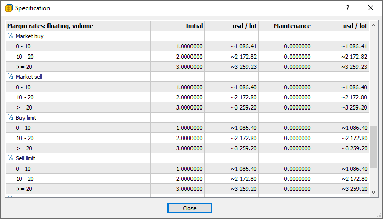

The type of margin calculation is displayed at the top:

  * Notional value — common margin calculation based on the instrument type: [Retail Forex, Futures](For-Advanced-Users/Margin-Calculation-Retail-Forex-Futures.md) or [Exchange model](For-Advanced-Users/Margin-Calculation-Exchange-Model.md).
  * Floating: **** — additional rates can be applied to the common margin calculation depending on the volume or notional value of positions on the account. In this case, the table will indicate the corresponding ranges. This option is only used for the [Retail Forex, Futures (#rate)](For-Advanced-Users/Margin-Calculation-Retail-Forex-Futures.md#rate) mode.

The "Initial" and "Maintenance" columns display [margin rates (#rate)](For-Advanced-Users/Margin-Calculation-Retail-Forex-Futures.md#rate). They are followed by the margin calculated based on the instrument type and rates.

In the above example, the margin depends on the volume of positions in the account. Three ranges are available:

  * 0 - 10
  * 10 - 20
  * >=20

Suppose there is already a position of 8 lots on the account, and you open a new position of 4 lots. In this case, the first two lots of the position will fall into the first range, and the applied margin will be 1,082.53 * 2 = 2,165.06. The other two lots will fall into the second range, and the margin will be 2,165.06 * 2 = 4,330.12. The total margin for the entire position will be equal to 2,165.06 + 4,330.12 = 6,495.18.

  * The margin is calculated based on the instrument price at the time the specification window opens and is not updated in real-time. Therefore, the values should be considered indicative. To recalculate values based on current prices, reopen the instrument specification.
  * The maintenance margin rate can be specified as zero, while the calculated value can be non-zero. This means that the maintenance margin rate is not explicitly specified, and the initial margin ratio is used instead.

  
---  
  

## Viewing the Tick Chart (#ticks)

To view the tick chart of an instrument, select a symbol in the "Symbols" tab of the Market Watch and switch to the "Ticks" tab.

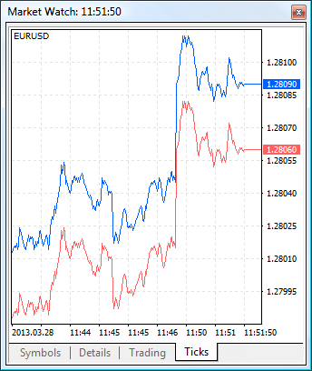

  * The platform stores up to 2000 last ticks for each symbol.
  * The tick chart is cleared and then redrawn in case you delete and re-add a symbol in the Market Watch window. Previous tick data can also be cleared for a correct scaling of the tick chart (if current prices differ from previous prices significantly).

  
---  
  

## Popup Prices (#quotes)

This window allows displaying price information on screens of all sizes — its main feature is font scaling. To open it click " Popup Prices" in the context menu of the Market Watch.

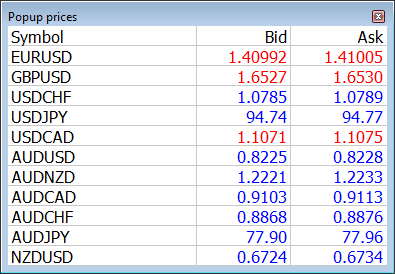

The Popup Prices window features the dame information as is available in Market Watch: the same set of symbols and columns, with the same sorting. By hovering your mouse over a symbol name, you can view brief information about it from the contract specification.

Use the context menu to customize the window view:

  * Enable or disable the display of Popup Prices on top of other windows in the system and use full screen mode.
  * Enable or disable any columns, hide the header and disable the display of milliseconds in the quote time field, if such precision is not needed.
  * In the properties window, you can customize colors and fonts, as well as the number of symbol columns. If you have a wide monitor, increase the number of columns to make better use of the screen real estate.

