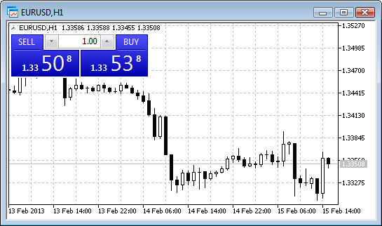
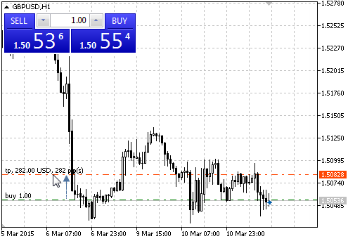
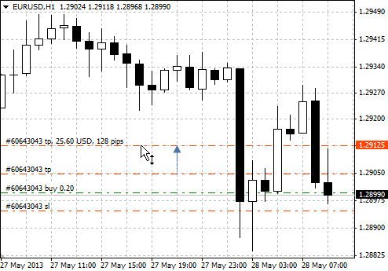
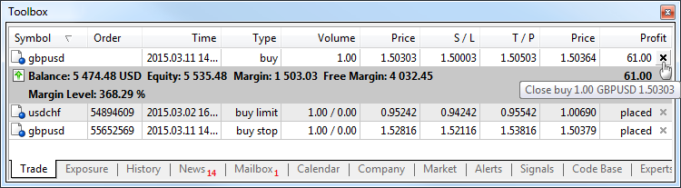
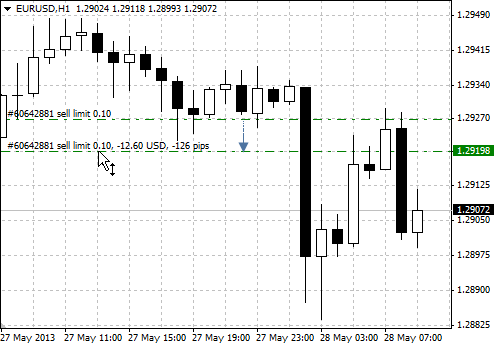
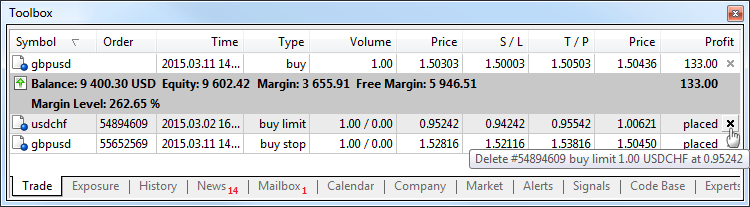
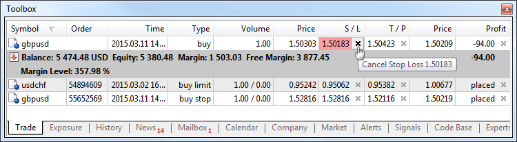

[🏠 Document Start](../README.md) / [Trading Operations](README.md) / One Click Trading

[Previous](Executing-Trades.md) | [Next](Trading-Report.md)

# One Click Trading (#one-click-trading)

Trade execution speed is very important in financial trading. Traders strive to enter the market on time to catch the opportunity to profit. Trading robots can be used for high-frequency trading. However some traders still prefer to trade manually. The platform features special tools for carrying out various trading operations with just one mouse click.

## How to Perform a Deal with One Click on a Chart (#chart-deal)

A special panel allows performing instant trade operations directly on a chart. To activate it, click " One Click Trading" in the chart context menu.

You can show/hide the panel by clickingto the left of OHLC.

Using this panel you can instantly send buy or sell [market orders (#market-order)](Basic-Principles.md#market-order) with specified volumes.

## How to Protect a Market Position by Take Profit and Stop Loss with a Single Mouse Action (#chart-set-sltp)

You can quickly set Stop Loss and Take Profit for a position on a chart. Click on the position level and drag it up or down. Depending on the direction of the position and dragging direction, a user is prompted to set either Stop Loss or Take Profit.

When you move a level, a tooltip appears displaying potential profit (or loss) in the deposit currency and pips that can be obtained if the level triggers.

To modify the level on a chart, left-click on it and drag the level up or down to the required value holding the mouse button (Drag'n'Drop):

  * Modification of Stop Loss and Take Profit on a chart is only available if the "Show trade levels" option is enabled in the [platform settings (#trade-levels)](../Getting-Started/Platform-Settings.md#trade-levels).
  * Modification of Stop Loss and Take profit on a chart is disabled if you enable the ["Disable dragging of trade levels" (#trade-levels)](../Getting-Started/Platform-Settings.md#trade-levels) option in the platform settings.

  
---  
  

## How to Quickly Lock the Profit/Loss of a Position (#close-position)

To quickly close a position and take its current profit/loss, use the "Trade" tab in the Toolbox window.

The "Profit" column of each open position has the button. If you click the button for a position, it will be immediately closed without additional confirmation.

## How To Quickly Set a Pending Order at the Desired Level on the Chart (#pending-place)

Pending orders can be placed from the chart using the [Trading (#trading)](../Price-Charts-Technical-and-Fundamental-Analysis/Additional-Features/Chart-Management.md#trading) submenu of the chart context menu:

Place the mouse cursor on the necessary price level on the chart and execute the appropriate context menu command to set a pending order.

Depending on the cursor position, available [order types (#pending-order)](Basic-Principles.md#pending-order) are displayed in the menu. If the menu is activated above the current price, a user can place Sell Limit and Buy Stop orders. If the menu is activated below the current price, Buy Limit and Sell Stop orders can be placed.

Available distance between the selected and current price for the symbol is additionally checked ("[Stop level (#specification)](Market-Watch.md#specification)").

> The order volume to set is selected on the quick trading panel on the chart.

After executing the command, the [Order window (#pending-place)](Executing-Trades.md#pending-place) appears allowing the user to adjust its parameters more precisely. If ["One Click Trading" (#one-click)](../Getting-Started/Platform-Settings.md#one-click) option is enabled in the platform settings, orders are placed at a specified price instantly without displaying the trading dialog.

## How to Quickly Change the Price of a Pending Order on the Chart (#pending-change)

Modification of pending orders on a chart is only available if the "Show trade levels" option is enabled in the [platform settings (#trade-levels)](../Getting-Started/Platform-Settings.md#trade-levels).

For pending orders, it is possible to modify [Stop Loss (#stop-loss)](Basic-Principles.md#stop-loss) and [Take Profit (#take-profit)](Basic-Principles.md#take-profit) levels separately, as well as modify the order price along with stop levels:

  * For the separate modification of stop levels on a chart, left-click the necessary level and drag it to the desired value (Drag'n'Drop).
  * Drag the price line to modify the entire order. In this case, both the price and the stop level are moved.

When you move an order, a tooltip appears displaying the distance from the current price in the deposit currency and pips.

Once a level is set, the [order modification (#pending-modify)](Executing-Trades.md#pending-modify) appears allowing users to adjust the level more precisely. If [One Click Trading (#one-click)](../Getting-Started/Platform-Settings.md#one-click) is enabled in the platform settings, modification is performed instantly without displaying the trading dialog.

> Changing pending orders on the chart can be disabled by enabling ["Disable dragging of trade levels" (#trade-levels)](../Getting-Started/Platform-Settings.md#trade-levels) option in the platform settings.

## How to Remove a Pending Order in One Click (#pending-delete)

To quickly delete a pending order, use the "Trade" tab in the Toolbox window.

The state column of each order has the button . When pressed on the order line, the order is deleted without additional confirmation.

## How to Remove Stop Loss or Take Profit with One Click (#sl-tp-delete)

To quickly delete Stop Loss or Take Profit of a position, use the "Trade" tab of the Toolbox window.

In the S/L or T/P column click . The appropriate level is deleted without any further confirmation.

## One Click Trading in the Depth of Market and Market Watch (#dom-mw)

The One Click Trading options are also available in the depth of market and the Market Watch. For details, refer to the appropriate sections:

  * [Quick Trading from the Depth of Market (#quick-trading)](Depth-of-Market.md#quick-trading)
  * [One Click Trading in Market Watch (#trading)](Market-Watch.md#trading)

## Features of One Click Trading (#notes)

A window of the agreement appears when you first try to make a deal with one click.

If you accept the conditions, tick "I Accept these Terms and Conditions" option and click "OK". If you do not accept the conditions, click "Cancel" and do not use the "One Click Trading" function.

You can pre-allow the one-click trading option in the [platform settings (#agreement)](../Getting-Started/Platform-Settings.md#agreement).

When performing operations with one click, you should be aware of some of its features:

  * One Click Trading is available in all [execution modes (#execution-type)](Basic-Principles.md#execution-type) except for "Request" execution. In the latter case, a standard trade dialog appears.
  * In the [Instant Execution (#execution-type)](Basic-Principles.md#execution-type) mode, the allowable price [deviation (#deviation)](Executing-Trades.md#deviation) in orders is set in accordance with the ["Use deviation" (#trade)](../Getting-Started/Platform-Settings.md#trade) option.
  * [The Fill Policy (#fill-policy)](Basic-Principles.md#fill-policy) is selected based on the trading instrument [execution mode (#execution-type)](Basic-Principles.md#execution-type): for exchange execution it is always "Return", for market execution it is either "Fill or Kill" or "Immediate or Cancel" (depending on what policy is allowed for the symbol), for instant and request execution it is always "Fill or Kill".
  * When a requote is received, an appropriate message is added to the platform [journal](../Getting-Started/For-Advanced-Users/Platform-Logs.md) and a [requote sound (#events)](../Getting-Started/Platform-Settings.md#events) is played.

The quotes are displayed on the one-click trading panel buttons the following way:

  * The decimal point between the numbers of different size is not displayed to save space. The font size is used as a separator instead.
  * In three-digit quotes, the first and second digits are highlighted, while in five-digit quotes — the third and fourth ones. The last two digits are highlighted in other cases.

