[🏠 Document Start](../README.md) / [Trading Operations](README.md) / Options Board

[Previous](Market-Watch.md) | [Next](Executing-Trades.md)

# Options Board (#options-board)

An option is a derivative financial instrument. Basically, it is a contract that grants the option buyer the right but not obligation to buy or to sell an asset at a previously agreed price (the Strike price) at some point in future. The option seller, in turn, is obliged to sell or buy the asset, if the buyer decides to exercise the option.

The right to buy an asset is called a Call option; the right to sell is the Put option. Each of these types of options can be bought or sold. The following four type of deals exist:

  * Buying a call option means purchasing the right to buy the underlying asset
  * Selling a call option means selling the right to buy the underlying asset
  * Buying a put option means purchasing the right to sell the underlying asset
  * Selling a put option means selling the right to sell the underlying asset

Two styles of options include American and European. American options can be exercised at any time up to the expiration date. European options can be exercised only on the expiration date.

## Option Prices (#option-prices)

One of the main properties of an option is its strike price. It is the price at which the option buyer can purchase or sell the underlying asset, and the option seller is obliged to sell or purchase the asset.

An option is sold or purchased not at the full cost of the underlying asset, but at a certain fee for a risk of adverse underlying price change until the option expiry. The option price is the premium, which is determined by two factors:

  * The ratio of the strike price to the underlying asset price is the intrinsic value of the option. The more profitable the strike price of an option is, relative to the current market value of the underlying asset, the higher its intrinsic value.
  * Time remaining until option expiration is attributable to the time value. The closer the option expiration date, the less is the time component of its value.

The board displays four prices for options contracts:

  * Bid CALL — the selling price of a call option.
  * Ask CALL — the buying price of a call option.
  * Bid PUT — the selling price of a put option.
  * Ask PUT — the buying price of a put option.

As seen from the board, the higher the strike price, the lower the cost of the call contract and the higher the cost of the put contract. The strike price, which is closest to the current market value of the underlying asset, is shown in green. This price is also called a central strike.

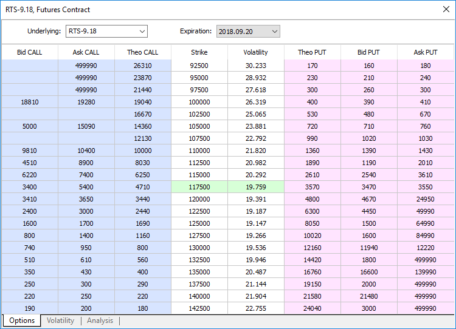

The following three types of options are possible depending on the ratio between the strike price and the market price:

  * In-the-money (ITM) is the option that can be exercised with profit. Call options are said to be in-the-money if the strike price is below the market price. A put option is in-the-money if the strike price is higher than the market price.
  * Out-of-the-money (OTM) is the option that cannot be exercised with profit. An option having a strike price above the market price (for call) or below the market price (for put) is said to be out-of-the-money.
  * At-the-money (OTM) is the option having the strike price on or very close to the market price.

"Theo CALL" and "Theo PUT" columns show the theoretical value of the option. It helps to determine how fair the contract price offered by its buyer/seller is. The theoretical price is calculated for each strike based on the price history of the underlying asset. The calculation is based on the [Black-Scholes model](https://ru.wikipedia.org/wiki/%D0%9C%D0%BE%D0%B4%D0%B5%D0%BB%D1%8C_%D0%91%D0%BB%D1%8D%D0%BA%D0%B0_%E2%80%94_%D0%A8%D0%BE%D1%83%D0%BB%D0%B7%D0%B0), in which the key point in determining the theoretical price is the volatility of the underlying asset. The main idea of this model is risk-free hedging: when one simultaneously buys the underlying asset and sells the call option to this underlying, the profit and loss must exactly compensate each other.

Implied Volatility is also shown on the Options Board. It is specified as a percentage, and characterizes the expectations of market participants about the future value of the underlying asset of the option. The higher the volatility value, the greater the change in the underlying asset price expected by traders. The dependence of the implied volatility on the option strike price is shown in the separate Volatility tab.

## Volatility Chart (#volatility-smile)

This chart shows how the implied volatility changes depending on the option strike price. Typically, the lowest volatility values are found near the strike price, which are very close to the current market value of the underlying asset. The further the strike price is from the current market, the greater future price change is expected by traders. The chart form resembles an arc and is called "Volatility Smile".

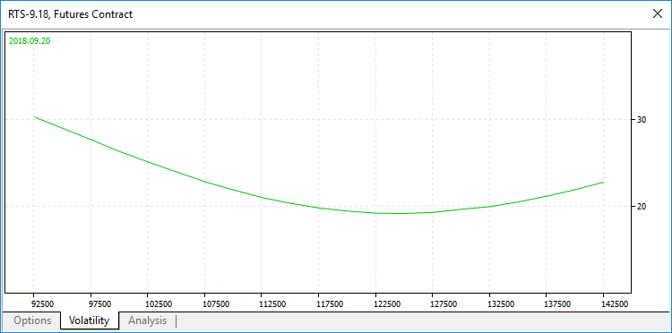

If the volatility smile is symmetrical, market participants equally expect the underlying price to grow and to fall. If the volatility smile is shifted to the right, as shown in the image above, participants are more likely to expect the asset to fall.

## Analysis (#analysis)

The Options Board includes a built-in strategy analysis tool, which allows analyzing open positions and modeling various investment portfolios. For example, you may open a virtual position on the underlying asset, enter into a virtual option contract, and analyze the effectiveness of such a combination. To model a situation, you may create a portfolio manually or use available templates of popular option strategies, such as Long Strangle, Bull Put Spread, Long Put Butterfly, and others.

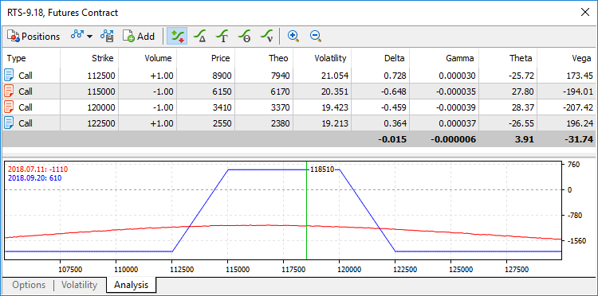

### Profit/Loss Graphs and Greeks (#greeks)

In addition to the general parameters of options, the Analysis tab features the so-called Greeks. These are statistical variables that help evaluate the sensitivity of the option price to changes in various parameters, which include strike prices, volatility, current price of the underlying asset, expiration date, etc. The Greeks will help you evaluate the risk of an adverse option price change based on the option parameters.

  * Delta measures an option's price sensitivity relative to changes in the underlying asset price. It is calculated as the ratio of a change in the option price to a change in the asset price. For example, if Delta is 0.5, then the growth in the asset price by 100 units is accompanied by the 50-unit growth in the option price. If Delta is negative, then the option price falls when the asset price grows. Delta is positive for call options and negative for put options.
  * Gamma shows how Delta changes when the underlying asset price changes. Intrinsically, it is the second derivative of the option price at the price of the underlying asset. For example, if Gamma is 0.01 and Delta is 0.05, then an increase in the underlying asset price by 2 units will lead to Delta increase by 0.02, so Delta will be equal to 0.07. Gamma of options having much time until expiration is minimal. Gamma increases as expiration approaches.
  * Theta shows the speed of option price change depending on expiration. It is calculated as the ratio of option price change to its expiration date change. For example, if Theta is 0.07, then the option loses 0.07 of its value every day. For convenience, the Theta value is always shown as negative, because it reduces the cost of the option.
  * Vega shows how an option value changes with the change of implied volatility. It is calculated as the ratio of a change in the option price to a change in the implied volatility. For example, if Vega is 10, then the 1% volatility growth leads to the 10-unit growth in the option price. Options with the strike price very close to the current asset price have the largest Vega value. Such options are most sensitive to changes in implied volatility. Vega decreases as the option expiry approaches.

Charts visualizing changes in Greeks depending on the option strike price are shown at the bottom. Use buttons on the toolbar or context menu to switch between the charts.

You may additionally view the profit/loss graph for the selected portfolio depending on the final price of the underlying asset. Blue line indicates the option's profit/loss as of the moment of exercise. Red line denotes profit/loss taking into account the time value. The profit/loss at the current price of the underlying asset is shown in the chart corner.

Profit at the time of exercise

Different profit and loss calculation methods apply to each strategy (combination of options). However, they are calculated as the difference between the strikes (or the strike and the price of the underlying asset) and the premiums paid. For example, under the Bear Put Spread strategy a put option with a lower strike is sold and a put option with a higher strike is purchased. The strategy is used when the trader expects the price of the underlying asset to go down. If the price change has been predicted correctly, and the trader earns profit, the profit is calculated as follows:

(Strike price of the purchased option) - (Strike price of the sold option) - (Premium for the purchased option) + (Premium for the sold option)

Since the price of the underlying asset has decreased, when exercising the put option we sell the underlying asset at a more favorable price — strike is higher than the current price. When executing obligations on the sold put option, we redeem the underlying asset at a more favorable price — strike is below the current price. Thus, our profit is the difference between the strike prices of the purchased and sold option.

Then, the formula includes premium paid for options contracts. The price of a long option is deducted, as it is paid by the buyer. The price of a short option is added, as it is paid to the seller.

If the price in this example is predicted incorrectly, loss will be equal to difference in the premium received and paid. Strike prices are not taken into account, because options are not exercised: one party will not buy the asset at a price higher than market, and the other party will not sell it at a price below the market price.

Profit taking into account the time value

Theoretical price is used for calculating profit/loss taking into account the time value:

Buy positions: (Theoretical Price - Option Price) * Volume

Sell positions: (Option Price - Theoretical Price) * Volume

To draw a chart, the platform calculates the theoretical price of each option from the strategy for a certain price of the underlying asset.

### Creating a Custom Strategy (#strategy-custom)

To analyze your own options trading strategy, add necessary positions to the list. Click "Add", select the desired symbol, and then click Buy or Sell.

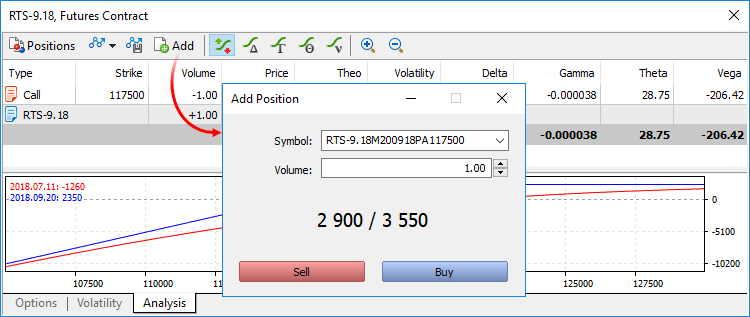

After adding positions, you can view statistic variables and the profit/loss graph for the strategy.

Any strategy can be saved for future use. Click  on the toolbar and specify the name of the strategy:

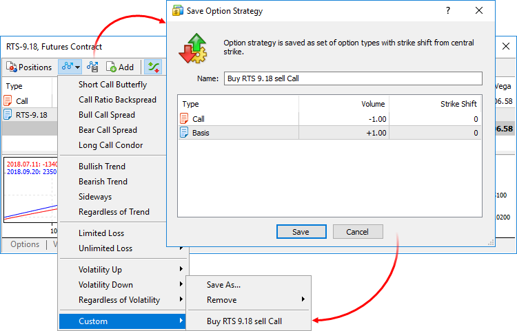

Absolute strike values are not stored to preserve universality. Shift from the central strike is saved instead.

To load a previously saved strategy, click  on the toolbar and select it from the Custom section.

> No real positions are opened during strategy analysis. All calculations are based on virtual positions.

### Templates of Popular Strategies (#strategy-template)

The Options Board includes a variety of popular strategies, which can be tested with a selected financial instrument. To apply a strategy, clickon the toolbar:

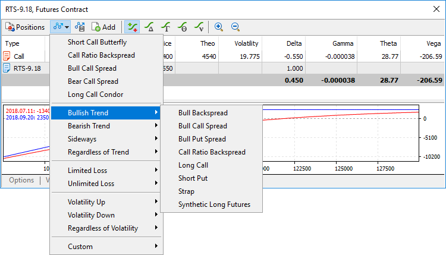

A list will be shown containing positions, which could be opened according to this strategy, enabling you to analyze statistical metrics.

Built-in strategies are divided into several basic types, depending on market conditions which the strategies are intended to be used in: bullish or bearish market, sideways movement, regardless of trend. The strategies are further divided into categories depending on the trader's expectations of the market and the ability to limit losses:

  * Volatility Up — the strategy is used when a growth in the underlaying asset volatility is expected.
  * Volatility Down — the strategy is used when a fall in the underlaying asset volatility is expected.
  * Regardless of Volatility — the strategy is used regardless of the volatility of the underlying asset.
  * Limited Loss — the strategy involves limiting of possible losses.
  * Unlimited Loss — the loss is not limited in case of unfavorable outcome.

All built-in strategies assume the purchase and sale of options with the same expiration date.

Bullish Trend Strategies

Name | Category | Description | When used | Profit/loss  
---|---|---|---|---  
Bull Backspread | Unlimited loss Volatility up | Sell ​​a put option with a lower strike and buy a call option with a higher strike. | When a moderate increase in the underlying asset price is expected. | Profit: Underlying asset price - Call option strike +/- Premium difference Loss: Put option strike - Underlying asset price +/- Premium difference It is expected under this strategy, that the final price will be between the option strikes. Both options will not be exercised in this case, and the trader may profit from the difference in premium values. When the underlying asset price grows, profit is not limited due to a more favorable purchase on the call option. If the price falls, the loss is not limited due to the obligation to sell the asset at a lower price on the put option. 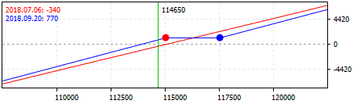  
Bull Call Spread | Limited loss Volatility up | Buy a call option with a lower strike and sell a call option with a higher strike. | When a moderate increase in the underlying asset price is expected. | Profit: Short option strike - Long option strike +/- Premium difference Loss: Premium difference If the price of the underlying asset grows, the trader receives the difference between strike prices, because it is the opportunity to buy the asset at a more favorable price than the trader is obliged to sell. The premium difference is deducted from this amount. When the asset price falls, options are not exercised, and the trader loses only the difference in premiums. 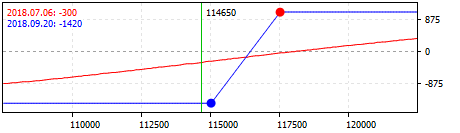  
Bull Put Spread | Limited loss Volatility up | Buy a put option with a lower strike and sell a put option with a higher strike. | When a moderate increase in the underlying asset price is expected. | Profit: Short option strike - Long option strike +/- Premium difference Loss: Premium difference If the price of the underlying asset grows, the trader receives the difference between strike prices, because it is the opportunity to sell the asset at a more favorable price than the trader is obliged to buy. The premium difference is deducted from this amount. When the asset price falls, options are not exercised, and the trader loses only the difference in premiums. 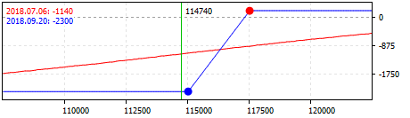  
Call Ratio Backspread | Limited loss Volatility up | Sell ​​one call option with a lower strike and buy two call options with higher strikes. | When a change in the underlying asset price and increase in volatility is expected. | Initially, the profit/loss is equal to the difference between the premiums paid. If the price falls below the strike of the sold option, the loss is limited to the premium difference, since non of the two options will be exercised (parties will not buy the asset at a price above the market). The largest loss is found in the range between the strikes of the long and short options. In this case, the sold option is in-the-money, in contrast to purchased ones. The loss is calculated as follows: Short option strike - Long option strike +/- Premium difference. If the asset price then grows, the portfolio reaches the breakeven level. When the price grows, the profit is not limited: Underlying asset price - Call option strike +/- Premium difference. 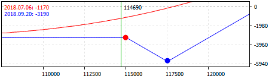  
Long Call | Limited loss Volatility up | Buy a call option. | When a growth in the underlying asset price and increase in volatility is expected. | Profit: Underlying asset price - Option strike - Option premium Loss: Option Premium The profit is not limited if the underlying asset price grows. If the price falls, the loss is limited to the option premium paid. 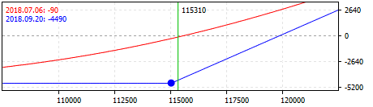  
Short Put | Unlimited loss Volatility down | Sell a put option. | When a growth in the underlying asset price and volatility increase is expected. | Profit: Option Premium Loss: Underlying asset price - Option strike + Option premium The profit is limited to the option premium if the underlying asset price grows. If the price falls, the loss is not limited. 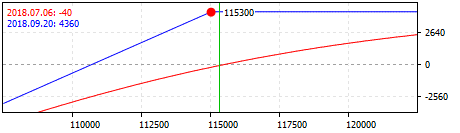  
Strap | Limited loss Volatility up | Buy two call options and one put option with the same strikes. | When a change in the underlying asset price is expected, with a higher probability of growth. | Profit in case of price growth: 2*(Underlying asset price - Call option strike) - Premium for options Profit in case of price decrease: Underlying asset price - Put option strike - Premium for options Loss: Premium for options The profit arises both when the underlying asset price grows and falls, but is higher in case of growth. The loss is limited to the premium paid for the options. 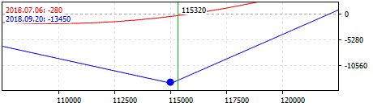  
Synthetic Long Futures | Unlimited loss Regardless of volatility | Buy a call option and sell a put option with equal strikes. | When an increase in the underlying asset price is expected. | Profit: Underlying asset price - Call option strike +/- Premium difference Loss: Put option strike - Underlying asset price +/- Premium difference The profit is not limited if the underlying asset price grows. Loss is not limited if the price falls. 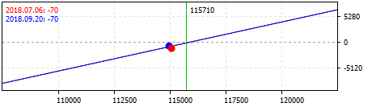  
  
Bearish Trend Strategies

Name | Category | Description | When used | Profit/loss  
---|---|---|---|---  
Bear Backspread | Unlimited loss Volatility up | Buy a put option with a lower strike and sell a call option with a higher strike. | When a moderate fall in the underlying asset price is expected. | Profit: Put option strike - Underlying asset price +/- Premium difference Loss: Underlying asset price - Call option strike +/- Premium difference It is expected under this strategy, that the final price will be between the option strikes. Both options will not be exercised in this case, and the trader may profit from the difference in premium values. When the underlying asset price falls, profit is not limited due to a more favorable selling on the put option. If the price grows, the loss is not limited due to the obligation to buy the asset at a higher price on the call option. 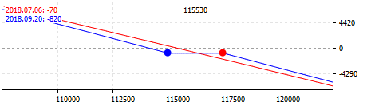  
Bear Call Spread | Limited loss Volatility up | Sell ​​a call option with a lower strike and buy a call option with a higher strike. | When a moderate fall in the underlying asset price is expected. | Profit: Premium difference Loss: Long option strike - Short option strike +/- Premium difference If the price of the underlying asset falls, the trader receives the difference between strike prices, because it is the opportunity to sell the asset at a more favorable price than the trader is obliged to buy. The premium difference is deducted from this amount. When the asset price grows, options are not exercised, and the trader loses only the difference in premiums. 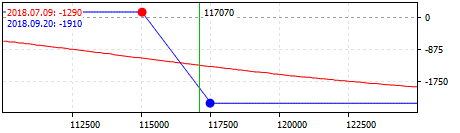  
Bear Put Spread | Limited loss Volatility up | Sell ​​a put option with a lower strike and buy a put option with a higher strike. | When a moderate fall in the underlying asset price is expected. | Profit: Long option strike - Short option strike +/- Premium difference Loss: Premium difference If the price of the underlying asset falls, the trader receives the difference between strike prices, because the trader has the obligation to sell the asset at a lower price than he is obliged to buy. The premium difference is deducted from this amount. When the asset price grows, options are not exercised, and the trader loses only the difference in premiums. 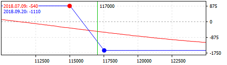  
Put Ratio Backspread | Limited loss Volatility up | Buy two put options with a lower strike and sell one put option with a higher strike. | When a change in the underlying asset price and increase in volatility is expected. | Initially, the profit/loss is equal to the difference between the premiums paid. If the price rises above the strike of the bought option, the loss is limited to the premium difference, since non of the two options will be exercised (parties will not sell the asset at a price below the market). The largest loss is found in the range between the strikes of the long and short options. In this case, the purchased options are in-the-money, in contrast to sold ones. The loss is calculated as follows: Long option strike - Short option strike +/- Premium difference. If the asset price then falls, the portfolio reaches the breakeven level. When the price falls, the profit is not limited: Put option strike - Underlying asset price +/- Premium difference. 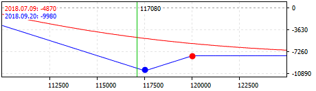  
Long Put | Limited loss Volatility up | Buy a put option. | When a fall in the underlying asset price and increase in volatility is expected. | Profit: Option strike - Underlying asset price - Option premium Loss: Option Premium The profit is not limited if the underlying asset price falls. If the price falls, the loss is limited to the option premium paid. 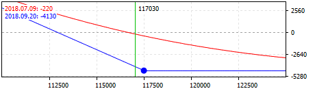  
Short Call | Unlimited loss Volatility down | Sell a call option. | When a fall in the underlying asset price and volatility decrease is expected. | Profit: Option Premium Loss: Option strike - Underlying asset price + Option premium The profit is limited to the option premium if the underlying asset price falls. If the price grows, the loss is not limited. 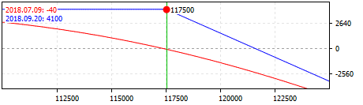  
Strip | Limited loss Volatility up | Buy one call option and two put options with equal strikes. | When a change in the underlying asset price is expected, with a higher probability of a fall. | Profit in case of price fall: 2*(Put option strike - Underlying asset price) - Premium for options Profit in case of price growth: Underlying asset price - Call option strike - Premium for options Loss: Option Premium The profit arises both when the underlying asset price grows and falls, but is higher in case of fall. The loss is limited to the premium paid for the options. 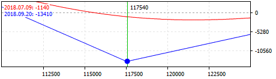  
Synthetic Short Futures | Unlimited loss Regardless of volatility | Buy a put option and sell a call option with equal strikes. | When a fall in the underlying asset price is expected. | Profit: Put option strike - Underlying asset price +/- Premium difference Loss: Underlying asset price - Call option strike +/- Premium difference The profit is not limited if the underlying asset price grows. Loss is not limited if the price falls. 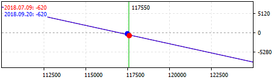  
  
Sideways Strategies

Name | Category | Description | When used | Profit/loss  
---|---|---|---|---  
Call Ratio Spread | Unlimited loss Volatility down | Buy one call option with a lower strike and sell two call options with higher strikes. | When a fall in the underlying asset volatility with no price change is expected. | Profit: Long option strike - Underlying asset price +/- Premium difference Loss in case of price growth: Underlying asset price - Short option strike +/- Premium difference Loss in case of price fall: Premium difference The initial profit is the difference in premiums. In case of a slight price growth, the trader receives an additional profit on a purchased call option. If the price continues to grow, the sold options will become in-the-money, and the trader will receive a loss (the volume of short options is higher, so the long option will not compensate for the loss). If the underlying asset price falls, the trader loses only the premium paid for the long option. If the price grows, the loss is unlimited. 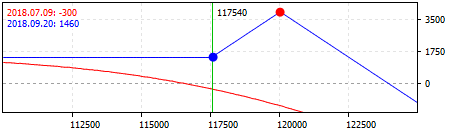  
Put Ratio Spread | Unlimited loss Volatility down | Sell two put options with a lower strike and buy one put option with a higher strike. | When a fall in the underlying asset volatility with no price change is expected. | Profit: Underlying asset price - Long option strike +/- Premium difference Loss in case of price growth: Premium difference Loss in case of price fall: Underlying asset price - Short option strike +/- Premium difference The initial profit is the difference in premiums. In case of a slight price fall, the trader receives an additional profit on a purchased put option. If the price continues to fall, the sold options will become in-the-money, and the trader will receive a loss (the volume of sold options is higher, so the bought option will not compensate for the loss). If the underlying asset price grows, the trader loses only the premium paid for the long option. If the price falls, the loss is unlimited. 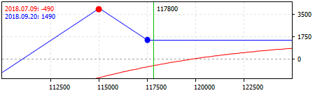  
Condor Ratio | Unlimited loss Volatility down | Sell two put options with a lower strike. Buy one put option with a higher strike. Buy one call option with an even higher strike. Sell two call options with an even higher strike. | When a slight change in the underlying asset price is expected. | Compared with the long and short condor, this strategy has a greater potential for profit, but possible losses are not limited. The maximum profit is achieved in two cases: when the price is in the interval between the put options strikes and in the interval between the call options strikes. In these cases, the trader can exercise the bought options, while the sold ones are not yet in the money. Losses are not limited in case the price grows or falls significantly, because the volume of sold options in-the-money will be twice as large as the volume of bought options. 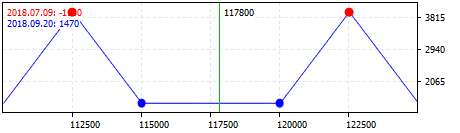  
Long Call Butterfly | Limited loss Volatility down | Buy one call option with a lower strike. Sell two call options with a higher strike. Buy one call option with an even higher strike. | When a fall in the underlying asset volatility with a slight price change is expected. | Profit in case of price growth: Underlying asset price - Long option strike +/- Premium difference Profit in case of further price growth: (Underlying asset price - Long option strike) - 2*(Underlying asset price - Short option strike) +/- Premium difference Loss: Premium difference It is expected under this strategy, that the price will move in a certain range. Profit is achieved in the intervals between the strikes of long and short options. In this case, the call option with the lowest strike is already in-the-money, and the profit is not yet fully covered by losses on sold options. Once the long option with the highest strike is in-the-money, losses on sold options become completely covered. The loss in case of significant price fall or rise is limited to the premium difference. 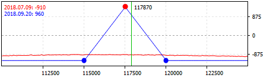  
Long Call Condor | Limited loss Volatility down | Buy one call option with a lower strike. Sell one call option with a higher strike. Sell one call option with an even higher strike. Buy one call option with an even higher strike. | When a fall in the underlying asset volatility with a slight price change is expected. | Profit in case of price growth: Underlying asset price - Long option strike +/- Premium difference Profit in case of further price growth: (Underlying asset price - Long option strike) - (Short option strike - Underlying asset price) +/- Premium difference Loss: Premium difference It is expected under this strategy, that the price will move in a certain range. Profit is achieved in the intervals between the strikes of long and short options. In this case, the long option with the lowest strike is already in-the-money, and the profit is not yet fully covered by losses of sold options. Once the long option with the highest strike is in-the-money, losses on sold options become completely covered. The loss in case of significant price fall or rise is limited to the premium difference. 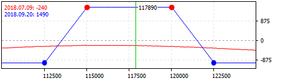  
Long Put Butterfly | Limited loss Volatility down | Buy one put option with a lower strike. Sell two put options with a higher strike. Buy one put option with an even higher strike. | When a fall in the underlying asset volatility with a slight price change is expected. | Profit in case of price fall: Underlying asset price - Long option strike +/- Premium difference Profit in case of further price fall: (Underlying asset price - Long option strike) - 2*(Underlying asset price - Short option strike) +/- Premium difference Loss: Premium difference It is expected under this strategy, that the price will move in a certain range. Profit is achieved in the intervals between the strikes of long and short options. In this case, the put option with the highest strike is already in-the-money, and the profit is not yet fully covered by losses on sold options. Once the long option with the lowest strike is in-the-money, losses on sold options become completely covered. The loss in case of significant price fall or rise is limited to the premium difference. 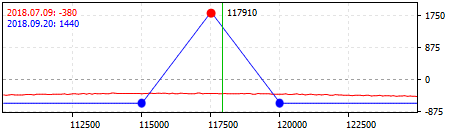  
Long Put Condor | Limited loss Volatility down | Buy one put option with a lower strike. Sell one put option with a higher strike. Sell one put option with an even higher strike. Buy one put option with an even higher strike. | When a fall in the implied volatility with a slight price change is expected. | Profit in case of price fall: Underlying asset price - Long option strike +/- Premium difference Profit in case of further price fall: (Underlying asset price - Long option strike) - (Short option strike - Underlying asset price) +/- Premium difference Loss: Premium difference It is expected under this strategy, that the price will move in a certain range. Profit is achieved in the intervals between the strikes of long and short options. In this case, the put option with the highest strike is already in-the-money, and the profit is not yet fully covered by losses on sold options. Once the long option with the lowest strike is in-the-money, losses on sold options become completely covered. The loss in case of significant price fall or rise is limited to the premium difference. 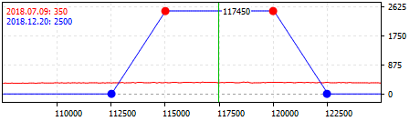  
Short Straddle | Unlimited loss Volatility down | Sell ​​call and put options with equal strikes. | When a fall in the underlying asset volatility with no price change is expected. | Profit: Premium for the options Loss in case of price growth: Underlying asset price - Put option strike - Premium for options Loss in case of price fall: Call option strike - Underlying asset price - Premium for options The potential profit is limited to the premium for options, the loss is unlimited and occurs if the underlying asset price moves in any direction. 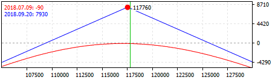  
Short Strangle | Unlimited loss Volatility down | Sell ​​a put option with a lower strike and sell a call option with a higher strike. | When a fall in the underlying asset volatility with no price change is expected. | Profit: Premium for the options Loss in case of price growth: Underlying asset price - Put option strike - Premium for options Loss in case of price fall: Call option strike - Underlying asset price - Premium for options The potential profit is limited to the premium for options, the loss is unlimited and occurs if the underlying asset price moves in any direction. Compared with Short Straddle, this strategy accepts larger changes in the underlying asset price: the profit remains at the maximum level between the strikes of the options. 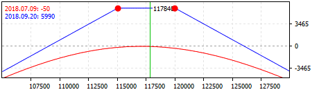  
  
'Regardless of Trend' Strategies

Name | Category | Description | When used | Profit/loss  
---|---|---|---|---  
Long Straddle | Limited loss Volatility up | Buy call and put options with equal strikes. | When a change in the underlying asset price and increase in volatility is expected. | Profit in case of price growth: Underlying asset price - Call option strike - Premium for options Profit in case of price fall: Put option strike - Underlying asset price - Premium for options Loss: Premium for options The potential loss is limited to the premium for options, the profit is not limited and occurs if the underlying asset price moves in any direction. 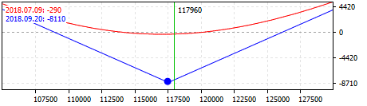  
Long Strangle | Limited loss Volatility up | Buy a put option with a lower strike and buy a call option with a higher strike. | When a change in the underlying asset price and increase in volatility is expected. | Profit in case of price growth: Underlying asset price - Call option strike - Premium for options Profit in case of price fall: Put option strike - Underlying asset price - Premium for options Loss: Premium for options The potential loss is limited to the premium for options, the profit is not limited and occurs if the underlying asset price moves in any direction. Compared with the Long Straddle, this strategy implies a greater price change. 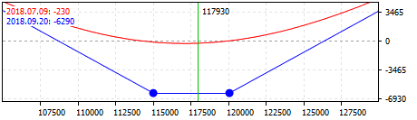  
Short Call Butterfly | Limited loss Volatility up | Sell one call option with a lower strike. Buy two call options with a higher strike. Sell one call option with an even higher strike. | When a change in the underlying asset price and increase in volatility is expected. | Profit: Premium difference Loss in case of price growth: Short option strike - Underlying asset price +/- Premium difference Loss in case of further price growth: (Underlying asset price - Short option strike) - 2*(Underlying asset price - Long option strike) +/- Premium difference The potential profit is expected to be maximum in case of considerable price movement in any direction, the loss is limited and occurs in case of insignificant price fluctuations. 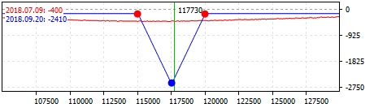  
Short Call Condor | Limited loss Volatility up | Sell one call option with a lower strike. Buy one call option with a higher strike. Buy one call option with an even higher strike. Sell one call option with an even higher strike. | When a change in the underlying asset price and increase in volatility is expected. | Profit: Premium difference Loss in case of price growth: Short option strike - Underlying asset price +/- Premium difference Loss in case of further price growth: (Short option strike - Underlying asset price) - (Long option strike - Underlying asset price) +/- Premium difference The profit is limited to the premium difference and may have the maximum value in case of a significant price movement in any direction. Highest loss occurs in the intervals between the strikes of long and short options. In this case, the sold option with the lowest strike is already in-the-money, and it is not yet fully covered by profit of bought options. If growth continues, the profit on long options will completely cover losses on short ones. 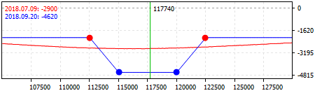  
Short Put Butterfly | Limited loss Volatility up | Sell one put option with a lower strike. Buy two put options with a higher strike. Sell one put option with an even higher strike. | When a change in the underlying asset price and increase in volatility is expected. | Profit: Premium difference Loss in case of price growth: Underlying asset price - Short option strike +/- Premium difference Loss in case of further price growth: (Underlying asset price - Short option strike) - 2*(Long option strike - Underlying asset price) +/- Premium difference The potential profit is expected to be maximum in case of considerable price movement in any direction, the loss is limited and occurs in case of insignificant price fluctuations. 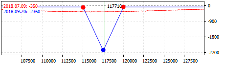  
Short Put Condor | Limited loss Volatility up | Sell one put option with a lower strike. Buy one put option with a higher strike. Buy one put option with an even higher strike. Sell one put option with an even higher strike. | When a change in the underlying asset price and increase in volatility is expected. | Profit: Premium difference Loss in case of price growth: Underlying asset price - Short option strike +/- Premium difference Loss in case of further price growth: (Underlying asset price - Short option strike) - (Underlying asset price - Long option strike) +/- Premium difference The profit is limited to the premium difference and may have the maximum value in case of a significant price movement in any direction. Highest loss occurs in the intervals between the strikes of long and short options. In this case, the sold option with the lowest strike is already in-the-money, and it is not yet fully covered by profit of bought options. If growth continues, the profit on long options will completely cover losses on short ones. 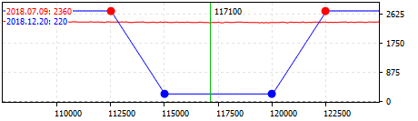
