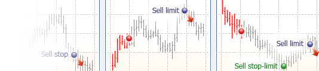
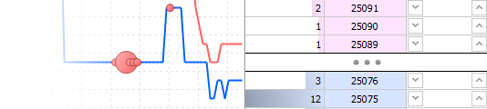
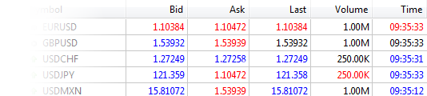
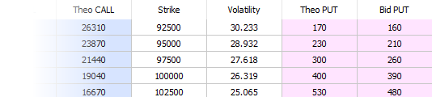
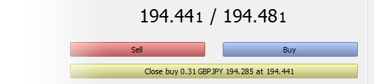
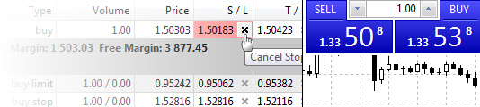
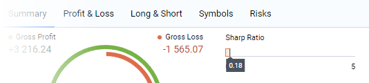

[🏠 Document Start](../README.md) / Trading Operations

[Previous](../Getting-Started/For-Advanced-Users/Uninstalling-the-Platform.md) | [Next](Basic-Principles.md)

# Trading Operations

The fundamental rule of profitable trading in financial markets is to buy low and sell high. The main purpose of the trading platform is to provide wide opportunities for executing buy and sell operations.

This section contains general information about financial trading and guides you through how to perform trading operations and manage positions, how to interpret data from the Depth of Market and where to find quotes.

[ General Principles Before you begin to study the trading functions available in the platform, you need to have a clear understanding of the basic terms and functions. Read about the types or order, execution types and fill policies, about the trailing stop and more.  ](Basic-Principles.md) [ Depth of Market The Depth of Market (DOM) displays bids and asks for a particular instrument at the best current prices. A tick chart with the Time&Sales data can also be access from the Depth of Market.  ](Depth-of-Market.md) [ Market Watch The Market Watch window provides an overview of price data for financial instruments: quotes, price statistics and tick chart. It also provides details of contract specifications and One Click Trading options.  ](Market-Watch.md) [ Options Board All available options of a trading instrument are displayed on the Options Board. The Options Board provides a convenient overview of dependence of options value from how close its execution price is to the current market. Also, the Board functionality allows viewing implied volatility charts and analyzing strategies.  ](Options-Board.md) [ Executing Trades The trading activity in the platform implies preparing and sending market and pending orders to be executed by a broker, as well as managing current positions. You can access your account history, configure alerts of market events and more.  ](Executing-Trades.md) [ One Click Trading Trade execution speed, as well as proper entry and exit time are very important in financial trading. The platform provides a number of cutting-edge tools for trading with just one mouse click.  ](One-Click-Trading.md) [ Trading Report The report represents trading results in a convenient visual format. It assists in evaluating trading performance, optimizing portfolios and finding methods to achieve lower risks along with improved trading stability.  ](Trading-Report.md)
