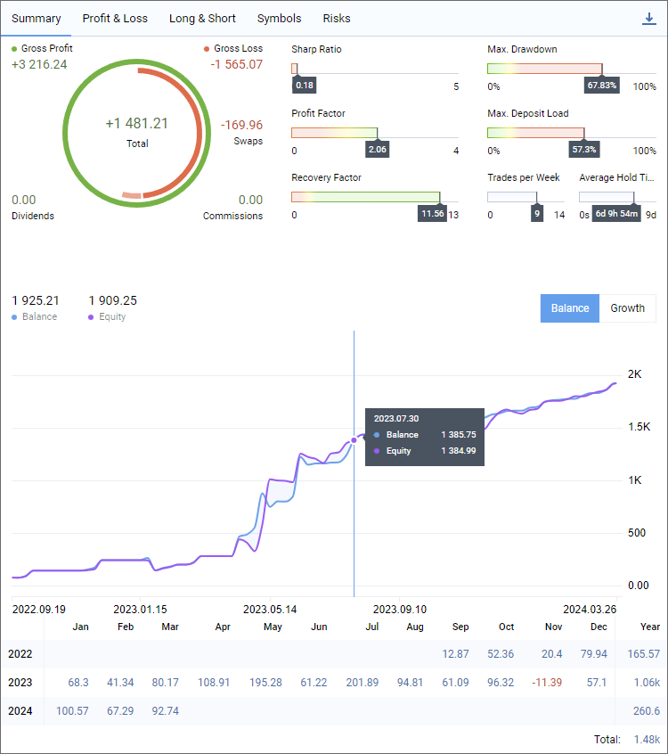
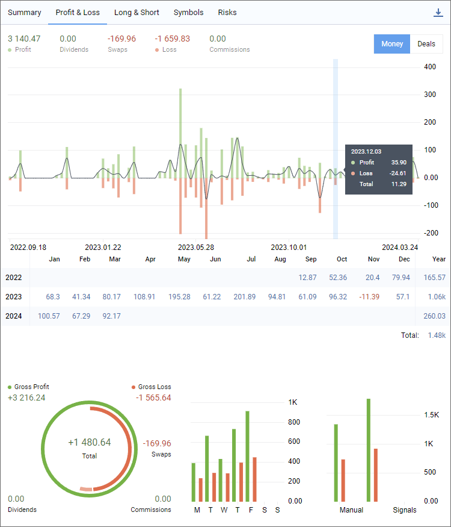
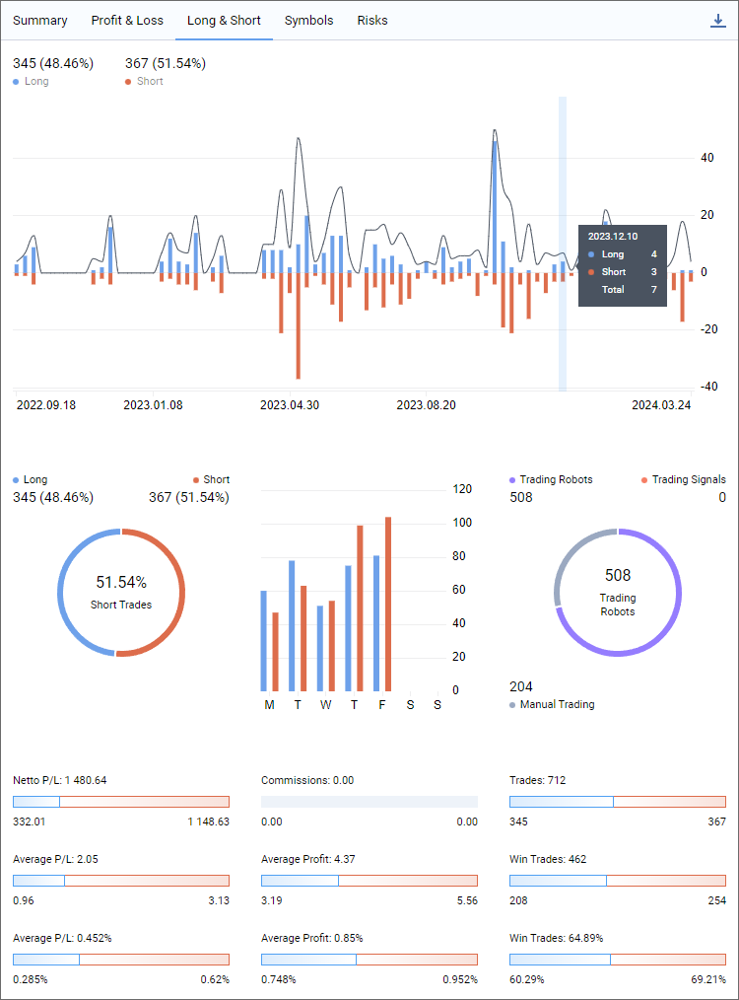
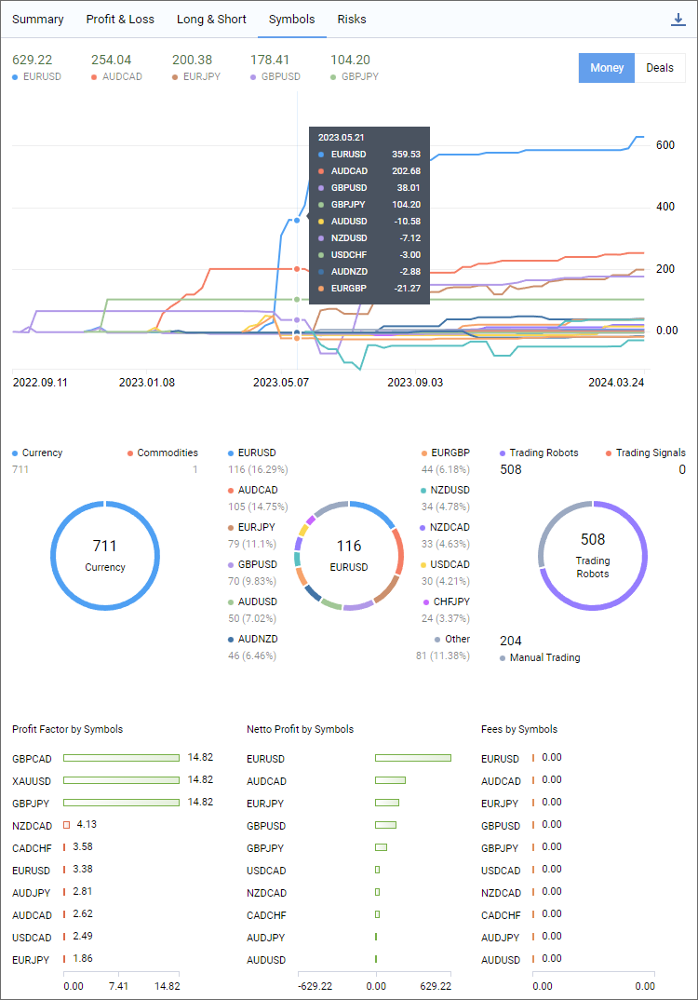
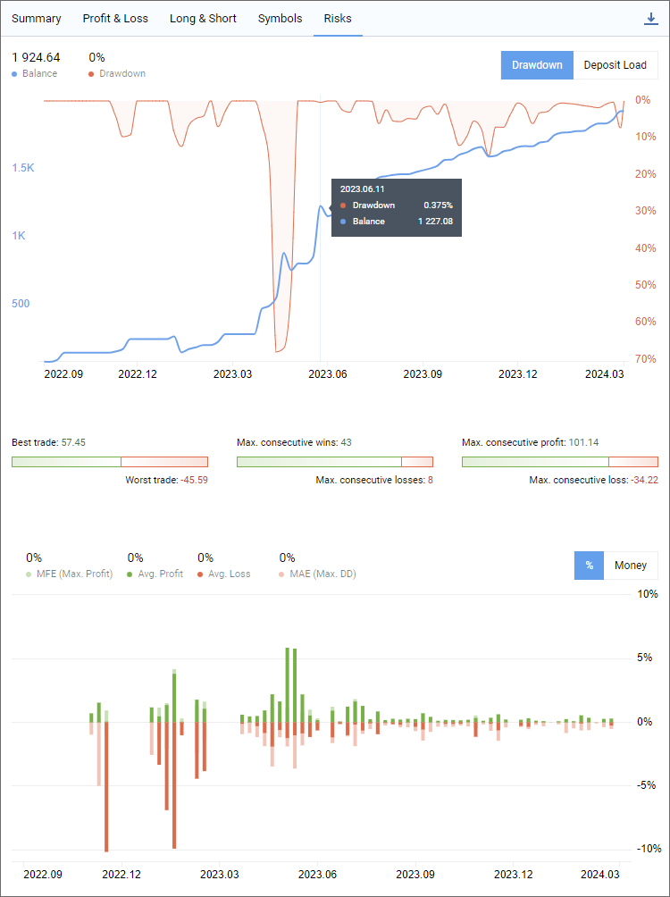

[🏠 Document Start](../README.md) / [Trading Operations](README.md) / Trading Report

[Previous](One-Click-Trading.md) | [Next](For-Advanced-Users.md)

# Trading Report (#trading-report)

The report represents trading results in a convenient visual format. It assists in evaluating trading performance, optimizing portfolios and finding methods to achieve lower risks along with improved trading stability. To analyze your strategy, click 'Report \ Overview' in the context menu of the trading history section or Reports in the View menu.

The report is divided into tabs, each providing aggregated information:

  * Summary — an overview of trading over time: overall profit and loss metrics, deposit and withdrawal amounts, balance, growth and dividends graphs, and other trading results.
  * Profit/Lost — details on profitable and losing trades, categorized by trading types (manual, algorithmic and copy trading). Results can be analyzed in the context of trades or money by months and years.
  * Long/Short — dynamic ratio of Buy and Sell trades at specified time periods, as well as profitability of Buy and Sell directions.
  * Symbols — analysis of trades by financial instruments, showing which symbols yield gains or losses, how often you trade them, and graphs of trades and monetary volumes.
  * Risks — key risk characteristics of your strategy: drawdown and deposit load graphs, and the ratio of profitable and losing trades.

For recommendations on how to use the report refer to the article "[New MetaTrader report: 5 most important trading metrics](https://www.metatrader5.com/en/news/2315)".

  * The report is generated based on the [trading history (#trade-history)](Executing-Trades.md#trade-history) of the current account. To analyze trading activity on a different account, switch to it and then reopen the report.
  * Some metrics in in the report require historical price data of financial instruments. For example, to display graphs of funds, deposit load and drawdowns, the platform calculates the fluctuations in floating profits across positions over time. Consequently, when you open a report for the first time, the platform may require some time to load prices and perform calculations. Next time the report will open instantly.

  
---  
  

## Summary (#summary)

This section provides an overview of trading over time: overall profit and loss metrics, deposit and withdrawal amounts, balance, growth and dividends graphs, and other trading results.

### Gross Profit (#gross-profit)

The total sum of all profitable trades in the deposit currency. The value is calculated based on the financial outcomes of trades, excluding swaps and commissions.

### Gross Loss (#gross-loss)

The total sum of all losing trades in the deposit currency. The value is calculated based on the financial outcomes of trades, excluding swaps and commissions.

### Dividends (#dividends)

The total amount of all dividends credited to the account. It is calculated based on trades of the 'Dividend and 'Franked Dividend' type.

### Swaps (#swaps)

The total amount of all swaps applied to the account.

### Commissions (#commissions)

Commission amount charged for all trades.

### Balance (#balance)

The balance at the time the report was generated. The value also includes the amount of credit, if there is any in the account.

If you switch the graph to the "Growth" mode, it will display the current deposit growth as a percentage. It is calculated based on the trading result, excluding withdrawals and deposits. The calculation uses the same algorithm as in "[Signals (#q23)](https://www.mql5.com/en/forum/10773#q23)".

### Equity (#equity)

The account equity at the time the report was generated. The equity is calculated as Balance + Credit - Commission +/- Floating profit/loss - Blocked. For further details please see section "[Performing trades (#position-list)](Executing-Trades.md#position-list)".

If you switch the graph to the "Growth" mode, it will display the current drawdown, the drop in equity from the local maximum as a percentage.

### Account status diagram (#account-status-diagram)

It shows how each of the account metrics (profit, swaps, commission, etc.) affected the final financial result, which is displayed in the center of the diagram. Hovering over a segment highlights the corresponding metric.

### Sharpe Ratio (#sharpe-ratio)

This parameter shows strategy efficiency and reliability. It reflects the ratio of the arithmetical mean profit for the position holding time to the standard deviation from it. Additionally, it includes the risk-free rate of return, which is the interest rate earned on a bank deposit. [Find out more...](https://www.mql5.com/en/articles/9171)

### Profit Factor (#profit-factor)

The ratio of total profit to total loss. The value of 1 means that the amount of profits is equal to the amount of losses.

### Recovery Factor (#recovery-factor)

Calculated as the ratio of the absolute profit to the maximum drawdown. The higher the recovery factor, the faster a system is recovered after a drawdown.

### Max. Drawdown (#max-drawdown)

The largest drop in balance from the local maximum as a percentage. Shows the balance or equity drawdown depending on which value is higher (worse).

### Max. Deposit Load (#max-deposit-load)

The share of funds in the account used for opening positions. The value is calculated as Margin/Equity*100. It characterizes risks in trading. The larger volumes you trade, the higher the potential profit and the higher the risk of experiencing a larger loss.

### Trades per Week (#trades-per-week)

The average number of trades per week. A trade is any operation that registers a financial result (exit, partial exit or reversal).

Switch graph and table to display balance metrics.

Switch graph and table to display growth metrics.

Balance and equity change graphs. The balance value also includes the amount of credit, if there is any in the account.

If you switch the graph to the "Growth" mode, it will display changes in the funds growth and drawdown in the account.

Balance or growth changes by month and year.

Save report as HTML or PDF.

## Profit/Loss (#profit-loss)

This section displays information about profitable and losing trades, categorized by trading types (manual, algorithmic and copy trading). Results can be analyzed in the context of deals or money by month and year.

### Profit (#profit)

The total sum of all profitable trades in the deposit currency. The value calculation includes swaps and commissions, allowing you to evaluate the real result of the trade.

### Dividends (#dividends)

The total amount of all dividends credited to the account. It is calculated based on trades of the 'Dividend and 'Franked Dividend' type.

### Swaps (#swaps)

The total amount of all swaps applied to the account.

### Loss (#loss)

The total sum of all losing trades in the deposit currency. The value calculation includes swaps and commissions, allowing you to evaluate the real result of the trade.

### Commissions (#commissions)

Commission amount charged for all trades.

Switch to display values in the deposit currency.

Switch to display values in the number of deals.

### Profit to loss ratio (#profit-to-loss-ratio)

The graph displays the total results of profitable and losing trades, allowing you to evaluate trading efficiency in a given period. The line on the graph displays the total profit/loss.

In the "Deals" mode, the graph displays the total number of profitable and losing deals for the specified period.

### Profit/Loss (#profit-loss)

Total profit/loss by month and year.

In the "Deals" mode, the table displays the total amount of deals for the specified period, including entry deals.

### Gross Profit (#gross-profit)

The total sum of all profitable trades in the deposit currency. The value is calculated based on the financial outcomes of trades, excluding swaps and commissions.

### Gross Loss (#gross-loss)

The total sum of all losing trades in the deposit currency. The value is calculated based on the financial outcomes of trades, excluding swaps and commissions.

### Dividends (#dividends)

The total amount of all dividends credited to the account. It is calculated based on trades of the 'Dividend and 'Franked Dividend' type.

### Swaps (#swaps)

The total amount of all swaps applied to the account.

### Commissions (#commissions)

Commission amount charged for all trades.

Distribution of profitable and losing deals by day of the week.

Distribution of profitable and losing deals by source: manual trading, [signal copying](../Trading-Signals-and-Copy-Trading/README.md), robot trading.

Save report as HTML or PDF.

## Long/Short (#long-short)

This section shows the dynamic ratio of Buy and Sell trades at specified time periods, as well as profitability of Buy and Sell directions.

### Long (#long)

The number of Buy trades and their share as a percentage of the total number of trades.

### Short (#short)

The number of Sell trades and their share as a percentage of the total number of trades.

### Long to Short ratio (#long-to-short-ratio)

On this graph, bars visualize the total number of buy and sell trades for the selected period, and the line shows the total number of trades. Analyze the graph to better understand how your strategy performs.

### Long (#long)

The number of Buy trades and their share as a percentage of the total number of trades.

### Short (#short)

The number of Sell trades and their share as a percentage of the total number of trades.

### Deals graph (#deals-graph)

The graph shows how much each trade direction contributed to the total number of trades. Hovering over a segment highlights the corresponding metric.

Distribution of buy and sell trades by day of the week.

### Trading Robots (#trading-robots)

The number of deals executed by Expert Advisors and their share as a percentage of the total number of deals.

### Trading Signals (#trading-signals)

The number of deals copied by a [Signal](../Trading-Signals-and-Copy-Trading/README.md) subscription and their share as a percentage of the total number of deals.

### Deals graph (#deals-graph)

Distribution of deals performed by Expert Advisors and signals by day of the week. Hovering over a segment highlights the corresponding metric.

### Netto P/L (#netto-pl)

The overall financial result of trades and a diagram showing the contribution of long and short trades to the result.

### Average P/L (#average-pl)

Average profit/loss per dealin monetary terms. The diagram shows separate values for short deals and for long ones.

### Average P/L (#average-pl)

Average profit/loss per deal as a percentage of the total result. The diagram shows separate values for short deals and for long ones.

### Commissions (#commissions)

The amount of commission charged for all deals. The diagram shows separate values for short deals and for long ones.

### Average Profit (#average-profit)

Average profit per profitable deal in monetary terms. The diagram shows separate values for short deals and for long ones.

### Average Profit (#average-profit)

Average profit per profitable deal in percentage. The diagram shows separate values for short deals and for long ones.

### Trades (#trades)

The total number of trades, i.e., deals that recorder profit/loss. These include exit, partial exit and reversal deals. The diagram shows separate values for short deals and for long ones.

### Win Trades (#win-trades)

The number of profitable trades. The diagram shows separate values for short trades and for long ones.

### Win Trades (#win-trades)

Profitable trades as a percentage of the total number of trades. The diagram shows separate values for short trades and for long ones.

Save report as HTML or PDF.

## Symbols (#symbols)

This section enables the analysis of trades in terms of financial instruments. showing which symbols yield gains or losses, how often you trade them, and graphs of trades and monetary volumes.

### Symbols (#symbols)

Total profit/loss received from trades for the specified symbol.

Switch to display values in the deposit currency.

Switch to display values in the number of deals.

### Distribution of deals by symbols (#distribution-of-deals-by-symbols)

The graph shows the total profit/loss and the number of deals for each symbol. Use it to find the best performing trading instruments.

### Deal Details by Sector (#deal-details-by-sector)

The number of deals by [sectors (#industry-analysis)](Market-Watch.md#industry-analysis) to which the financial instruments belong: currencies, commodities, etc.

### Deal Details by Sector (#deal-details-by-sector)

The number of deals by [sectors (#industry-analysis)](Market-Watch.md#industry-analysis) to which the financial instruments belong: currencies, commodities, etc. The most popular sector and the corresponding number of deals are displayed in the center.

### Deal Details by Symbol (#deal-details-by-symbol)

Statistics on the number of deals performed for each symbol and their share in the total number of deals.

### Deal Details by Symbol (#deal-details-by-symbol)

Number of deals for each symbol. The most popular symbol and the corresponding number of deals are displayed in the center.

### Trading Robots (#trading-robots)

The number of deals executed by Expert Advisors and their share as a percentage of the total number of deals.

### Trading Signals (#trading-signals)

The number of deals copied by a [Signal](../Trading-Signals-and-Copy-Trading/README.md) subscription and their share as a percentage of the total number of deals.

### Manual Trading (#manual-trading)

The number of deals which you executed manually and their share as a percentage of the total number of deals.

### Deal Details by Type (#deal-details-by-type)

The number of deals of each type. The most popular type and the corresponding number of deals are displayed in the center.

### Profit Factor by Symbols (#profit-factor-by-symbols)

The ratio of gross profit to gross loss for each symbol. The value of 1 means that the amount of profits is equal to the amount of losses.

### Netto Profit by Symbols (#netto-profit-by-symbols)

The final financial result of deals executed for each symbol. The value is specified in the deposit currency.

### Fees by Symbols (#fees-by-symbols)

The amount of fees and commissions for the execution of deals for each symbol. The value is specified in the deposit currency.

Save report as HTML or PDF.

## Risks (#risks)

This section visualizes key risk characteristics of your strategy: drawdown and deposit load graphs, and the ratio of profitable and losing trades.

### Balance (#balance)

The balance at the time the report was generated. The value also includes the amount of credit, if there is any in the account.

### Drawdown/Deposit Load (#drawdowndeposit-load)

Depending on the selected mode, the section displays:

  * Drawdown relative to the balance at the time the report was generated.
  * The amount of funds in the account utilized to open positions. The value is calculated as Margin/Equity*100. It characterizes risks in trading. The larger volumes you trade, the higher the potential profit and the higher the risk of experiencing a larger loss.

Switch to Drawdown graph.

Switch to Deposit Load graph.<

### Drawdown/Deposit Load graphs (#drawdowndeposit-load-graphs)

Depending on the selected mode, the section displays:

  * Drawdown graph applied over the balance change graph.
  * Deposit Load graph applied over the balance change graph.

By analyzing these metrics, you can evaluate how aggressive your trading is and whether this style is justified.

### Best/Worst trade (#bestworst-trade)

The trade that resulted in the greatest profit and the greatest loss.

### Max. consecutive wins/losses (#max-consecutive-winslosses)

The longest series of profitable and losing trades in a row.

### Max. consecutive wins/losses (#max-consecutive-winslosses)

Profit and loss from the longest series of profitable and losing trades in a row.

### MFE (#mfe)

The maximum potential profit recorded during the lifetime of open positions. Average value for all positions. Compare this variable with the average actual profit to assess unrealized potential.

### Avg. Profit (#avg-profit)

The average value of the actual profit obtained when closing positions.

### MAE (#mae)

The maximum potential loss recorded during the lifetime of open positions. Average value for all positions. Compare this variable with the average actual loss to assess the risks taken.

### Avg. Loss (#avg-loss)

The average value of the actual loss registered when closing positions.

### MFE/MAE graph (#mfemae-graph)

The graph displays the values of the maximum potential profit (MFE), the maximum potential loss (MAE), as well as the values of the actual profit and loss received when closing positions for a certain period. The graph will help you evaluate the maximum unrealized potential and the maximum registered risk.

Switch graph to percentage values.

Switch graph to values in money in the deposit currency.

Save report as HTML or PDF.
