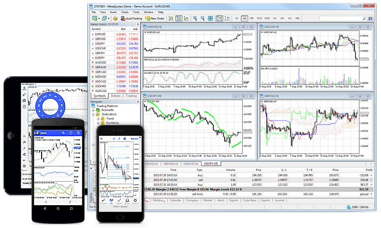
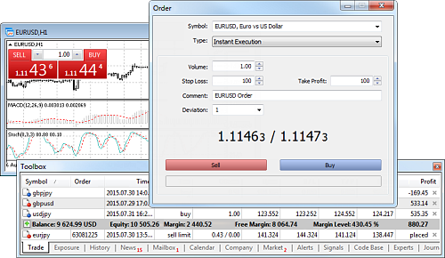
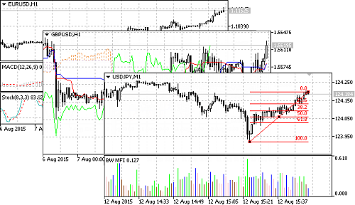
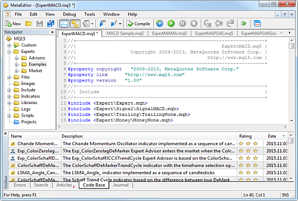
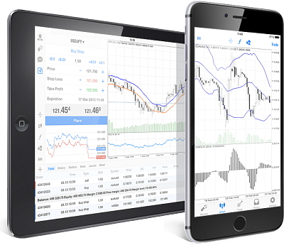
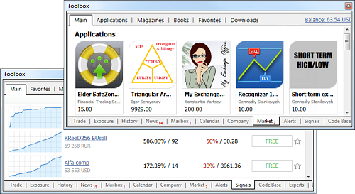

[🏠 Document Start](README.md) / Trading Platform

[Next](Getting-Started.md)

# Trading Platform — User Manual

The Trading Platform is the trader's working tool, providing all the necessary features for a successful online trading. It includes [trading](Trading-Operations/README.md), technical [analysis of prices](Price-Charts-Technical-and-Fundamental-Analysis/README.md) and [fundamental analysis](Price-Charts-Technical-and-Fundamental-Analysis/Fundamental-Analysis.md), [automated trading](Algorithmic-Trading-Trading-Robots/README.md) and trading from [mobile devices](Mobile-Trading/README.md). In addition to Forex symbols, options futures and stocks can be traded from the platform.

### All Types of Orders, Price Charts, Technical and Fundamental Analysis, Algorithmic and Mobile Trading

Trading The platform provides a wide set of trading tools. It supports four [order execution modes (#execution-type)](Trading-Operations/Basic-Principles.md#execution-type): Instant, Request, Market and Exchange execution. All types of orders are available in the platform, including [market, pending and stop-orders (#order-type)](Trading-Operations/Basic-Principles.md#order-type). With such a diversity of order types and available execution modes, traders can implement various trading strategies for successful performance in the currency markets and stock exchanges. The platform also features One-Click Trading and provides functions for trading straight from the chart. [Find out more >>](Trading-Operations/README.md) |   
---|---  
a | Analytics The trading platform provides powerful analytical functions. 82 different analytical tools are available for analyzing currency and stock prices, including [technical indicators](Price-Charts-Technical-and-Fundamental-Analysis/Technical-Indicators.md) and [graphical objects](Price-Charts-Technical-and-Fundamental-Analysis/Analytical-Objects.md). The analytical resources of the trading platform are not limited to the built-in indicators only. The trader can additionally use [the free Code Base of technical indicators (#codebase)](Algorithmic-Trading-Trading-Robots/Where-to-Find-Trading-Robots-and-Indicators.md#codebase) and [the Market of trading applications](Market-App-Store/README.md). There are [21 timeframes (#operations)](Price-Charts-Technical-and-Fundamental-Analysis/View-and-Configure-Charts.md#operations), from a minute to a month one, available for each financial instrument. Up to 100 charts of financial instruments can be open at the same time. [Find out more >>](Price-Charts-Technical-and-Fundamental-Analysis/README.md)  
Algorithmic Trading Virtually any trading strategy can be formalized and implemented in the form of an Expert Advisor, which can automatically trade for you. A trading robot never gets tired or suffers from stress; it accurately follows its algorithm and is much more responsive to market changes. The trading platform provides all the necessary tools for Expert Advisor development: the powerful [MQL5 language (#mql5)](Algorithmic-Trading-Trading-Robots/How-to-Create-an-Expert-Advisor-or-an-Indicator.md#mql5) with an integrated development environment, [a multicurrency tester](Algorithmic-Trading-Trading-Robots/Strategy-Testing.md) for testing and optimizing strategies, and [the Code Base of free trading robots (#codebase)](Algorithmic-Trading-Trading-Robots/Where-to-Find-Trading-Robots-and-Indicators.md#codebase). To assist beginners, we have released two comprehensive books on MQL5 programming, designed for anyone who wish to master the creation of trading robots and applications for algorithmic trading. "[MQL5 Programming for Traders](https://www.mql5.com/en/book "MQL5 Programming Book")" is the most complete and detailed tutorial on MQL5, suitable for programmers of all levels. "[Neural Networks for Algorithmic Trading with MQL5](https://www.mql5.com/en/neurobook "Book on Neural Networks with MQL5, OpenCL and Python")" not only teaches MQL5 but also provides instruction on programming in Python and OpenCL, along with integrated matrix and vector methods that enable the solution of complex mathematical problems. [Find out more >>](Algorithmic-Trading-Trading-Robots/README.md) |   
 | Mobile Trading Smartphones and tablets are indispensable in trading when you are away from your computer. Use special trading platform versions on your [iPhone/iPad and Android devices](Mobile-Trading/README.md) to trade in the financial markets on the go. You will certainly appreciate the functionality of the mobile trading platforms that include the full support for the trading functions, broad analytical capabilities with technical indicators and other graphical objects. Of course, all these features are available from anywhere in the world 24 hours a day. Use the mobile platform to read financial news and internal emails, as well as for instant messaging with the participants of the most popular website for traders MQL5.community. [Find out more >>](Mobile-Trading/README.md)  
Additional Services The platform provides powerful trading tools and a variety of additional services. Social trading is available through the [Signals](Trading-Signals-and-Copy-Trading/README.md) service. This is an easy way to copy deals of experienced traders. Choose from thousands of signal, subscribe in a couple of clicks and the selected provider's deals will be automatically copied to your account. [Market](Market-App-Store/README.md) is a store where you can purchase or download for free cutting-edge trading robots and technical indicators. An application can be purchased straight from the platform. The purchase procedure is simple and secure. If you cannot find the desired app, order one from professional developers in [Freelance](https://www.mql5.com/en/job "The Freelance service for ordering trading robots and indicators"). The service provides secure cooperation between the customer and the developer — a payment for an application is transferred only after the approval of the resulting program. To ensure 24/7 operation of your trading robots and copied signals, rent a [Virtual Hosting](Virtual-Hosting-for-247-Operation/README.md) straight from your platform. [Find out more >>](MQL5-Algotrading-community/README.md) |   
  
© 2000-2025, [MetaQuotes Ltd](https://www.metaquotes.net/ru)
