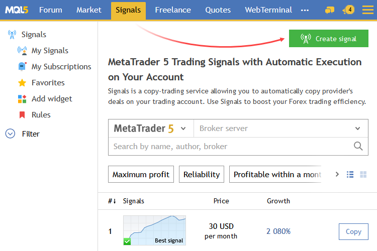
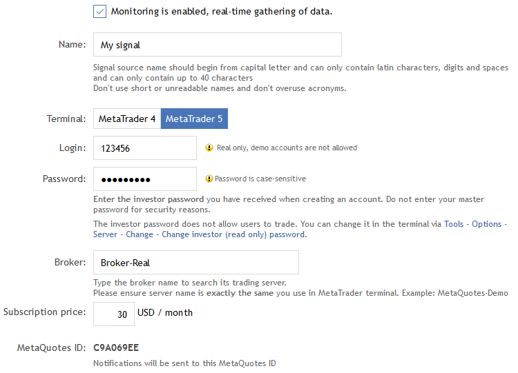
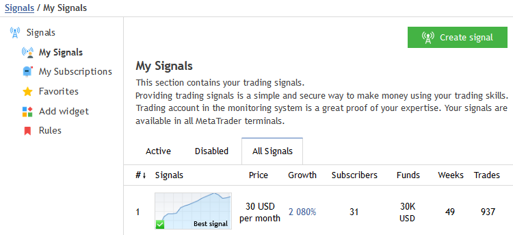
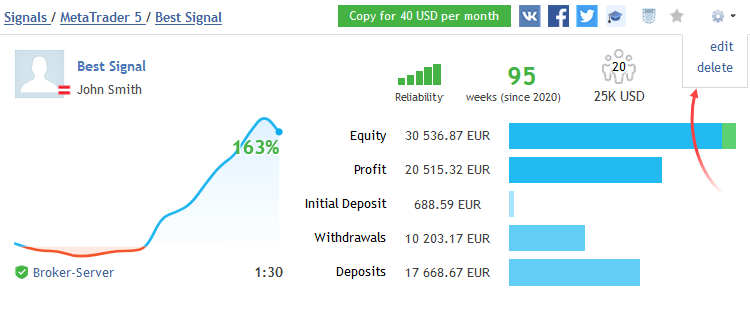

[🏠 Document Start](../README.md) / [Trading Signals and Copy Trading](README.md) / How to Become a Signal Provider

[Previous](How-to-Subscribe-to-a-Signal.md) | [Next](../Market-App-Store/README.md)

# How to Become a Signal Provider (#how-to-become-a-signal-provider)

Signal Provider is a trader who grants access to the data on his or her trading operations allowing other traders to copy them on their own trading accounts. To become a Signal Provider, you need an active MQL5.community account. If you do not have an account yet, please [register](https://www.mql5.com/en/auth_register "Register on MQL5.community").

> Make sure to read the [rules before using the Signals service](https://www.mql5.com/en/signals/rules "Rules of Using the Signals Service").

## Registration as a Seller (#seller)

To be able to register your trading account as a provider of paid signals, you should register as a seller. Move to the "Seller" section of your profile at [MQL5.community](https://www.mql5.com/en/signals "Signals section on MQL5.community").

Prior to registration, you should confirm your consent to the processing of your personal data and agree to Service Rules. During the registration process, you will need to provide your personal data as well as to attach photographs of your ID documents. Every registration step is provided with detailed instructions. Please read them carefully and strictly follow the requirements.

Information about the approval or refusal of your registration will appear on the same page in due course.

## Adding a Signal (#add)

Once you register as a [Signal Provider](https://www.mql5.com/en/signals "Signals section on MQL5.community"), button "Register" is replaced with "Add signal".

After clicking it, you will move to the account registration form where you should specify the account that will be used for sending trading signals.

To quickly create a signal, select a required account in the [Navigator](../Getting-Started/User-Interface.md) window of the platform and click " Register as a signal" in its context menu. Then you will go the signal registration page at MQL5.community. The selected account and the right broker server will be automatically specified in the registration form.  
---  
  

Monitoring is enabled, real-time gathering of data — trading data will not be updated in the system until you enable this option.

The name of the trading signal.

Select the fifth platform version in this field.

Account number from which trading signals will be generated.

Specify your investor password here. This password provides access to the account in read-only mode without the possibility to perform trading operations. Master password is not specified and thus the Provider's account remains protected.

Specify the name of the broker's server in this field. After you start typing the first characters, the field will show a hint with matching names. Please ensure that the server name exactly matches the server name specified [platform settings (#server)](../Getting-Started/Platform-Settings.md#server).

The price is specified as a monthly fee in USD.

You can receive notifications on MQL5.community website updates (new personal messages, correspondence with the moderator in the seller's profile or Articles section, etc.) on your phone. Notifications coming to your mobile number can be replaced with more advanced and reliable [push notifications (#notifications)](../Getting-Started/Platform-Settings.md#notifications).

Click "Add" after specifying all the parameters.

  * An account with a leverage exceeding 1:500 will not be available for [subscription](How-to-Subscribe-to-a-Signal.md). This limitation is implemented to protect subscribers from signals produced on accounts with too risky trading process.
  * A provider does not need to stay always connected in the trading platform with the account used for providing signals. Trade operations are read by the signal server using the investor password provided during the registration and then delivered to subscribers.

  * Specify your unique MetaQuotes ID (that can be found in the mobile trading platforms for [iPhone](https://download.mql5.com/cdn/mobile/mt5/ios?hl=ru&utm_campaign=metaquotes.download&utm_source=www.metatrader5.com "iPhone") and [Android](https://download.mql5.com/cdn/mobile/mt5/android?hl=ru&utm_campaign=metaquotes.download&utm_source=www.metatrader5.com "Android")) and receive instant and free notifications on all important MQL5.community events.

  
---  
  

## Managing Signals (#manage)

Move to "[My Signals](https://www.mql5.com/en/signals/my)" section to manage your signals. Basic information about your signal is displayed here. Signals can also be viewed by categories by clicking the appropriate tabs:

The name of the trading signal.

Percentage increase in funds on the signal provider's account.

The number of users currently subscribed to the signal.

The amount of subscribers' funds managed by the signal. The value reflects only the funds on real accounts within the used risks.

The number of weeks since the first trade performed on the trading account (this parameter considers the entire account lifetime rather than the period since its registration as a signal).

The number of deals from which profit or loss was fixed.

Signals that can be viewed by other users. The category does not contain demo signals, because they are not displayed on the Signals showcase on MQL5.community.

Signals in which monitoring is disabled.

To proceed to signal editing, open its page and click the gear button in the upper right corner.

This will open the signal data form which you filled at signal [creation (#add)](How-to-Become-a-Signal-Provider.md#add). Only some of the parameters can be edited:

  * Enable/disable the signal.
  * Change the name if the signal does not have subscribers.
  * Change account password.
  * Change the subscription price.

