[🏠 Document Start](../README.md) / [Trading Signals and Copy Trading](README.md) / How to Choose a Signal

[Previous](README.md) | [Next](How-to-Subscribe-to-a-Signal.md)

# How to Choose a Signal (#how-to-choose-a-signal)

Every signal is provided with a detailed performance report: growth, balance and equity charts, multiple statistical values, full trading history and more.

[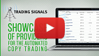](https://www.metatrader5.com/video/1/ntu6pZRopq4/video.mp4 "Watch video: Trading signals showcase") | Watch video: Trading signals showcase How to choose a trading signal and subscribe to it in a couple of clicks It is easy! Watch the video to find out everything about trading signals.  
---|---  
  
To open the showcase, go to the "Navigator \ Signals" section. It features signal widgets with basic information:

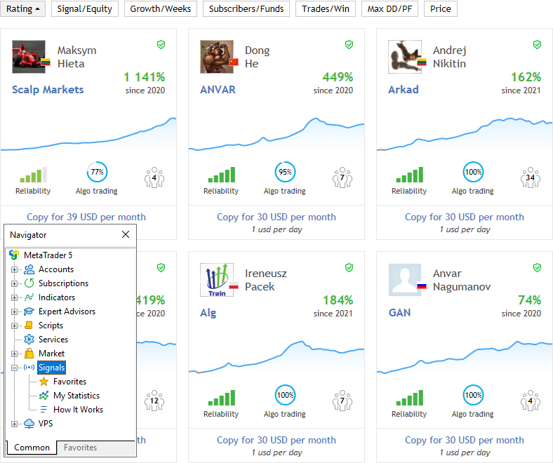

### Growth chart (#growth-chart)

This chart enables the visual evaluation of the signal performance.

### Rating (#rating)

Sort signals by rating which is calculated based on a set of performance metrics, such as growth, drwadown, lifetime and others.

### Signal/Equity (#signalequity)

Switch between signal sorting by name and by account equity.

### Growth/Weeks (#growthweeks)

Switch between signal sorting by growth rate and by the number of weeks since the first trade on the account.

### Subscribers/Funds (#subscribersfunds)

Switch between signal sorting by the number of subscribers and by the amount of subscribers' funds managed by this signal (only the funds on real accounts within the set risks).

### Trades/Profitable (#tradesprofitable)

Switch between signal sorting by the number of trades on the account and by the percentage of winning deals. A small number of trades cannot characterize trading, while the obtained profit can be random.

### Max DD/PF (#max-ddpf)

Switch between signal sorting by the maximum drawdown and by the profit factor.

### Price (#price)

Sort signals by subscription cost.

### Growth (#growth)

Deposit growth in percentage value calculated based on trading operation results, excluding withdrawals and top-up operations. Growth is one of the main characteristics, based on which you can evaluate the signal performance.

### Weeks (#weeks)

Account lifetime which starts on the first performed trade (this refers to the entire account lifetime rather than the period since its registration as a signal). The older the signal, the more trading information is available. Be careful subscribing to too young signals.

### Reliability (#reliability)

Reliability evaluates in % the risks of this signal relative to others. The higher the variable, the more reliable the signal.

### Algo trading (#algo-trading)

The share of deals performed by trading robots or scripts.

### Subscribers (#subscribers)

The current number of signal subscribers.

### Price (#price)

Monthly subscription fee in USD.

By default, all signals are sorted by rating, that is by a complex metric based on profits, drawdowns, risks and many other criteria. Use the upper panel to search signals by a specific metric, such as the number of subscribers or price. The first click sorts the showcase by the first parameter and the second click switches to the second parameter.

For convenience, the signals showcase adapts depending on your account type:

  * Only the first one thousand of signals sorted by rating are featured on the platform showcase. Other signals can be found via [MQL5.community](https://www.mql5.com/en/signals "Signals on MQL5.community") or by using [search (#search)](../Getting-Started/User-Interface.md#search).
  * Signals that are incompatible with the current account are also hidden from the showcase.

[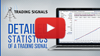](https://www.metatrader5.com/video/1/2Dk7UdpnWZg/video.mp4 "Watch video: Detailed statistics of a trading signal") | Watch video: Detailed statistics of a trading signal For your convenience, the most valuable parameters of trading signals are placed in a separate block. From this video you will find out where to find them and what to pay attention to.  
---|---  
  
Click on a signal to view its details.

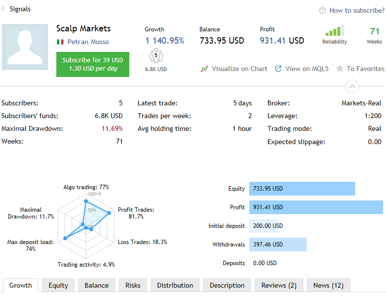

### General information about the signal (#general-information-about-the-signal)

  * Signal name.
  * Signal author's avatar and country.
  * Signal author's name. Click on the name to view the author's profile at MQL5.community. From the profile, you can also write a message to the author.
  * Monthly subscription fee in USD.

### Main signal characteristics (#main-signal-characteristics)

  * Growth — deposit growth in percentage value calculated on the basis of the account trading history, excluding deposits and withdrawals.
  * Balance — funds on the account, not including the floating profit of currently open orders.
  * Profit — profit/loss gained during the account lifetime.
  * Reliability — evaluates in % the risks of this signal compared to others. The higher the value, the more reliable the signal.
  * Weeks — the number of weeks since the first trade performed on the trading account (this parameter considers the entire account lifetime rather than the period since its registration as a signal).
  * Subscribers — the current number of signal subscribers.

### Visualize on chart (#visualize-on-chart)

[View the signal trading history (#show-on-chart)](How-to-Choose-a-Signal.md#show-on-chart) on charts in the trading platform. This command opens charts of the symbols that have ever been traded on the signal account. All performed deals will be displayed with the relevant icons.

### View on MQL5 (#view-on-mql5)

Go to the signal page at MQL5.community.

### To Favorites (#to-favorites)

If you like a signal, add it to [favorites (#favorites)](How-to-Subscribe-to-a-Signal.md#favorites) to get back to it later.

### Extended signal statistics (#extended-signal-statistics)

  * Subscribers — the current number of signal subscribers.
  * Subscribers' funds — the total amount of subscribers' funds managed by this signal. The value only reflects funds on real accounts, within the used risks.
  * Maximal Drawdown — the largest balance or equity drop from the local maximum, as a percentage. The parameter shows either balance or equity drawdown, depending on which value is higher (worse).
  * Weeks — the number of weeks since the first trade performed on the trading account (this parameter considers the entire account lifetime rather than the period since its registration as a signal).

### Trading data (#trading-data)

  * Latest trade — time since the last trading operation on the signal provider's account.
  * Trades per week — the average number of trades per week.
  * Avg holding time — average position holding time.

### Provider account details (#provider-account-details)

  * Broker — the name of the broker's server on which the account is registered.
  * Leverage — account leverage amount.
  * Trading mode — account trading mode: demo or real. Please note that a provider can afford much greater risks on a demo account than they would on a real one.
  * Expected slippage — slippage calculated based on trade copying statistics between the subscriber's and the provider's servers. The parameter is only available in the trading platform.

The radar chart provides a quick assessment of the main signal parameters:

  * Algo trading — the share of deals performed using trading robots or scripts.
  * Maximal Drawdown — the largest balance or equity drop from the local maximum, as a percentage. The parameter shows either balance or equity drawdown, depending on which value is higher (worse).
  * Max deposit load — the share of funds on the provider's account used for opening positions. The value is calculated as Margin/Equity*100. It characterizes risks in trading. The larger the traded volume, the higher the potential profit but also the larger the potential loss.
  * Profit trades — the number of profitable trades and their share in the total number of trades, as a percentage.
  * Loss trades — the number of losing trades and their share in the total number of trades, as a percentage.
  * Trading activity shows the time when the account had open positions, as a percentage of the total monitoring monitoring time. Low activity indicates low-frequency trading or low position holding time (scalping).

### Provider account details (#provider-account-details)

  * Equity — funds on the account including the results of currently open positions (floating profit/loss). The current account balance and the floating profit of open positions are additionally shown on hover.
  * Profit — amount of profit/loss gained during the account lifetime. The number of trades on the account is shown on hover.
  * Initial deposit — funds deposited at account opening.
  * Withdrawals — funds withdrawn from the account for its entire lifetime. The number of withdrawal operations is additionally shown on hover.

### Signal graphical data (#signal-graphical-data)

The tabs present signal performance [charts and diagrams (#graphs)](How-to-Choose-a-Signal.md#graphs): growth charts, equity and balance graphs, distribution of deals by symbols, risk data and reviews from signal subscribers.

## How to View the Signal Trading History on a Chart (#show-on-chart)

To visually evaluate the effectiveness of how the provider enters and exits the market, you can display all of the trades on charts in the trading platform.

[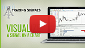](https://www.metatrader5.com/video/1/c4E1YpjKwKo/video.mp4 "Watch video: Visualize a signal on a chart") | Watch video: Visualize a signal on a chart The effectiveness of entry points and the unrealized profit can be easily assessed with the visualized chart of provider's deals.  
---|---  
  
Select. All the charts of symbols traded on the signal account are opened. The icons  and  on these charts show all trades performed on the signal account.

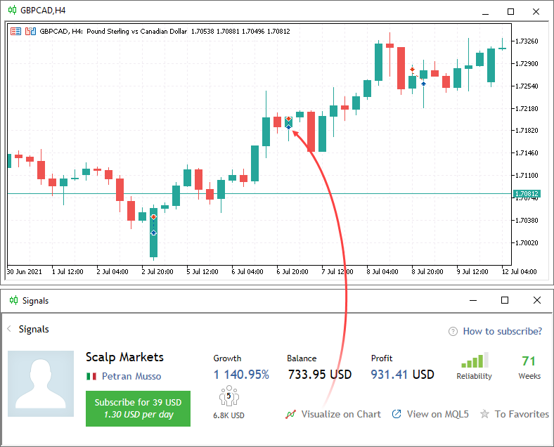

## Growth, Equity and Balance Graphs (#graphs)

[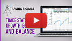](https://www.metatrader5.com/video/1/cjcaKKLf6aY/video.mp4 "Watch video: Trade statistics, growth, equity & balance graphs") | Watch video: Trade statistics, growth, equity & balance graphs Trade statistics provide detailed information about a signal, to help you make a wise decision. Growth, equity & balance graphs allow you to visually evaluate a successful provider.  
---|---  
  
These charts mainly show the profitability of the signal.

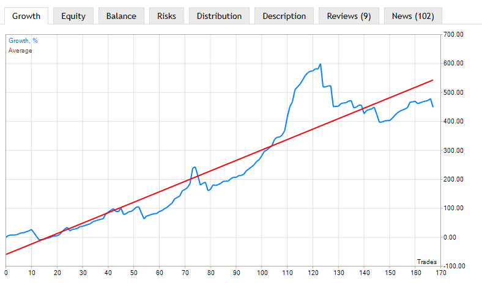

  * Growth — shows the growth of balance on the signal provider's account in percentage terms.
  * Equity — the chart shows both the equity curve and the balance curve. You should pay attention to the strong fall of equity relative to the balance. This indicates that the provider outstays the losses, which means an additional risk for the subscribers. Triangles  and  on the horizontal axes of the graph mark balance operations on the account — withdrawal and deposit. If you point the mouse cursor over it, the operation amount is displayed.
  * Balance — shows the growth of balance on the signal provider's account in money terms.

## Evaluating the Riskiness of the Signal (#evaluating-the-riskiness-of-the-signal)

[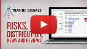](https://www.metatrader5.com/video/1/KqDhr1kumRM/video.mp4 "Watch video: Risks, distribution, news and reviews of trading signals") | Watch video: Risks, distribution, news and reviews of trading signals How risky does your provider trade and what do other subscribers think of that? Watch this video to find the answers to these questions.  
---|---  
  
All risk evaluation metrics are available under the Risks section.

The first two graphs are the following:

  * Drawdown by equity — the largest equity drop from the local maximum, as a percentage. The larger the drawdown, the more risks the provider allows.
  * Deposit load — the share of funds on the provider's account used for opening positions. The value is calculated as Margin/Equity*100. It characterizes risks in trading. The larger the traded volume, the higher the potential profit, but also the larger the potential loss.

These two charts only reflect data for the monitoring period; they are not calculated for the entire account history.

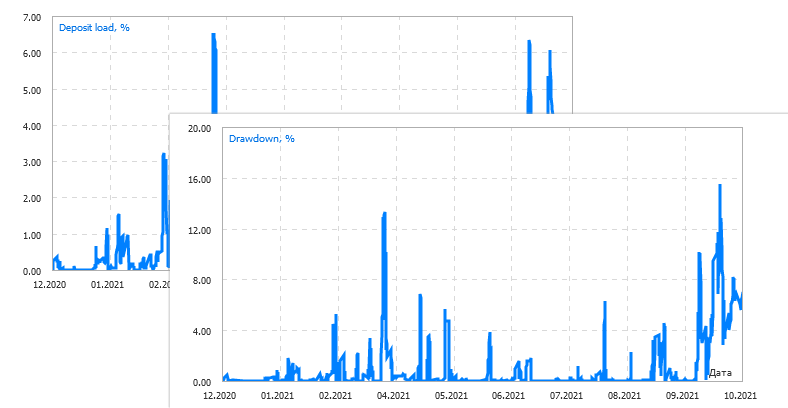

The following statistical rates are displayed below the graphs:

  * Best trade — trade having the highest profit among all profitable ones;
  * Worst trade— trade having the worst loss among all loss-making ones;
  * Max. consecutive wins — the amount of trades in the longest profitable sequence and its total profit;
  * Max. consecutive losses — the amount of trades in the longest losing sequence and its total loss;
  * Max. consecutive profit — the largest profit in a continuous profitable sequence and the amount of appropriate profitable trades;
  * Max. consecutive loss — the largest loss in a continuous losing sequence and the amount of the appropriate losing trades.

Below are MFE and MAE distribution point graphs.

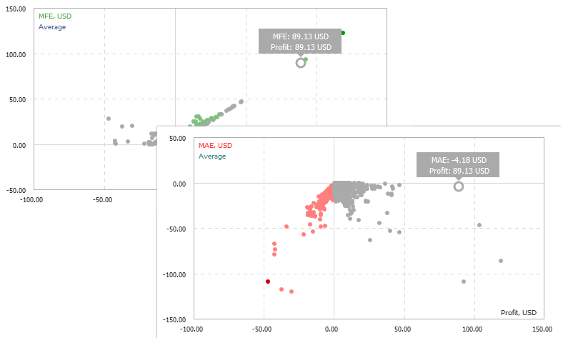

Maximum profit (MFE) and maximum loss (MAE) values are recorded for each open order during its lifetime. These parameters additionally characterize each closed order using the values of the maximum unrealized potential and maximum permitted risk. MFE/Profit and MAE/Profit distribution graphs display each order as a point with received profit/loss value plotted along the X-axis, while maximum displayed values of potential profit (MFE) and potential loss (MAE) are plotted along the Y-axis.

If you place cursor over a position point on a graph, the same position point will be highlighted on the other graph. Thus you can analyze both potential profit and loss of every position.

The following statistical rates are displayed below the graphs:

  * Best trade — trade having the highest profit among all profitable ones;
  * Worst trade— trade having the worst loss among all loss-making ones;
  * Max. consecutive wins — the amount of trades in the longest profitable sequence and its total profit;
  * Max. consecutive losses — the amount of trades in the longest losing sequence and its total loss;
  * Max. consecutive profit — the largest profit in a continuous profitable sequence and the amount of appropriate profitable trades;
  * Max. consecutive loss — the largest loss in a continuous losing sequence and the amount of the appropriate losing trades.

If you place cursor over a rate, the corresponding trades will be highlighted on the graphs.

When you hover over the statistics above, the relevant trades are highlighted on the MFE and MAE graphs.

  * Deposit load, drawdown, MAE and MFE graphs are only available on [MQL5.community](https://www.mql5.com/en/signals "MQL5.community"). The trading platform only contains risk statistics.
  * Find out more about MAE and MFE distributions in the article [Mathematics in Trading. How to Estimate Trade Results](https://www.mql5.com/en/articles/1492 "Article: Mathematics in Trading. How to Estimate Trade Results").

  
---  
  

## Financial Instruments and Trading Direction in a Signal (#financial-instruments-and-trading-direction-in-a-signal)

The "Distribution" tab shows the number of trade operations displayed by symbols. It also contains the distribution of trades based on direction (Buy and Sell):

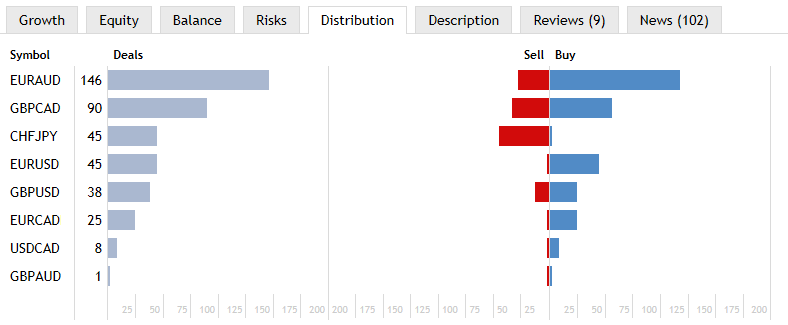

## Slippage during copy trading (#slippage-during-copy-trading)

The Slippage tab displays average slippage when executing trade operations on the servers of various brokers.

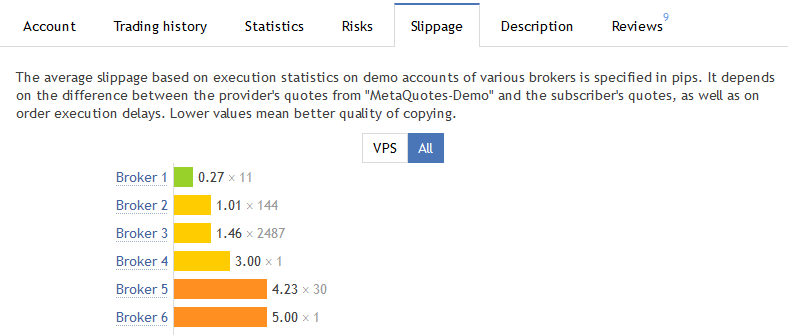

The average slippage is calculated based on statistics of trading signals execution at different brokers. Statistics is gathered for all signals at the provider's server. The difference between the order price placed by the signal provider and the order execution price at the subscriber's server is defined. The average value is calculated based on these data.

Number of slippage points is displayed according to the price accuracy (number of decimal places) at the signal provider's side.

Slippage can be caused by differences in quotes on the servers or trade execution delays. The lower the slippage, the higher the accuracy of the signal copying.

A separate tab provides statistics on the slippage for subscribers who copy signals on a [VPS](../Virtual-Hosting-for-247-Operation/README.md). By choosing a VPS located close to the broker's servers, subscribers can significantly reduce slippage. You can evaluate connection improvement by checking out real statistics.

> The access statistics is only available on [MQL5.community](https://www.mql5.com/en/signals "MQL5.community"). Click "View on MQL5" to open the signal page.

## User Reviews about the Signal (#user-reviews-about-the-signal)

On the "Reviews" tabs, MQL5.community members can express their opinion on the signal. Before you subscribe to a signal, check out the comments of other subscribers.

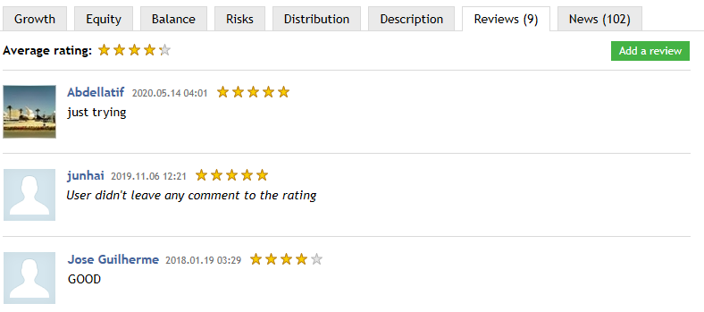

You can also leave your feedback after subscribing to the signal. Assist other community members in making the right choice. Select "Add a review" to go to the signal page at MQL5.community, where you can add your review.

## Signal News (#signal-news)

Using tab "News", the signal provider can inform subscribers about any changes in the signal operations as well as provide any other useful information. If no news is published, this tab is not displayed.

## Trading and Statistics (#trading-and-statistics)

Detailed account trading statistics, as well as currently open positions and the history of trades are displayed below the chart.

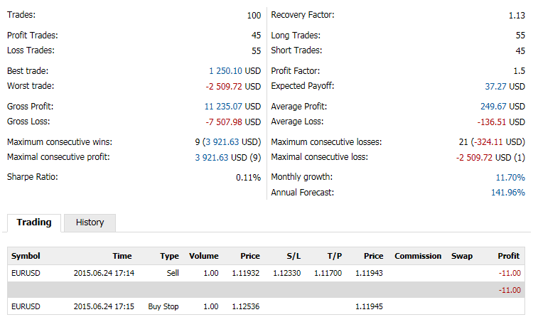

### Trade Statistics (#trade-statistics)

  * Total Trades — the total number of trades (deals that lock profit or loss).
  * Profit Trades — the number of profitable trades and their share in the total number of trades in percentage value.
  * Loss Trades — the number of losing trades and their share in the total number of trades in percentage value.
  * Best trade — trade with the highest profit among all profitable trades.
  * Worst trade — trade with the largest loss among all loss-making trades.
  * Gross Profit — the sum of all profitable trades in monetary units.
  * Gross Loss — the sum of all loss-making trades in monetary units.
  * Max consecutive wins — the number of trades in the longest profitable sequence and its total profit.
  * Max consecutive profit — the largest profit in a continuous profitable sequence and the amount of appropriate profitable trades.
  * Sharpe Ratio — this parameter shows strategy efficiency and reliability. The value reflects the ratio of the arithmetical mean profit for the position holding time to the standard deviation from it. The risk-free rate, which is the profit gained from the appropriate bank deposit funds is also taken into account here.

### Trade Statistics (#trade-statistics)

  * Recovery Factor — this parameter displays the risk level of the strategy (the funds that are put to risk to earn the obtained profit). It is calculated as the ratio of gained profit to the maximum drawdown.
  * Long Trades — the number of trades fixing profit from long deals and the number of profitable long trades in percentage value.
  * Short Trades — the number of trades fixing profit from short deals and the number of profitable short trades in percentage value.
  * Average Profit — the average profit from all profitable trades.
  * Average Loss — the average loss from all loss-making trades.
  * Profit Factor — ratio between gross profit and gross loss. One means that these parameters are equal.
  * Expected Payoff is a statistically calculated parameter displaying average profitability/unprofitableness of one trade. Also, it is considered to display the expected return of the next trade.
  * Max consecutive losses — the number of trades in the longest losing sequence and its total loss.
  * Max consecutive loss — the largest loss in a continuous losing sequence and the amount of the appropriate losing trades.
  * Monthly growth — the average deposit growth for a month in percentage values. The value is calculated as the total growth divided by the number of months traded.
  * Annual Forecast — deposit growth forecast for a year according to the monitoring period results.

### Open Positions (#open-positions)

  * Symbol — the financial instrument of the open position.
  * Time — position opening time. The record is represented as YYYY.MM.DD HH:MM (year.month.day hour:minute).
  * Type — position type: "Buy" — long, "Sell" — short.
  * Volume — trade operation volume (in lots). The minimum volume and its change step are limited by a brokerage company, the maximum amount — by the deposit size.
  * Price — the price of a deal, as a result of which the position was opened. If the opened position is a result of execution of several deals, then this field displays their weighted average price: (price of deal 1 * volume of deal 1 + ... + price of deal N * volume of deal N) / (volume of deal 1 + ... + volume of deal N). The accuracy of rounding of the weighted average price is equal to the number of decimal places in the symbol price plus three additional characters.
  * S/L — [the Stop Loss level (#stop-loss)](../Trading-Operations/Basic-Principles.md#stop-loss) of the current position. If this order has not been placed, a zero value is displayed in this field.
  * T/P — [the Take Profit level (#take-profit)](../Trading-Operations/Basic-Principles.md#take-profit) of the current position. If this order has not been placed, a zero value is displayed in this field.
  * Price — the current price of the financial symbol. Bid price is displayed for short positions, while Ask price is used for long ones. The price of the last performed deal (Last) is displayed for the positions of exchange symbols (both directions).
  * Swap — amount of swaps charged.
  * Profit — the financial result of the trade taking into account the current price is written in this field. The positive result tells that the trade is profitable, negative shows that it's losing. 

### Pending Orders (#pending-orders)

  * Symbol — the financial instrument of the pending order.
  * Time — pending order placing time. The record is represented as YYYY.MM.DD HH:MM (year.month.day hour:minute).
  * Type — [pending order type (#pending-order)](../Trading-Operations/Basic-Principles.md#pending-order): "Sell Stop", "Sell Limit", "Buy Stop", "Buy Limit", "Buy Stop Limit" or "Sell Stop Limit".
  * Volume — volume requested in the pending order, and volume covered by the deal (in lots).
  * Price — price reaching which the pending order will trigger.
  * S/L — the level of the [Stop Loss (#stop-loss)](../Trading-Operations/Basic-Principles.md#stop-loss) order. If this order has not been placed, a zero value is displayed in this field.
  * T/P — the level of the [Take Profit (#take-profit)](../Trading-Operations/Basic-Principles.md#take-profit) order. If this order has not been placed, a zero value is displayed in this field.
  * Price — the current price of the financial symbol. Bid price is displayed for short orders, while Ask price is used for long ones. The price of the last performed deal (Last) is displayed for the orders involving exchange symbols (both directions).

### The history of trades on the signal (#the-history-of-trades-on-the-signal)

  * Time — the time of a trade. The record is represented as YYYY.MM.DD HH:MM (year.month.day hour:minute).
  * Symbol — a financial instrument of the deal.
  * Type — trading operation type: "Buy" — a buy deal, "Sell" — a sell deal. It is possible that previously performed deal can be canceled. In this case, the type of the previously performed deal is changed to Canceled buy or Canceled sell, and its profit/loss is reset to zero. Previously gained profit/loss is deposited/withdrawn from an account in a separate balance operation.
  * Direction — direction of the deal relative to the current position of a particular symbol: "in", "out" or "in/out".
  * Volume — the volume of an executed deal (in lots).
  * Price — price the deal was executed at.
  * Swap — amount of swaps charged.
  * Profit — the financial result of the position exiting. For entry trades the zero profit is shown. 

## How to Add a Signal to Favorites (#favorites)

A huge number of signals are available for subscription. When searching for signals, you can add any of them to Favorites in order to select the best one. To add a signal to or to remove it from Favorites, selecton the signal page.

All favorite signals are displayed under a separate section:

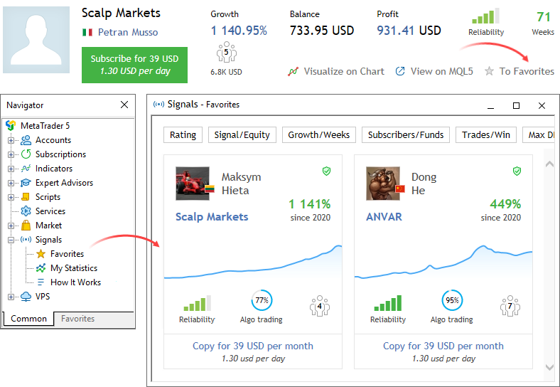
