[🏠 Document Start](../README.md) / [Trading Signals and Copy Trading](README.md) / How to Subscribe to a Signal

[Previous](How-to-Choose-a-Signal.md) | [Next](How-to-Become-a-Signal-Provider.md)

# How to Subscribe to a Signal (#select-subscribe)

To copy the [provider's](How-to-Become-a-Signal-Provider.md) trading operations to your account, you should subscribe to a signal. A monthly fee may be charged for the subscription.

A valid MQL5.community account is required for a signal subscription. Specify the account details in the platform settings under the [Community (#community)](../Getting-Started/Platform-Settings.md#community) tab. If you do not have an account, please [register](https://www.mql5.com/en/auth_register "Sign up for MQL5.community").

Before using the service, be sure to read the [Rules](https://www.mql5.com/en/signals/rules "Rules of Using the Signals Service"). Also note that your trading account must always be on and connected to the server using the account which is subscribed to the signals. In order not to keep your computer on all the time, you can [rent a VPS](../Virtual-Hosting-for-247-Operation/README.md) to copy signals. Furthermore, a VPS can provide a better copying quality by reducing network latency.

## How to Subscribe to a Signal (#select-subscribe)

[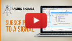](https://www.metatrader5.com/video/1/r99S48RiKeA/video.mp4 "Watch video: Subscribe to a trading signal") | Watch video: Subscribe to a trading signal From the video, you will learn how to subscribe to a signal and what parameters to specify. Find out, whether you need to copy the stop levels, what part of your deposit will take part in copying and what slippage to choose.  
---|---  
  
You can subscribe to a selected signal directly from the list or from the signal details page.

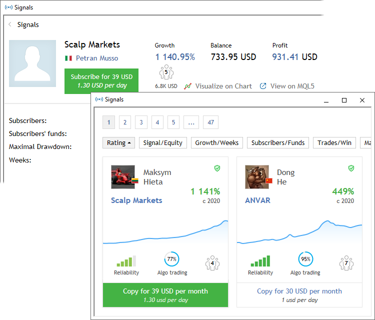

The details of the signal you are about to subscribe to are displayed in a separate window. Please carefully check them.

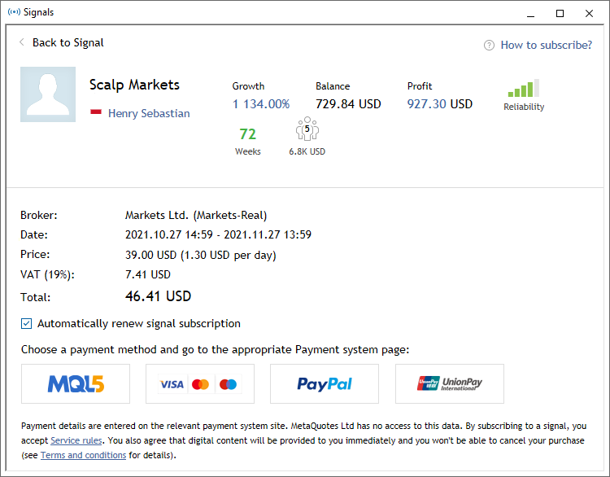

Basic signal information is displayed here:

  * Signal — signal name.
  * Author — signal provider's name. A click on the name opens the provider's MQL5.community profile.
  * Growth — deposit growth on the provider's account from the moment of signal registration. The value is specified as a percentage of the initial value.
  * Balance — funds on the account not including the floating profit of current open positions.
  * Profit — amount of profit/loss gained during the account lifetime.
  * Reliability — evaluates in % the risks of this signal relative to others. The higher the variable, the more reliable the signal.
  * Weeks — number of weeks that have passed since the first trade on the trading account was performed.
  * Subscribers — the current number of signal subscriptions and the amount of subscribers' funds managed by the account (only the funds on real accounts within the set risks).
  * Broker — the name of the broker server used by the provider.
  * Date — subscription start and end date.

### Mismatched Trading Conditions (#trade-conditions2)

Before subscribing to a signal the system checks trading conditions on the subscriber's and provider's accounts:

  * The minimal and maximal allowed volume for symbols — in case these settings do not match, there can be serious difference in volume between the provider's trading operations and the operations copied to the subscriber's account.
  * Availability of symbols on the subscriber's account — if any of the symbols used by the provider is not available for the user, signals for this symbol will not be copied. Operations on other symbols can be copied successfully.

If a mismatch is detected, the corresponding warning is displayed in the subscription window. It is recommended to use signals with matching trading conditions.

### Auto Renewal (#renewal)

You can set the automatic subscription renewal by enabling the corresponding option.

With this option, you can be sure that your signal will not stop suddenly and that the positions opened by the signal will not be left unmanaged. You do not have to monitor the subscription period, while the system will automatically renew it.

Auto renewal is performed using the same payment method which was used for the first subscription purchase. If you paid for the subscription with your card, the system will use this card. If payment cannot be made using the same card, the payment will be made from your MQL5 account.

The system protects you from unnecessary expenses. If the price increases relative to the original price, auto-renewal will be canceled. You will receive the relevant notification by email.

Attempts to auto-renew your subscription start early, in case something goes wrong. The day before the expiration date, the system will attempt to charge the corresponding payment. If the renewal fails, you will receive a notification by email. The new subscription period will start after the expiration of the current period, not when the renewal is actually charged.

You can enable or disable the auto renewal option at any moment via the [My Subscriptions](https://www.mql5.com/en/signals/subscriptions) section at MQL5.com:

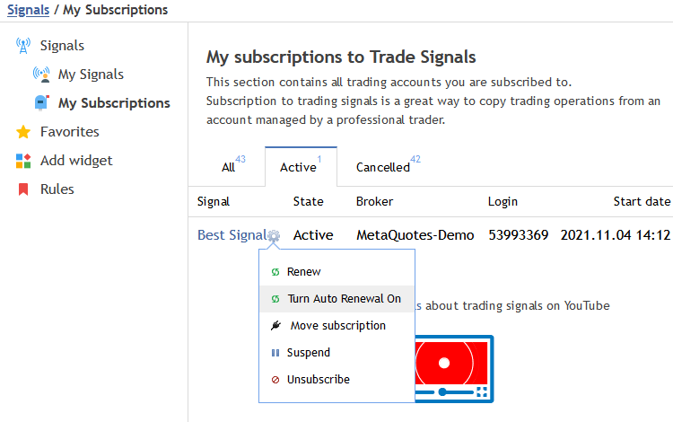

### Payment (#payment)

Read the [Signals service terms of use](https://www.mql5.com/en/signals/rules "Rules of Using the Signals Service"). By subscribing to a signal you confirm that you agree with the terms.

To pay for the subscription from your MQL5.community account balance, select the MQL5 option. If you do not have enough money on your account, you do not necessarily need to go to the site and top it up. Payment can be made directly through one of the payment systems. Select any of the available options and follow the system instructions to complete the payment. To maintain a clear and unified history of subscriptions, the required amount is first transferred to your MQL5.community account, from which an appropriate payment is made.

After you complete the payment, the page will show details and useful information:

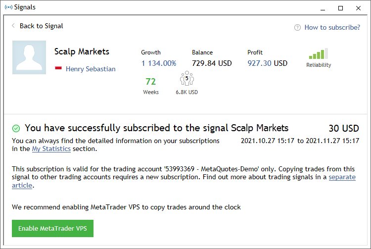

A window with [copying settings (#settings)](How-to-Subscribe-to-a-Signal.md#settings) will also open.

Your trading account must always be on and connected to the server using the account which is subscribed to the signals. In order not to keep your computer on all the time, you can [rent a VPS](../Virtual-Hosting-for-247-Operation/README.md) to copy signals. Furthermore, a VPS can provide a better copying quality by reducing network latency.

## How to Configure the Trading Platform to Use Signals (#settings)

To configure the use of signals in the trading platform, open the settings window and move to the [Signals (#signals)](../Getting-Started/Platform-Settings.md#signals) tab.

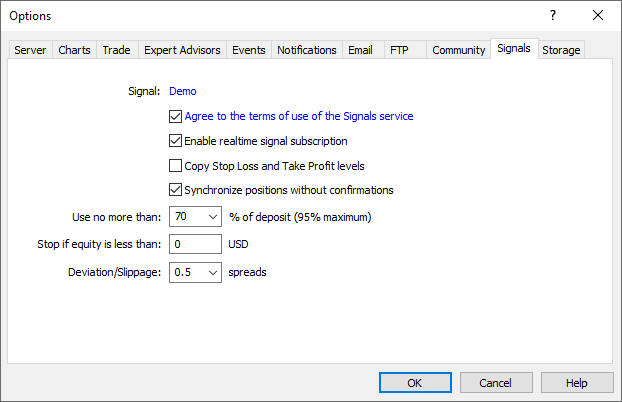

Configure the following parameters:

  * Agree to the terms of use of the Signals service — to start using the Signals service, agree to its [rules of use](https://www.mql5.com/en/signals/rules "Rules of Using the Signals Service"). Read the rules carefully. If you agree, check the box next to the option. If you do not agree with the rules, do not use the Signals service.
  * Enable realtime signal subscription — trading operations will be copied to your account only after this option is enabled. No operations will be copied to the account in case the option is disabled. The settings below will become editable only after enabling this option.
  * Copy Stop Loss and Take Profit levels — [Stop Loss (#stop-loss)](../Trading-Operations/Basic-Principles.md#stop-loss) and [Take Profit (#take-profit)](../Trading-Operations/Basic-Principles.md#take-profit) placed at the provider's account will be also placed on your trading account if this option is enabled. These orders are executed at the broker's side. It means that they are executed regardless of whether the platform is running or not. Also, different brokers can provide different execution conditions (if subscriber and provider have different brokers).  
Therefore, copying of stop orders guarantees that a position will be closed upon reaching the specified profit and loss levels.
  * Synchronize positions without confirmations — automatic synchronization without additional confirmation. When subscribing to a signal, trading states of the Subscriber's and Provider's accounts are [synchronized (#sync)](How-to-Subscribe-to-a-Signal.md#sync). This can be a primary synchronization when activating the subscription or [a re-synchronization (#resync)](How-to-Subscribe-to-a-Signal.md#resync) during copying.  
If pending orders or non-signal positions (opened manually or by an Expert Advisor) are detected at the Subscriber's account during synchronization, the dialog offering to close the positions and remove the orders is displayed. If during the [initial synchronization (#sync)](How-to-Subscribe-to-a-Signal.md#sync), a provider account has floating (unfixed) profit, a user will see a dialog window offering to wait for better conditions to start copying. In both cases, synchronization is not performed and copying of signals is stopped until the user makes the decision by clicking the appropriate dialog button.  
If the platform is working around the clock without constant external control (for example, runs on VPS), confirmation requests to perform synchronization are left unanswered and thus can prevent signals from being copied. When this option is enabled, synchronization is always performed automatically without the need for Subscriber's confirmation.

  * If there are custom positions/orders, they are left on the account, while the system starts/proceeds copying the Provider's trades.
  * If the Provider has a floating profit, the platform does not wait for better entry conditions and starts copying immediately.
  * Use no more than [A] % — percentage value of your deposit that can be used for following provider's signals. For example, if your balance is 10,000 USD and 90% is specified here, then 9,000 USD will be used for following the signals. This affects the calculation of volumes of the deals performed when following the signals. The volume is calculated proportionally. See ["Signal Subscribers"  (#trade)](How-to-Subscribe-to-a-Signal.md#trade) section for more information. It is strongly not recommended to change the deposit load if you already have positions opened according to a signal. This will lead to correction of volume of the open positions (volume increase or partial close at the current market price).
  * Stop if equity is less than [B] — this parameter allows you to limit losses when using trading signals. If equity drops below a specified level, copying of trade signals is automatically terminated, all positions are closed. 0 means no limitations.
  * Deviation/Slippage [C] spreads — this setting is similar to deviation set when [orders are placed (#deviation)](../Trading-Operations/Executing-Trades.md#deviation) from the platform. This is the value of the permissible deviation of the executed order price from the price initially requested by the platform when copying a trading operation. This value is displayed as a part of the current spread on the symbol used in trading operation.  
The order is executed if the deviation is less or equal to the specified parameter. If the deviation exceeds the specified value, the platform increases the acceptable deviation by 0.5. If the requote is received again, the accounts of the subscriber and provider become unsynchronized. Later the platform will retry to synchronize them.

Once all the parameters are set and subscription is allowed, your trading account starts synchronization with the Provider's one.

## Initial synchronization of Provider's and Subscriber's accounts (#sync)

Synchronization is necessary to copy trades from a provider's account to a subscriber's one. The initial synchronization is the one performed when a subscriber's account has no signal-based open positions, for example, when activating a subscription.

A number of requirements should be met to carry out synchronization:

  * Subscriber should not have open positions and active pending orders;
  * total floating profit of all Provider's positions should be negative. This allows a Subscriber to enter the market at a price that is not worse than the Provider's one.

If at least one of these conditions is not met, the appropriate warning is displayed during synchronization attempt. Synchronization is not continued till the user makes the decision.

> Enable [Synchronize positions without confirmations (#settings)](How-to-Subscribe-to-a-Signal.md#settings) option in the platform settings in order not to receive warnings and synchronize automatically.

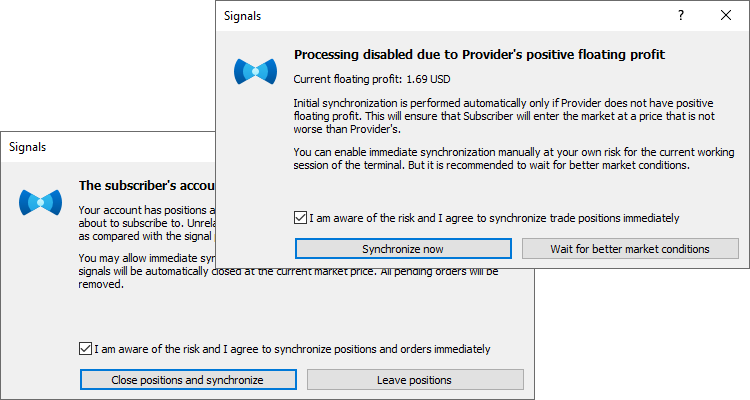

Carefully read the recommendations described in the dialog windows.

  * If you want to automatically close all the open positions by the current market price and delete the pending orders, check "I am aware of the risk and I agree to synchronize positions and orders immediately". Then click the "Close positions and synchronize now" button. If you do not want the program to close the positions and delete the pending orders, click "I will check manually" or close the window.
  * If you want to synchronize your account with the provider despite the positive floating profit, check "I am aware of the risk and I agree to synchronize trade positions immediately". If you want to postpone the synchronization and wait until the floating profit of the provider becomes negative, click "Wait for better market conditions". Until the floating profit of the provider becomes negative the platform will not synchronize the accounts and will not start copying trade operations.

> It is strongly recommended NOT to perform trades manually or via MQL5 programs while being subscribed to a signal. Unrelated trades increase the overall load on the trading account as compared with the signal provider.

## Synchronization during copying (#resync)

After successful synchronization of positions, the platform can perform a re-synchronization. It is performed in case of network issues during copying to make sure that no trades from the Provider are missed.

If it turns out that some Provider's trades are absent on the Subscriber's account, the system copies them. Unlike the initial synchronization, the total floating profit of the Provider is not checked here. If the Subscriber started copying, they should follow the Provider's trading strategy to the maximum possible extent. It is impossible to copy some positions, while ignoring others.

In addition to the network issues, the reason for the absence of certain positions on the Subscriber's account may be activation of stop levels or closing positions manually:

  * If the "Copy Stop Loss and Take Profit levels" option is enabled, the Subscriber copies Provider's operations together with stop levels. Different brokers may have different price flows, therefore stop levels on the Subscriber's account may be triggered earlier than on the Provider's one. If during re-synchronization, it turns out that a certain position on the Subscriber's account is already closed, while it is still open on the Provider's one, the service copies it again. To reduce the likelihood of such situations, it is recommended to use the account on the same server (broker) as the Provider's one for copying.
  * If the Subscriber closes a copied position manually, it is opened again during re-synchronization. We strongly advise you against interfering with copying.

  * Re-synchronization is performed in regular situations as well: after re-starting the terminal, re-connecting to the trading account, [depositing funds to the account (#balance)](How-to-Subscribe-to-a-Signal.md#balance), etc.
  * If the system detects positions not based on signals on the Subscriber's account, it offers to close them or skips such positions depending on the ["Synchronize positions without confirmations" (#settings)](How-to-Subscribe-to-a-Signal.md#settings) setting.

  
---  
  

## Copying Trading Operations and Volume Calculation (#trade)

After Subscriber's and Provider's accounts are successfully synchronized, copying of trading operations will start. This is done automatically.

[Pending orders (#pending-order)](../Trading-Operations/Basic-Principles.md#pending-order) placed on Provider's account are not copied to Subscriber's account. Trade operations are copied when pending orders trigger: when a Buy Limit or Buy Stop order triggers, a buy signal is copied; when a Sell Limit or Sell Stop order triggers, a sell signal is copied.

  * Manual trading operations (as well as using Expert Advisors) are not recommended after Subscriber's account starts copying Provider's trading operations. Unrelated trades increase the overall load on the trading account as compared with the signal provider.
  * It is strongly not recommended to change the deposit load if you already have positions opened according to a signal. This will lead to correction of volume of the open positions (volume increase or partial close at the current market price).

  
---  
  
The volume of trading operations performed on the Subscriber's account is based on the Subscriber's and Provider's available funds. The calculation is performed in several stages.

The volume is multiplied by the ratio of Subscriber's and Provider's balances considering deposit currency and allowable deposit load specified in the [platform settings (#load)](How-to-Subscribe-to-a-Signal.md#load).

Assume that the Subscriber's balance comprises 8,000 EUR, the allowable load is - 50% and the Provider's balance is 10,000 USD. The current EURUSD rate is 1.20000. If the Provider performs a deal with the volume of 1 lot, the same deal is performed on the Subscriber's account with the volume of 0.48 lots. Subscriber's balance comprises 4,000 EUR or 4,800 USD considering allowable load. Therefore, the volume ration will comprise 4,800 / 10,000 = 0.48.

After the balances have been considered, Subscriber's and Provider's leverages are also taken into account. If Subscriber's leverage exceeds the one of the Signal Provider, it does not affect a volume of a copied deal. Otherwise, the deal volume is changed in direct ratio to the correlation of a Signal Provider's leverage with a Subscriber's one.

For example, if a Signal Provider having a leverage of 1:100 opens a deal of 1 lot, a Subscriber having a leverage of 1:500 will open a deal of 1 lot in case of 100% copying and a deposit matching by size and currency. A subscriber having a leverage of 1:10 will open a deal of 0.1 lots in similar conditions.

Volume calculations are displayed in the ["Journal"](../Getting-Started/For-Advanced-Users/Platform-Logs.md) tab of the platform. The sample entry is shown below:

percentage for volume conversion selected according to the ratio of balances and leverages, new value 24%  
Signal signal provider has balance 10 000.00 USD, leverage 1:200; subscriber has balance 8 000.00 USD, leverage 1:100  
Signal money management: use 50% of deposit, equity limit: 0.00 EUR, deviation/slippage: 0.5 spreads  
---  
  

### Balance Operations on the Subscriber's Account during Copying (#balance)

The total amount of subscriber's funds is changed after a balance/credit operation is performed. If the percentage value of signals copying has decreased by more 1% afterwards (the volume of copied trades is calculated considering the ratio of the subscriber's and provider's balance), the subscriber's account is forcedly synchronized with the provider's one. This is done to correct the subscriber's current positions according to the new copying percentage value.

If the subscriber's funds have increased due to the balance or credit operation, no forced synchronization is performed.

### Requoting (#requote)

The platform may receive a requote when copying a trade operation of a provider (the server returns new prices as a response to a trade request at the specified price).

If the deviation of the new price exceeds the ["Deviation/Slippage [C] spread"](How-to-Subscribe-to-a-Signal.md#deviation) value specified in the settings, the platform increases the acceptable deviation by 0.5 of the spread and makes another attempt to perform the trade operation. If the requote is received again, the accounts of the subscriber and provider become unsynchronized. Later the platform will retry to synchronize them.

## Subscriptions Displayed in the Platform (#display)

For convenience, trading accounts subscribed to a signal are marked with a special icon in the [Navigator](../Getting-Started/User-Interface.md) window:

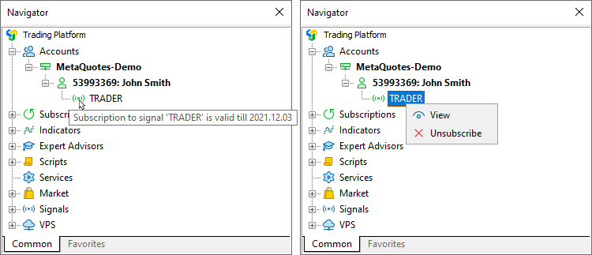

When you point the mouse cursor over the name, the subscription's expiration date is displayed. The context menu contains commands for viewing the signal and unsubscribing from it. The latter one is displayed only if the appropriate trading account is currently active in the platform.

If the current trade account is subscribed to a signal, the corresponding icon is also displayed in the account state bar on the [Trade (#position-open)](../Trading-Operations/Executing-Trades.md#position-open) tab:

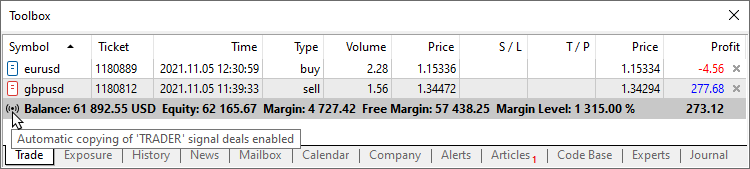

## Signal Copying Report (#stats)

Statistics on signal copying is displayed in "My Statistics" tab. It contains data on all signals the current trading account has ever been subscribed to.

[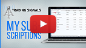](https://www.metatrader5.com/video/1/G8VwybmYzqA/video.mp4 "Watch video: The report on the copied trades") | Watch video: The report on the copied trades Detailed information on complete and active subscriptions will help you to estimate the effectiveness of every single provider. These reports will show you the profit gained from money spent for subscription.  
---|---  
  
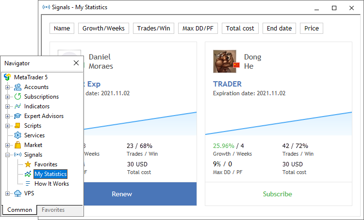

All values in the list are only based on the trades copied to the trading account in accordance with the signal:

  * Growth graph.
  * Signal — signal name.
  * Growth — deposit growth in percentage value calculated on the basis of trade history without considering deposits and withdrawals;
  * Weeks — number of weeks, during which the signal was copied;
  * Max DD — maximum balance drop from the local maximum in percentage value;
  * PF — profit factor, ratio between gross profit and gross loss. One means that these parameters are equal.
  * End date — signal subscription end date.

The list can be sorted by any of the above parameters. The first mouse click on the column name sorts the signals by the first parameter, while the second click — by the second parameter. To reset the sorting, click the upper line of the growth graph column.

## Subscription renewal and cancellation (#unsubscribe)

If a subscription expiration time approaches and you want to continue using it, you should renew it.

To manage subscription in the trading platform, open any signal page. "You already subscribed to [signal name]" message is displayed in the upper panel. The signal name is a link — use it to open the signal page.

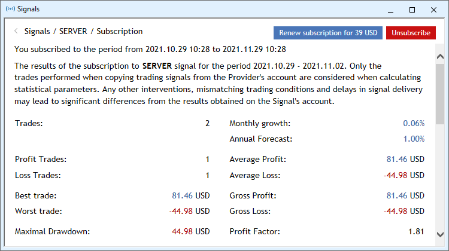

To renew the subscription, click "Renew subscription". This will open the [payment (#payment)](How-to-Subscribe-to-a-Signal.md#payment) page. For free signals, the renewal takes effect immediately.

A subscription can be renewed for no more than 3 months.

If you no longer want to use the subscription, click "Unsubscribe". If your account has open positions which were opened when copying a signal, they will not be closed after subscription cancellation. You should manage all such positions by yourself.

  * When you cancel a subscription, the payment amount locked for it on [your MQL5.community account](https://www.mql5.com/en/articles/302 "MQL5.community Payment System") is irrevocably transferred to the signal provider. If you have problems receiving signals, please do not cancel the subscription. You should contact the [Service Desk](https://www.mql5.com/en/contact "Service Desk")through your MQL5.community profile.
  * If you want to suspend copying trades, do not unsubscribe from the signal. Instead, suspend the subscription by disabling the option "Enable realtime signal subscription" in the [platform settings (#signals)](../Getting-Started/Platform-Settings.md#signals). Later you can resume the subscription by enabling this option.

  
---  
  
You can also manage subscriptions using the [My subscriptions](https://www.mql5.com/en/signals/subscriptions) section at MQL5.com. Open the signal page and click on the gear icon:

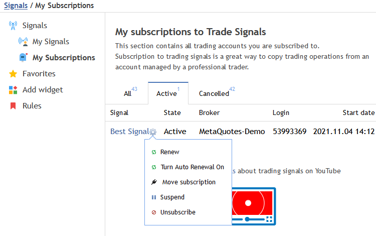

## Subscription transfer (#move)

If you have copying issues on your current account, you can transfer the subscription to a different account, including the one opened with another broker. Open [My Subscriptions](https://www.mql5.com/en/signals/subscriptions) at MQL5.com, click the gear icon and select "Move subscription".

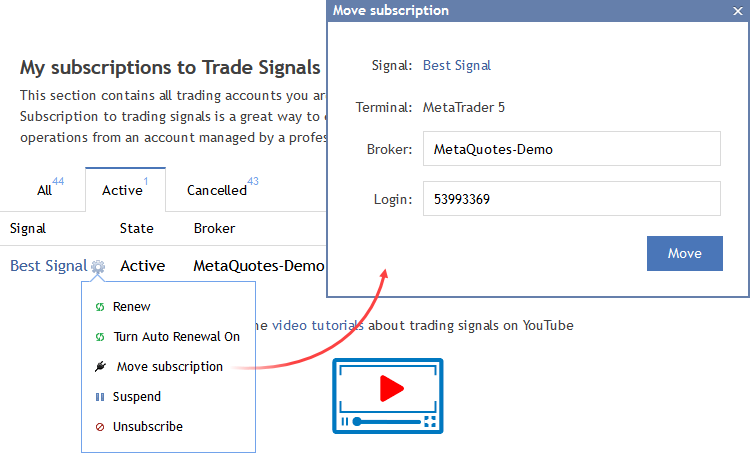

Indicate the account number and the name of the server on which the account is open.

Please note that only one subscription transfer option is available per week.
