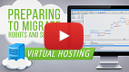
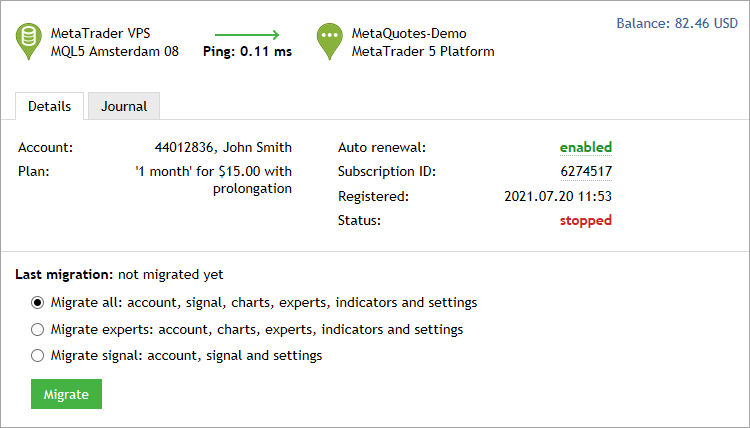
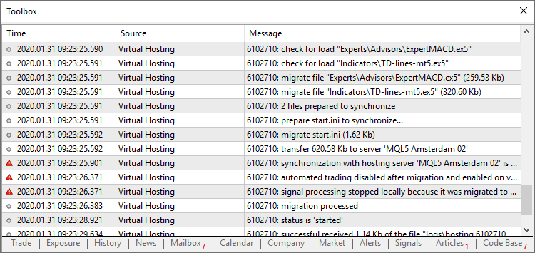
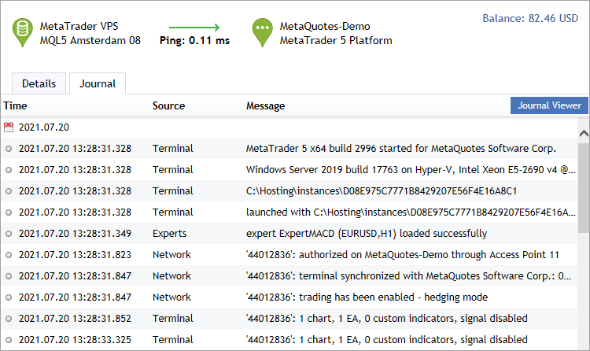
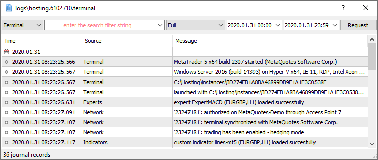

[🏠 Document Start](../README.md) / [Virtual Hosting for 24/7 Operation](../Virtual-Hosting-for-247-Operation/README.md) / Migration

[Previous](Register-a-Server.md) | [Next](Working-with-the-Virtual-Platform.md)

# Migration (#process)

Migration is transferring the current active environment from the trading platform to the virtual one. This is a simple and straightforward way to change the set of launched programs, open charts and subscription parameters in the virtual platform.

## Preparing for Migration (#preparing-for-migration)

Before you launch a virtual platform, prepare an active environment for it — charts, running indicators and Expert Advisors, Signal copying parameters and platform settings.

 | Watch video: Preparing migration of robots and signals How to setup a trading environment, in order to execute your trading robots and signals on a virtual platform for 24 hours a day?  
---|---  
  

### Charts and Market Watch (#charts-and-market-watch)

In the [Market Watch](../Trading-Operations/Market-Watch.md) window, set up the list of symbols critical for your Expert Advisors' operation. We recommend that you remove all unnecessary symbols to decrease the tick traffic received by the platform. There is no point in keeping hundreds of symbols in the Market Watch if only a couple of them are used for trading.

Open only the charts that you really need. Although there are no limitations on the number of open charts, there is no point in opening unnecessary ones. Color settings do not matter.

Set "Max bars in chart" parameter in [Charts (#charts)](../Getting-Started/Platform-Settings.md#charts) tab of the platform settings. Some custom indicators are developed in a wasteful way and perform calculations on all history available on the chart. In that case, the lesser the specified value, the better. However, make sure that the indicator works correctly with these settings by restarting the platform after changing the parameter.

The virtual platform is designed so that it automatically downloads all available history from a trade server, but not more than 500 000 bars are available on a chart.

### Indicators and Expert Advisors (#indicators-and-expert-advisors)

Apply to the charts all indicators and Expert Advisors that are necessary for the autonomous operation of the platform. Most trading robots do not access data of indicators on the charts, so check out and decide what you really need.

Products purchased from the [Market](../Market-App-Store/README.md) and launched on the chart are also moved during migration. They remain completely functional, and the number of available activations is not decreased. Automatic licensing of purchased products without spending available activations is provided only for the virtual platform.

  * DLL calls are completely forbidden in the virtual platform.
  * During platform synchronization with the virtual server, charts without Expert Advisors are ignored, even if custom indicators are running on these charts. If you need to migrate a custom indicator, run it on the chart of an "empty" Expert Advisor that does not perform operations. Such an Expert Advisor can be easily generated using the MQL5 Wizard in [MetaEditor (#metaeditor)](../Algorithmic-Trading-Trading-Robots/How-to-Create-an-Expert-Advisor-or-an-Indicator.md#metaeditor) by selecting "Expert Advisor: template". This is to ensure that indicators are migrated on purpose.

  
---  
  
All external parameters of indicators and Expert Advisors should be set correctly. Check them once again before you start synchronization.

Scripts cannot be moved during migration even if they are running in an endless loop on the chart at the time of synchronization.

### Configuring Email, FTP and Signals (#configuring-email-ftp-and-signals)

If an Expert Advisor is to send emails, upload data via [FTP (#ftp)](../Getting-Started/Platform-Settings.md#ftp) or [copy Signal trades (#signals)](../Getting-Started/Platform-Settings.md#signals), make sure to specify all the necessary settings. Specify the login and password of your MQL5.community account on the [Community (#community)](../Getting-Started/Platform-Settings.md#community) tab. This is required for Signal copying.

### Permission to Trade and Copy Signals (#permission-to-trade-and-copy-signals)

The automated trading is always allowed in the virtual platform. Therefore, any Expert Advisor with trading functions running during synchronization can trade on the virtual platform after the migration. Do not launch the Expert Advisors you are not sure about.

When you transfer Expert Advisors, the automated trading function is automatically disabled in the local platform. This is done to prevent the situation when two platforms connected with the same account trade through the same Expert Advisor.

> Regardless of whether auto trading is allowed or forbidden in your platform or in the properties of a running Expert Advisor, any trading robot is allowed to trade after being moved to a virtual platform.

Set the desired trade copying parameters on the [Signals (#signals)](../Getting-Started/Platform-Settings.md#signals) tab. If a trading account has an active subscription and trade copying is allowed, permission to copy signals is disabled in the trading platform during migration. This is done to prevent the situation when two platforms connected to the same account copy the same trades simultaneously. It is not necessary to turn on signal copying on the local platform when migrating to a virtual platform where the signal is already running.

The ["Synchronize positions without confirmations" (#signals)](../Getting-Started/Platform-Settings.md#signals) setting is always enabled in the virtual platform. The virtual platform has no user interface, the operations are copied only automatically, and it is impossible to confirm them manually.

Trade copying is automatically enabled on the virtual platform once the migration is complete. Message about copy cancellation on the local platform is also repeated in the journal.

### Setting WebRequest (#setting-webrequest)

If a program that is to operate on the virtual platform uses the [WebRequest](https://www.mql5.com/en/docs/network/webrequest "WebRequest function") function for sending HTTP requests, set permission and list all trusted URLs on the [Expert Advisors (#ea)](../Getting-Started/Platform-Settings.md#ea) tab.

## Migration (#process)

Migration is performed every time you synchronize the trading platform. Synchronization is always a one-direction process — the local platform environment is moved to the virtual platform, but never vice versa. The virtual platform status can be monitored via requesting the platform and Expert Advisor logs, as well as virtual server monitoring data.

To perform synchronization, navigate to VPS and select the migration type. There are several types of migration that should be used depending on the objective:

  * All — a complete migration is necessary if you want to simultaneously launch [Expert Advisors/indicators](../Market-App-Store/README.md) and [trade copying](../Trading-Signals-and-Copy-Trading/README.md). In this mode, account connection data, as well as all open charts, signal copying parameters, running Expert Advisors and indicators, FTP and email settings are copied to the virtual server.
  * Experts — only Expert Advisors and indicators are transferred, if subscription to Signals is not required. Unlike the complete migration, signal subscription parameters are not transferred in this mode.
  * Signal — only Signal copying settings (no charts or programs) are transferred. In this mode, account connection data, signal copying parameters, FTP and email settings are transferred to the virtual server.

Thus, you can anytime change the number of charts and the list of symbols in the Data Window, the set of running programs and their input parameters, platform settings and Signal subscription.

> All available history data of open charts is automatically uploaded during the first synchronization. Uploading history from a trade server can take some time, and all programs running on the charts should process the updated data correctly during the synchronization.

During migration, all the information is recorded in the platform log.

After the synchronization, open the main journal of the virtual platform to examine the actions performed on it. To do this, navigate to VPS \ Journal:

To view further details, click "Journal Viewer". In the newly opened log window, specify the desired search text to filter the journal entries, and the desired time frame. After that, click Request to download the found logs.

The virtual platform logs are updated during each request and saved to [platform data folder]\logs\hosting.*.terminal\\.

## Migration Features (#migration-features)

The migration process has a number of features:

  * Automated trading is always allowed in the virtual platform even if it is disabled in the local platform settings or in the running Expert Advisor's parameters.
  * Scripts are not transferred during migration even if they have been launched in an endless loop on the chart at the time of synchronization.
  * Charts with non-standard timeframes and symbols are not transferred.
  * Accounts with [one-time password](../Getting-Started/For-Advanced-Users/One-Time-Passwords-2FATOTP.md) authentication cannot be used on a VPS. Virtual hosting is designed for a completely autonomous platform operation, which would not be possible if manual one-time password specification were required for each connection to the account.

