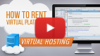
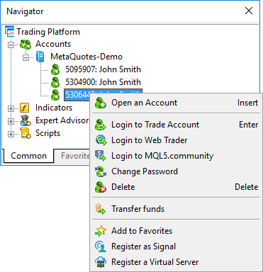
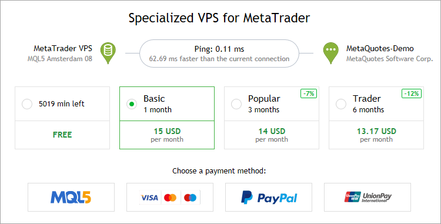
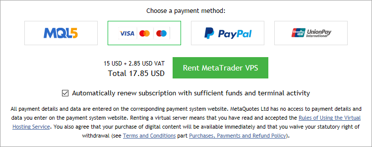
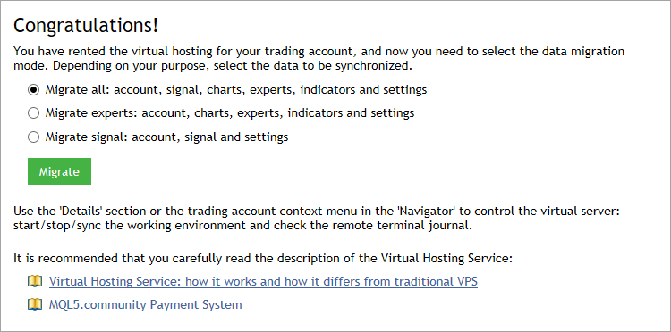

[🏠 Document Start](../README.md) / [Virtual Hosting for 24/7 Operation](../Virtual-Hosting-for-247-Operation/README.md) / Register a Server

[Previous](../Virtual-Hosting-for-247-Operation/README.md) | [Next](Migration.md)

# Register a Server (#register-a-server)

To receive a virtual platform, connect using the appropriate trading account, open the context window of the [Navigator](../Getting-Started/User-Interface.md) and execute " Register a Virtual Server" command.

 | Watch video: How to rent a virtual platform A detailed how-to description that will help you to rent a virtual hosting directly from a trading platform. It is easy: choose the nearest server and payment plan to let your robots and signals run 24 hours a day.  
---|---  
  

This will open the VPS section, and the system will automatically select the server that is closest to your broker. The network connection improvements will be shown in the left part of the window: the system will provide the comparison of network delays between your terminal on the hosting server and the broker server, and between your local and the broker server. Lower network latency provides better condition for the execution of trading operations, such as reduced slippage and probability of getting re-quotes.

In order to rent a virtual platform, you need to have a valid MQL5.community account. If your MQL5 account is not specified in the [trading platform settings (#community)](../Getting-Started/Platform-Settings.md#community), you will be prompted you to add one.

## Hosting Plans (#tariff)

Select a suitable hosting plan: longer rental periods are more cost-efficient.

The following plans can also be available:

  * Free — free hosting rental for unused time. This option appears if you [cancel (#cancel)](Working-with-the-Virtual-Platform.md#cancel) a previously rented VPS. In this case, unused hosting time is credited to your MQL5 account. This time can be used to rent a new VPS.
  * Sponsored — free hosting; the rental is paid by your broker. The availability of this option depends on your broker. Please contact your broker to find out how you can rent a VPS for free.

You can change the selected service plan only after the rental period expires.

## Auto Renewal (#renewal)

If you want the rental period to be renewed with the same payment plan after subscription expiration, enable the option "Automatically renew subscription with sufficient funds and terminal activity".

With this option, you can be sure that your Expert Advisors and signal subscriptions will not stop due to the end of the VPS period. You do not have to monitor the subscription period, while the system will automatically renew it.

If the VPS subscription expires, your hosting data will be completely deleted from the server. You can manually rent it again, but in this case you will have to configure the entire environment anew. The auto renewal option helps avoid this issue.

Auto renewal is performed using the same payment method which was used for the first subscription purchase. If you paid for the subscription with your card, the system will use this card. If payment with the same card cannot be made, the fee will be charged from your MQL5 account.

To protect you from unnecessary payments for inactive hosting subscriptions, the system checks the hosting state during auto renewal. If hosting was [stopped (#stop)](Working-with-the-Virtual-Platform.md#stop), the subscription will not be renewed.

Attempts to auto-renew your hosting start early, in case something goes wrong. The day before the expiration date, the system will attempt to charge the corresponding payment. If the renewal fails, you will receive a notification to the email specified in your MQL5 account. The new rental period will start after the expiration of the current period, not when the renewal is actually charged.

  * You can [enable or disable (#renewal)](Working-with-the-Virtual-Platform.md#renewal) the auto renewal option at any moment.
  * A VPS subscription can only be renewed automatically — manual mode is not supported.

  
---  
  

## Payment (#payment)

At the last step, select a payment system.

To pay for the hosting subscription from your MQL5.community account balance, select the MQL5 option. If you do not have enough money on your account, you do not necessarily need to go to the site and add money to your account. A payment for the hosting subscription can be transferred directly through one of the payment systems. Select any of the available options and follow the system instructions to complete the payment. To maintain a clear and unified history of rented virtual servers, the required amount is first transferred to your MQL5.community account, from which an appropriate payment is made.

After paying for the VPS subscription, you can migrate the platform environment to the virtual server immediately. Select the desired [migration type (#process)](Migration.md#process) and click "Migrate". If the platform is not ready for migration, you can perform it later.

> By renting the Virtual Hosting service, you agree to [the service rules](https://www.mql5.com/en/hosting/rules "Rules of Using the Virtual Hosting Service"). Read them carefully.
