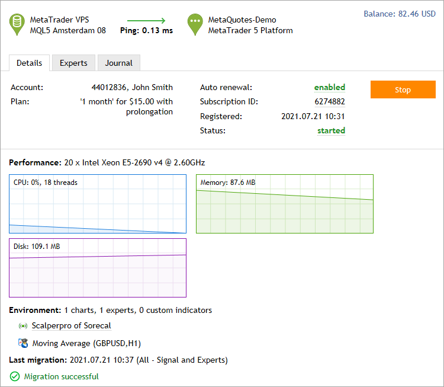
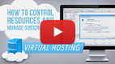
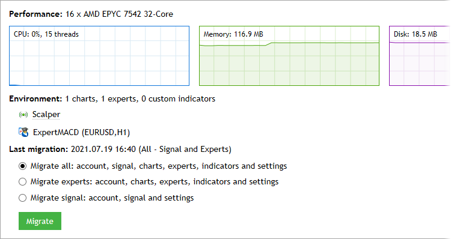
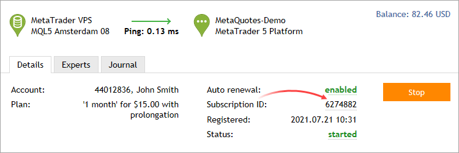
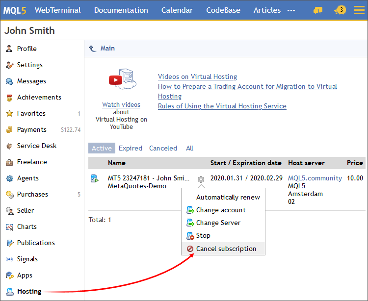
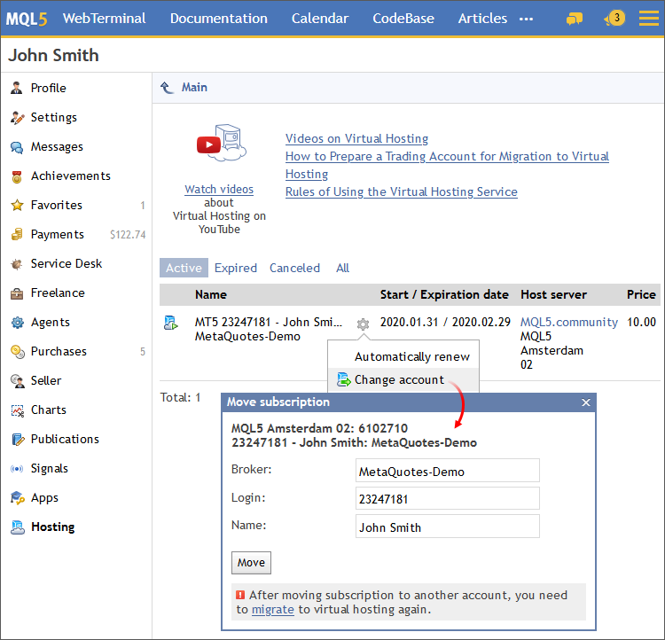
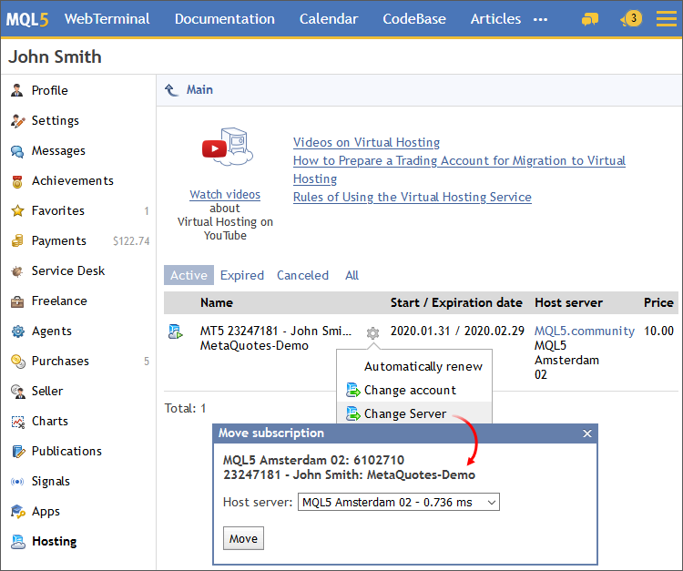
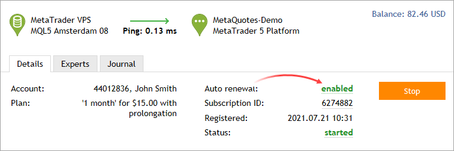
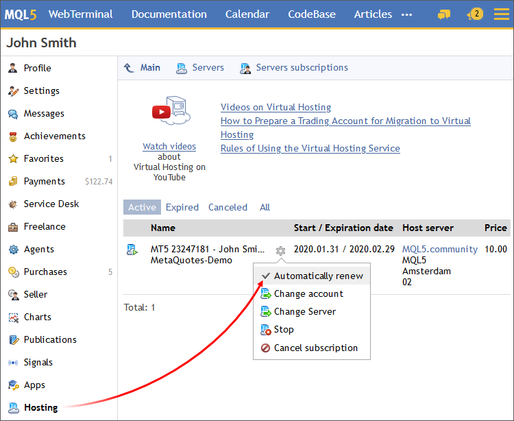

[🏠 Document Start](../README.md) / [Virtual Hosting for 24/7 Operation](../Virtual-Hosting-for-247-Operation/README.md) / Working with the Virtual Platform

[Previous](Migration.md) | [Next](../Mobile-Trading/README.md)

# Working with the Virtual Platform (#working-with-the-virtual-platform)

The rented virtual server status can also be easily monitored from the trading platform. Use the Toolbox \ VPS section to:

  * View [the virtual server data (#details)](Working-with-the-Virtual-Platform.md#details)
  * Synchronize the environment by performing the immediate [migration (#process)](Migration.md#process)
  * Request the platform and Expert Advisor operation [journal (#log)](Working-with-the-Virtual-Platform.md#log)
  * [Stop the server (#stop)](Working-with-the-Virtual-Platform.md#stop)
  * [Cancel hosting (#cancel)](Working-with-the-Virtual-Platform.md#cancel)

Further hosting actions are available via the MQL5.community profile:

  * [Canceling Hosting (#cancel)](Working-with-the-Virtual-Platform.md#cancel)
  * [Moving hosting to another trading account (#move)](Working-with-the-Virtual-Platform.md#move)
  * [Moving a virtual platform to another hosting server (#move-server)](Working-with-the-Virtual-Platform.md#move-server)
  * [Managing automated renewal (#renewal)](Working-with-the-Virtual-Platform.md#renewal)

 | Watch video: How to control resources and manage subscriptions Watch the video to learn how to analyze the virtual hosting resources report and how to control your subscriptions.  
---|---  
  

## Details (#details)

All information about your virtual platform is presented in the left part of the window:

  * Hosting server name.
  * Ping in milliseconds displaying the network delay between the virtual server and the trade server of your broker. Information on how much ping on the virtual platform is less than that on the local one is also shown here. Lower network latency provides better condition for the execution of trading operations, such as reduced slippage and probability of getting re-quotes.
  * Trading account number for which hosting is registered, and the account holder name.
  * Selected subscription plan.
  * [Subscription auto renewal (#renewal)](Working-with-the-Virtual-Platform.md#renewal) status. Click on it to enable or to disable the option.
  * Subscription ID Click on it to navigate to the "Hosting section" of your MQL5.community profile. Your hosting subscription can be managed from this section: stop and start the server, cancel the subscription, move subscription to another trading account, enable/disable automatic renewal, move hosting to another server.
  * Subscription date.
  * Virtual server status: started, stopped. Hover over the status to view additional information about the virtual platform: the broker's access point to which the platform is connected, the status of connection to the broker's server, the state of the [Allow Push notifications (#notifications)](../Getting-Started/Platform-Settings.md#notifications) option and current state.
  * Start/Stop commands to stop and launch the virtual platform. These commands are similar to stopping and starting the application. They do not affect the subscription.

### Performance (#hdd)

This block features the configuration of the server, on which the virtual platform is running, as well as CPU, memory and hard disk usage graphs. Make sure that your program does not consume too much resources.

## Environment (#environment)

This section features information about the trading environment on the virtual platform: the number of launched charts, Expert Advisors and indicators.

  * Each Expert Advisor working on the virtual server is provided with information on the chart symbol and timeframe.
  * If a signal is running on the hosting, you can view its status right from here: whether copying of deals is enabled and whether the service is currently connected. To do this, hover over the signal name.

## Last migration (#last-migration)

Information about the last data [migration](Migration.md) and its type is shown here. Here you can also perform immediate synchronization of the current platform environment.

## Virtual Platform Logs (#log)

To control the virtual platform operation, use the VPS \ Journal section:

Logs are automatically requested from the hosting server when you scroll through the journal.

To access additional journal tools, click "Journal Viewer". In the newly opened log window, you can set a piece of text the journal entries are to be filtered by and a desired interval. After that, click Request to download the found logs. Here you can also select the journal type:

  * Terminal — logs about all events taking place in the platform including trade operations.
  * Experts — information about the Expert Advisor and indicator operation.

The virtual platform logs are updated during each request and saved to [platform data folder]\logs\hosting.*.terminal\\.

> If a user requests too many records, only part of the first logs for the specified period are downloaded. This prevents performance degradation resulting from large logs. If you want to download further logs, you do not need to change the request period. Simply select the last line in the log viewer window and press PgDn.

## Stopping the Server (#stop)

Stopping the server means the temporary shutdown of the virtual platform. This action is similar to closing the platform on your computer. It is performed by " Stop Server" command in the server context menu in the Navigator window or the "Start" button in the hosting section.

To launch the platform, execute the "Start Server" or "Start" respectively.

## Canceling Hosting (#cancel)

Hosting cancellation means that the virtual server will no be longer provided and the virtual platform will be completely deleted. All data transferred to hosting during migration will be completely removed, without the possibility to recover.

Refunds are made only if you cancel hosting within the first 24 hours after purchase. No refund is made if you cancel the subscription later. However, the unused hosting time will be credited to your MQL5 account in the form of free minutes. You can [rent a new VPS for free (#tariff)](Register-a-Server.md#tariff) using these minutes.

To cancel hosting, click on the subscription ID.

In your MQL5.community profile, call up the subscription menu and click "Cancel":

## Moving Hosting to Another Trading Account (#move)

Virtual hosting is rented for a specific trading account, but it can be moved at any time. Open the "Hosting" section in your profile at MQL5.community.

Find the required subscription, click on the gear button and select "Move". Then specify a new trading account (login) and a new server (broker) if necessary, then click "Move".

Open the trading platform and connect to the account, to which the hosting has been moved. Open Toolbox \ VPS and [migrate your trading environment](Migration.md).

## Moving a virtual platform to another hosting server (#move-server)

The system automatically selects a virtual server with the minimum delay to your broker's server. However, connection figures may change over time, for example due to a change on broker's network infrastructure. In this case you can move the virtual platform to a hosting server with a better network connection.

Open the "Hosting" section in your profile at MQL5.community. Find the required subscription, click on the gear button and select "Change Server". Select the server with the smallest ping from the list and click "Move".

After moving, navigate to Toolbox \ VPS and [migrate the trading environment](Migration.md).

## Managing automated renewal (#renewal)

The [auto renewal (#renewal)](Register-a-Server.md#renewal) option eliminates the need to monitor your subscription status. As soon as the current hosting period expires, the system will automatically renew it at the same rate and using the same payment system that you used earlier.

You can enable or disable the auto renewal option at any time. To do this, click on the option status on the VPS page:

You can also manage the option in the "Hosting" section of your MQL5.community profile:

