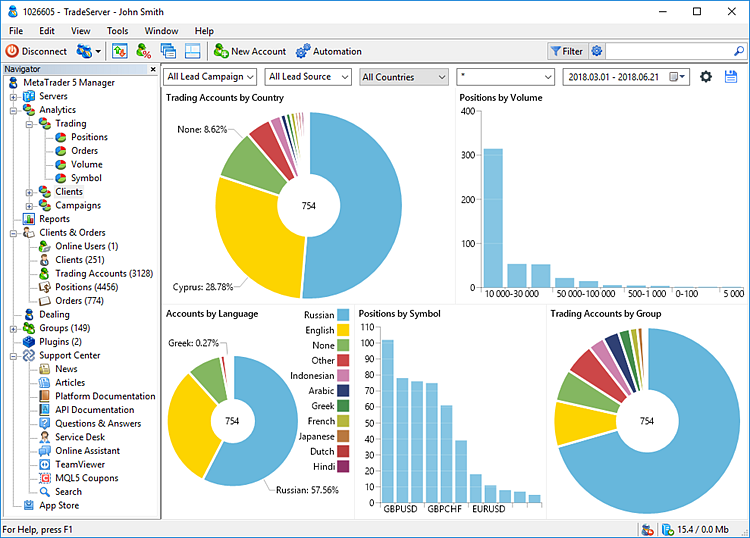
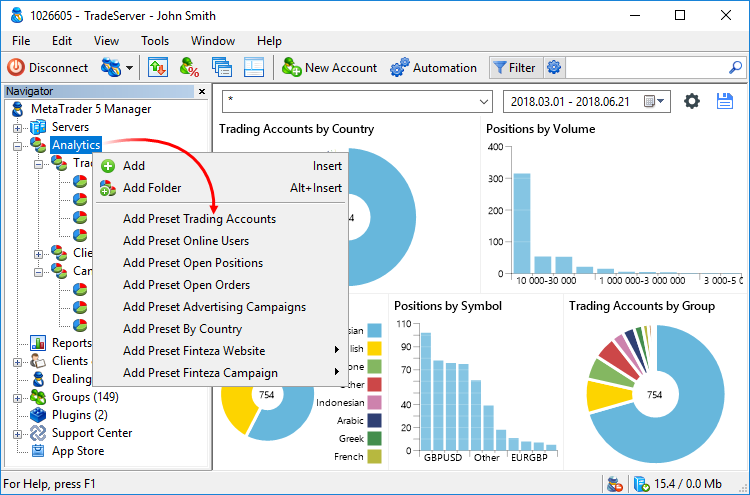
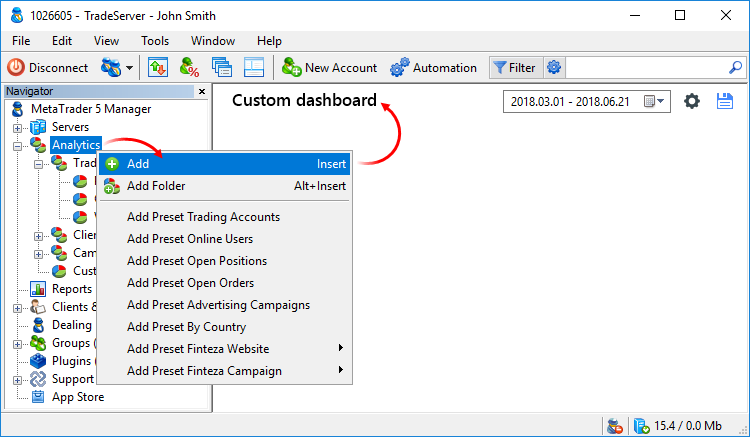
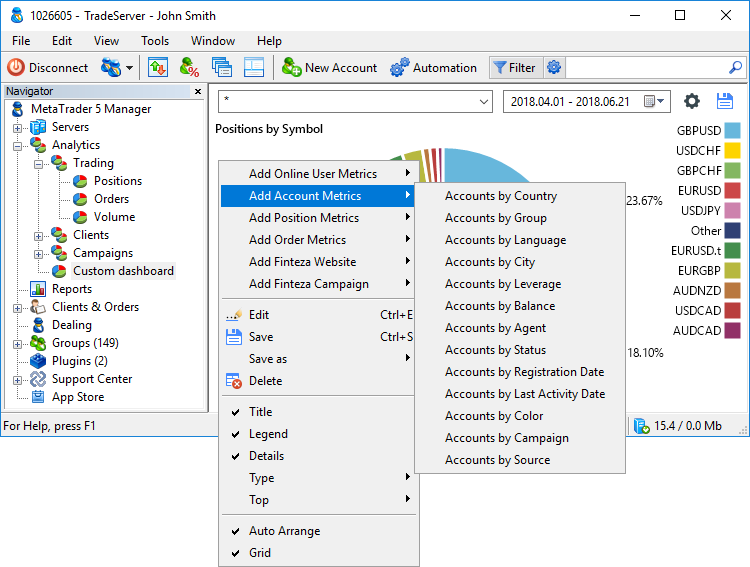
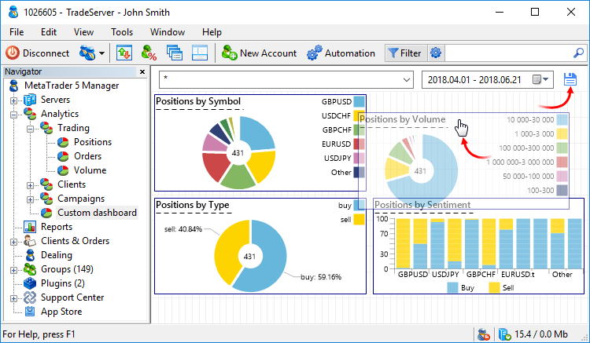
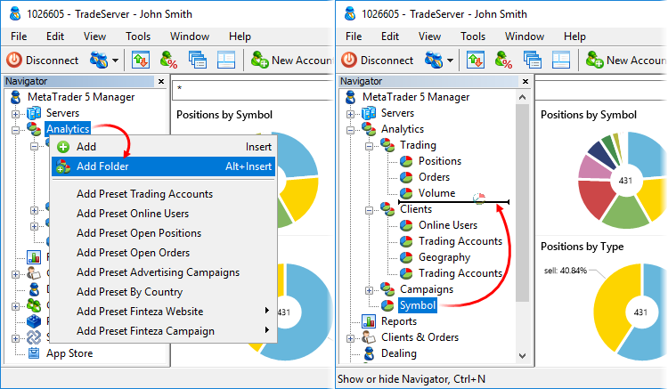
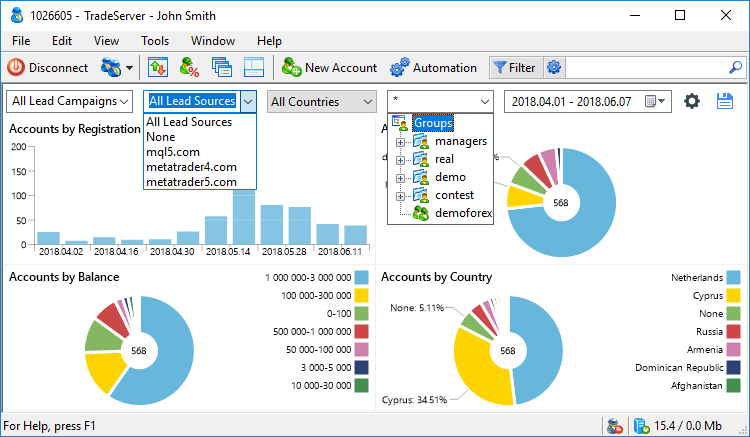
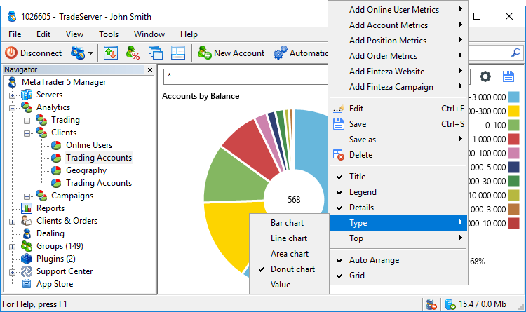
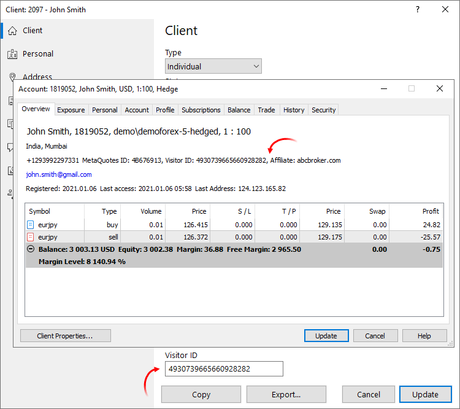
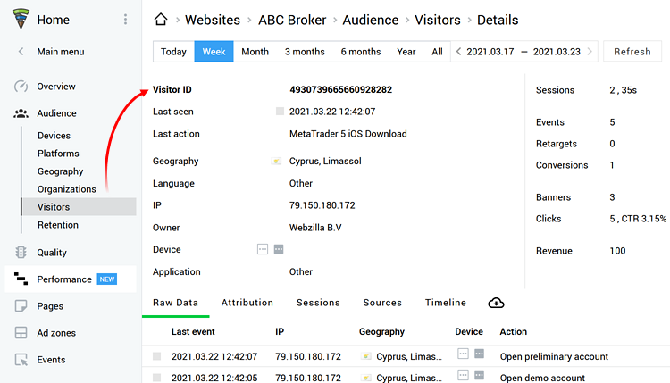

[🏠 Document Start](../README.md) / Analytics

[Previous](../Server-Reports/Fast-Profit-Deals.md) | [Next](../Payments/README.md)

# Analytics (#analytics)

The Manager terminal features tools for analyzing broker's audience and traders' preferences, as well as managing marketing campaigns. Integration with the [Finteza business analytics system](https://www.finteza.com/) enables the display of information about your site visits, analysis of page efficiency and attraction channels, and other data directly in the terminal.

Information is conveniently presented in the form of charts and diagrams. You can create your own dashboards based on any metrics or use ready presets.

## Available Metrics (#metrics)

The terminal provides access to various analytical variables. All metrics are divided into groups:

  * Online Users — data about users currently connected to the trade server: distribution by geographical location, running balances, software builds, groups, etc.
  * Clients — data about all clients and accounts on the trade server: distribution by geographical location, running balances, agents, statuses, marketing campaigns, etc.
  * Positions — information about clients' open positions: distribution by symbols, volumes, types, market mood, etc.
  * Orders — information about clients' open (active) orders: distribution by symbols, volumes, types, direction, etc.
  * Finteza Sites — data on your sites, provided by Finteza: visits, unique users, page views, tracked events, etc.
  * Finteza Campaigns — data on your marketing campaigns from Finteza: clicks, CTR, views, etc.
  * External URL — browser widget. The widget allows displaying the contents of any web page. For example, you can use it to include your own data in reports.

  * Information from Finteza can be viewed without additional trading platform configuration, while access to relevant data is provided based on the broker's license. If Finteza metrics are not available to you, please contact the administrator and request appropriate permissions for your manager account.
  * To add new websites and to start collecting relevant analytical data, [log in to the Finteza panel](https://panel.finteza.com/) using your [technical support](../Technical-Support/README.md) site account credentials. If you need a new account, you may request it via the [official Finteza website](https://www.finteza.com/pricing).
  * For details please watch the video: [Built-in analytics: Boost your sales through efficient advertising](https://support.metaquotes.net/en/articles/947).

  
---  
  

## Ready Sets of Metrics (#sets)

To quickly get started without creating custom dashboards, you may use ready-made sets of metrics. Open the context menu of the Analytics section and select a preset, which best suits your purposes. For example, the Trading accounts preset includes diagrams showing the distribution of trading accounts by the registration data, country and group.

## Configuring a Custom Dashboard (#setup)

You may create your own dashboards using any metrics available. All dashboard settings are stored on the trading server separately for each manager account. Thus, the manager can access dashboards from any computer, on which the Manager terminal is installed.

To create a new dashboard, click "Add" in the context menu of the Analytics section.

Then add required metrics using the context menu of the dashboard:

To change the order of charts, use the context menu or click  in the upper right corner. Next, rearrange charts with the mouse. In editing mode, you can also change the names of the charts. Click on the current name and enter a new one. To delete a chart, select it and press the Delete key. After making changes, click . 

## Arranging Dashboards (#folders)

If you are using a large number of dashboards, arrange them in folders, for convenience. For example, you may create separate folders for clients and accounts, trading metrics and marketing campaigns.

Click "Add Folder" in the context menu. After creating the necessary folders, drag dashboards into them using the mouse.

You can create further dashboards directly in the desired folder, using the folder context menu. Nesting is supported, which means you can create subfolders inside the folders.

## Data Filters (#filter)

Data in the charts can be filtered by Lead campaigns and Lead sources, groups and countries, and also by time: For example, you can set the filter to display traders from Germany, who responded to a certain landing page, during the past 5 days. Filters are located at the top of the dashboard:

## Customizing Charts (#diagram)

To customize the appearance of a chart, open its context menu and set the desired parameters:

  * Title — show/hide the chart title.
  * Legend — show/hide the chart legend.
  * Details — show/hide the chart details.
  * Color — switch color. The option is used for charts displaying information about an entity.
  * Type — switch the chart view: Bar chart, Line chart, Area chart, Donut chart, value (shows the total variable value).
  * Stacking — switch chart stacking type. Used for charts, which compare several entities and their contribution to the overall value. For example, you may distribute positions by symbols and market sentiment. Available options:

  * None — data series are displayed separately
  * With negative values — data series are combined, values are not summed up
  * Regular — data series are combined, values are summed up
  * 100% — rows are combined, the general contribution of each series to the total value in percentage is shown
  * Top — set the number of values displayed in the chart. For example, if you set Top = 5, then the chart will display the five largest values.

## Trader tracking (#visitor)

MetaTrader 5 integration with Finteza enables the generation of end-to-end trader analytics, with which you can trace trader behavior, from the first website visit to a real account deposit.

If you have an active [Finteza subscription](https://support.metaquotes.net/en/news/3420), in addition to trader reports in the Analytics section, you can access further data in the account and client dialogs:

  * Visitor ID — a unique identifier assigned to a user when he/she installs your terminal or visits your site, if a Finteza tracker is installed in it. With this tracker, you can trace trader behavior, from the first website visit to a real account deposit.
  * Affiliate — the name of the website from which the trading terminal installer was downloaded.

Find the required Visitor ID in the Finteza panel, under the visits section, and click on it to apply the ID as a filter. This will enable the generation of any report on trader actions in your site: page views, events, sales funnels, and others.

