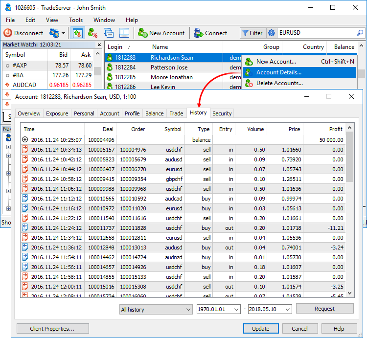
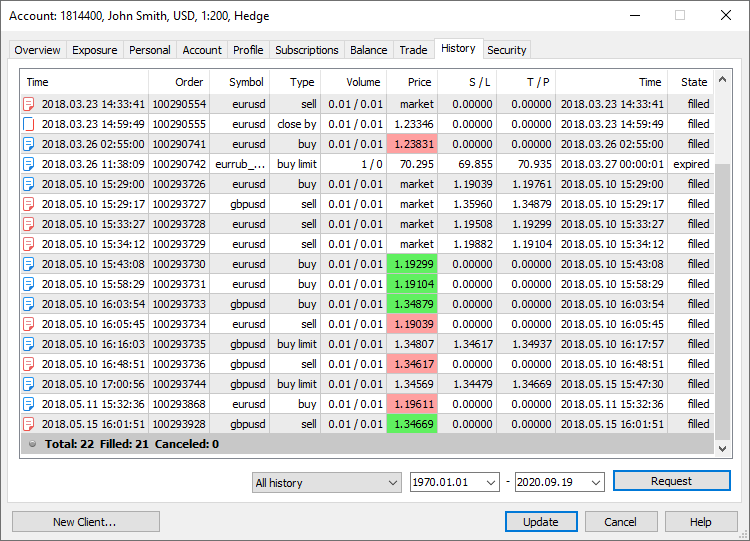
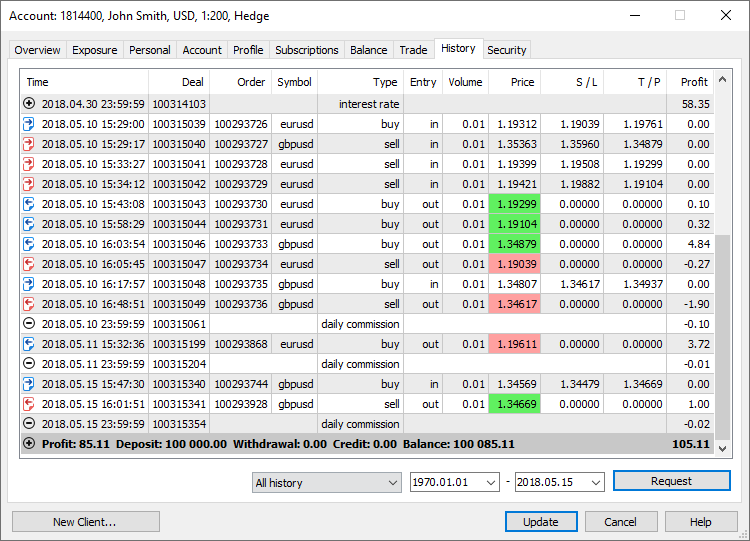
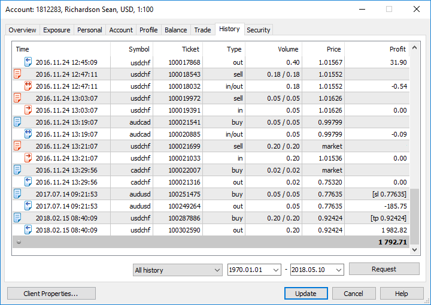
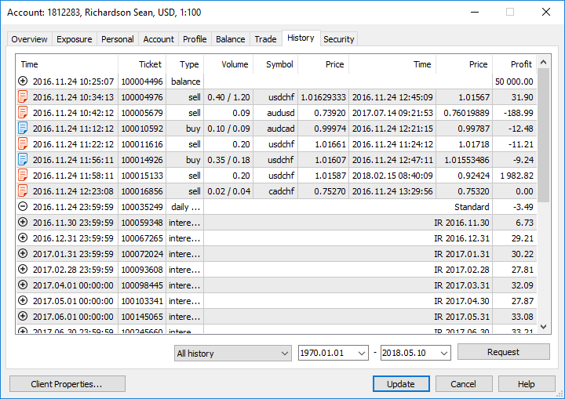

[🏠 Document Start](../README.md) / [Clients and Trading Accounts](README.md) / Account History

[Previous](Trading-Operations.md) | [Next](Security-and-Certificates.md)

# History (#history)

The Manager terminal allows you to view the full history of trading accounts. To do this, select an account and go to the History tab.

The account history can be viewed in various modes: deals, orders, deals and orders and positions. Use the context menu to switch between them. To view the history of trade operations, you should request it. To do this, select a time interval and click Request at the bottom of the window.

To open the [operation details](../Trading-Operations/Viewing-and-Editing.md), click "View" or "Edit" (if you have enough permissions) in its context menu.

## Orders (#orders)

The following data is available on placed orders:

  * Time — time of order placing. The record has the format of YYYY.MM.DD HH:MM (year.month.day hour:minute).
  * Order — ticket number (unique identifier) of a trade operation.
  * ID — order ID in an external trading system.
  * Symbol — financial instrument of an order.
  * Type — [type of a trade operation](../Trading-Operations/Basic-Principles.md): "Buy" — a long position, "Sell" — a short position, or names of "Sell Stop", "Sell Limit", "Buy Stop", "Buy Limit", "Buy Stop Limit" and "Sell Stop Limit" pending orders.
  * Volume — volume requested in the order (in lots or units). Available values and volume change step are set in the trading symbol settings on the server.
  * Price — price, a trade operation should be executed at, specified in an order;
  * S/L — level of a placed [Stop loss order (#stop-loss)](../Trading-Operations/Basic-Principles.md#stop-loss). If the trade position was closed upon this order, this cell will be colored red, and record "[s/l]" will appear in the comment box. If this order was not placed, a zero value is recorded in this field.
  * T/P — level of a placed [Take profit (#take-profit)](../Trading-Operations/Basic-Principles.md#take-profit) order. If the trade position was closed upon this order, this cell will be colored green, and record "[t/p]" in the comment box will appear. If this order was not placed, a zero value is recorded in this field.
  * State — [result (#state)](../Trading-Operations/Basic-Principles.md#state) of the order placing: "Filled", "Partial", "Canceled" etc.
  * Comment — comments to order are written here. Comments can be written only when placing or changing orders. 

The lower line shows result of orders: total quantity, number of filled and canceled orders.

To view [operation details (#order)](../Trading-Operations/Viewing-and-Editing.md#order), double click on the appropriate operation line.

## Deals (#deals)

The following data is available on deals:

  * Time — time of a deal. The record has the format of YYYY.MM.DD HH:MM (year.month.day hour:minute).
  * Deal — ticket number (unique identifier) of a deal.
  * Order — ticket number (unique identifier) a deal was executed on. Several deals can correspond to one order, if the required volume specified in the order was not covered by one market offer.
  * ID — ID of a deal in an external trading system.
  * Symbol — financial instrument of a deal.
  * Type — type of a trade operation: "Buy" — a buy deal, "Sell" — a sell deal. In some situations, a previously performed deal is canceled. In this case, the type of the previously performed deal is changed to "Canceled buy" or "Canceled sell", and its profit/loss is reset to zero. Previously gained profit/loss is deposited/withdrawn from an account in a separate balance operation.
  * Direction — direction of a deal relative to the current position on a particular symbol: "in", "out" or "in/out".
  * Volume — volume of an executed deal (in lots or units).
  * Price — price a deal was executed at.
  * Commission — commission charged for a deal execution. The commission value is displayed in this field only in case of immediate commission charging after an execution of the deal. The commission may also be configured so that its value is accumulated within a day/month and is then withdrawn from the account by a single balance deal. In that case, its value is not displayed for each deal. The value accumulated during a day/month is displayed in the [account status bar (#account-state)](Account-Overview.md#account-state). The method of charging a commission is set for a client group in the Administrator terminal.
  * Profit — financial result of exiting a position. For entry deals, zero profit is shown.
  * Stop loss — the Stop Loss level. Stop Loss values for entry and reversal deals are set in accordance with the Stop Loss of orders, which initiated these deals. The Stop Loss values ​​of appropriate positions as of the time of position closing are used for exit deals.
  * Take profit — the Take Profit level. Take Profit values for entry and reversal deals are set in accordance with the Take Profit of orders, which initiated these deals. The Take Profit values ​​of appropriate positions as of the time of position closing are used for exit deals. 
  * Swap — charged swap.
  * Comment — deal comment. Additional information can be written in the Comment field. For example, a comment indicating an account for whose trades an agent receives the commission is automatically added to the agent commission deals.
  * Reason — reasons for a deal execution:

  * Client — deal performed by a client manually through the client terminal.
  * Expert — deal performed by a client using an Expert Advisor.
  * Dealer — deal performed by a dealer through the Manager terminal.
  * Stop loss — deal performed as a result of a stop loss activation.
  * Take profit — deal performed as a result of a take profit activation.
  * Stop out — deal performed when a client reached a stop out level.
  * Rollover — deal performed when reopening a position for charging swaps.
  * External Client — deal performed by a client from an external trading system.
  * Variation margin — deal performed for accruing variation margin.
  * Gateway — deal performed by a MetaTrader 5 gateway that had connected to the trading platform.

  * Signal — deal performed as a result of copying a [trading signal](https://www.mql5.com/en/signals) according to a subscription in the client terminal.
  * Settlement — deal performed as a result of performing operations connected with the settlement of a futures contract/option. It is currently not used.
  * Transfer — deal performed as a result of relocating a position at a calculated price to a new symbol with the same underlying asset. It is currently not used.
  * Synchronization — deal performed as a result of synchronization of an account's trade status with an external system.
  * External Service — deal performed from an external trading system for technical reasons (for example, to correct a trade status of a client).

  * Mobile — deal conducted via the MetaTrader 5 mobile terminal for Android or iPhone.
  * Web — deal conducted via the web terminal.

  * Split — deal conducted as a result of a symbol split.

In the bottom line, the result of a deal execution relative to the initial deposit is shown:

  * Profit — profit or loss relative to the initial deposit. For losses, icon  is shown in this field, for profit — ;
  * Credit — amount [credited](Balance-Operations.md) by a brokerage company;
  * Deposit — account deposit;
  * Withdrawal — amount withdrawn from an account.

The balance value taking into account the displayed history is shown at the end of the line. It is calculated as the sum of results of the displayed deals, balance operations (deposit and withdrawal) and credit operations.

To view [operation details (#deal)](../Trading-Operations/Viewing-and-Editing.md#deal), double click on the appropriate operation line.

## Orders and deals (#orders-deals)

In this mode, orders and deals are displayed as a tree that shows how exactly trade requests were processed. For each order, all deals associated with it are shown.

The financial result of all deals is shown in the bottom line.

## Positions (#positions)

The platform collects data on deals related to a position (position opening, additional volume, partial and full closure), and then combines the data into one record providing the following details:

  * Position opening and closing time determined by the first and last trade respectively
  * Position volume. If a position was closed partially, the record contains the closed and initial volumes
  * The weighted average open and close prices of a position
  * The total financial result of deals related to a position
  * Position Stop Loss and Take Profit determined by Stop Loss and Take profit values of the deals, which opened and closed the position

To display the trading history in the form of positions, the terminal uses information about deals executed during the requested period. Only the positions which were closed within this period will be shown in history. If the position is still open or its close time is beyond the selected interval, it will not be displayed in history. Therefore, the totals (profit and commission) in positions mode can differ from those in orders/deals history mode.

For example, you are viewing the past week history. During this period, 100 deals were executed, 98 of which opened and closed 20 positions. The last two deals opened new positions, which have not been closed up to now. In this case, the history of deals contains 100 records and appropriate total values calculated based on these deals. When viewing the history as positions, you will see 20 records collected based on 98 deals. Only this data will be taken into account when calculating total values. If the broker charges commissions per entry deals, the final commission value in the deals history will differ from the commissions value in the positions history, because two last deals will be ignored in case latter case.

## Context menu (#context)

You can execute the following commands from the context menu of this tab:

  * View — open the window of viewing a selected [order (#order)](../Trading-Operations/Viewing-and-Editing.md#order), [deal (#deal)](../Trading-Operations/Viewing-and-Editing.md#deal) or [position (#position)](../Trading-Operations/Viewing-and-Editing.md#position).
  * Edit — administrator command allowing you to [edit any parameters](../Trading-Operations/Viewing-and-Editing.md) of a selected trade operation. The command is available if a manager account has the appropriate permissions.
  * Delete — administrator command allowing you to delete a selected trade operation. The command is available if the manager account has the appropriate permissions.
  * Orders — display history of account orders.
  * Deals — display history of account deals.
  * Orders & Deals — display history of account deals and orders.
  * Positions — display history of account positions.
  * Volumes — select units to display volumes (lots or amount).
  * Symbols — if the account history contains financial operations for different symbols, using this menu allows you to select those that should be displayed. When you select All Symbols, all operations will be shown. If you select Current Symbol, all operations for the symbol, whose operation is currently open, will be displayed. In the below list, you can select one of symbols operations were executed for.
  * Report — generate a report on client's trading history in XML or HTML format.
  *  Find — search for an order or a deal by a ticket, a symbol, etc. Before you start the search, request the history of trade operations and enable necessary columns. The search is conducted only through the information displayed on the History tab.
  *  Find Next — find the next operation matching the search query.
  * Show Milliseconds — show the time of trade operations with the millisecond precision.
  * Auto Arrange — enable/disable automatic sizing of columns.
  * Grid — show/hide the grid to separate fields.
  * Columns — open the submenu for showing/hiding ID, Commission, Swaps and Comments columns.

