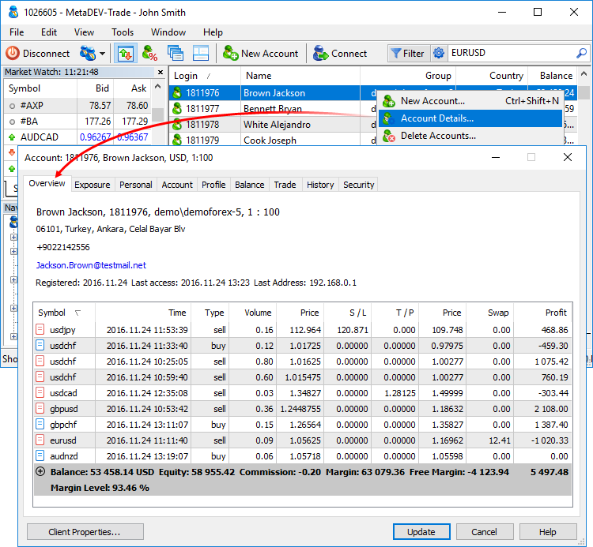

[🏠 Document Start](../README.md) / [Clients and Trading Accounts](README.md) / Account Overview

[Previous](Push-Notifications-SMS-and-Mail.md) | [Next](Exposure.md)

# Account Overview (#account-overview)

The Overview tab contains summary information about the account: [personal data](Personal-Data.md), date of registration and last access to the account, as well as all the current trading status.

If you have an active [Finteza subscription](https://support.metaquotes.net/en/news/3420), this section can display data for user tracking: Visitor ID and Affiliate. For further details please visit the "[Analytics (#visitor)](../Analytics/README.md#visitor)" section.

> Last connection time and address data is updated once per hour.

## Open positions (#positions)

If an account has open positions, they are displayed first.

  * Symbol — financial instrument of an open position.
  * Time — time when a position was opened. The record has the format YYYY.MM.DD HH:MM (year.month.day hour:minute).
  * Type — position type: "Buy" — long, "Sell" — short.
  * Volume — volume of a trade operation (in lots or units).
  * Price — weight-average price of a position opening: (price of deal 1 * volume of deal 1 + ... + price of deal N * volume of deal N) / (volume of deal 1 + ... + volume of deal N). The accuracy of rounding of an average weighted price is equal to a number of decimal places in a symbol price plus three additional digits.
  * S/L — [stop loss (#stop-loss)](../Trading-Operations/Basic-Principles.md#stop-loss) level of the current position. If this order is not placed, a zero value is shown in the field.
  * T/P — [take profit (#take-profit)](../Trading-Operations/Basic-Principles.md#take-profit) level of the current position. If this order is not placed, a zero value is shown in the field.
  * Price — current price of a financial symbol. Bid price is displayed for short positions, while Ask price is used for long ones. A price of the last performed deal (Last) is displayed for positions involving exchange symbols (both directions).
  * Swap — amount of swaps charged.
  * Profit — current financial result of a position calculated at a market price. A positive result indicates the profitability of a deal, while negative highlights its loss-making nature. 

To open the [operation details](../Trading-Operations/Viewing-and-Editing.md), click "View" or "Edit" (if you have enough permissions) in its context menu.

> When the current price nears the levels of stop loss and take profit, S/L and T/P fields are colored in red and green, respectively. A pending order trigger price is colored green as well. Highlighting turns on when a price nears closer than:

## Account status (#account-state)

The following information is displayed in the account status bar:

  * Balance — account funds not considering results of currently open positions (deposit).
  * Credit — amount of funds provided to a client by a broker as a loan (sum of operations of [Credit and Bonus](Balance-Operations.md) types). The trading platform does not have a function of charging an interest for credit assets. Credit assets can be deposited and withdrawn at the [Balance](Balance-Operations.md) tab.
  * Commission — commission by orders and positions accumulated during a day/month. Depending on the [client group settings (#commission)](../Managing-Trade-Server-Settings/Spread-Commission-and-Swap.md#commission), preliminary commission calculation is performed during a day/month and an appropriate amount of money is blocked in the account and displayed here. Final commission calculation is performed at the end of a day/month and the appropriate sum is withdrawn from the account by a balance operation (displayed as a separate deal on the [History](Account-History.md) tab), while blocked funds are unblocked.  
In case commission is charged immediately during a deal, its value is shown in the Commission field of the History tab.
  * Accumulated — client group can be set up so that a profit earned by a trader during a day cannot be used for trading (it is not accounted in the free margin). At the end of a trading day, this profit is unblocked and deposited to the account balance. This field displays the current profit/loss obtained by a client during the day.
  * Equity — equity is calculated as Balance + Credit - Commission +/- Floating profit/loss - Blocked.
  * Margin — money required to cover open positions and pending orders.
  * Free — following parameters are displayed here:

  * Free Margin — free amount of money that can be used to maintain open positions. It is calculated as Equity - Margin. Depending on the client group settings, the equity value may or may not consider: floating profit, floating loss or floating profit and floating loss together;
  * Margin Level — percentage of an account equity to a margin volume (Equity / Margin * 100).
  * Total of deals — total financial result of all open positions. In case of a positive result, icon  is shown, in case of a negative one — .

## Exposure (#collateral)

The trading platform supports a special type of non-tradable assets, which can be used as client's assets to provide a required margin for open positions of other instruments. For example, a certain amount of gold in physical form can be available on a trader's account, which can be used as a margin (collateral) for open positions.

These instruments have [Collateral (#calculation)](../Trading-Operations/Market-Watch.md#calculation) calculation type. They have the following features:

  * Clients cannot perform any operations with them except closing. A position can be opened only by a manager.
  * No profit can be accrued for positions of these symbols, they have no stop loss or take profit.

Such assets are displayed as open positions. Their value is calculated by the formula: Contract size * Lots * Market Price * Liquidity Rate.

  * Contract size — size of a contract
  * Lots — volume in lots
  * Market Price — current market price of a financial instrument
  * Liquidity Rate here means a share of an asset a broker allows to use for the margin

The Assets are added to the client's Equity and increase Free Margin, thus increasing the volumes of allowable trade operations on the account.

In the example above, a trader has 1 ounce of gold having the current market value of 1 212.01 USD. This value is added to the equity and the free margin

Collateral symbol settings on the server may allow clients and managers close such positions (Trade = Close only). In this case, a trader is able to convert the asset into the deposit currency at the current market rate and use that money for trading. Closing can be performed only if an asset/deposit currency conversion rate is present.

  * To delete a collateral position without crediting any profit, a manager should close the position at the zero price.
  * To close a position with adding its value to a trader's balance, a manager should close it at the current market price.

  
---  
  

## Pending orders (#pending)

Below the line with the current status of the account, placed pending orders and requests pending [processing](../Dealing-and-Risk-Management/Dealing.md) are shown:

  * Symbol — financial instrument of a pending order.
  * Order — ticket number (unique identifier) of a pending order.
  * ID — order ID in an external trading system.
  * Time — pending order placing time. The record has the format YYYY.MM.DD HH:MM (year.month.day hour:minute).
  * Type — [type of a pending order (#pending-order)](../Trading-Operations/Basic-Principles.md#pending-order): "Sell Stop", "Sell Limit", "Buy Stop", "Buy Limit", "Buy Stop Limit" or "Sell Stop Limit".
  * Volume — volume requested in a pending order, and volume covered by a deal (in lots or units).
  * Price — pending order trigger price.
  * S/L — [stop loss order (#stop-loss)](../Trading-Operations/Basic-Principles.md#stop-loss) level. If this order is not placed, a zero value is shown in the field.
  * T/P — [take profit (#take-profit)](../Trading-Operations/Basic-Principles.md#take-profit) order level. If this order is not placed, a zero value is shown in the field.
  * Price — current price of a financial symbol. Bid price is displayed for short orders, while Ask price is used for long ones. A price of the last performed deal (Last) is displayed for orders involving exchange symbols (both directions).
  * Comment — comment to a pending order.
  * State — current order status: "Started", "Placed" etc.

## Context menu (#context)

The context menu of an account status block allows performing the following commands:

  * New Order — go to the [Trade](Trading-Operations.md) tab to create a [new order (#open)](../Trading-Operations/Working-with-Trading-Positions.md#open) on the account.
  * Close Position — go to [closing (#close)](../Trading-Operations/Working-with-Trading-Positions.md#close) of a selected position on the Trade tab.
  * Modify or Cancel — go to [modifying or deleting (#modify-delete)](../Trading-Operations/Working-with-Trading-Orders.md#modify-delete) a selected pending order or to [modifying (#modify)](../Trading-Operations/Working-with-Trading-Positions.md#modify) a selected position.
  * Activate — go to [activation (#activate)](../Trading-Operations/Working-with-Trading-Orders.md#activate) of a selected pending order.
  * Edit — administrator command allowing you to [edit any parameters](../Trading-Operations/Viewing-and-Editing.md) of a selected trade operation. The command is available if the manager account has the appropriate permissions.
  * Delete — administrator command allowing you to delete a selected trade operation. The command is available if the manager account has the appropriate permissions.
  * Volumes — open the submenu for selecting the units to display volumes (lots or amount).
  * Profit — open the submenu for selecting the units to display the profit (money or points).
  * Report — generate a report on client's trading positions in XML or HTML format.
  * Show Milliseconds — show time of trade operations with the millisecond precision.
  * Auto Arrange — if enabled, a size of columns is selected automatically.
  * Grid — show/hide the grid to separate columns.
  * Columns — open the submenu for selecting columns to show in the table.

