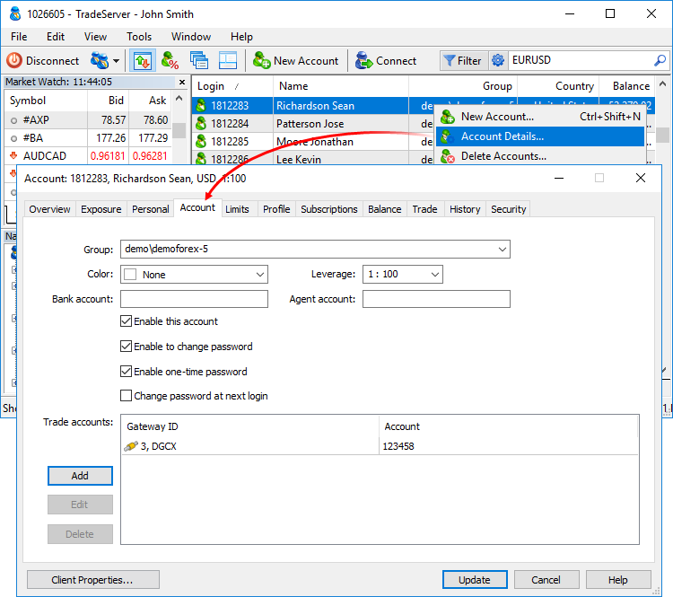
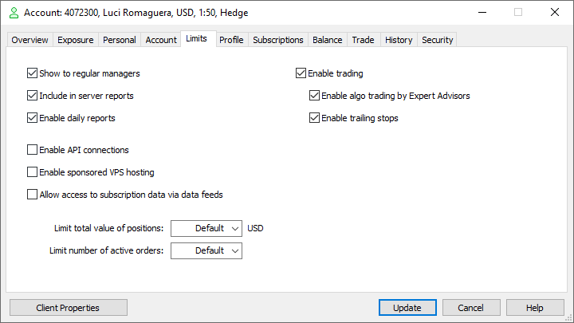

[🏠 Document Start](../README.md) / [Clients and Trading Accounts](README.md) / Account Trading Settings

[Previous](Personal-Data.md) | [Next](Balance-Operations.md)

# Account Trading Settings (#account-trading-settings)

To view or change the trading settings, open the Account tab:

It contains the following parameters:

  * Group — group an account belongs to.
  * Color — color to be used in the Manager terminal for displaying clients' [requests](../Dealing-and-Risk-Management/Queue-of-Trade-Requests.md) for performing trade operations in the Manager terminal. For example, you can use certain colors to flag suspicious and VIP clients.
  * Leverage — account leverage.
  * Bank account — client's account in an external bank.
  * Agent account — account for charging [agent commissions (#commission)](../Managing-Trade-Server-Settings/Spread-Commission-and-Swap.md#commission) on trade operations on this account.
  * Enable this account — enable/disable the account. If you remove the check mark from this item, the account will be inactive and its icon will become gray . It will be impossible to connect to the server using this account. Disabling of an account does not disable the sending of daily or monthly reports to this account. This option should be [disabled separately (#reports)](Account-Trading-Settings.md#reports). 
  * Enable password change — if enabled, an account holder will be able to change passwords to the account in the client terminal.
  * Enable one-time password — enable/disable [OTP](../MetaTrader-5-Manager/For-Advanced-Users/One-Time-Passwords-2FATOTP.md) use for individual clients in a group. If use of OTP is disabled for a group, enabling this option does not have any effect.
  * Change password at next login — if enabled, an account holder will have to [change the Master Password (#change-password)](../MetaTrader-5-Manager/Connecting-to-the-Server.md#change-password) during the next connection. No actions can be performed on the account till then. After changing the password, the option is automatically disabled.

  * Moving accounts to groups with different deposit currencies can only be performed for accounts with zero balances and no open positions.

  * Moving accounts to groups belonging to different trade servers is impossible.
  * Do not move accounts between groups with different [position accounting systems (#position-system)](../Trading-Operations/Basic-Principles.md#position-system) (netting and hedging), especially if they have open positions. They may become incorrect.

  
---  
  

### Trade accounts (#trade-accounts)

The trading platform can be integrated with an external trading system, for example, a stock exchange or ECN. Gateways are used for integration — they broadcast price data from an external system and pass trade operations made by clients in MetaTrader 5 into it. The special client record field — account number in an external trading system — is used for connecting a client in a trading platform and at an external system side.

The "Trade accounts" section allows you to manage client's trade accounts numbers in external systems. Each account number is associated with a specific gateway, through which the interaction with an external system occurs.

The following commands are available for managing accounts:

  * Add — add a new account. After clicking, a new line will appear in the window. Specify one of the gateways in the Gateway ID field and a number of a trading account in an external system the gateway is connected to in the Account field;
  * Edit — edit a selected account. The same operation can be done by double-clicking on the required field.
  * Delete — delete a selected account.

## Limits (#limits)

In this section, you can configure trading account permissions and restrictions:

  * Show to regular managers — this rule allows the convenient working with technical accounts. Disable this option for testing accounts to hide them from all managers who do not have special access to technical accounts (which is provided by the platform administrator). Such technical accounts can be confusing for the managers working with clients, in which case hiding them can be useful.   
The permission affects the visibility in the general list of accounts in the Administrator and Manager terminals, as well as in the list of online accounts in the Manager terminal.
  * Include in server reports — using this option, you can exclude the account from [server reports](../Server-Reports/README.md). Like the previous permission, it is intended for more convenient work with technical accounts. Permission to edit the previous two options is provided by the platform administrator.
  * Enable daily reports — allow receiving daily and monthly reports. If this option is disabled, HTML reports will not be generated or sent daily/monthly for the account (however, this does not affect the generation of [daily data for server reports](../Server-Reports/Daily.md)).
  * Enable API connections — allow connection using this account via Web API;
  * Enable sponsored VPS hosting — brokers can pay for the [virtual hosting](https://www.mql5.com/en/vps) for their client. The service is extremely important for traders, and the opportunity to receive a VPS for free can give them a good reason to choose your company over competitors. The availability of a broker-sponsored VPS is controlled at the individual account level. Only if this option is enabled, the appropriate payment plan will be shown to the trader in the client terminal. For more details, please read the [appropriate section (#sponsored)](https://support.metaquotes.net/en/docs/community/vps#sponsored).
  * Enable trading — if disabled, trading on the account is impossible: you cannot place new orders and modify existing orders and positions. However, it can be used for connecting to the server and analyzing price dynamics. Disabling trading does not affect triggering pending orders that have already been set as well as stop loss and take profit levels of the current positions. However, Stop out is not performed for accounts with trading disabled since this tool is meant for broker's internal risk management.
  * Enable algo trading by Expert Advisors — allow this account to trade using Expert Advisors;
  * Enable trailing stops — allow an account to use trailing stops in the client terminal.
  * Allow access to subscription data via data feeds — this option provides additional protection for your market data accessed through [subscriptions](https://support.metaquotes.net/en/docs/mt5/platform/administration/subscriptions). By default, such data is only available via client terminals. If you are integrating with another service or server and need to access data through a gateway or data feed, enable this permission to allow access for the relevant account. By default, this permission is disabled for all accounts.
  * Limit total value of positions — the maximum value of open positions allowed on the account. Positions are evaluated as follows:  
  
For each symbol, the total value of positions and active pending orders is determined separately for each direction, i.e., separately for buy and sell operations. The difference in the values of these direction is calculated. A similar analysis is performed for all instruments for which the account has open positions and orders.  
  
The obtained values are summed up and the result is compared with the specified limit. Once the limit is reached, the platform will disable the ability to place new orders if their execution can increase the total value of positions.  
  
The value calculation for each position/order depends on the [symbol's margin/profit calculation method (#calculation)](../Trading-Operations/Market-Watch.md#calculation).  
  
For the symbols with the Forex calculation type, the value is calculated in the base symbol currency and is equal to the product of the contract size and the volume. For example, for EURUSD with the contract size of 100,000, the value of 1 lot is equal to 100,000 EUR.  
  
For the symbols with the CFD, CFD Leverage, CFD Index and Futures calculation type, the value is also calculated in the deposit currency. Since the contract size of such instruments is not expressed in money (it can be expressed, for example, in the amount of assets), the contract size is additionally multiplied by the instrument price to obtain the value in monetary terms. For Futures symbols, the final value is additionally multiplied by the ratio of tick price to tick size. For example, if some Futures symbol has USD as the base currency, the contract size is equal to 100, the cost is 33, and the tick price to tick size ratio is 1/0.1, the value of one lot of the position is equal to 100*33*10 = 33,000 USD. For a СFD symbol with the same parameters, one lot size would be 100*33 = 3,300 USD.   
  
If the symbol base currency differs from the account deposit currency (specified after the field), the calculated value will be additionally converted using the relevant exchange rate.  

  * Limit number of active orders — the maximum number of active (placed) pending orders allowed on the account. Once the limit is reached, the client will no longer be able to place new pending orders. If no value is specified (default), a limit defined on the server will be used.

