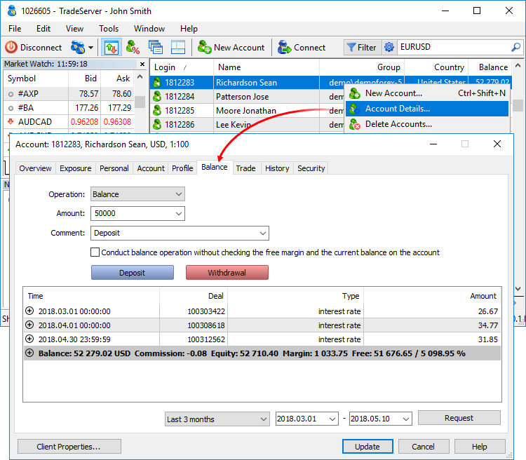
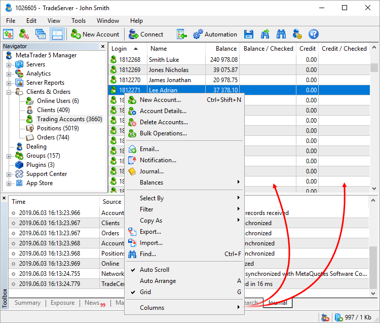
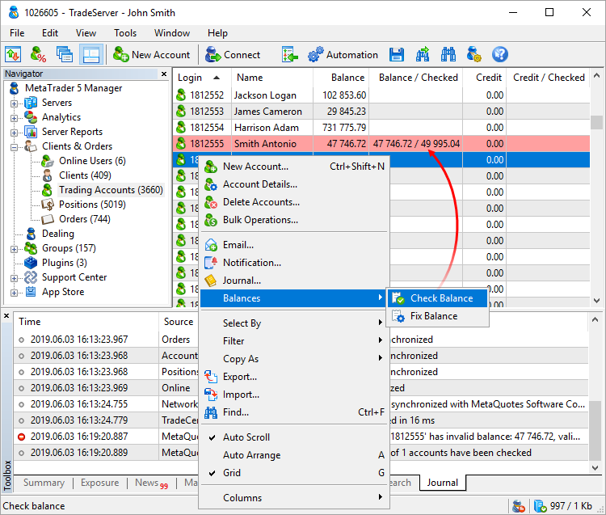

[🏠 Document Start](../README.md) / [Clients and Trading Accounts](README.md) / Balance Operations

[Previous](Account-Trading-Settings.md) | [Next](Trading-Operations.md)

# Balance (#balance)

The Manager terminal allows performing balance operations: depositing and withdrawal of funds, credit provision, charging commissions, dividends, etc.

> "Accountant (deposit/withdraw)" permission is required for accessing the section. The permission is granted by the platform administrator.

To conduct a balance operation, set the following parameters:

  * Operation — type of operation:

  * Balance — changing an account balance.
  * Credit — issuing and repaying a credit.
  * Charge — any additional charges.
  * Correction — correction of trading results.
  * Bonus — bonuses. Operations of this type affect the credit assets of a client ([Credit (#state)](Account-Overview.md#state) field).
  * Commission — additional commissions.
  * Dividend — paying taxable dividends.
  * Franked dividends — paying non-taxable dividends (tax is paid by a company).
  * Tax — charging a tax.
  * Amount — amount of money deposited or withdrawn from an account.
  * Comment — text comment to an operation. In this field, you can choose one of the earlier created comments, or write a new one. 

There are two types of directions for each operation type — depositing to an account or withdrawal. A blue button is used for depositing (in operations), red one — for withdrawals (out operations).

By default, when conducting balance operations the platform performs checks to make sure they do not cause the account free margin and balance to become negative. If it does, the platform will not perform the operation and will display the "No money" error. If necessary, you can disable these checks by enabling the option "Conduct balance operations without checking the free margin and the current balance on the account".

Due to the funds accounting specifics, margin and balance are not checked on accounts with the "[for Stock Exchange, based on margin discount rates (#risk)](../Managing-Trade-Server-Settings/Margin.md#risk)" risk management model.

  * All balance transactions in the system are passed as [deals (#deal)](../Trading-Operations/Basic-Principles.md#deal).
  * You cannot withdraw an amount greater than the current value of an account free margin or balance.

  * The free margin is not checked for the "Correction" operation. Be careful with withdrawal operations. If the client has open positions, and you deduct an amount greater than the free margin, Stop Out will trigger on the account.

  
---  
  

## History of operations (#history-of-operations)

The history of balance operations conducted earlier is located at the bottom of the window:

  * Time — time when the operation was conducted. When depositing to an account, at the beginning of this field,  icon is shown, when withdrawing — .
  * Deal — unique operation ID in the system.
  * Type — operation type.
  * Amount — operation amount.
  * Comment — operation comment.

To view a history of balance operations, set a period and click Request at the bottom of the window. To enable/disable display of milliseconds, grid or comments in the history of operations, use the context menu.

## Account status (#account-state)

The account status bar is displayed under the list of balance operations. It contains the following information:

  * Balance — money on the account, not considering results of currently open positions (deposit).
  * Credit — amount of funds provided to a client by a broker as a loan. The trading platform does not have a function of charging an interest for credit assets. Credit assets can be deposited and withdrawn at the [Balance](Balance-Operations.md) tab.
  * Blocked — client group can be set up so that a profit earned by a trader during a day cannot be used for trading (it is not accounted in the free margin). This blocked profit is displayed in the Blocked field. At the end of the trading day, this profit is unblocked and deposited to the account balance.
  * Equity — equity is calculated as Balance + Credit - Commission +/- Floating profit/loss - Blocked.
  * Margin — money required to cover open positions and pending orders.
  * Free — the following parameters are displayed here:

  * Free Margin — free amount of money that can be used to maintain open positions. It is calculated as Equity - Margin. Depending on the client group settings, the equity value may or may not consider: floating profit, floating loss or floating profit and floating loss together.
  * Margin Level — percentage of the account equity to the margin volume (Equity / Margin * 100).

in case of a positive result of current open positions, at the beginning of the account, status bar icon  is shown, in case of a negative one — .

## Balance check and correction (#fix)

In the Manager terminal, you can easily check the balance and the state of credit funds on accounts based on the [history of deals (#deals)](Account-History.md#deals). Such operations can be required after the manual history correction, for example, as a result of failures or abnormal situations.

To perform a check, go to the "Accounts" section and enable the "Balance / Checked" and "Credit / Checked" columns via the context menu.

Select one or several accounts, for which you want to check the balance and credit funds, and execute the "Balance — Check Balance" command. If an incorrect balance or credit funds value is revealed, the appropriate account will be highlighted in red.

Two values will be displayed in "Balance" and "Credit" columns: the current balance/credit funds value will be displayed on the left, while the value calculated using the deals history is shown on the right.

> The credit funds are checked based on the ["Credit" type (#deals)](Account-History.md#deals) deals.

The check result is also displayed in the [journal (#journal)](../User-Interface/Toolbox.md#journal). If the calculated value differs from the current one, the following message will appear in the journal:

account xxx has invalid balance: xxx.xx, valid: xxx.xx  
---  
  
To correct the balance/credit funds value, select the desired account and execute "Balance — Fix Balance" command in the context menu. After that the calculated balance/credit value will be inserted as the current one. The correction result will be written to the journal:

balance of account '1030390' has been fixed from 9 968.70 to 9 999.80  
---
