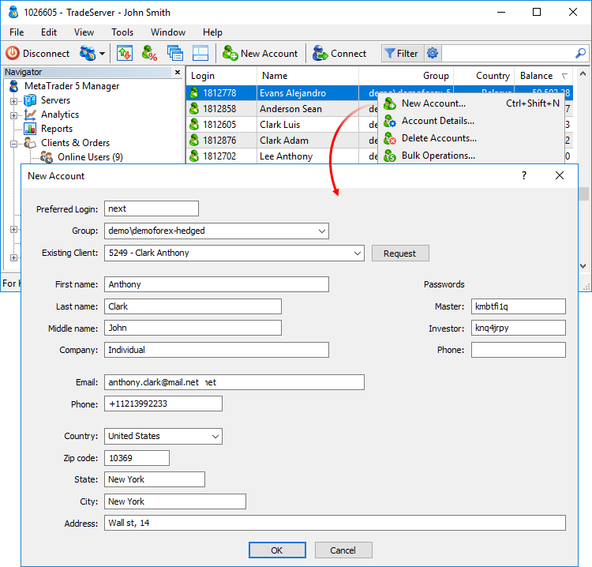

[🏠 Document Start](../README.md) / [Clients and Trading Accounts](README.md) / Creation of Accounts

[Previous](Online-Accounts.md) | [Next](Importing-Accounts.md)

# Creation of Accounts

To create an account, select " New Account" in the context menu or press Ctrl+N.

For convenience, the account settings in the account creation window are divided into two blocks.

## Information

In this block, information about a client is set:

  * Preferred Login — account number. If you specify "next" instead of a number, the next available number is assigned to an account.
  * Group — group where the account will be created. Only a group available to a manager can be selected.
  * Preferred Client — the [client](Clients.md) to whom the account should be linked. Specify the ID, name or contact information in the Existing Client field and then click "Request". Then select the required client from the list.
  * Name — name of the account holder.
  * Last Name — second name of the account owner.
  * Middle Name — middle name of the account owner.
  * Company — name of the client's company.
  * E-Mail — e-mail address.
  * Phone — phone number.
  * Country — country of residence.
  * State — state (region) of residence.
  * City/Town — city/town of residence.
  * Zip code — zip or postal code.
  * Address — client's address.

  * [Additional settings](Personal-Data.md) can be configured for an account after creating it.
  * Accounts are always created with a zero balance. To deposit funds, go to the [Balance](Balance-Operations.md) section of a created account.

  
---  
  
## Passwords

In this block, passwords are set. When you create an account, passwords are generated automatically, however they can be specified manually in the appropriate fields:

  * Master — master password for an account.
  * Investor — investor password (without the possibility of trading).
  * Phone — phone password used for identifying an account holder while performing trade operations over phone.

> All passwords, including master and investor, must contain four character types: lowercase letters, uppercase letters, numbers and symbols (#, @, !, etc.). For example, 1Ar#pqkj. The minimum password length is determined by group settings, while the lowest possible value is 8 characters. The maximum length is 16 characters.

After specifying all the data, click OK.
