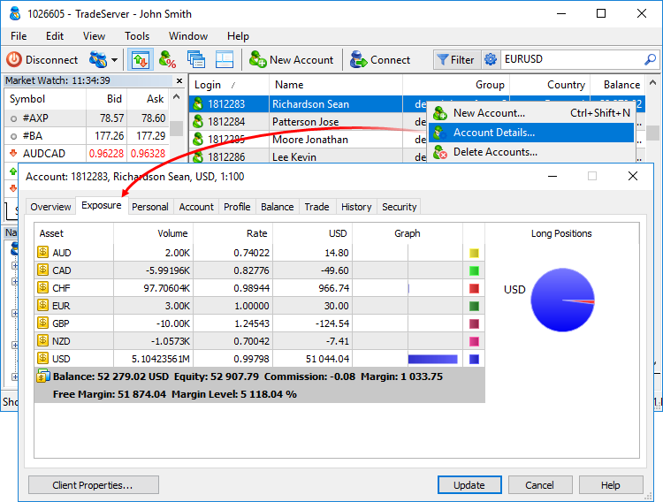

[🏠 Document Start](../README.md) / [Clients and Trading Accounts](README.md) / Exposure

[Previous](Account-Overview.md) | [Next](Personal-Data.md)

# Exposure (#exposure)

The Exposure tab contains the current account assets grouped by currencies.

The following information is available:

  * Assets — name of a currency or financial instrument.
  * Volume — client's position volume (in units) for the currency or financial instrument including leverage.
  * Rate — currency or instrument rate in relation to the deposit currency.
  * Deposit currency — amount of deposit currency (excluding leverage) actually expended to buy/sell the currency or trading instrument.
  * Graph — graphical representation of the client's position in the deposit currency (blue bars show long positions, red ones denote short ones). 
  * Long/Short Positions — information on long and short positions in the form of a diagram. To switch between long and short position diagrams, click the diagram name or use the context menu.

> The assets of an account by a deposit currency are displayed considering free margin.

## Account status (#account-status)

The trading account status bar is displayed under the exposure data:

  * Balance — money on an account, not accounting for the results of currently open positions.
  * Equity — money accounting for the results of the currently open positions.
  * Margin — money required to cover open positions.
  * Free Margin — free amount of money that can be used to maintain open positions.
  * Margin Level — percentage of an account equity to a margin volume.

## Context menu (#context)

The following commands can be run from the context menu of this tab:

  * Diagram — open the diagram control submenu: 

  * Long Positions — display the diagram on buy positions.
  * Short Positions — display the diagram on sell positions.
  * Hide — hide the diagram.
  *  Save — save the information about assets as an HTML file.
  * Report — generate a report on assets in the XML or HTML format.
  * Grid — show/hide grid to separate the fields.
  * Auto Arrange — enable/disable auto arrange of column sizes when resizing the window.

