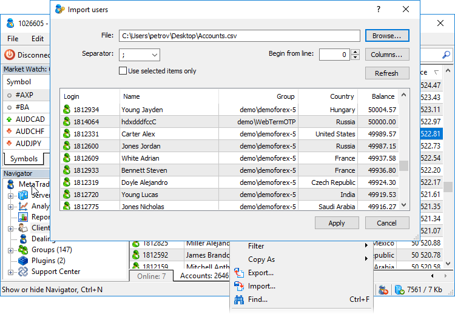
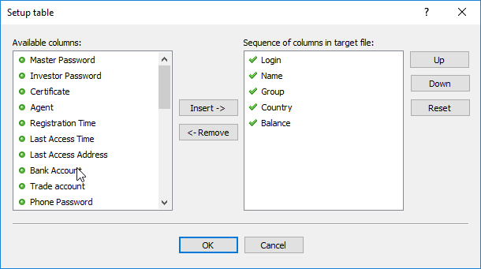

[🏠 Document Start](../README.md) / [Clients and Trading Accounts](README.md) / Importing Accounts

[Previous](Creation-of-Accounts.md) | [Next](Preliminary-Accounts.md)

# Importing Accounts (#importing-accounts)

The Manager terminal allows you to bulk import accounts to the trading platform from text files. To do this, select " Import" in the context menu of the account list.

The following commands are available in the account importing window:

  * File — path to a *.CSV file you need to import accounts from. Specify the path manually, or select the desired file using the Browse... button located to the right.
  * Separator — data separator in the file (comma, semicolon, tabulation character or space).
  * Start from Line — file line, starting from which data will be imported. For example, if you set 3, the first two lines in the file are skipped.
  * Columns — open the [data associating (#columns)](Importing-Accounts.md#columns) window in the imported file with appropriate fields in the system.
  * Use selected items only — if enabled, only rows currently selected in the preview window below are imported.
  * Refresh — refresh data in the preview window.

To see how an account will look after the import, double-click on it in the list or click View in its context menu.

Click Apply to import accounts. Status of the import will be displayed on the [Journal (#journal)](../User-Interface/Toolbox.md#journal) tab of the Toolbox window.

  * All accounts are imported as disabled. Later they can be manually enabled on the [Account (#enable)](Account-Trading-Settings.md#enable) tab.
  * You cannot import clients' financial data (balance) and security data.
  * After importing the accounts, set [passwords (#password)](Security-and-Certificates.md#password) for them.

  
---  
  

## Associating data (#columns)

This function allows you to match data in an imported file with the data fields of client records on the trading platform side. To start matching, click Columns in the import window.

Set the sequence of columns according to how they are located in an imported file in the right part of the window:

  * Add — add a selected available column to selected ones.
  * Remove — remove a selected column from the list of selected ones. The Login cannot be removed.
  * Up — move an added column upward relative to other columns.
  * Down — move an added column downward relative to other columns.
  * Reset — return default column settings.

You can also move columns by double-clicking on them.

The sequence of selected columns is very important, because this is the way they are associated with the fields in the system. To skip one or more columns in the source file, use the special "Skip column" item. For example, if this point is set third from top in the sequence, the third column in the imported file will be skipped.

> When importing accounts exported from the MetaTrader 4 platform, field matching is determined automatically.
