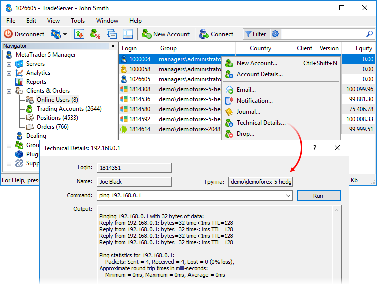

[🏠 Document Start](../README.md) / [Clients and Trading Accounts](README.md) / Online Accounts

[Previous](Clients.md) | [Next](Creation-of-Accounts.md)

# Online Accounts

This section contains accounts currently connected to the trade server. For convenience, each type of connection is indicated by a separate icon:  — desktop client terminal,  — Administrator terminal,  — Manager terminal,  — mobile terminal for Android,  — signal provider (connection to the account via a signal server), etc. If the user is connected to the same account from different devices/terminals, all connections will be shown as separate entries.

Apart from account data, here you can view technical details on their connection. In the list of accounts, you can see an IP address a client is connected from, or a domain name if the Enable DNS Lookup option is enabled in the context menu.

For more detailed information, click Technical Details... in the context menu, as shown above. Next, enter a network command to execute in the Command field. You can specify your own command or choose one of the commonly used ones: "ping", "tracert" or "whois". After clicking Run, the result is shown below.

To forcibly disconnect a client from the server, click Drop in the context menu. After the connection is dropped, the client terminals attempt to reconnect automatically.

> The Online Users tab can be hidden by pressing "Hide online users" in the [options (#online)](../MetaTrader-5-Manager/Terminal-Settings.md#online) of the Manager terminal. This reduces the load on the Manager terminal and saves network traffic.
