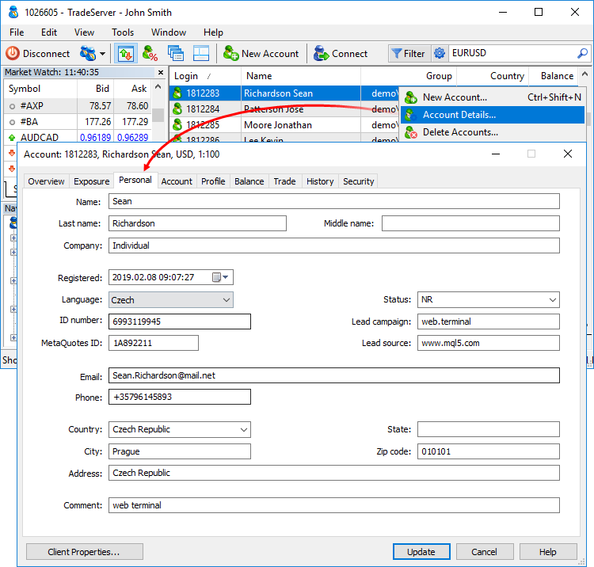
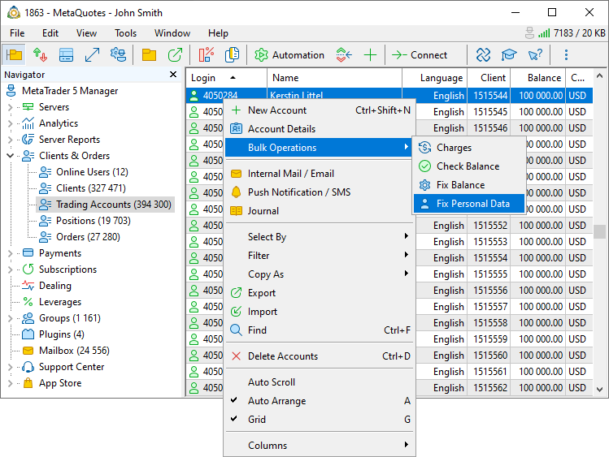

[🏠 Document Start](../README.md) / [Clients and Trading Accounts](README.md) / Personal Data

[Previous](Exposure.md) | [Next](Account-Trading-Settings.md)

# Personal Data (#personal-data)

Here you can view and edit account holder's personal data:

The following data is specified for an account:

  * Name — name of an account holder.
  * Last Name — second name of the account owner.
  * Middle Name — middle name of the account owner.
  * Company — name of an account holder's company.
  * Registered — account registration date. The date is added automatically during account creation. Please be careful when changing the registration date manually: the data should fit the account trading history, and thus there should not be any trading operations before the registration date. Otherwise, such operations can be ignored when generating [reports](../Server-Reports/README.md).
  * Language — user's language. If the account is created through the client terminal, the language is set automatically based on the terminal's interface language.
  * Status — status of an account holder, RE (resident) or NR (non-resident).
  * Lead Source, Lead Campaign — website, from which a client has come (lead source), and a name of a marketing campaign that attracted the client (lead campaign).  
These fields are used to analyze marketing campaigns and track where clients come from. To receive the data, add the following labels to the client or mobile platform download link:

https://download.mql5.com/cdn/web/metaquotes.ltd/mt5/mt5setup.exe?utm_source=YourWebsite&utm_campaign=YourCampaign  
https://download.mql5.com/cdn/mobile/mt5/ios?server=ABC-Demo,ABC-Real&utm_source=YourWebsite&utm_campaign=YourCampaign  
https://download.mql5.com/cdn/mobile/mt5/android?server=ABC-Demo,ABC-Real&utm_source=YourWebsite&utm_campaign=YourCampaign  
---  
  
Here YourCampaign is the company name, and YourWebsite is the address of the website hosting the link. In the "server" parameter of the mobile platform links, enter the list of your servers to be shown to traders when they open an account.  
When opening a demo account and connecting to any trading account via the terminal downloaded using such a link, utm_source and utm_campaign values are set in a client record at the server side. If the fields are already filled, the label values are not overwritten when re-connecting to the account (even if the terminal used for connection was downloaded by a link containing other labels).

  * ID number — number of a passport, tax ID or any other unique identifiers of an account holder.
  * MetaQuotes ID — during installation of mobile MetaTrader 5 for [iPhone](https://download.mql5.com/cdn/mobile/mt5/ios?hl=en&utm_campaign=download&utm_source=metatrader5.help "iPhone") or [Android](https://download.mql5.com/cdn/mobile/mt5/android?hl=en&utm_campaign=download&utm_source=metatrader5.help "Android") a unique MetaQuotes ID is provided to every user. This identifier is used like a phone number. After specifying MetaQuotes ID in the desktop version of the client terminal, users can send notifications of different trade events to their mobile devices. MetaQuotes ID is also supported at [MQL5.community](https://www.mql5.com/en "MQL4.com"): after specifying an ID in the profile, a user is able to receive important notifications from the website and communicate with other community participants via personal messages. You can find more details in the article [MetaQuotes ID in MetaTrader Mobile terminal](https://www.mql5.com/en/articles/476 "The article MetaQuotes ID in MetaTrader Mobile Terminal").  
MetaQuotes ID is added to the client record on the server side, once the client specifies it in the terminal settings. To [send a message](Push-Notifications-SMS-and-Mail.md) to the client, click Notification.
  * E-mail — e-mail address.
  * Phone — phone number.
  * Country — country of residence.
  * State — state (region) of residence.
  * City/Town — city/town of residence.
  * Zip code — zip or postal code.
  * Address — client's address.
  * Comment — text comment to an account.

  * When opening a demo account from the client terminal, the client's country and city/town are filled in using GeoIP data. If defining a location by GeoIP is impossible, a language of the client's operating system is used.
  * Lead Source and Lead Campaign data from terminal download links can be written to created accounts only if the broker has a [Finteza license](https://support.metaquotes.net/en/docs/mt5/platform/administration/integration/integration_finteza).

  
---  
  

## Automatic correction of personal data (#fix)

The manager terminal includes a function for automatic correction of personal data in the database of trading accounts:

  * Names are converted to the proper case: First Name Last Name.
  * Country names are converted to standard ones.
  * Phone numbers are formatted to a unified style: +countrycode number. If the phone number does not initially include a country code, it will be added according to the country specified in the account/client data.

To apply the function, select accounts and click "Bulk Operations\Fix Personal Data" in the context menu:

