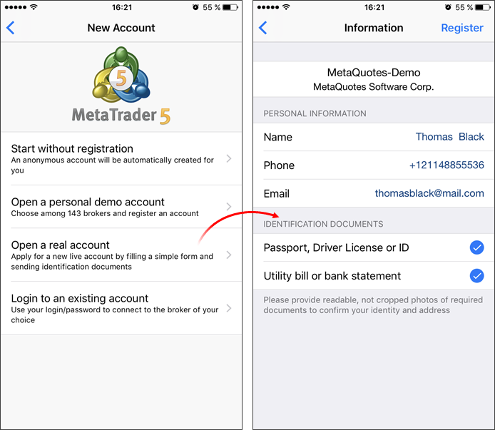

[🏠 Document Start](../README.md) / [Clients and Trading Accounts](README.md) / Preliminary Accounts

[Previous](Importing-Accounts.md) | [Next](Push-Notifications-SMS-and-Mail.md)

# Preliminary Accounts

Traders can send a request to a broker to open a real account directly from the desktop and mobile terminals. A user needs to fill in a simple request form with contact details, similar to the one used for demo accounts, and to additionally attach two documents to confirm their identity and address.

After that, a new account with a zero balance is created for the client in the Preliminary group. Trading is disabled for this group. After formalizing relations with the client, a manager can easily move the preliminary account to one of real groups, after which the client will be able to trade.

> View the video "[Increase conversion rate and optimize client management](https://support.metaquotes.net/en/articles/461)" for more details related to preliminary accounts.
