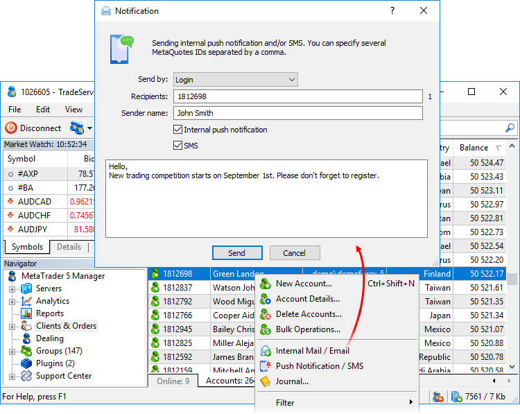
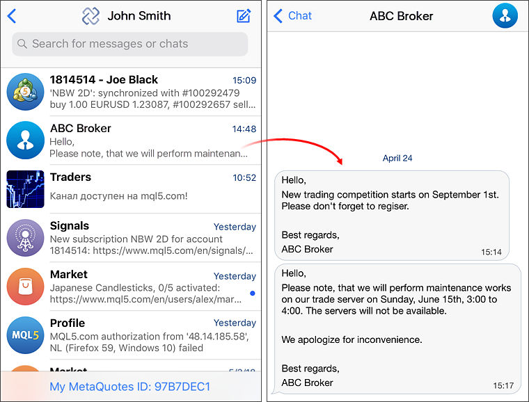
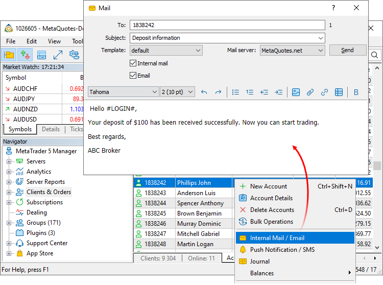

[🏠 Document Start](../README.md) / [Clients and Trading Accounts](README.md) / Push Notifications, SMS and Mail

[Previous](Preliminary-Accounts.md) | [Next](Account-Overview.md)

# Communication with clients: Push notifications, SMS and emails (#communication-with-clients-push-notifications-sms-and-emails)

The MetaTrader 5 platform provides fast and efficient tools for notifying traders about important server operation news or real account opening offers. Straight from the Manager terminal, you can send messages to mobile devices, as well as emails and internal mail messages.

## How to send push notifications (#how-to-send-push-notifications)

Push notifications are personal messages sent over the Internet. They do not depend on a phone number or a mobile network operator. Messages are delivered instantly: there is no need to run any applications on the receiver's device.

Messages are sent based on MetaQuotes ID, which is a unique user identifier. To obtain the ID, a user needs to install MetaTrader 5 Mobile for [iPhone](https://download.mql5.com/cdn/mobile/mt5/ios?hl=en&utm_campaign=download&utm_source=metatrader5.help "iPhone") or [Android](https://download.mql5.com/cdn/mobile/mt5/android?hl=en&utm_campaign=download&utm_source=metatrader5.help "Android").

> The Push Notifications permission should be enabled for a manager via MetaTrader 5 Administrator.

To send a notification, select Notification in the context menu of an account in the list. A similar command is available in the account edit dialog. Type the comma separated list of logins or MetaQuotes IDs and a message text. Ranges of logins can also be specified, e.g. 1000-2000.

  * MetaQuotes ID should be specified in the settings of appropriate accounts in order to send messages by specifying logins.
  * The maximum message length is 1024 characters.

  
---  
  
The sending mode affects the automatic signature in push notifications:

  * If you send messages specifying logins, the signature will contain the name of the Owner company from the settings of the group the accounts belong to. Use this type for White Labels to add a correct company name in the signature.
  * If MetaQuotes IDs are used, a company name from the Server License is specified in the signature.

Clients will immediately receive sent notifications on their mobile devices. Broker's push notifications appear in the special category of the Messages section in the mobile trading platform:

## How to send SMS (#sms)

SMS messages are sent similarly to Push notifications. Click "Push-notification / SMS" in the context menu of the account, then set logins and enter the text. The message will be sent to the phone number indicated in [account personal data](Personal-Data.md).

Some SMS providers support the specification of the message sender name. In this case, the received will see the company name instead of the phone number. Contact your platform administrator to find out whether this feature is supported by your provider. If it is, fill in the appropriate field when sending an SMS.

> The SMS sending option requires a properly configured list of providers available on the trade server. If the function is not available, please contact your platform administrator.

## How to send internal mail messages and emails (#mail)

The trading platform has an internal mail system. It enables brokers to send important information to traders: open account details, useful information about the platform features, upcoming events, etc. Clients can also send emails to managers via the system.

To send an email, select "Internal mail/Email" in the account menu. For bulk mailing, you can first select all the required account in the list. Their logins will be included in the "To" field.

When using Email instead of the internal mail, a more convenient option may be to send emails to a list of clients rather than accounts. Clients often have multiple accounts that use the same email address. Because of this, when sending emails to a list of accounts, the client may receive several identical messages. To avoid this, send emails from the [Clients](Clients.md) section. Select the desired entries in the list and click "Internal mail/Email" in the menu. The mailing list will only include unique email addresses from all the trading accounts linked to the selected clients.

Fill in the following fields in the email:

  * To — account number of the email recipient. The terminal allows the [sending of emails to multiple clients simultaneously (#mass-mail)](Push-Notifications-SMS-and-Mail.md#mass-mail).
  * Subject — email subject.
  * Template — any email can be saved as a template using the context menu. For example, you can save a typical maintenance works email as a template. To get a ready-made email afterwards, simply select the template in this field.
  * Internal mail — select this option to send a message using the internal mail system.
  * Email — use this option to send an email. The address specified in [account personal data](Personal-Data.md) will be used. Please note:

  * A mail server must be configured in the platform to enable email sending. If the feature is not available, please contact your platform administrator.
  * Messages sent by email are not displayed under the "Toolbox \ Mail" section. To check the sending, request the [trade server journal](../Managing-Trade-Server-Settings/Trade-Server-Journal.md) using the 'email' keyword. If an email has been sent successfully, the recipient address and the configuration name of the mail server through which the email has been sent, are shown in the log: email to someaddress@mail.net sent [MailServer].

By selecting  on the toolbar, you can attach a file to the email. Please mind the following attachment restrictions:

  * The size of one file should not exceed 8 MB
  * The total size of attachments should not exceed 16 MB
  * Up to 5 files can be attached

To enable the mailing feature, you should specify the mailbox name in the manager's account on the trade server. Also, the manager should have sufficient permissions. Contact the platform administrator to configure the account.  
---  
  
Below is the window for working with an email text. Commands for creating lists and inserting images, links and tables, etc. are available in the editor. To view or edit the source HTML code of the news, clickon the toolbar.

The context menu of the text editing window contains standard commands for working with the text: Copy, Cut, Paste, Insert Hyperlink, Insert Table and Insert Image. From the context menu, you can also work with [templates (#mail-template)](Push-Notifications-SMS-and-Mail.md#mail-template) of mails and [macros (#macro)](Push-Notifications-SMS-and-Mail.md#macro).

### Bulk mailing (#mass-mail)

The manager terminal supports emailing to user groups. The list of users is defined in the message field "To".

  * Multiple Logins — specify several usernames separated by a comma. For example, 1000, 1001, 1002.
  * Range of Logins — send emails to a range of logins, specify the range through a hyphen. For example, 1000-9000.
  * Group of Accounts — to send emails to a certain group, specify the following construction: "group:group name". For example, to send mails to group demoforex, in the To field specify group:demoforex. You can also specify several groups separating them by commas.
  * Country of Residence — emails can be sent to account holders living in a certain country. To do this, specify the following construction: "country:country name" in the To field. For example, to send mails to all clients who live in Germany, specify country:Germany. You can also specify several countries separating them by commas.
  * City of Residence — to send mails to clients in certain cities, specify "city:city name". You can specify several cities separated by commas.

In the To field, you can specify several delivery parameters separated by a semi colon (;). In this case the mail will be sent to all the clients who meet at least one of the specified parameters. For example, if you specify "group:demoforex, managers; city:Hamburg; 1000-2000", emails will be sent to all clients from 'demoforex' and 'managers' groups, all clients who live in Hamburg and to all of the clients from the accounts range from 1000 to 2000 inclusive.

When specifying the mailing parameters, you can use the negation sign "!". It allows the excluding of clients from the mailing list by a certain parameter. For example, if you specify "group:!managers", then messages will be sent to all the users except the ones who belong to the managers group.

> When sending an email, the system checks whether there are any clients with the specified delivery parameters. If there are no such clients, the email will not be sent. In this case a corresponding message will appear in the [journal (#journal)](../User-Interface/Toolbox.md#journal).

### Templates (#mail-template)

Use templates for a more convenient operation. They are available as HTML files which contain macros and enable email customization to address each recipient.

Use the email creation window context menu to work with templates.

All email templates are stored in the /templates/mail folder of the Manager terminal.

### Macros (#macro)

Using the "Macros" submenu of the context menu of the email creation window, you can insert macros in the text. They allow substituting different data depending on the email recipient.

  * Login (#LOGIN#) — the email/messenger recipient's Account number.
  * Name (#USERNAME#) — the first name and the last name of the recipient.
  * Currency (#USER_CURRENCY#) — the recipient's deposit currency.
  * Balance (#USER_BALANCE#) — the recipient's balance.
  * Credit (#USER_CREDIT#) — the credit amount on the recipient's account.
  * Equity (#USER_EQUITY#) — the equity amount on the recipient's account.
  * Leverage (#USER_LEVERAGE#) — account leverage.
  * Margin (#USER_MARGIN#) — the amount of funds reserved on the recipient's account.
  * Free margin (#USER_MARGIN_FREE#) — the free margin amount on the recipient's account.
  * Margin level (#USER_MARGIN_LEVEL#) — the margin level on the recipient's account.

These macros substitute email sending time in the message text:

  * Trading time — internal platform time.
  * Local time — time used in the computer on which the platform is installed.
  * UTC time — [UTC](https://ru.wikipedia.org/wiki/%D0%92%D1%81%D0%B5%D0%BC%D0%B8%D1%80%D0%BD%D0%BE%D0%B5_%D0%BA%D0%BE%D0%BE%D1%80%D0%B4%D0%B8%D0%BD%D0%B8%D1%80%D0%BE%D0%B2%D0%B0%D0%BD%D0%BD%D0%BE%D0%B5_%D0%B2%D1%80%D0%B5%D0%BC%D1%8F) time.

### Email history (#email-history)

The email sending history is displayed in the [Toolbox \ Mailbox tab (#mail)](../User-Interface/Toolbox.md#mail).
