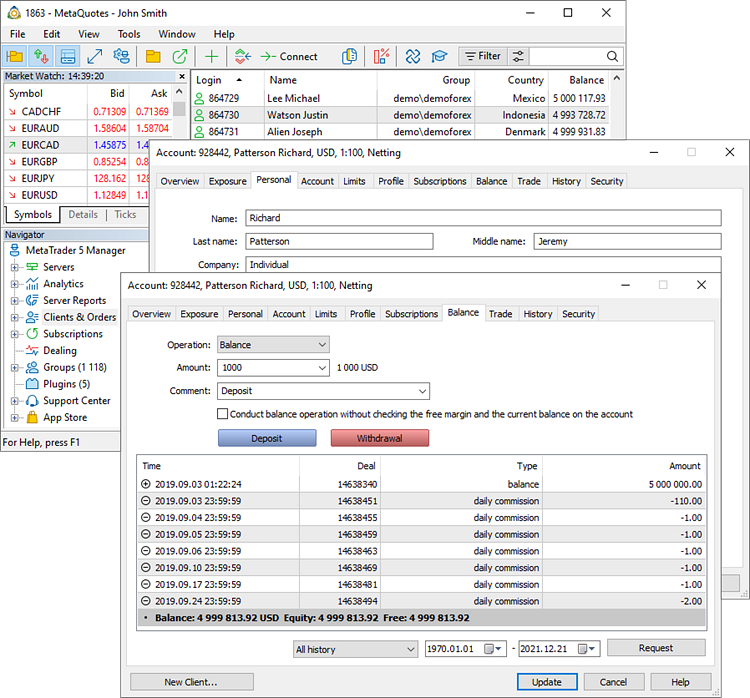
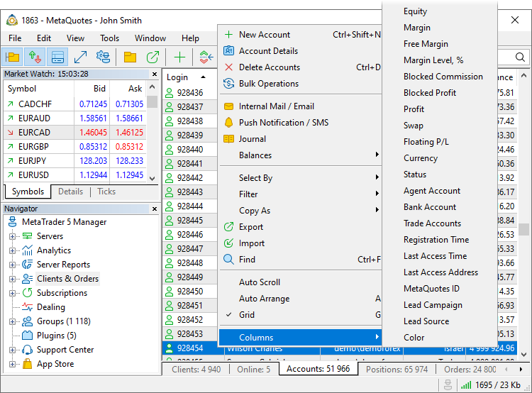
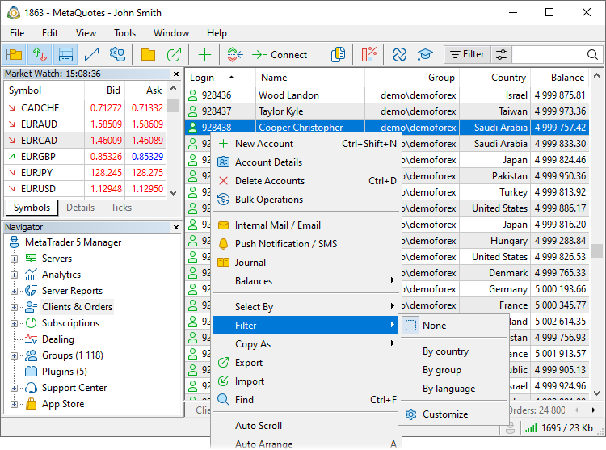
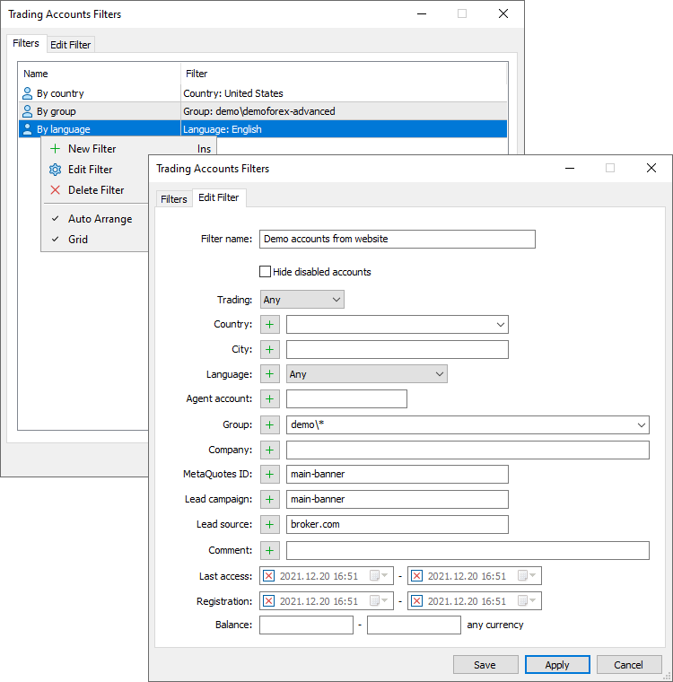

[🏠 Document Start](../README.md) / Clients and Trading Accounts

[Previous](../User-Interface/Hot-Keys.md) | [Next](Clients.md)

# Clients and Trading Accounts (#clients-and-trading-accounts)

The Manager terminal supports the full cycle of maintaining customers: [opening](Creation-of-Accounts.md) and configuring accounts, [depositing funds](Balance-Operations.md) and [performing trade operations](../Trading-Operations/README.md). Complete information is always available for each client: [personal data (#personal)](Clients.md#personal), all [open positions and orders](Account-Overview.md), account financial status and [history of all operations](Account-History.md).

You can also see the accounts which are [currently connected](Online-Accounts.md) to the trade server.

The context menu of Client, Trading Accounts and Online Users provides multiple commands:

  * The shown data can be managed using the Columns command.
  * Clients [can be informed](Push-Notifications-SMS-and-Mail.md) by using " Notification..." and " Email..." commands.
  * Details on clients' operations can be retrieved from [the trade server journal](../Managing-Trade-Server-Settings/Trade-Server-Journal.md) using the " Journal..." command.
  * For the fast [balance check based on the operations history (#fix)](Balance-Operations.md#fix) and for relevant corrections — the Balances submenu.
  * For convenient selection of customers and accounts in the list — the "Select by" submenu. Copy logins to the clipboard and click "Select By \ Logins from Clipboard" in the context menu. Accounts with these login numbers will be instantly found and selected in the list. You can similarly use the accounts list from a text file.

The context menu also allows you to [export](../MetaTrader-5-Manager/For-Advanced-Users/Data-Export.md) and [import accounts](Importing-Accounts.md), as well as perform [bulk operations](../Corporate-Actions-and-Bulk-Operations/Bulk-Operations.md). If Autoscroll is enabled, the list of clients and accounts is scrolled to the last one when a new trading account is added to the list. The scroll option only works if the count list is sorted by a login.

> Information about clients and accounts in some sections may be unavailable if a manager has not enough permissions. Permissions are appointed by the platform administrator.

## Account types (#type)

The following account types are available in the trading platform:

  *  — demo accounts to trade in a training mode without investing real money.
  *  — accounts used in trader contests.
  *  — [preliminary accounts](Preliminary-Accounts.md) for fast request of real accounts directly from client terminals.
  *  — live accounts for real trading.
  *  — an account for working with traders and managing the platform.

The account type is determined by the [type of the group (#group)](Account-Trading-Settings.md#group), in which the account is located:

  * Demo — the names of these groups contain "demo".
  * Manager — the names of the groups contain "manager".
  * Contest — the names of the groups contain "contest".
  * Preliminary — a group with the "preliminary" name.
  * Real — other groups that do not match the above conditions.

## Filtering accounts and clients (#filter)

Use filters for a convenient work with clients and accounts. All [clients](Clients.md) and accounts available to a manager are shown by default. You may use filters to view information, which correspond to selected criteria. For example, you can set the filter to display clients from a selected country, clients, who responded to a certain marketing campaign, or accounts with a certain language.

To apply a previously created filter, select it from the Filter menu. To return to the initial list of accounts, click "Not selected".

To create or edit filters, click Customize. The list of all previously created filters is shown in the Filters tab. Click twice on the filter to change its parameters.

Set a name of a filter and then configure parameters for filtering accounts:

  * Enabled only accounts — show only [enabled accounts (#enable)](Account-Trading-Settings.md#enable), disabled accounts will be hidden.
  * Trading — show accounts with the enabled or disabled [trading option (#limits)](Account-Trading-Settings.md#limits).
  * Country, City, Language — show accounts from a selected country, city or with a selected language. Such filters will be useful, for example, for sending information to clients in bulk via [email (#mail)](../User-Interface/Toolbox.md#mail) or [push notifications](Push-Notifications-SMS-and-Mail.md).
  * Agent account — show only accounts of a specified [agent (#agent-account)](Account-Trading-Settings.md#agent-account). The filter allows analyzing the work of agents.
  * Group — show only accounts from a specified group. This filter can be used for separate work with real and demo accounts.
  * Company — show accounts, in which this [company](Personal-Data.md) is specified. Such a filter is useful for working with corporate clients.
  * MetaQuotes ID — show accounts with this [MetaQuotes ID (#mqid)](Personal-Data.md#mqid) or all accounts which have any MetaQuotes ID. In the latter case, leave the field empty and invert the filter using the button.
  * Lead campaign, Lead source — show accounts with a specified [lead campaign and lead source (#leadsource)](Personal-Data.md#leadsource). This filter allows evaluating the efficiency of your marketing campaigns.
  * Comment — show accounts with a specified comment. This filter allows viewing accounts according to your own internal criteria.

The following filtering options are available for [online accounts](Online-Accounts.md):

  * Country, City — show accounts from the selected country or city. Such filters can be useful for sending bulk notification to clients, such as [emails (#mail)](../User-Interface/Toolbox.md#mail) or [push notifications](Push-Notifications-SMS-and-Mail.md).
  * Group — show only accounts from the specified group. This filter can be used for separate work with real and demo accounts.
  * Client — show accounts with the selected connection type: desktop, mobile, and manager terminals, API, etc. Use the filter to analyze what features are used by your clients.
  * Version — show accounts which use the specified client application build. The filter can be used to identify clients using old terminal versions.
  * Balance — show accounts having the balance within the specified range. When combined with the registration date filter, this option enables detection of inactive clients.
  * Equity — show accounts having the equity within the specified range. When combined with the balance filter, this option enables detection of clients with large floating profit or loss.

The following options are available for [client](Clients.md) filters:

  * Country, City, Language — show clients from the selected country, city or with the selected language. Such filters are useful for comprehensive audience analysis.
  * Company — show clients, in whose accounts this [company (#company)](Clients.md#company) is specified. Such a filter is useful for working with corporate clients.
  * Introducer — display clients, who were introduced by the specified user (the account number is specified). The filter allows analyzing the work of agents.
  * Assigned manager — show clients managed by the [specified assigned manager (#general)](Clients.md#general). The filter is useful for managers, working with clients, as well as for controlling the performance of such managers.
  * Lead campaign, Lead source — show clients with the specified [lead campaign and lead source (#leadsource)](Personal-Data.md#leadsource). This filter allows evaluating the efficiency of your marketing campaigns.
  * Type — display only private or only corporate clients in the list.
  * Status — display clients with a selected registration status in the list. For example, the filter can show clients with incomplete registration, inactive clients, etc.

The filter can be immediately enabled from the editing window by clicking Apply.

Filters enable selection of entries not only based on fields matching the specified value, but also by the "Except" and "Not empty field" parameters. Enter the desired value in the filter field and click , it will change to . The filter will select accounts/clients, the parameters of which do not match the specified value. For example, you can use the filter to get a list of accounts, which do not belong to the specified group, as well as a list of clients without an assigned manager. In the latter case, switch the filter mode and leave the field blank.
