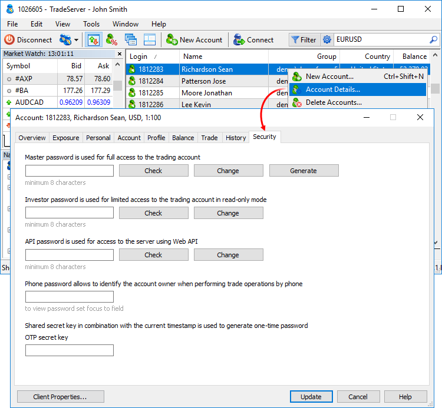
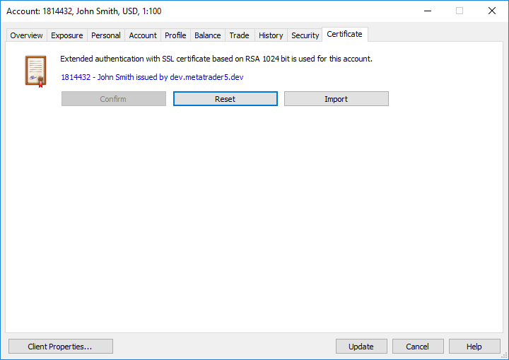

[🏠 Document Start](../README.md) / [Clients and Trading Accounts](README.md) / Security and Certificates

[Previous](Account-History.md) | [Next](../Trading-Operations/README.md)

# Security and Certificates (#security-and-certificates)

The Manager terminal allows you to control account security: passwords and certificates for connecting to the server. Security and Certificates tabs are used for that.

## Security (#security)

From this tab, you can manage different account passwords.

Up to four types of passwords can be used for each account.

  * Master password provides full access to an account including trading functions.
  * Investor password provides access to an account without the ability to perform trades. 
  * Web API password is required if the account is used for authorization via the web client written using [MetaTrader 5 Web API](https://support.metaquotes.net/en/docs/mt5/api/webapi). 
  * Phone password is used to identify an account holder while performing trade operations over phone.

To check or change a Master, Investor or Web API password, type it in the Password field. Then click Change or Check depending on the required action. Password check results are shown in a separate window after clicking Check. They are also displayed in the [Manager terminal journal (#journal)](../User-Interface/Toolbox.md#journal).

To create a random master password, click Generate. Next, select Change to assign the created password to your account. You can set other passwords in the same way. After generating the password, copy it into the required field.

To view a phone password, set the mouse cursor to Password field. To change it, specify a new one and click Update.

  * Master, investor, and Web API passwords must contain four character types: lowercase letters, uppercase letters, numbers and [symbols](https://learn.microsoft.com/en-us/style-guide/a-z-word-list-term-collections/term-collections/special-characters) (#, @, !, etc.). For example, 1Ar#pqkj. The minimum password length is determined by group settings, while the lowest possible value is 8 characters. The maximum length is 16 characters.

  * Once a password is changed, the connection of an account to a trade server is reset. A reconnection with the new password is required.

  
---  
  

### OTP secret key (#otp-secret-key)

The key is a link between the account and the [one-time password generator](../MetaTrader-5-Manager/For-Advanced-Users/One-Time-Passwords-2FATOTP.md) it is bound to. The key is a sequence of 16 characters generated based on the data about the device the MetaTrader 5 mobile platform is installed on.

Each account can be bound to only one password generator. When trying to rebind the account to a new generator, a one-time code from the previous generator should be entered.

If a user no longer has access to the bound password generator (for example, the mobile device is lost), the current OTP secret key can be deleted. In this case, account authorization via one-time passwords is disabled and the user is able to bind the account to the new generator.

If the user has forgotten the password for the password generator (PIN) while using the same mobile device, they may simply reinstall the mobile platform and rebind the account to the generator. No one-time password is required when rebinding an account to the generator on the same device.

# Certificates (#certificate)

The tab displays a type of a group authentication an account belongs to. If a standard authentication is used for a group, the tab is not displayed.

The tab displays data on a certificate that was generated or imported for an account. The data includes number of an account it has been generated for, account holder name, as well as a certification center that issued the certificate. Clicking on a certificate opens a detailed data about it in a separate window.

Commands for working with a certificate:

  * Confirm — enable additional [certificate confirmation (#confirm)](../MetaTrader-5-Manager/For-Advanced-Users/Extended-Authentication.md#confirm) for a client group. This improves the work safety. It is impossible to log in using a certificate until it is confirmed. After a client performs necessary actions, a manager can confirm his/her certificate with this command.
  * Reset — reset a [certificate](../MetaTrader-5-Manager/For-Advanced-Users/Extended-Authentication.md) if it has already been generated or imported for an account. It will become impossible to log in using this certificate. If certificates are generated on the server, a new one is assigned during the next account connection.
  * Import — import a certificate for an account. When clicking the button, the window for setting a certificate file (*.cer, *.crt) appears. The public part of a certificate is imported to the platform. When authorizing on the server, the client's certificate is compared to the one downloaded to the database. The presence of a private key in the client's certificate is additionally checked. The import function is provided for the possibility of using custom mechanisms for generating certificates.

> When you reset a certificate, the previously issued one becomes invalid. The next time you connect, the process of new certificate [generation (#generation)](../MetaTrader-5-Manager/For-Advanced-Users/Extended-Authentication.md#generation) and [authorization (#authorization)](../MetaTrader-5-Manager/For-Advanced-Users/Extended-Authentication.md#authorization) with its help will be performed.
