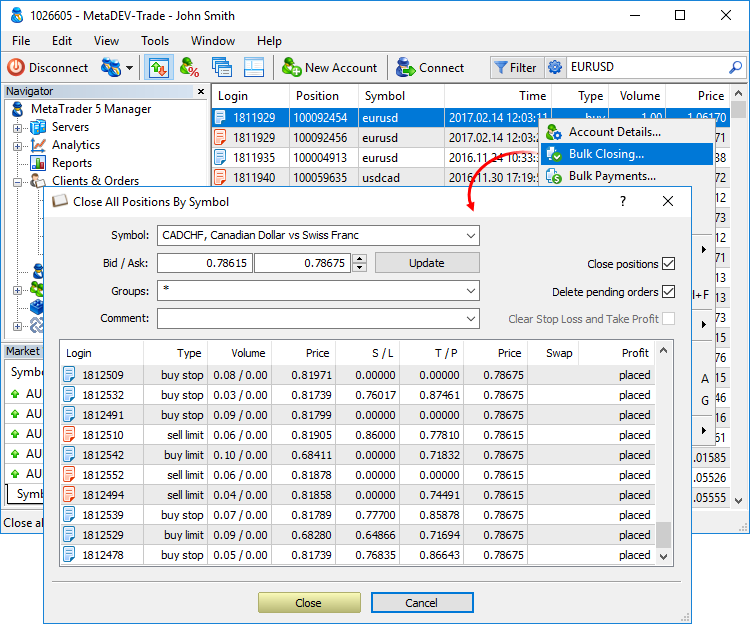

[🏠 Document Start](../README.md) / [Corporate Actions and Bulk Operations](README.md) / Bulk Closing

[Previous](README.md) | [Next](Bulk-Operations.md)

# Bulk Closing

The Manager terminal allows executing mass operations with trade positions for a selected symbol: close positions, delete orders and remove stop levels. To start performing bulk operations, click " Bulk Closing" in the context menu of the [Positions](../Trading-Operations/Working-with-Trading-Positions.md) or [Orders](../Trading-Operations/Working-with-Trading-Orders.md) section.

Specify the bulk operation settings:

  * Symbol — select a symbol to execute the bulk operations for.
  * Bid/Ask — Bid and Ask prices for closing positions (if the appropriate option is enabled). If you click the Update button, the current Bid and Ask prices are set here.
  * Groups — client group to execute the bulk operation for. If "*", the operation is performed for all groups.
  * Comment — comment, which will be written to all orders and deals executed as a result of the operation.
  * Close positions — close positions for a selected symbol.
  * Delete orders — delete all pending orders for a selected symbol.
  * Clear Stop Loss and Take Profit — delete all [stop losses (#stop-loss)](../Trading-Operations/Basic-Principles.md#stop-loss) and [take profits (#take-profit)](../Trading-Operations/Basic-Principles.md#take-profit) of the selected orders or positions. This function only sets these levels to zero, other parameters of the positions are not changed.

Depending on the type of bulk operations chosen, the lower part displays positions or pending orders for the selected symbol considering selected groups (or both positions and orders if both options are selected).

To close positions/delete orders, click Close in the lower part of the window.

The context menu of the preview of orders and positions allows configuring the list of trading operations: switch volume display mode (in lots or units) and profit (in money or points).
