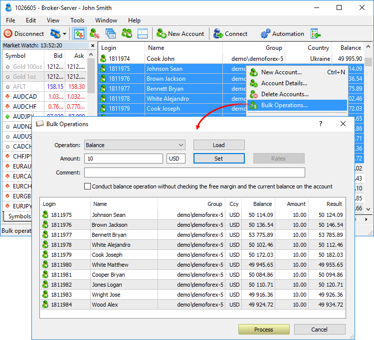
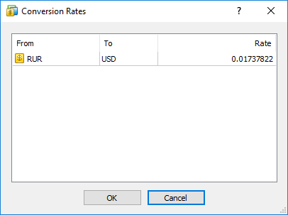

[🏠 Document Start](../README.md) / [Corporate Actions and Bulk Operations](README.md) / Bulk Operations

[Previous](Bulk-Closing.md) | [Next](Bulk-Payments-by-Positions.md)

# Bulk Operations

The Manager terminal allows performing balance operations for multiple accounts at once, for example, pay bonuses or charge commissions en masse. A set of accounts and operation amounts can be selected manually or imported from a CSV file.

Select one or several accounts (holding Ctrl or Ctrl+Shift) and click Bulk Operations... in the context menu.

Select the type of a balance operation:

  * Balance — changing an account balance.
  * Credit — issuing and repaying a credit.
  * Charge — any additional charges.
  * Correction — correction of trading results.
  * Bonus — bonuses. Operations of this type affect the credit assets of a client (Credit field).
  * Commission — additional commissions.
  * Dividend — paying taxable dividends.
  * Franked dividends — paying non-taxable dividends (tax is paid by a company, not a client).
  * Tax — charging a tax.

You can also add a comment to be included into each payment operation. If you want to add different comments to different users, prepare a list of charges in a CSV file and then import it. Specify comments in the file, in the Comment column.

All payments are performed in the form of transactions. By default, when conducting payment operations, the platform performs certain checks to ensure that the operation will not cause the account free margin and balance to become negative or its margin level to fall below 100%. If it does, the platform will not perform the operation and will display the "No money" error. If necessary, you can disable these checks by enabling the option "Conduct balance operations without checking the free margin and the current balance on the account".

> The free margin is not checked for the "Correction" operation. Be careful with withdrawal operations. If the client has open positions, and you deduct an amount greater than the free margin, Stop Out will trigger on the account.

To perform a transaction for the same amount for all clients, specify it in the Amount field and click Set. The amount will be displayed in the Amount column for all clients. In order to change the amount for a certain account, double-click it in the accounts table.

If a payment currency is different from a client deposit one, the amount is converted at the current exchange rate. Click Rates to see or modify it.

To modify the rate, double-click its value.

The list of accounts and operation amounts can be imported from a CSV file. The first value in the file (before the separator) sets logins, the second one defines operation amounts. For example:

1001;100   
1002;50.20   
1003;70.05  
---  
  
Click Process to execute operations. Three entries appear in the [journal (#journal)](../User-Interface/Toolbox.md#journal) for each performed operation:

2017.03.14 11:27:15.867 Trades '1026605': balance 10.00 Bonus for '1811955' done in 61 ms (Bonus)   
2017.03.14 11:27:15.866 Trades '1026605': accepted balance 10.00 Bonus for '1811955'   
2017.03.14 11:27:15.806 Trades '1026605': balance 10.00 Bonus for '1811955'  
---
