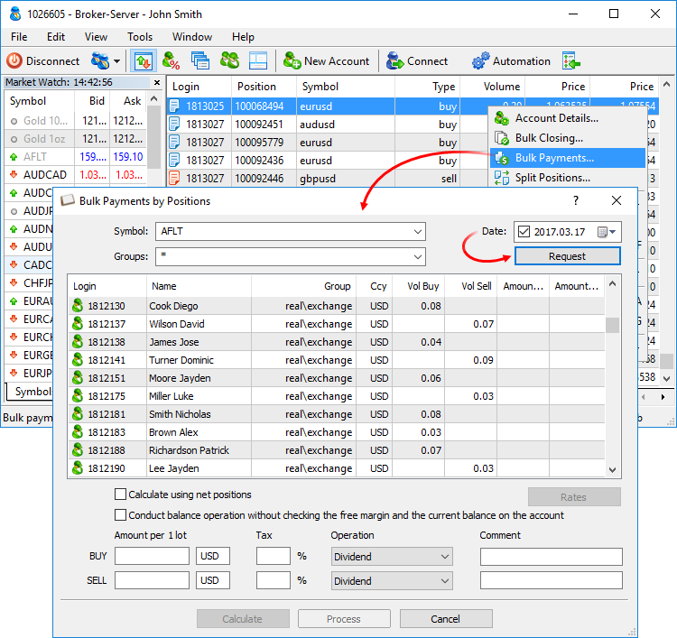
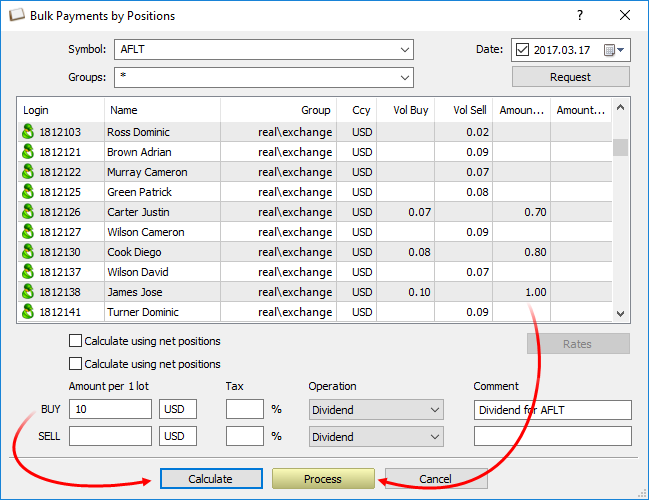
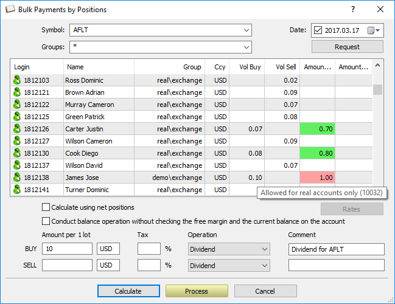

[🏠 Document Start](../README.md) / [Corporate Actions and Bulk Operations](README.md) / Bulk Payments by Positions

[Previous](Bulk-Operations.md) | [Next](Splitting-Positions.md)

# Bulk Payments by Positions

Unlike ordinary [bulk balance operations](Bulk-Operations.md), here you can calculate payments for actual traders' positions at a specified date. The function is primarily developed for calculating and paying dividends to shareholders according to the number of shares each of them has in possession.

Calculation and payments are performed for the positions status as of the selected date. If the date is different from the current one, data on actual clients' positions is taken from daily reports. Therefore, daily reports generation should be enabled for each client group separately on a trade server for such cases.

Click "Bulk Payments..." in the context menu of the Positions section and specify the following parameters:

  * The instruments of the positions for which the payments will be made. One symbol or a group of symbols can be selected from the list. Optionally, you can specify a comma separated list of trading instruments or groups of symbols. For example, Forex\*, CFD\*, Metals\GOLD.
  * The client groups for which the payments will be made.
  * Payment settlement date.

Click "Request" to display data on clients' positions for the selected symbols in the list. The data is taken from the last daily report available on the server at a specified date. To enable calculation for current positions, uncheck the Date field.

The volume of short and long positions in lots is displayed for each client. If hedging accounts are present among others, use a net volume for calculating payments (volume difference between buy and sell positions). To do this, enable the "Calculate using net positions" option.

By default, when conducting payment operations, the platform performs certain checks to ensure that the operation will not cause the account free margin and balance to become negative or its margin level to fall below 100%. If it does, the platform will not perform the operation and will write the "No money" error in the Status column. If necessary, you can disable these checks by enabling the option "Conduct balance operations without checking the free margin and the current balance on the account".

> Be careful when disabling margin and balance checks. Such payment operations may cause Margin Call or Stop Out on client accounts.

Specify a payment amount per each position lot and the payment currency. If a payment currency is different from a client deposit one, the amount is converted at the exchange rate valid during the daily report generation time. Click Rates to see or modify it.

To modify the rate, double-click its value.

The Tax field allows you to enter a percentage value to be deducted from a payment amount. For example, if the payment amount is 100 USD, while the Tax field is set to 3, clients are paid 97 USD per each position lot.

Next, select the operation type:

  * Balance — changing an account balance.
  * Credit — issuing and repaying a credit.
  * Charge — any additional charges.
  * Correction — correction of trading results.
  * Bonus — bonuses. Operations of this type affect the credit assets of a client (Credit field).
  * Commission — additional commissions.
  * Dividend — paying taxable dividends.
  * Franked dividends — paying non-taxable dividends (tax is paid by a company, not a client).
  * Tax — charging a tax.

A comment may additionally be added to be included into each payment operation. All payments are performed in the form of transactions.

> The free margin is not checked for the "Correction" operation. Be careful with withdrawal operations. If the client has open positions, and you deduct an amount greater than the free margin, Stop Out will trigger on the account.

Click Calculate to see preliminary payment results. They are displayed in the Amount Buy and Amount Sell (or Amount when using net positions).

> Any payment amount can be changed manually. Double-click the amount and enter a new value.

Make sure the amounts are correct and click Process. Payments are performed using balance operations of a selected type with a specified comment. Successfully paid amounts are highlighted in green. If a payment is not performed, it is highlighted in red. An error description can be seen in a tooltip.

