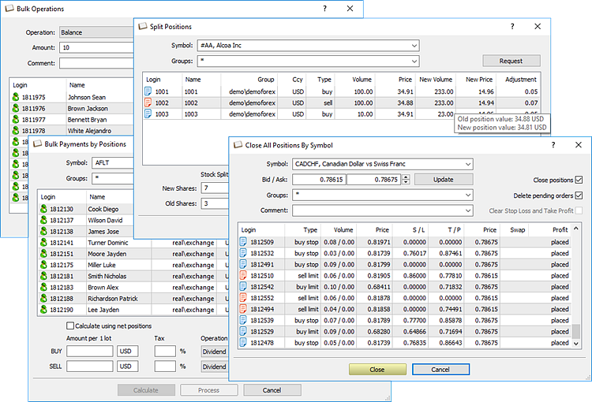

[🏠 Document Start](../README.md) / Corporate Actions and Bulk Operations

[Previous](../Trading-Operations/For-Advanced-Users/Collateral-Symbols.md) | [Next](Bulk-Closing.md)

# Corporate Actions and Bulk Operations

The Manager terminal allows you to perform bulk operations with trading accounts, as well as corporate actions with securities:

  * Close positions and remove pending orders, as well as clear stop loss and take profit levels in bulk
  * Perform funds depositing or withdrawal from trading accounts in bulk
  * Pay interest on securities
  * Split or consolidate securities

> Before performing bulk and corporate actions, please read the [general information on the platform's trading system](../Trading-Operations/Basic-Principles.md) and basic concepts.
