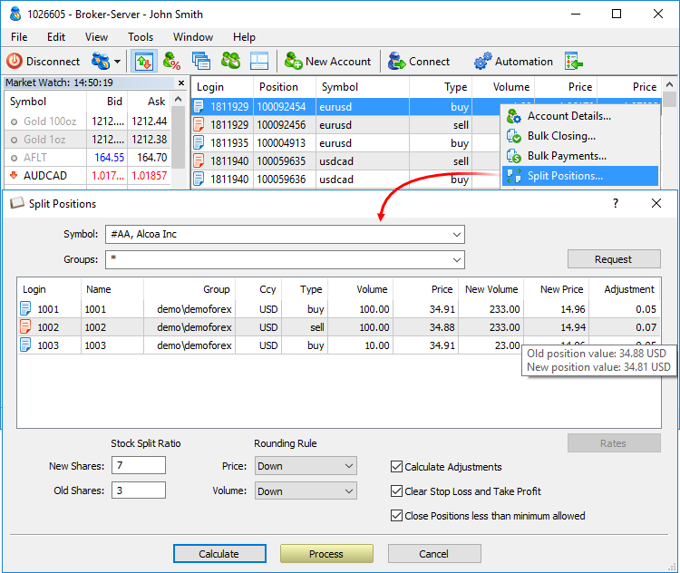

[🏠 Document Start](../README.md) / [Corporate Actions and Bulk Operations](README.md) / Splitting Positions

[Previous](Bulk-Payments-by-Positions.md) | [Next](../Dealing-and-Risk-Management/README.md)

# Splitting Positions

Split is an increase of the number of outstanding stocks by splitting them with a proportional decrease in their value. The opposite operation — consolidating (or reverse split) by decreasing a number of stocks with a proportional increase in their value — is possible as well.

The appropriate operations (stock splitting/consolidation) can be executed on the trading platform's side as well:

  * Transforming the current client's positions — assigning a new volume and price with the ability to remove stop loss and take profit levels.
  * Transforming the minute and tick symbol history (via MetaTrader 5 Administrator).

Click Split Positions in the context menu of the Positions section.

Select a trading instrument and a client group, and click Request. The list displays all open positions.

Set the split settings:

  * Use New Shares and Old Shares to set stock split/consolidation ratio.
  * Set the rounding rules for the new volume and price, in case a fractional number of stocks is left on a client's account after a split. For example, dividing 35 stocks using the 3:2 ratio results in 52.5 stocks. In this case, the number may be rounded down (against a trader) or up (in a trader's favor). A similar rounding may be applied to a price.
  * If the Calculate Adjustments option is enabled, a difference in money gained/lost by a client as a result of a split is withdrawn/deposited to their account as a separate balance transaction. Suppose that we perform a 2:1 split for a position with a volume of 3 lots, while the minimum lot for a symbol is 1 lot. The new volume should be equal to 1.5 lots but it is not allowed by the symbol settings. A new position will have a volume of 1 or 2 lots depending on the selected rounding rule. The price of 0.5 lot of a new position (calculated at the new price) is deposited/withdrawn via a balance operation. The cost is determined using the [profit calculation formula](https://support.metaquotes.net/en/docs/mt5/platform/administration/admin_symbols/admin_symbols_settings/symbol_settings_trade/profit_calculation) corresponding to the financial instrument type.  
For groups with [over-the-counter risk management mode (#risk)](../Managing-Trade-Server-Settings/Margin.md#risk), adjustments are calculated based on the difference in the position floating profit/loss before and after the split. In this case, it makes no sense to include the position value, since it does not affect the account state (the position is secured by margin).
  * It is recommended to clear trading positions' stop levels to avoid their activation after a split. To do this, enable the "Clear Stop Loss and Take Profit" option.
  * If the split operation will cause a position volume to become less than one contract, the split operation will be not performed. In such a case, the Manager terminal highlights the appropriate volume field in red. The positions, which cannot be split, can be bulk closed during the split operation. To do this, enable the "Close Positions less than minimum allowed" in the dialog.

After implementing all the settings, click Calculate to see the preliminary split results. The table displays a new price, a volume for each position, as well as a difference in money gained/lost by a client. Click Process to execute a split.

Existing positions are closed and then re-opened with a new price and volume. The tickets of the position remain the same as they were before the split. The split of each position on an account is implemented by performing two deals:

  * An Out deal with the 'Split' reason to close the existing position.
  * An In deal with the 'Split' reason to open a new position.

The ticket of the position affected by the deals is written to the "Position" field of both deals.

If adjustments are enabled, they are charged as separate balance operations.

## Specifics of rounding position volumes

When rounding the volume, calculations are made in contracts, not in lots. Let's consider an example:

  * We are splitting a position with a volume of 1.19 lots in a ratio of 1:3.
  * In accordance with the split settings, the resulting value is rounded up.
  * The contract size for the instrument is 100,000.
  * The volume change step for the instrument is 0.01

We calculate the position volume in contracts: 119,000 \ 3 = 39666.6666. The number of decimal places to which this value should be rounded is determined based on the volume change step in the number of contracts: 100,000 * 0.1 = 1000. The value does not have a fractional part, so the calculated value 39666.6666 will be rounded up to 39667 (up according to the split settings).

The resulting value is converted back to lots: 39667 \ 100,000 = 0.39667. The number of decimal places to which this value should be rounded is determined based on the volume change step in lots, which is 0.01. In this case, the value is always rounded down so that there is no "extra" volume as a result of the split. Thus, the final position volume after the split will be 0.39 lots. If we rounded up, we would get an "extra" volume. This can be checked by performing a reverse split: 0.40 * 3 = 1.20 instead of the original 1.19.
