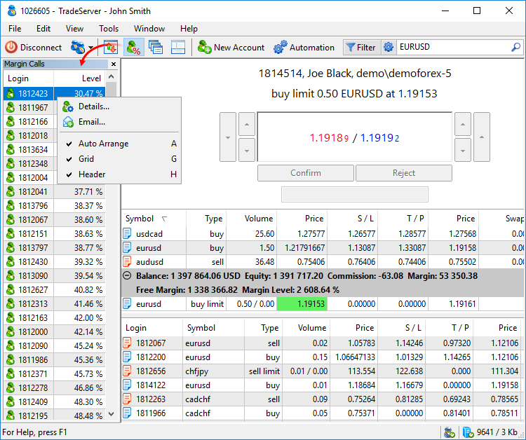

[🏠 Document Start](../README.md) / [Dealing and Risk Management](README.md) / Accounts with Margin CallStop Out

[Previous](Dealing.md) | [Next](Queue-of-Trade-Requests.md)

# Accounts with Margin Call/Stop Out (#accounts-with-margin-callstop-out)

The Manager terminal allows tracking accounts with insufficient funds to cover open positions and pending orders. There are two conditions of an account with insufficient funds:

  * Margin Call — an account will soon have no funds to cover open positions. If the account is not replenished, the Stop Out condition may occur.
  * Stop Out — an account has no enough funds to cover open positions. When this state occurs, trading positions and orders on the account are forcibly closed.

Both levels are configured separately for each client group on the trade server. They are set as a threshold value of the "Margin level" parameter (calculated as Funds / Margin * 100) or "Funds" on a trading account.

A separate window is available in the terminal to track Margin Call accounts. To open it, select " Margin Call" in the [View (#view)](../User-Interface/Main-Menu.md#view) menu or on the [toolbar](../User-Interface/Toolbar.md).

The level of funds in the window is shown in percent or money, depending on how the Margin Call and Stop Out levels are configured in the client group settings (by margin or funds level). If an account has a red background, then it is already in Stop Out state.

Use the [internal email system (#mail)](../User-Interface/Toolbox.md#mail) in the context menu to quickly inform a client about the lack of funds on the account. Select the account and click  E-Mail... To view detailed information about the client, double-click the account number.

## Stop out auto processing (#stopout-processing)

When Stop Out is processed automatically by the server (not a plugin or a manager), forced order removal and position closing are performed as follows:

  * Client's pending orders that are currently not in the process of execution are analyzed.
  * An order requiring the greatest amount of margin is removed.
  * If Equity (or Margin level, depending on how the SO level is determined) is still under the stop out level, the next order is deleted. Orders with no margin requirements are not deleted.
  * If Equity (or Margin level) is still under the stop out level, the server closes a position with the largest loss.
  * Positions are closed until Equity (or Margin level) becomes higher than the stop out level.

  * [Netting accounts (#netting)](../Trading-Operations/Basic-Principles.md#netting) allow partial position closure by Stop out if the volume of the position to be closed exceeds the maximum allowable volume for the symbol. For example, a trader has a 50-lot position, while the [maximum permissible deal volume (#specification)](../Trading-Operations/Market-Watch.md#specification) is 20. In the event of a Stop out, the platform will first close 20 lots of the position. If after this the client's funds level is still below the threshold, the platform will close the next 20 lots. Otherwise, the trader will have part of the position remaining open. In this case, the position comment will indicate [so XX%], where XX is the margin level at which Stop out occurred.

If the forced deletion of orders and closing of positions are not performed by the server, that can be automated in the Manager terminal. Enable the following options at the [Automation (#automation)](../MetaTrader-5-Manager/Terminal-Settings.md#automation) tab in the terminal settings:

  * Delete Stopout Pending Order — enable to delete pending orders with a margin reserved.
  * Close Stopout Positon — enable to delete most unprofitable positions.

The mechanism of processing a Stop out situation by the Manager terminal is similar to automatic processing by the server.
