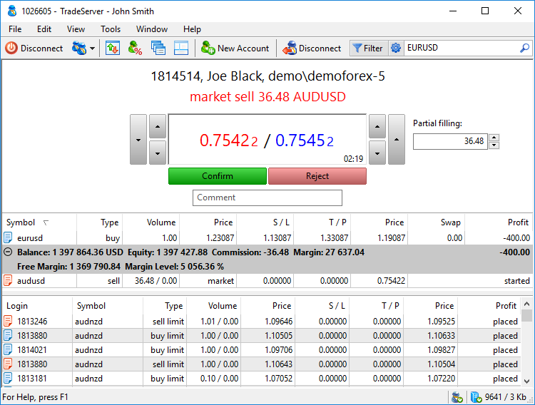
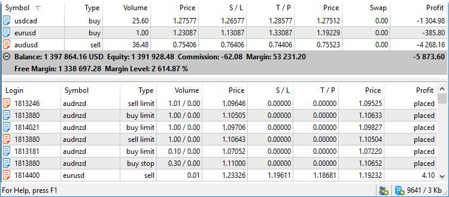
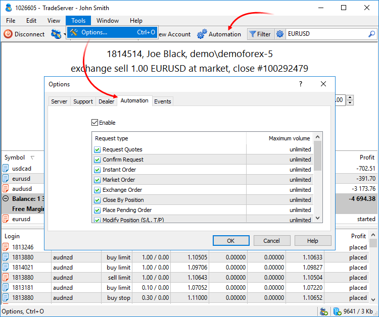
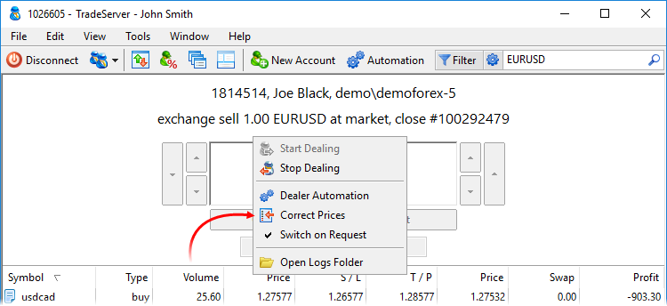
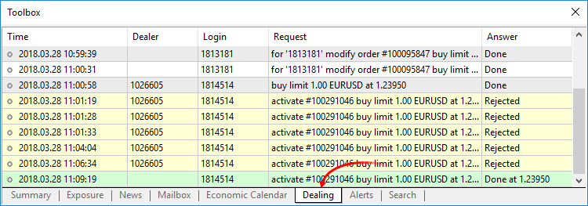

[🏠 Document Start](../README.md) / [Dealing and Risk Management](README.md) / Dealing

[Previous](README.md) | [Next](Accounts-with-Margin-CallStop-Out.md)

# Dealing — Processing Client's Trade Requests (#dealing-processing-clients-trade-requests)

Dealing — one of the main functions of the Manager terminal. Managers can process trading requests from clients: confirm and reject them and issue prices for execution of trades.

To process trade requests, select " Start Dealing" in the [File (#file)](../User-Interface/Main-Menu.md#file) menu or on the toolbar. After that, the Manager terminal starts accepting trade requests from clients from the general queue of trade requests. Dealers receive requests only from the clients available to them. While a request is processed by one dealer, another one cannot receive and process it. Dealers have a certain time to process a request. This time is set in the [Manager terminal (#timeout)](../MetaTrader-5-Manager/Terminal-Settings.md#timeout) settings. It is shown in the quotation field. If the dealer does not process a request within the specified time, it is rejected automatically.

When a request is received, a dealer immediately sees the current trading account status including open positions and pending orders. Besides, the dealer sees the list of orders located close to the market price that can be triggered soon.

### Client data (#client-data)

Account number, as well as client's name and group are displayed for each incoming request.

### Request data (#request-data)

A type (for example, instant sell, request buy), volume, trading symbol name and price (if a request is set at a constant price) are displayed for each request.

### Quote field (#quote-field)

The main part of the quote field contains Bid and Ask prices as of the moment a request was accepted for processing. Using arrow buttons you can change the price, at which the request will be processed. Large buttons change both prices, small ones — individually. If you enable ["Throw in prices at request answer (#prices)](../MetaTrader-5-Manager/Terminal-Settings.md#prices), specified prices are automatically thrown to a price flow when confirming a request.

Remaining time for a request processing. If the dealer does not answer within the specified time, the request is rejected automatically. The response time is set in the [Manager terminal settings (#timeout)](../MetaTrader-5-Manager/Terminal-Settings.md#timeout). Price, volume or time, at which an alert is triggered.

Here you can set a volume used to execute an incoming request. This allows for partial execution of orders.

This field is available only if the execution order from the trader indicates the [execution policy (#fill-policy)](../Trading-Operations/Basic-Principles.md#fill-policy) that allows the execution of the order in an incomplete volume.

In this field, a dealer can indicate a reason for the refusal in the order execution. The comment is displayed in the order placing window in the client terminal. The maximum comment length is 32 symbols.

Buttons for answering a trade request:

  * Confirm — confirm request execution at prices and for the volume specified in the quoting field.
  * Reject — reject the request; in this case the request is not executed and deleted from the queue, while a trader will receive an appropriate warning in the terminal.

The current state of the account, a request from which is currently being processed: [open positions](../Trading-Operations/Working-with-Trading-Positions.md), [account state (#state)](../Clients-and-Trading-Accounts/Account-Overview.md#state), [pending](../Trading-Operations/Working-with-Trading-Orders.md) and unprocessed orders (including the request that is currently being processed). Double-click a position or an order to move to the account dialog.

The context menu allows to configure display: volumes (lots or units) and profits (money or points), enable columns auto sizing etc.

Orders and positions located close to the market price and may soon be triggered. More details are provided below.

  * Account information is displayed in the color specified in its [settings (#color)](../Clients-and-Trading-Accounts/Account-Trading-Settings.md#color). The background color allows the dealer to identify a trader when processing a trade request. For example, color can highlight potential frauds or important clients.
  * The dealing section, as well as buttons for connecting by the dealer in the [main menu](../User-Interface/Main-Menu.md) and on the [toolbar](../User-Interface/Toolbar.md) may not be present if the manager account has no Dealer permission. This permission can be granted by a trade server administrator.

  * Left-clicking on the quoting field substitutes the current market price of the instrument.

  * It is possible to quickly change the price value by a certain amount by holding Ctrl or Shift, while pressing arrows: Shift — by 5 points, Ctrl — by 10 points, Ctrl+Shift — by 50 points.

  
---  
  

## Trade request data (#requests-info)

Upon receiving a request, the Manager terminal displays its details (type, volume and price) to a dealer. Examples of all possible request types are provided below.

Request type | Description | Example | Interpretation  
---|---|---|---  
Request of Quotes | Request of quotes in the Request [execution mode (#execution-type)](../Trading-Operations/Basic-Principles.md#execution-type). | prices for EURUSD 1.00 | Request of prices to execute a trade operation on 1 lot of EURUSD.  
Request Confirmation | The option of additional order confirmation can be enabled in symbol settings. Upon receiving quotes from a dealer in the Request execution mode and agreeing to them, a trader sends a request to execute a deal. The dealer should re-confirm execution of this request (specifying execution mode, deal direction, volume, symbol and price). | request sell 1.00 EURUSD at 1.22788 | Request to sell one lot of EURUSD at 1.22788.  
Instant Order | Order confirmation in the instant execution mode. | instant sell 1.00 EURUSD at 1.22788 sl: 1.22000 | Request to sell one lot of EURUSD at price 1.22788 with Stop Loss level equal to 1.22000.  
Market Order | Order confirmation in the market execution mode. | market sell 1.00 EURUSD | Request to sell one lot of EURUSD.  
Exchange Order | Order confirmation in the exchange execution mode. | exchange sell 1.00 EURUSDl | Request to sell one lot of EURUSD.  
Placing a Pending Order | Placing a [pending order (#pending-order)](../Trading-Operations/Basic-Principles.md#pending-order). | buy limit 1.00 EURUSD at 1.22000 | Placing a pending order Buy Limit for one lot of EURUSD at level 1.22000.  
Position Modification (S/L, T/P) | Request to change levels of [stop loss (#stop-loss)](../Trading-Operations/Basic-Principles.md#stop-loss) or [take profit (#take-profit)](../Trading-Operations/Basic-Principles.md#take-profit). | modify buy 1.00 EURUSD (sl: 1.22000, tp: 0.00000) | Changing levels of stop loss and take profit of a position for buying one lot of EURUSD to 1.22000 and 0.00000, respectively.  
Pending order modification | Request to [modify (#modify-delete)](../Trading-Operations/Working-with-Trading-Orders.md#modify-delete) a pending order. | modify #123456 buy limit 1.00 EURUSD at 1.23000 (sl: 1.22000, tp: 0.00000) | Modify the Buy Limit order of one lot of EURUSD with unique number 123456. The order is placed at price 1.23000 with stop loss level at 1.22000 and no take profit level.  
Deleting a Pending Order | Request to [delete (#modify-delete)](../Trading-Operations/Working-with-Trading-Orders.md#modify-delete) a pending order. | cancel #123456 buy limit 1.00 EURUSD at 1.23000 | Delete the Buy Limit order of one lot of EURUSD with unique number 123456 that was placed at level 1.23000.  
Pending Order Activation | [Activation (#activate)](../Trading-Operations/Working-with-Trading-Orders.md#activate) of a pending order, when conditions specified in it occur ("activate", unique number of the order). | activate #123456 buy limit 1.00 EURUSD at 1.23000 | Activate the Buy Limit order of one lot of EURUSD with unique number 123456, at price 1.23000.  
Activation of Stop Loss | Activation of an order to close a position when a stop loss level is reached. | activate stop loss buy 1.00 EURUSD (sl: 1.23000) | Close a position to buy one lot of EURUSD at stop loss price 1.23000.  
Activation of   
Take Profit | Activation of an order to close a position when a take profit level is reached. | activate take profit buy 1.00 EURUSD (sl: 1.23000) | Close a position to buy one lot of EURUSD at take profit price 1.23000.  
Activation of a   
Stop Limit order | Activation of a stop limit order Buy Stop Limit or Sell Stop Limit. | activate stop-limit order #123456 buy stop limit 1.00 EURUSD at 1.23000 | Place the Buy Limit order for one lot of EURUSD at level 1.23000 based on the activated Buy Stop Limit order with unique number 123456.  
Deleting a Pending order by Stop Out | Deleting a pending order when a client reaches a stop out level. | delete stop-out order #123456 buy limit 1.00 EURUSD at 1.23000  | Delete the Buy Limit order placed for one lot of EURUSD at level 1.23000 with the unique number 123456.  
Position Closing by Stop Out | Closing a position when a client reaches a stop out level. | close stop-out position buy 1.00 EURUSD at 1.23000 | Close a position to buy one lot of EURUSD at price 1.23000.  
  
> In the Manager terminal, you can set up automatic processing of some of the requests listed above.

## Orders and positions closest to the market (#closest-orders)

Under the field displaying the state of an account, you can see the list of orders and positions that are closest to the market. Thus, a dealer always has data on orders that may trigger in the near future.

This list displays positions, whose [stop loss (#stop-loss)](../Trading-Operations/Basic-Principles.md#stop-loss) and [take profit (#take-profit)](../Trading-Operations/Basic-Principles.md#take-profit) levels are closest to the market prices of the corresponding symbols. Also, it displays pending orders, whose trigger prices are closest to the market prices.

Take profit and stop loss fields of positions as well as the Price field of pending orders are highlighted with different colors depending on the distance to the current market price:

  * Triggered levels are highlighted in red.
  * The Stop Loss level which has not yet triggered are highlighted in pink.
  * For the symbols with 5 decimal places: if the distance to the current price is 100 points or less, the Take Profit levels and pending order activation prices are highlighted in yellow.
  * For the symbols with 3 decimal places: if the distance to the current price is 10 points or less, the Take Profit levels and pending order activation prices are highlighted in yellow.

The Profit field is also highlighted in red if the account is under stop out.

> The specified highlight distances are used for symbols with five- and three-digit quotes. For symbols with four- and two-digit quotes, the highlight distance is ten times less.

## Automatic processing of trade requests (#automation)

In the Manager terminal, you can enable automatic processing of trade requests of certain types. You can set types of requests and volume limitations in the terminal settings on the [Automation (#automation)](../MetaTrader-5-Manager/Terminal-Settings.md#automation) tab.

For quick enabling/disabling the automatic processing mode, use the " Automation" button on the [toolbar](../User-Interface/Toolbar.md).

> After you enable the automatic processing, you should manually handle the current request. Only after that, the automatic processing is started.

## Additional dealer tools (#additional)

The context menu of the Dealing section allows you to quickly manage terminal settings related to processing trade requests:

The following commands are available here:

  *  Automation — enable/disable auto processing of trade requests.
  *  Correct Prices — [automatically throw in quotes (#prices)](../MetaTrader-5-Manager/Terminal-Settings.md#prices) to a price flow when replying to a trade request. The prices, at which a request is executed, are thrown to the flow.
  * Switch on Request — automatically switch to the dealer window when a new trade request arrives.
  *  Open Logs Folder — open the folder storing the trade request processing journal (dealing.log).

## Dealing log (#journal)

The Manager terminal keeps track of processed requests and records information about dealer's actions in a special log.

The log displays trade processing time, dealer's and client's logins, request and answer descriptions. The possible answers are:

  * Done — request was executed at a specified price.
  * Rejected — request was rejected.
  * Prices — specified prices were suggested to the trader for executing the request.

  * Server time is displayed in the dealer's journal entries.
  * Dealer's journal entries are stored in a [separate file (#dealing)](../MetaTrader-5-Manager/For-Advanced-Users/Files-and-Folders.md#dealing).

  * If a manager has Supervisor permission (granted in the Administrator terminal) while not connected as a dealer, this tab displays results of processing requests by other dealers. Managers are able to track processing requests coming from client groups available for them.

  
---  
  
Journal entries are highlighted in different colors depending on how a request is processed by a dealer:

  * Orders triggered in worse conditions than the current market ones (buying above the current price, selling below it) are highlighted in green.
  * Rejected requests are displayed in yellow.
  * Orders triggered in better conditions than the current market ones (buying below the current price, selling above it) are highlighted in red.
  * Orders triggered at a requested price are highlighted in white.

The log's context menu allows [viewing an account](../Clients-and-Trading-Accounts/Account-Overview.md), open the dealer's log folder (dealing.log), as well as configure the tab view.
