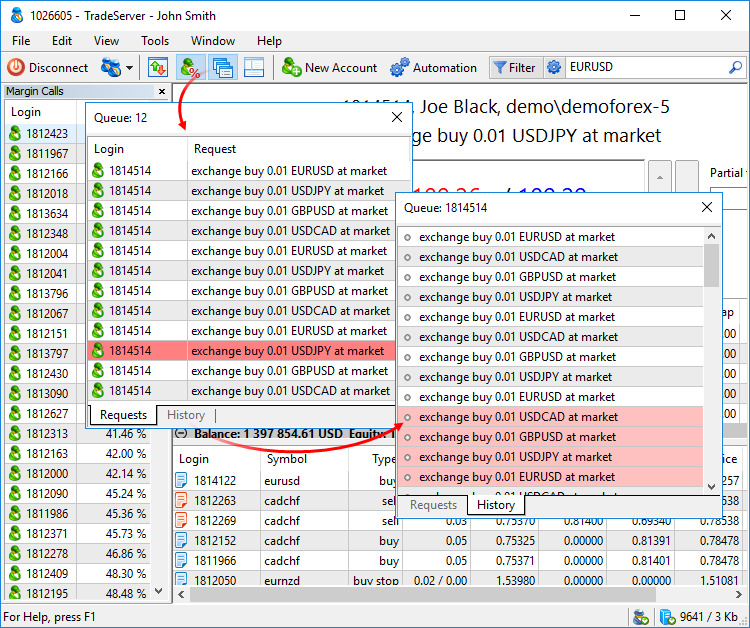

[🏠 Document Start](../README.md) / [Dealing and Risk Management](README.md) / Queue of Trade Requests

[Previous](Accounts-with-Margin-CallStop-Out.md) | [Next](Quoting-and-Symbol-Management.md)

# Queue of Trade Requests

A manager can view the list of trade requests waiting to be processed. Also, when receiving a new client's request, the manager can see the history of the client's previous requests. A separate window is provided for that in the Manager terminal. To open it, click " Queue" in the [View (#view)](../User-Interface/Main-Menu.md#view) menu or on the [toolbar](../User-Interface/Toolbar.md).

All requests pending processing are shown here. They are listed in the order they were received: from older to newer ones. The request that is currently processed by a dealer is displayed on a red background.

  * Requests start coming to the terminal as soon as a manager [connects in the dealing mode](Dealing.md).
  * If a manager has Supervisor permission (granted in the Administrator terminal) while not connected as a dealer, then in this window, they see the entire queue of requests coming from client groups available to them.

  
---  
  
The History tab displays the history of requests of the client, whose request is currently being processed by a dealer. This allows monitoring the client's trading activity. If a request has the red background, it means it was rejected by the dealer.

In order to automatically switch to the History tab at the beginning of request processing, enable Track Requests option in the context menu. To see the [client's details](../Clients-and-Trading-Accounts/Account-Overview.md), double-click the account or the request on any of the tabs. 
