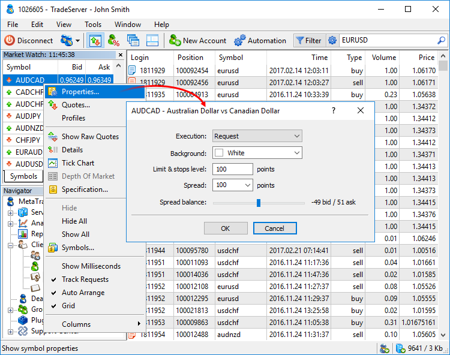
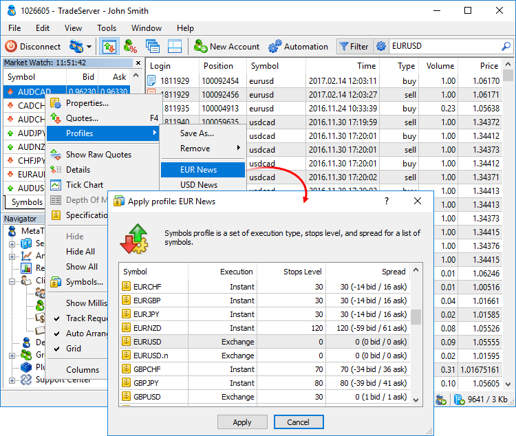
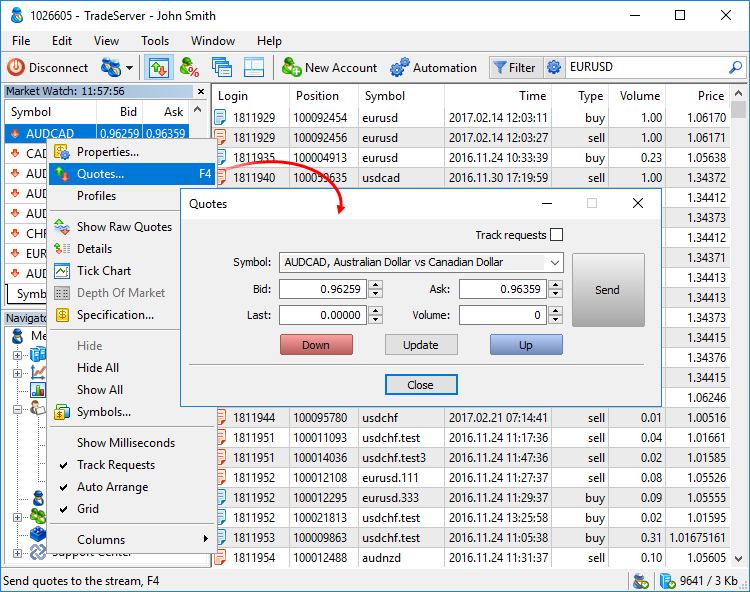

[🏠 Document Start](../README.md) / [Dealing and Risk Management](README.md) / Quoting and Symbol Management

[Previous](Queue-of-Trade-Requests.md) | [Next](Summary-Positions-and-Coverage.md)

# Quoting and Symbol Management (#quoting-and-symbol-management)

The Manager terminal allows [throwing in quotes to the price flow (#quotes)](Quoting-and-Symbol-Management.md#quotes), as well as change financial symbol settings. For example, a manager can expand a spread and a channel, within which the modification of stop levels is prohibited, when important economic news are released. 

## Managing financial symbol settings (#properties)

With appropriate rights, a manager can configure some financial symbol settings. Such rights can be given by a server administrator. To open the symbol settings window, click " Properties" in the context menu of the [Market Watch](../Trading-Operations/Market-Watch.md) window.

The following settings are available in this window:

  * Execution — [execution type (#execution-type)](../Trading-Operations/Basic-Principles.md#execution-type) by symbol: Instant, Request or Exchange.
  * Background — background color of a symbol name. This will be the color of the symbol background in the [Market Watch](../Trading-Operations/Market-Watch.md) window.
  * Limit & stops level — channel of prices (in points) from the current price, inside which one cannot place [stop loss (#stop-loss)](../Trading-Operations/Basic-Principles.md#stop-loss), [take profit (#take-profit)](../Trading-Operations/Basic-Principles.md#take-profit) and pending orders. If you try to place an order inside the channel, the server returns Invalid Stops and does not accept the order.
  * Spread — spread in points. If this field is set to "0", then the spread is considered to be floating, i.e., formed on the basis of quotes received from data feeds. If you set here a value other than "0", then the spread will be fixed and calculated for the symbol by using the "Spread balance" parameter.
  * Spread balance — if a fixed spread is set in the Spread field, using this function, you can set the direction and size of deviation of the symbol price (Bid + (Bid-Ask)/2) to form prices Bid and Ask. For example, if the spread is set equal to "3", and the balance spread "-2 bid/1 ask", then the Bid price will be equal to the symbol price - 2 points, and the price of Ask - an average price of the symbol + 1 point.

> To change settings for several characters simultaneously, use [profiles (#profile)](Quoting-and-Symbol-Management.md#profile).

## Profiles (#profile)

Profiles are sets of [symbols of financial instruments (#properties)](Quoting-and-Symbol-Management.md#properties). They allow quickly switching between the settings of symbols when the market situation changes. The following symbol settings are saved in a profile:

  * Execution
  * Background
  * Limit & Stop levels
  * Spread
  * Spread balance

Working with profiles is carried out by using the Profiles command in the context menu of the [Market Watch](../Trading-Operations/Market-Watch.md) window.

To create a profile, configure symbols in the Market Watch window, and then click Profiles - Save As. The profile saves all the settings for all symbols present in the Market Watch window at the time of saving. To apply a profile, simply select it from the list of available (previously saved) ones:

Before applying the profile, a window with all the symbols and settings that it contains is displayed. Check them and click Apply.

## Quotes (#quotes)

The Manager terminal allows throwing in quotes to the price flow translated from the server. To do this, click " Quotes" in the context menu of the Market Watch window or press F4.

This window contains the following settings and commands:

  * Track requests — if enabled, [at the receipt of a new trade request](Dealing.md) from a client, the symbol of the request will be pre-selected in the Quotes window. Tracking works only when the Quotes window is open.
  * Symbol — symbol, whose quote should be thrown in. To select a different symbol, click this field.
  * Bid — Bid price of the quote. The price can be changed with the help of arrows or manually.
  * Ask — Ask price of the quote. The price can be changed with the help of arrows or manually.
  * Last — price of the last committed transaction. The price can be changed with the help of arrows or manually.
  * Volume — volume of the last executed deal. The price can be changed with the help of arrows or manually.
  * Up — change Bid and Ask prices by one point up.
  * Down — change Bid and Ask prices by one point down.
  * Update — insert current prices to Ask and Bid fields.
  * Send — send a quote with specified prices to the price flow.

> If you hold one of the below buttons when clicking arrows, the price will change by a certain amount:
