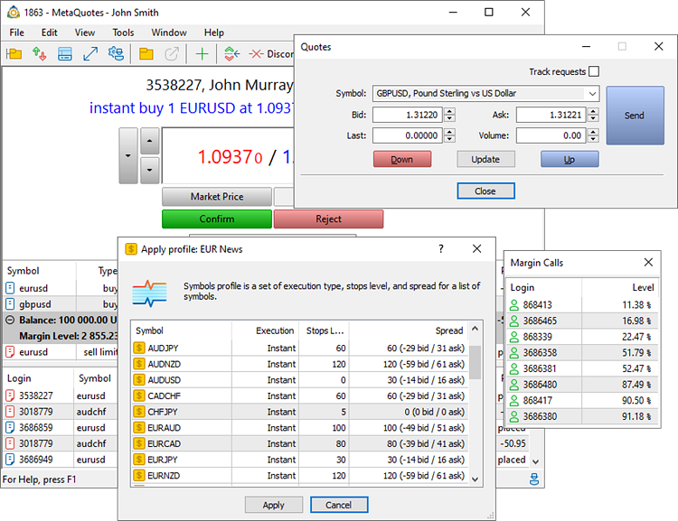

[🏠 Document Start](../README.md) / Dealing and Risk Management

[Previous](../Corporate-Actions-and-Bulk-Operations/Splitting-Positions.md) | [Next](Dealing.md)

# Dealing and Risk Management

One of the main available tasks in the Manager terminal is [processing trade requests](Dealing.md) of clients. To do this, the dealer is provided with all the necessary tools: the ability to confirm requests partially or completely, reject them, issue new prices in response, and much more. When a request is received, the dealer immediately receives complete information about a client: general data, account status, open positions, orders and query history.

For a risk manager, the terminal provides data on [summary positions](Summary-Positions-and-Coverage.md) and [assets](Exposure.md) of clients, as well as on uncovered positions.

Besides, managers have access to [Margin call](Accounts-with-Margin-CallStop-Out.md) account lists and are able to send notifications asking for an account replenishment. Besides, a risk manager can quickly [modify trading symbol settings (#profile)](Quoting-and-Symbol-Management.md#profile) during important news releases.

> Before processing requests, please read the [general information on the platform's trading system](../Trading-Operations/Basic-Principles.md) and basic concepts.
