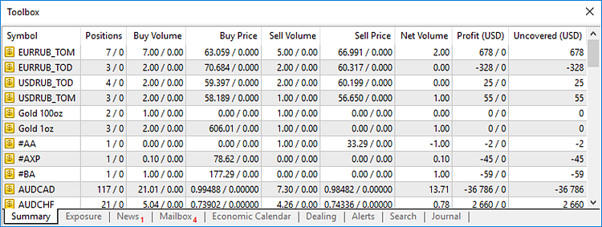

[🏠 Document Start](../README.md) / [Dealing and Risk Management](README.md) / Summary Positions and Coverage

[Previous](Quoting-and-Symbol-Management.md) | [Next](Exposure.md)

# Summary Positions and Coverage (#summary-positions-and-coverage)

The Manager terminal allows viewing data on clients' summary positions. A risk manager can in real time view the volume of short and long positions for each symbol, as well as manage non-covered profits on client's positions. This information is displayed in the Summary tab of the Toolbox window:

The following information on summary positions is available:

  * Symbol — name of a financial security.
  * Positions — number of clients' positions/number of covering positions.
  * Buy Volume — volume of clients' open buy positions/volume of the corresponding position on a coverage account.
  * Buy Price — average weighted open price of the clients' buy positions/the corresponding open price on a coverage account.
  * Sell Volume — volume of the clients' open sell positions/volume of the corresponding position on a coverage account.
  * Sell Price — average weighted open price of the clients' sell positions/the corresponding open price on a coverage account.
  * Net Volume — difference between the volumes of clients' buy and sell positions, at that the corresponding volume on the coverage account is subtracted from the buy or sell position.
  * Profit (Currency) — total profit (loss) from the clients' positions/profit (loss) on a coverage account position. Currency, in which the profit is displayed, is specified in brackets. You can change the currency using the Currency command of the context menu.
  * Uncovered (Currency) — difference between the total profit (loss) from the clients' positions and the corresponding position on the coverage account. Currency, in which the uncovered profit is displayed, is specified in brackets. You can change the currency using the Currency command of the context menu.

The Total line in the lower part displays the total rates by all symbols.

> Coverage accounts are those created in groups whose names start with "coverage" (case sensitive). For example, coverage\forex. This tab displays summary positions for all coverage accounts of a trade server.

## Covering client's positions (#coverage)

MetaTrader 5 allows you to cover client's positions on other trade servers protecting your company against risks. For example, traders have opened the total of 100 lots of buy and 120 lots of sell positions for EURUSD. As a result, an imbalance of 20 lots occurs — a net position posing risk for the company. In this case, the brokerage company can open their own position at their market maker (for example, another broker) for selling 20 lots. A special type of accounts is provided in the platform for that. These accounts are created in groups whose names begin with the "coverage" symbols. For example, coverage\forex. Performing trading operations on a coverage account, a manager covers clients' positions on another trade server.

To perform a coverage, a trading platform administrator should perform the following settings:

  * Create a group with its name starting with "coverage".
  * Create an account in that group; this account will be used for covering.
  * Open a trade account on an external trade server, where coverage positions will be opened.
  * Set up the MetaTrader 5 Gateway - specify the authorization details of the account opened on the external trade server.
  * Set up routing of trade operations on the coverage account to the external trade system through the gateway.

> A more detailed description of setting up covering is provided in the MetaTrader 5 Administrator User Guide.

Once a coverage account is set up, a manager can perform [trade operations](../Clients-and-Trading-Accounts/Trading-Operations.md) on it using the Manager terminal. The summary rates for all coverage accounts on the trade server are displayed in the [Summary](Summary-Positions-and-Coverage.md) and [Exposure](Exposure.md) tabs of the Toolbox window.

## Context menu (#context)

The following commands can be run from the context menu of this tab:

  * Currency — open the submenu of selecting a currency to be used for displaying a profit by symbols. Any currency used as a deposit currency of a group of accounts at the server is available for selection.
  * Profit — open the submenu of selecting a profit display mode. There are two modes implemented — with and without swaps and commissions.
  *  Copy — copy a selected line to the clipboard.
  * Report — generate a report on summary positions in the XML or HTML format.
  *  Save — save the information about the summary positions as an HTML file.
  * Reset Sort Order — restore the default sorting order.
  * Auto Arrange — set the size of columns automatically.
  * Grid — show/hide the grid to separate fields in the table.

