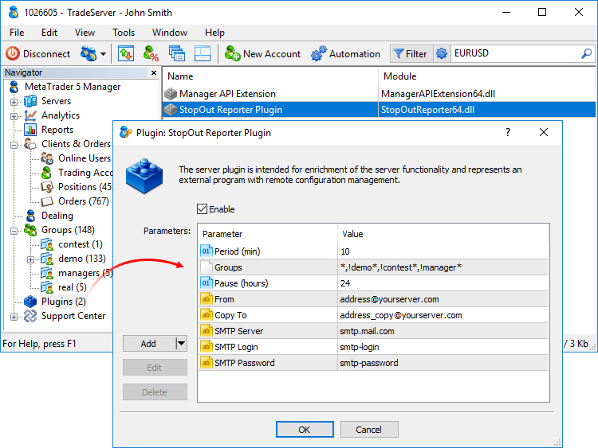

[🏠 Document Start](../README.md) / [Managing Trade Server Settings](README.md) / Managing Plugins

[Previous](Margin.md) | [Next](Trade-Server-Journal.md)

# Managing Plugins on the Trade Server

Plugins are the modules for enhancing the platform functionality. They are installed on the trade server. Plugins allow you to change the behavior of the platform's native functions, as well as add custom ones, integrate the platform with other systems, and much more. The Manager terminal enables managing plugins installed on the trade server.

Open Plugins section in the Navigator. It features the list of plugins you can manage.

Double-click a plugin name to configure its operation parameters. The Enable option allows to enable/disable the plugin. Below are editable parameters. Their set depends on the plugin. To modify a parameter, double-click the Value field.

If you accidentally remove the parameter, it can be added again using the appropriate button. String type parameters are created by default. To select another type (integer or fractional) click the arrow on the "Add" button.

  * A manager can only change the settings of the plugins that are explicitly allowed to be modified on the trade server. The "Configurable by managers" option should be enabled in the configuration of such plugins.
  * Each configuration of the plugin is bound to a specific trade server. Thus, the Manager can configure plugins only for the server it is currently connected to.
  * Be careful when changing the plugin settings. This may significantly affect the platform performance.

  
---
